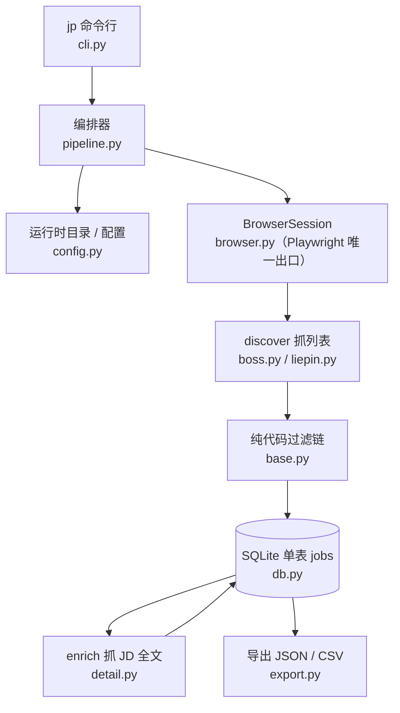
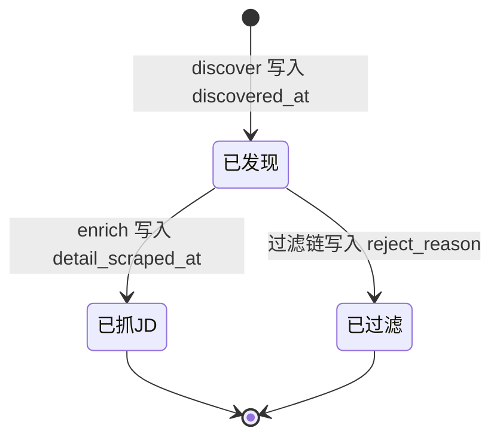

JobPilot-CN 是一个面向国内招聘平台的**岗位与 JD 全文抓取器**，它的工作链路可以用一句话概括：抓岗位列表 → 抓 JD 全文 → 导出 JSON / CSV。本页是整份文档的起点，目标是帮助初学者建立对项目的**整体认知骨架**——它是什么、能做什么、由哪些部分组成、各部分如何衔接。更细的安装与操作细节请随后参考 [快速开始](2-kuai-su-kai-shi) 与 [命令行命令全览](3-ming-ling-xing-ming-ling-quan-lan)。
Sources: [README.md](README.md#L1-L7), [pyproject.toml](pyproject.toml#L1-L16)

## 项目定位：只做数据采集

明确项目的边界是理解它一切设计取舍的前提。JobPilot-CN **只做数据采集**，不含任何 AI 分析、岗位打分、打招呼语生成或简历定制逻辑，也**不需要任何 LLM API Key**。这个定位并非从一开始就如此——仓库曾包含 `llm.py`、`scoring/`、`prompts/` 等模块，后续被整体剔除，只保留了纯净的采集链路。理解这一点，就能理解为什么代码里没有一个模型调用、没有网络 API 依赖，所有依赖只有 `typer`（命令行）、`rich`（终端表格）、`pyyaml`（配置）与 `playwright`（浏览器）。
Sources: [README.md](README.md#L3-L7), [CHANGELOG.md](CHANGELOG.md#L8-L21), [pyproject.toml](pyproject.toml#L8-L13)

项目的架构思想与平台抓取经验来自两个海外/国内开源项目（ApplyPilot 与 get_jobs），但**未复用任何一方代码**，选择器字符串、接口路径等客观事实凭理解重写。项目要求 Python 3.11+，使用 MIT 许可证，命令行入口通过 `jp` 命令暴露（实现为 `jobpilot.cli:main`）。
Sources: [ATTRIBUTION.md](ATTRIBUTION.md#L1-L14), [pyproject.toml](pyproject.toml#L5-L16)

## 核心能力：两大平台 × 三阶段

JobPilot-CN 目前支持 **Boss 直聘**与**猎聘**两个平台，每个平台在「列表页采集」与「JD 全文获取」上采用了不同的技术手段。下面的对照表概括了两个平台在采集方式上的差异——这也是后续 Deep Dive 章节（`平台采集实现`）会逐一展开的重点。
Sources: [README.md](README.md#L9-L18)

| 平台 | 列表页采集方式 | JD 全文方式 |
| --- | --- | --- |
| **Boss 直聘** | 搜索页滚动加载 + DOM 卡片解析，薪资走字体反爬解码 | 优先拦截 `job/detail.json` 接口 JSON，失败降级 DOM 选择器 |
| **猎聘** | 拦截搜索页 `pc-search-job` XHR JSON + AntD 翻页 | 详情页 DOM 轮询（React SPA 水合较慢，等待最多 15s） |

在采集之外，项目还有三条贯穿全流程的设计特征，值得在概览层面先建立印象：

- **SQLite 单表数据总线**：用「一列即一个阶段的状态」组织数据，使 `jp run` 幂等可续传，中断后重跑只补未完成的。
- **纯代码过滤**：标题黑名单、日结岗、HR 不活跃、公司黑名单、薪资下限等规则全部写在 `profile.json`，不依赖任何模型，规则可审计。
- **浏览器单点封装**：Playwright 只通过 `discovery/browser.py` 一个出口使用，包含登录态持久化与验证页人工暂停机制。

Sources: [README.md](README.md#L16-L18), [db.py](src/jobpilot/db.py#L1-L4), [base.py](src/jobpilot/discovery/base.py#L89-L155)

## 架构总览

整个项目的运行时结构可以抽象为「命令行驱动 → 编排器串联 → 四个功能模块读写同一张表」。下图展示了各模块之间的依赖与数据流向：命令行 `cli.py` 接收用户指令后交给 `pipeline.py` 编排，编排器按平台创建 `BrowserSession`（Playwright 唯一出口），先后驱动 discovery（抓列表 + 过滤）与 enrichment（抓 JD 全文）写入 SQLite，最后由 `export.py` 读出导出。
Sources: [cli.py](src/jobpilot/cli.py#L12-L17), [pipeline.py](src/jobpilot/pipeline.py#L27-L79), [export.py](src/jobpilot/export.py#L48-L69)



这张图的关键在于：**四个功能模块之间没有直接调用**，它们只通过 SQLite 的 `jobs` 表交互。`db.py` 的模块注释把这条规矩称为「模块边界铁律」——discovery 只写 discover 列，enrichment 只写 enrich 列。这种松耦合正是幂等续传得以成立的基础。
Sources: [db.py](src/jobpilot/db.py#L1-L4), [pipeline.py](src/jobpilot/pipeline.py#L46-L79)

## 列级状态机：一个阶段 = 一列

理解本项目最重要的一个概念是**列级状态机**：某个阶段是否完成，由「该阶段负责的列是否为 NULL」来判定，不需要任何断点文件。三个核心列分别是 `discovered_at`（已发现）、`detail_scraped_at`（已抓 JD）与 `reject_reason`（已过滤）。`models.py` 把这套判定集中定义为两个可复用的谓词 `PENDING_ENRICH`（已发现、未抓、未被过滤）与 `ENRICH_FAILED`（抓过但失败），供阶段逻辑与 `jp status` 计数板共用。
Sources: [models.py](src/jobpilot/models.py#L1-L24), [db.py](src/jobpilot/db.py#L119-L134)



之所以用「列状态」而不是外部断点文件，是为了让**幂等性天然成立**：任何阶段崩溃后，只要重跑 `jp run`，程序只需按谓词查一遍表，就能准确地只补那些「发现过但没抓 JD」的行。主键是岗位 URL，入库采用 `INSERT` + 主键冲突跳过（`upsert_job`），因此天然去重、不覆盖已有行。这套机制的完整原理与契约在 [列级状态机与幂等续传机制](5-lie-ji-zhuang-tai-ji-yu-mi-deng-xu-chuan-ji-zhi) 中有专门展开。
Sources: [db.py](src/jobpilot/db.py#L86-L100), [CHANGELOG.md](CHANGELOG.md#L49-L54), [pipeline.py](src/jobpilot/pipeline.py#L1-L4)

## 数据模型：单表 jobs

所有数据落在 SQLite 单表 `jobs` 中（数据库文件位于运行时目录的 `db.sqlite3`，启用 WAL 模式）。表结构按用途分成三块列：**discover 块**（标题、公司、城市、薪资、年限/学历原文、HR 信息等列表页字段）、**enrich 块**（JD 全文 `full_description`、`detail_scraped_at`、`enrich_error`、重试计数）、以及**过滤块**（`reject_reason`、`rejected_at`）。主键为 `url`，并有针对「待抓 JD」查询的部分索引。初学者可以先把这个表理解成项目的「唯一真相来源」——它既是各模块的通信总线，也是最终导出数据的来源。
Sources: [db.py](src/jobpilot/db.py#L14-L51), [export.py](src/jobpilot/export.py#L17-L33)

需要留意的是，SQLite 在 Windows 上默认路径为 `C:\Users\<用户>\.jobpilot-cn\`（或由环境变量 `JOBPILOT_HOME` 覆盖），这是**设计而非 Bug**——运行时数据与仓库代码分离。数据库结构的逐列说明、导出字段清单与直连查看方式，请见 [SQLite 单表数据总线与表结构](6-sqlite-dan-biao-shu-ju-zong-xian-yu-biao-jie-gou)。
Sources: [config.py](src/jobpilot/config.py#L34-L59), [CHANGELOG.md](CHANGELOG.md#L57), [README.md](README.md#L161-L189)

## 项目结构导览

下图用树形结构呈现了源码的组织方式，并标注了每个模块的职责。对于初学者，建议先记住 `cli.py`（入口）、`pipeline.py`（编排）、`db.py`（数据）、`models.py`（状态谓词）这四个核心文件，其余模块可以按需深入。
Sources: [README.md](README.md#L204-L218)

```
src/jobpilot/
├── cli.py            # Typer 命令行入口（init / status / login / discover / enrich / run / export）
├── config.py         # 运行时目录、profile.json / searches.yaml 加载与初始化
├── db.py             # SQLite 单表 jobs + upsert / 查询辅助
├── models.py         # 列级状态谓词（阶段衔接契约）
├── pipeline.py       # discover → enrich 编排
├── export.py         # JSON / CSV 导出
├── discovery/        # browser.py（Playwright 唯一出口）+ base.py + boss.py + liepin.py
├── enrichment/       # detail.py：JD 全文抓取
└── searches.example.yaml  # 搜索配置模板（jp init 复制到运行时目录）

tests/                # pytest：薪资解析 / 过滤规则 / 导出
```

其中 `cli.py` 暴露了七个命令：`init`（建库并生成配置模板）、`status`（计数板）、`login`（扫码登录）、`discover`（只抓列表）、`enrich`（只补抓 JD）、`run`（串联 discover + enrich）、`export`（导出）。`discovery/` 目录中的 `browser.py` 是唯一的 Playwright 出口，其余平台模块只负责构造 URL 与解析页面数据；`enrichment/detail.py` 独立承载 JD 全文抓取。测试目录 `tests/` 覆盖了薪资解析、过滤规则、导出与猎聘城市纠偏等纯函数逻辑。
Sources: [cli.py](src/jobpilot/cli.py#L26-L168), [browser.py](src/jobpilot/discovery/browser.py#L1-L5), [README.md](README.md#L217)

## 关键设计约束

在概览层面，有几条「改动时别破坏」的约束值得先知道，它们是这个项目所有后续设计的地基，也是各部分 Deep Dive 反复引用的前提：

| 约束 | 含义 | 相关页面 |
| --- | --- | --- |
| **列级状态机 = 阶段契约** | 阶段完成 = 该阶段负责的列非 NULL，`jp run` 靠它幂等续传，不引入断点文件 | [列级状态机与幂等续传机制](5-lie-ji-zhuang-tai-ji-yu-mi-deng-xu-chuan-ji-zhi) |
| **模块边界铁律** | discovery 只写 discover 列，enrichment 只写 enrich 列，跨模块写列会破坏续传语义 | [模块边界与阶段编排契约](7-mo-kuai-bian-jie-yu-jie-duan-bian-pai-qi-yue) |
| **入库去重不覆盖** | 以 url 为主键，INSERT + 冲突跳过，天然去重 | [SQLite 单表数据总线与表结构](6-sqlite-dan-biao-shu-ju-zong-xian-yu-biao-jie-gou) |
| **浏览器单点封装** | Playwright 只在 `discovery/browser.py` 一个文件里使用 | [Playwright 浏览器单点封装与反检测](8-playwright-liu-lan-qi-dan-dian-feng-zhuang-yu-fan-jian-ce) |
| **被过滤岗不自动翻案** | `PENDING_ENRICH` 要求 `reject_reason IS NULL`，放宽规则后需手动清空才会重抓 | [纯代码过滤链设计](12-chun-dai-ma-guo-lu-lian-she-ji) |
| **enrich 最多重试 3 次** | `enrich_attempts < 3`，修好选择器后需清失败行才会重试 | [JD 全文抓取与接口优先/DOM 降级](11-jd-quan-wen-zhua-qu-yu-jie-kou-you-xian-dom-jiang-ji) |

Sources: [CHANGELOG.md](CHANGELOG.md#L49-L57), [models.py](src/jobpilot/models.py#L15-L23), [detail.py](src/jobpilot/enrichment/detail.py#L38-L43)

## 推荐阅读路径

本页只勾勒了全貌，接下来建议按「先跑起来、再看原理」的顺序推进。**Get Started** 部分先带你完成从安装到导出的一次完整闭环：先读 [快速开始](2-kuai-su-kai-shi) 完成 `jp init` / `jp login` / `jp run` / `jp export` 四步；再读 [命令行命令全览](3-ming-ling-xing-ming-ling-quan-lan) 掌握每个命令的参数；然后读 [运行时目录与配置体系](4-yun-xing-shi-mu-lu-yu-pei-zhi-ti-xi) 理解 `profile.json` 与 `searches.yaml` 的作用。
Sources: [README.md](README.md#L37-L83), [config.py](src/jobpilot/config.py#L14-L59)

当你能顺畅跑完一次流程后，**Deep Dive** 部分会解释「为什么它能续传、为什么这样分层」。建议的深入顺序是：先读架构与数据流三篇（[列级状态机与幂等续传机制](5-lie-ji-zhuang-tai-ji-yu-mi-deng-xu-chuan-ji-zhi)、[SQLite 单表数据总线与表结构](6-sqlite-dan-biao-shu-ju-zong-xian-yu-biao-jie-gou)、[模块边界与阶段编排契约](7-mo-kuai-bian-jie-yu-jie-duan-bian-pai-qi-yue)）打好地基，再按需进入平台采集实现、过滤规则、搜索配置与运维等专题章节。