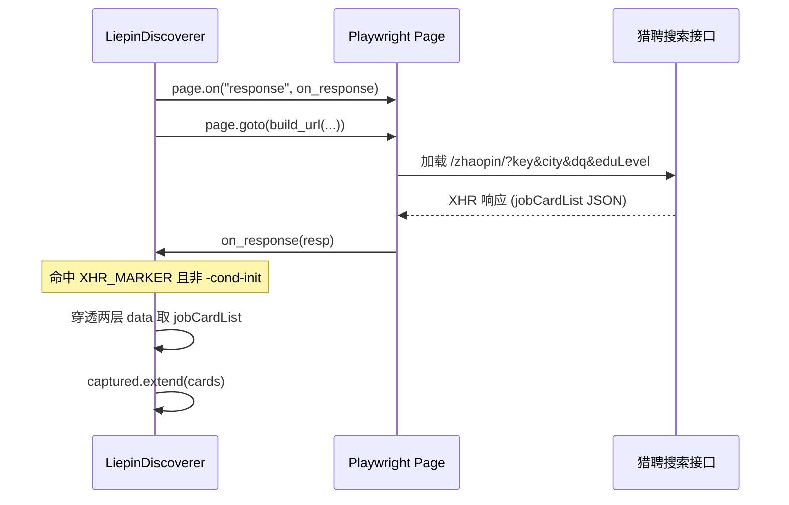
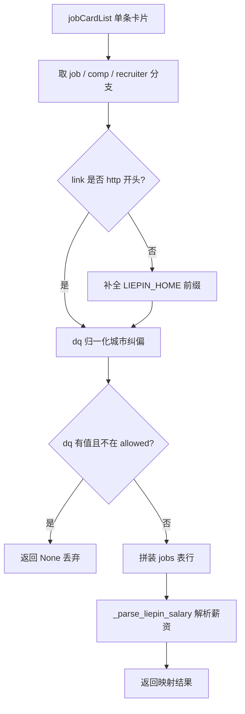

## 页面定位与设计取舍

本页聚焦猎聘（liepin）列表采集模块 `LiepinDiscoverer` 的两个核心机制：**搜索页 XHR 响应拦截**与**城市结果纠偏**。前者决定「从哪里拿数据」，后者决定「如何保证数据的地理正确性」。二者的实现都集中在 [`src/jobpilot/discovery/liepin.py`](src/jobpilot/discovery/liepin.py) 单文件中，属于「平台采集实现」分类下的深潜内容。

设计上做了一个关键取舍：**猎聘走 XHR JSON 拦截，而非 DOM 解析**。模块顶部注释直接点明理由——XHR 返回的 JSON 不含字体反爬问题，比 DOM 解析更稳定（Boss 直聘走的是 DOM 解析 + 字体映射路线，可对照 [Boss 直聘列表采集与薪资字体反爬](9-boss-zhi-pin-lie-biao-cai-ji-yu-xin-zi-zi-ti-fan-pa)）。XHR 方案绕开了整个「薪资显示层被字体加密」的攻击面，因此 `liepin.py` 不含任何字体映射表。

Sources: [liepin.py](src/jobpilot/discovery/liepin.py#L1-L4)

整体采集流程由 `run` 作为入口编排，它把「多城市循环 → 单城市采集 → 去重 → 统一过滤」串联起来。调用侧由 pipeline 通过 `discoverer.run(session.context, kw, conf, limit=opts.max_per_search)` 触发，猎聘发现器实例在 `platform == "liepin"` 时被创建。

Sources: [liepin.py](src/jobpilot/discovery/liepin.py#L59-L84), [pipeline.py](src/jobpilot/pipeline.py#L57-L66)

## XHR 拦截机制

猎聘搜索页在加载时会异步请求一个搜索接口，返回的 JSON 内含职位卡片列表。实现通过 Playwright 的 `page.on("response", on_response)` 事件监听器，在响应返回时同步拦截并解析。拦截器的命中判定有**两个条件**：URL 必须包含接口标识 `XHR_MARKER`（即 `com.liepin.searchfront4c.pc-search-job`），且 URL 不能包含 `-cond-init` 子串。

后者是故意排除的：`-cond-init` 是页面初始化请求，虽然 URL 前缀相同，但它不含 `jobCardList` 结果数据，若一并捕获只会引入噪声。这种「白名单标记 + 黑名单排除」的组合判定，比单纯前缀匹配更精确。

Sources: [liepin.py](src/jobpilot/discovery/liepin.py#L25-L26), [liepin.py](src/jobpilot/discovery/liepin.py#L95-L104)

解析路径是拦截逻辑中最容易因平台改版而失效的部分。实际层级为 `flag → data → data → jobCardList`，即需要穿过**两层嵌套的 `data` 字段**才能拿到卡片数组：

```python
cards = ((data.get("data") or {}).get("data") or {}).get("jobCardList") or []
```

代码注释特别标注「比旧文档多一层 `data`」——这是一个典型的接口结构漂移点。整条链路上每一层都用 `or {}` 做空值兜底，任何一层缺失都不会抛异常，而是退化为空数组，保证解析失败时静默跳过而非崩溃。`try/except` 包裹的 `resp.json()` 同理：非 JSON 响应（如埋点、日志接口偶然命中）直接忽略。

Sources: [liepin.py](src/jobpilot/discovery/liepin.py#L98-L104)

下面的时序图展示了从页面导航到卡片捕获的完整链路：



Sources: [liepin.py](src/jobpilot/discovery/liepin.py#L95-L111)

## 城市纠偏的两道防线

「城市纠偏」是猎聘模块最具代表性的设计。它解决的问题是：**即使请求时带了城市过滤参数，返回结果中仍会混入约 5% 的外地推荐卡**。为了不污染数据，实现设置了两道独立防线。

**第一道防线在 URL 参数层**：`build_url` 在构造搜索 URL 时同时写入 `city` 与 `dq` 两个参数。代码注释揭示了一个实测结论——猎聘真正生效的过滤参数是 `dq`（地区），`city` 只影响页面展示；**若只给 `city`，XHR 请求体里的 `dq` 会落到默认值，结果混杂全国岗位，只有两者都给才准确**。这解释了为什么 `build_url` 会把同一个城市代码赋给两个参数。

```python
url = f"{LIEPIN_HOME}/zhaopin/?key={quote(keyword)}&city={code}&dq={code}"
```

城市代码来自 `CITY_CODES` 字典，若配置里通过 `city_codes` 提供了覆盖则以覆盖为准，最终兜底默认值 `"010"`（北京）。关键词经 `quote()` 做 URL 编码。

Sources: [liepin.py](src/jobpilot/discovery/liepin.py#L41-L49), [liepin.py](src/jobpilot/discovery/liepin.py#L17-L23)

**第二道防线在客户端映射层**：`_scrape_city` 把配置城市归一化为一个 `allowed` 集合（通过 `_norm_city`），透传给 `_map_card`。每张卡片在映射前会读取其 `job.dq` 字段（形如 `"上海-浦东新区"`），归一化后与 `allowed` 比对；不在集合内的卡片直接返回 `None` 被丢弃。这正好拦住了第一道防线「漏网」的外地推荐卡。

```python
if allowed and _norm_city(dq_raw) and _norm_city(dq_raw) not in allowed:
    return None
```

关键的**不误杀原则**：当 `dq` 为空时无法判定城市，此时保留该卡片（不丢弃）。代码注释明确指出「dq 为空时无法判定，保留（不误杀）」。丢弃计数会通过返回值层层上报，最终在 `run` 中打印「跳过 N 条城市不在配置内的岗位」。

Sources: [liepin.py](src/jobpilot/discovery/liepin.py#L156-L159), [liepin.py](src/jobpilot/discovery/liepin.py#L61-L74)

城市归一化逻辑由 `_norm_city` 承担：先按 `-` 取第一段（剥离区县），再若以「市」结尾且长度大于 1 则去掉该字。因此 `"上海-浦东新区"` → `"上海"`，`"北京市"` → `"北京"`，且对空字符串安全返回空串。

Sources: [liepin.py](src/jobpilot/discovery/liepin.py#L192-L195)

两道防线的职责对比如下：

| 防线 | 位置 | 手段 | 覆盖范围 | 失败时行为 |
|------|------|------|----------|------------|
| 第一道 | URL 参数 | `dq=<城市代码>` | 绝大多数岗位 | 混入 ~5% 外地推荐卡 |
| 第二道 | 客户端映射 | `_norm_city` 白名单比对 | 拦截第一道漏网卡片 | `dq` 为空则保留（不误杀） |

Sources: [liepin.py](src/jobpilot/discovery/liepin.py#L46-L49), [liepin.py](src/jobpilot/discovery/liepin.py#L156-L159)

## 单城采集与 AntD 分页

`_scrape_city` 负责单座城市的完整采集，返回 `(岗位列表, 丢弃条数)` 元组。它先创建新页面并挂载响应拦截器，然后 `page.goto` 到 `build_url` 生成的地址，等待 `domcontentloaded`（超时 60 秒）。

导航后有两个稳定性处理：调用 `pause_if_challenge(page)` 处理可能出现的滑块/验证页（详情见 [滑块/验证页人工暂停机制](18-hua-kuai-yan-zheng-ye-ren-gong-zan-ting-ji-zhi)），再 `time.sleep(random.uniform(2, 4))` 随机停顿以模拟人类行为，降低被风控概率。

Sources: [liepin.py](src/jobpilot/discovery/liepin.py#L86-L111), [browser.py](src/jobpilot/discovery/browser.py#L123-L145)

翻页依赖 AntD 分页组件，选择器集中在 `LOCATORS` 字典（平台改版只需改这里）。翻页循环上限为 `conf.get("max_pages", 3)`（默认 3 页），每次循环前先检查 `len(captured) >= limit` 提前收敛。判断「是否还有下一页」的方式是读取下一页按钮的 `class` 属性，若含 `ant-pagination-disabled` 则停止；点击后随机等待 3–5 秒。整个循环用 `try/except` 包裹，任何定位/点击异常都直接 break，保证翻页失败不至于中断采集。

Sources: [liepin.py](src/jobpilot/discovery/liepin.py#L32-L35), [liepin.py](src/jobpilot/discovery/liepin.py#L113-L126)

需注意 `_scrape_city` 用 `finally: page.close()` 保证页面句柄一定被释放——即使中途异常也不会泄漏页面。翻页结束后，`captured` 中的每张卡片经 `_map_card` 映射，映射返回 `None` 的计入 `dropped`，其余进入结果列表。

Sources: [liepin.py](src/jobpilot/discovery/liepin.py#L128-L138)

## 卡片字段映射与薪资解析

`_map_card` 把 `jobCardList` 的单个条目转换为 jobs 表行。一条卡片有三个顶层分支：`job`（职位信息）、`comp`（公司信息）、`recruiter`（HR 信息）。字段名以实测为准，映射关系如下：

| jobs 表列 | 来源字段 | 说明 |
|-----------|----------|------|
| `url` / `apply_url` | `job.link` | 相对路径补全为绝对地址，缺失时退化为 `liepin:<jobId>` |
| `job_title` | `job.title` | |
| `company` | `comp.compName` | |
| `city` / `district` | `job.dq` | 按 `-` 切分，`dq[0]` 为城市、`dq[1]` 为区县 |
| `salary_raw` | `job.salary` | 原始薪资文本 |
| `experience_raw` | `job.requireWorkYears` | 如 `'3-5年'` / `'经验不限'` / `'5年以上'` |
| `education_raw` | `job.requireEduLevel` | 如 `'本科'` / `'统招本科'` / `'硕士'` |
| `job_tags` | `job.labels` | 标签列表，并追加年限/学历文本 |
| `hr_name` | `recruiter.recruiterName` | |
| `hr_title` | `recruiter.recruiterTitle` | |
| `hr_active` | `recruiter.imShowText` | 如 `'2月前活跃'`，供过滤链判定活跃度 |

Sources: [liepin.py](src/jobpilot/discovery/liepin.py#L140-L189)

两个细节值得注意。其一，猎聘的**年限与学历不在独立字段**，而是文本形式（`requireWorkYears` / `requireEduLevel`），实现把它们追加进 `job_tags`，同时单独抽出为 `experience_raw` / `education_raw` 供下游过滤链使用（年限解析见 [年限解析与左开右闭区间过滤](13-nian-xian-jie-xi-yu-zuo-kai-you-bi-qu-jian-guo-lu)，学历归一化见 [学历档位归一化过滤](14-xue-li-dang-wei-gui-hua-guo-lu)）。其二，`dq` 字段用 `-` 分隔（如「上海-浦东新区」），与 Boss 的 `·` 分隔不同，因此切分逻辑各平台独立。

薪资解析由 `_parse_liepin_salary` 独立处理。它用正则匹配 `数字-数字[K/W/万]` 格式，将「万/月」单位换算为 K（乘 10），返回 `(下限, 上限, 12)` 三元组；无法解析（如「面议」）返回 `None`。返回值中第三个元素固定为 12，代表默认 12 薪。

Sources: [liepin.py](src/jobpilot/discovery/liepin.py#L198-L208)



Sources: [liepin.py](src/jobpilot/discovery/liepin.py#L146-L189)

## 多城配额、去重与统一过滤

`run` 在遍历多城市前先分配配额，避免「排在前面的城市吃光配额，饿死后面的城市」：单城市时 `per_city = limit`，多城市时 `per_city = max(4, limit // len(cities))`——即平均分配但保证每城至少 4 条。这一逻辑与 boss.py 保持一致。

Sources: [liepin.py](src/jobpilot/discovery/liepin.py#L59-L72)

所有城市的结果汇总到 `raw` 后执行去重，去重键为 `url`，缺失时退化为 `job_title`——因为多城市多页采集可能产生重复卡片。去重后调用继承自 `BaseDiscoverer` 的 `_finalize`，由后者补齐全平台公共字段并运行纯代码过滤链（标题黑名单、日结岗、HR 活跃度、公司黑名单、薪资、年限、学历）。

Sources: [liepin.py](src/jobpilot/discovery/liepin.py#L74-L84), [base.py](src/jobpilot/discovery/base.py#L165-L181)

服务端筛选参数方面，猎聘的可用能力与 Boss 不同，配置时需注意边界（详细对照见 [服务端筛选参数（年限/学历/薪资）](15-fu-wu-duan-shai-xuan-can-shu-nian-xian-xue-li-xin-zi)）：

| 参数 | 支持情况 | 取值 | 说明 |
|------|----------|------|------|
| `dq` / `city` | 支持 | `CITY_CODES` 或 `city_codes` 覆盖 | `dq` 才真正生效 |
| `eduLevel` | 支持 | `本科`=040 / `硕士`=030 / `大专`=050 | 博士档未确认，未内置；非法值抛 `ValueError` |
| `experience` | **不支持** | — | 配了只打印提示，需改用本地过滤 |

代码对不支持的配置采取了「显式告知」策略：若配置了 `experience`，`build_url` 会打印提示「猎聘不支持服务端年限筛选，请改用 profile.json 的 preferences.experience 本地过滤」，而不是静默忽略——避免使用者白配一场。学历参数则相反，非法取值会主动 `raise ValueError`。

Sources: [liepin.py](src/jobpilot/discovery/liepin.py#L28-L30), [liepin.py](src/jobpilot/discovery/liepin.py#L42-L56)

## 配置与测试

猎聘的搜索配置集中在 `searches.yaml` 的 `liepin` 段，可用字段包括 `keywords`、`cities`、`max_pages`、`education`，以及可选的 `city_codes` 城市代码覆盖。需注意 `max_pages` 是猎聘专属的翻页上限，Boss 为滚动采集会忽略该项。

Sources: [searches.example.yaml](src/jobpilot/searches.example.yaml#L25-L30), [searches.example.yaml](src/jobpilot/searches.example.yaml#L4-L17)

城市纠偏逻辑有专门的单元测试覆盖，测试用例直接构造 `_card` 字典并断言行为，覆盖了三类场景：合法城市保留、外地城市丢弃、`dq` 为空时保留。此外还覆盖了 `_norm_city` 归一化、`build_url` 携带 `dq`（并断言「只给 city 不会过滤，必须带 dq」）、`city_codes` 覆盖生效以及薪资解析。

Sources: [test_liepin_city.py](tests/test_liepin_city.py#L22-L65)

---

### 延伸阅读

- 上游：验证页/滑块出现时的处理逻辑，见 [滑块/验证页人工暂停机制](18-hua-kuai-yan-zheng-ye-ren-gong-zan-ting-ji-zhi)
- 下游：卡片被采集后的 JD 全文抓取，见 [JD 全文抓取与接口优先/DOM 降级](11-jd-quan-wen-zhua-qu-yu-jie-kou-you-xian-dom-jiang-ji)
- 对照：另一平台的 DOM 采集路线，见 [Boss 直聘列表采集与薪资字体反爬](9-boss-zhi-pin-lie-biao-cai-ji-yu-xin-zi-zi-ti-fan-pa)
- 城市代码体系与多城配额，见 [城市代码映射与多城配额分配](16-cheng-shi-dai-ma-ying-she-yu-duo-cheng-pei-e-fen-pei)