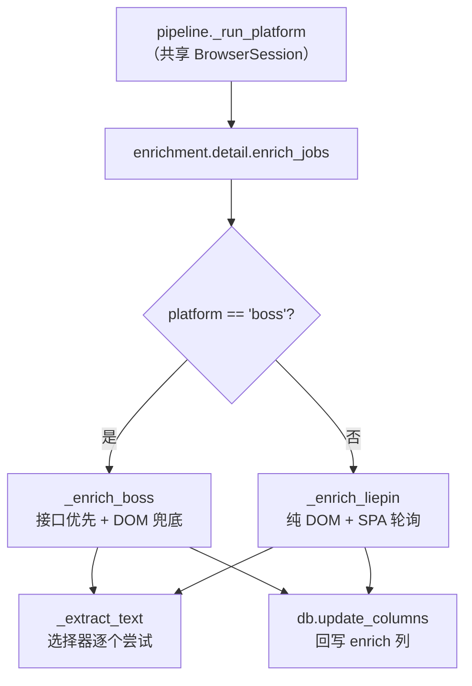
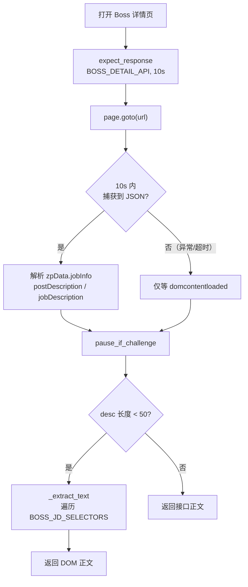

本页深入 **enrich 阶段**——pipeline 的第二段，负责把岗位列表阶段仅有的元数据（标题、薪资、公司、标签）补全为可分析、可对标的 **JD 正文全文**。核心是一套「接口优先、DOM 降级」的双平台抓取策略：Boss 直聘先拦截服务端 JSON 详情接口（无字体反爬），失败再退回 DOM 文本抽取；猎聘则因详情页是 React SPA，只能直接走 DOM 并容忍水合延迟。本页只覆盖 enrich 阶段的选择逻辑、抓取路径、选择器维护点与回写契约，列表采集细节见 [Boss 直聘列表采集与薪资字体反爬](9-boss-zhi-pin-lie-biao-cai-ji-yu-xin-zi-zi-ti-fan-pa) 与 [猎聘 XHR 拦截与城市纠偏](10-xi-pin-xhr-lan-jie-yu-cheng-shi-jiu-pian)。

## 阶段定位与模块边界

整个 enrich 阶段由单文件 `src/jobpilot/enrichment/detail.py` 承载，对外只暴露一个函数 `enrich_jobs`，这保持了项目「模块边界铁律：discovery 只写 discover 列，enrichment 只写 enrich 列」的约定。`pipeline.py` 在 `_run_platform` 中与 discover 阶段**共用同一个浏览器会话**，因此登录态只需验证一次即可同时支撑列表抓取与 JD 抓取两段。这种编排意味着 enrich 不负责打开浏览器、不负责登录，只消费一个已就绪的 `BrowserSession`。
Sources: [detail.py](src/jobpilot/enrichment/detail.py#L1-L14), [pipeline.py](src/jobpilot/pipeline.py#L46-L78), [db.py](src/jobpilot/db.py#L1-L5)

`enrich_jobs` 的签名接收 `conn`、`session`、`platform` 与 `limit`，返回本轮成功抓到正文的条数；单条岗位的任何异常都会被就地捕获并写入 `enrich_error`，不会中断整批任务。
Sources: [detail.py](src/jobpilot/enrichment/detail.py#L35-L44)

## 待抓队列的选择口径

`enrich_jobs` 如何知道「哪些岗位还没抓正文」？答案是复用列级状态机谓词 `PENDING_ENRICH`，而非维护独立的断点文件。查询条件在 `PENDING_ENRICH` 基础上再叠加三个约束：限定当前 `platform`、`enrich_attempts < 3`（重试上限，避免死链无限重抓），并按 `discovered_at ASC` 升序取前 `limit` 条。升序保证了「先进先出」的公平性，让早发现的岗位优先补齐正文。
Sources: [detail.py](src/jobpilot/enrichment/detail.py#L38-L43), [models.py](src/jobpilot/models.py#L15-L18)

| 谓词 | 语义 | 定义位置 |
|------|------|----------|
| `PENDING_ENRICH` | 已发现、未抓正文、未被过滤 | [models.py](src/jobpilot/models.py#L16-L18) |
| `ENRICH_FAILED` | 抓取失败过、未被过滤（可排查后重跑） | [models.py](src/jobpilot/models.py#L21-L23) |

由于选择完全依赖数据库列状态，`enrich` 命令天然幂等：任何时刻中断后重跑 `jp run` 或 `jp enrich`，都只会重新拾取 `detail_scraped_at IS NULL` 的行继续续传。这与其他阶段共享同一套谓词，是实现「崩溃即续传」的关键。
Sources: [models.py](src/jobpilot/models.py#L1-L23), [cli.py](src/jobpilot/cli.py#L120-L131)

## Boss：接口优先、DOM 降级

Boss 阶段的抓取函数 `_enrich_boss` 体现了本页标题的核心策略。它先用 Playwright 的 `page.expect_response(BOSS_DETAIL_API, timeout=10_000)` 挂起一个响应监听器，再 `page.goto` 打开详情页；监听的 URL 模式 `**/wapi/zpgeek/job/detail.json*` 指向服务端直出的 JSON 详情接口。若该响应在 10 秒内到达，代码直接解析 `zpData.jobInfo` 下的 `postDescription`（缺失时退回 `jobDescription`）作为正文，**完全绕开 DOM 解析**——这也是接口优先的根本动机：JSON 接口无薪资字体反爬、字段稳定、无前端渲染延迟。
Sources: [detail.py](src/jobpilot/enrichment/detail.py#L16-L19), [detail.py](src/jobpilot/enrichment/detail.py#L84-L101)

关键细节在于降级触发条件：整个「进入 `expect_response` → `goto` → 解析 JSON」被包在一个 `try` 块里，任何异常（典型是 10 秒超时，即详情页不会自动触发该接口）都会落入 `except`，转而只等待 `domcontentloaded` 就此收手。这正是注释所描述的现象——列表页点击卡片时才会触发的 `detail.json`，在直接打开详情页时并不一定出现，故超时即降级。降级后先执行 `pause_if_challenge` 处理可能的验证页，再判断已拿到的 `desc` 是否够长（`< 50` 字符即视为无效），不够长才调用 DOM 抽取。
Sources: [detail.py](src/jobpilot/enrichment/detail.py#L84-L107)

需要说明的是：`pause_if_challenge` 的职责是检测到滑块/登录页时提示并等待人工处理，该机制与登录态、反检测的完整原理分别见 [滑块/验证页人工暂停机制](18-hua-kuai-yan-zheng-ye-ren-gong-zan-ting-ji-zhi) 与 [Playwright 浏览器单点封装与反检测](8-playwright-liu-lan-qi-dan-dian-feng-zhuang-yu-fan-jian-ce)，本页仅关注它在 enrich 流程中的插入位置。
Sources: [detail.py](src/jobpilot/enrichment/detail.py#L104), [browser.py](src/jobpilot/discovery/browser.py#L123-L145)

## 猎聘：纯 DOM + SPA 水合轮询

猎聘没有可拦截的详情接口，`_enrich_liepin` 只能走详情页 DOM。其独特之处在于**轮询等待水合**：猎聘详情页是 React SPA，正文要数秒后才由 JS 注入，直接读取会拿到空节点。因此代码设置了一个 15 秒的 deadline，在循环中以 1.5 秒为间隔反复调用 `_extract_text`，一旦命中正文立刻返回，超时仍未命中则返回空串。轮询前同样会先 `pause_if_challenge`，且仅接受以 `http` 开头的 URL（相对路径视为无效直接返回空串）。
Sources: [detail.py](src/jobpilot/enrichment/detail.py#L112-L129)

## 选择器清单：平台改版的单一维护点

两平台的正文候选选择器都以模块级常量集中声明，遵循「平台改版只改这里」的维护原则。`_extract_text` 会**按列表顺序逐个尝试，取第一个命中且长度达标的**，因此最精确、当前有效的选择器排在前面，宽泛兜底的排在后面。注释中的日期标注（如「2026-09 实测」）记录了选择器的验证时点，是后续排查过期失效的关键线索。
Sources: [detail.py](src/jobpilot/enrichment/detail.py#L21-L32), [detail.py](src/jobpilot/enrichment/detail.py#L74-L81)

| 平台 | 选择器常量 | 候选列表（顺序即优先级） | 备注 |
|------|-----------|------------------------|------|
| Boss | `BOSS_JD_SELECTORS` | `div.job-sec-text` → `div.job-detail-section` → `div[class*='job-sec']` | 仅作接口失败时的兜底 |
| 猎聘 | `LIEPIN_JD_SELECTORS` | `section.job-intro-container` → `dd.job-intro-container` → `div[class*='job-description']` | 2026-09 实测结构 |

## 文本抽取的一致化契约

`_extract_text` 是两平台 DOM 抽取的公共出口，其契约有三点：其一，对每个选择器先用 `loc.count()` 判断是否存在，避免对不存在节点取值；其二，命中后把 `all_text_contents()` 的每个片段 `strip()` 并过滤空串，再用换行符拼接，从而保留段落结构而非挤成一坨；其三，结果须满足 `min_len`（默认 50 字符）阈值才算有效，否则继续尝试下一个选择器，全部落空则返回空串。这个长度阈值与 `_enrich_boss` 中接口正文的校验口径（`len(desc) < 50`）保持一致，形成统一的「正文有效性」判定。
Sources: [detail.py](src/jobpilot/enrichment/detail.py#L74-L81), [detail.py](src/jobpilot/enrichment/detail.py#L105-L106)

## 回写与失败分类：三条路径

抓取结束后，`enrich_jobs` 根据结果走三条互斥的写入路径，全部通过 `db.update_columns` 落到 enrich 列。这里的关键设计是**无论成功与否都递增 `enrich_attempts`**，配合查询端的 `enrich_attempts < 3` 上限，既保证失败可重试，又防止异常岗位被无限轮询。此外，成功路径会以 `apply_url = r["apply_url"] or r["url"]` 做兜底——猎聘在列表阶段就把卡片 `link` 写入 `apply_url`，Boss 则可能为空，此时回落到主键 `url`。
Sources: [detail.py](src/jobpilot/enrichment/detail.py#L45-L71), [liepin.py](src/jobpilot/discovery/liepin.py#L171-L174)

| 路径 | 触发条件 | 写入列 |
|------|---------|--------|
| 成功 | `desc` 非空 | `full_description`、`apply_url`、`detail_scraped_at`、`enrich_attempts + 1` |
| 空结果 | `desc` 为空 | `enrich_error = "未找到 JD 正文（选择器可能过期）"`、`enrich_attempts + 1` |
| 异常 | 抓取抛异常 | `enrich_error = str(e)[:200]`、`enrich_attempts + 1` |

注意成功路径写入的是 `detail_scraped_at`（状态机的完成标志），而失败路径**刻意不写**该列——因此 `PENDING_ENRICH` 依然为真，下次运行会再次拾取，直到 `enrich_attempts` 触顶为止。这正是列级状态机区分「完成」与「失败待重试」的机制。
Sources: [detail.py](src/jobpilot/enrichment/detail.py#L49-L69), [db.py](src/jobpilot/db.py#L37-L42)

## 节流与人机协调

每条岗位处理完毕后，循环会执行 `time.sleep(random.uniform(2, 4))`，以 2~4 秒的随机间隔降低被风控识别为自动化批量的概率。节流与浏览器会话的 `slow_mo`、反检测注入共同构成抓取的「拟人化」节奏；后者见 [Playwright 浏览器单点封装与反检测](8-playwright-liu-lan-qi-dan-dian-feng-zhuang-yu-fan-jian-ce)。
Sources: [detail.py](src/jobpilot/enrichment/detail.py#L70)

## 可观测性与排查

enrich 阶段的运行状况可通过 `jp status` 的计数板直接观察：`已有 JD 全文`、`待抓 JD`、`抓 JD 失败` 三项分别对应成功总量、待处理积压与失败数量。当 `抓 JD 失败` 持续增长且 `enrich_error` 提示「选择器可能过期」时，排查方向即为更新上方 `BOSS_JD_SELECTORS` / `LIEPIN_JD_SELECTORS` 选择器清单。
Sources: [db.py](src/jobpilot/db.py#L119-L134), [detail.py](src/jobpilot/enrichment/detail.py#L58-L63)

## 小结与延伸阅读

本页梳理了 enrich 阶段的完整链路：以 `PENDING_ENRICH` 谓词选取待抓队列 → 按平台分发 → Boss 走「详情接口优先、DOM 兜底」、猎聘走「DOM + SPA 水合轮询」→ 经 `_extract_text` 统一抽取 → 三路径回写 enrich 列。理解本页后，建议顺读相邻的采集实现页 [Boss 直聘列表采集与薪资字体反爬](9-boss-zhi-pin-lie-biao-cai-ji-yu-xin-zi-zi-ti-fan-pa) 与 [猎聘 XHR 拦截与城市纠偏](10-xi-pin-xhr-lan-jie-yu-cheng-shi-jiu-pian)，以对照「列表元数据」与「正文全文」两段采集的取舍差异；正文入库后的去向见 [SQLite 单表数据总线与表结构](6-sqlite-dan-biao-shu-ju-zong-xian-yu-biao-jie-gou) 与 [列级状态机与幂等续传机制](5-lie-ji-zhuang-tai-ji-yu-mi-deng-xu-chuan-ji-zhi)。