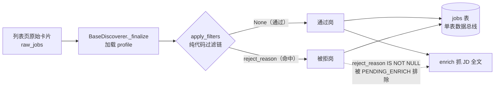
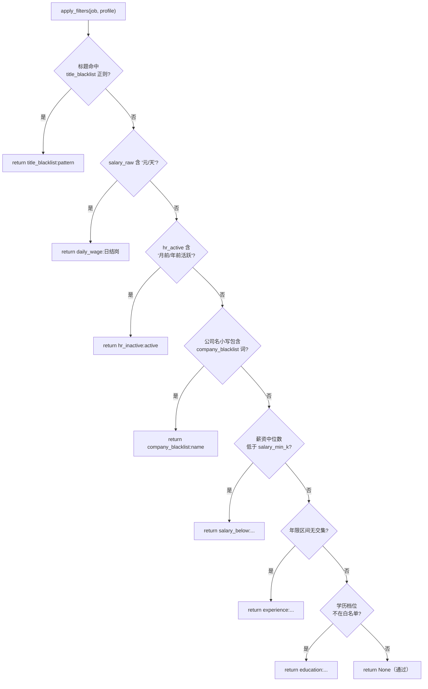
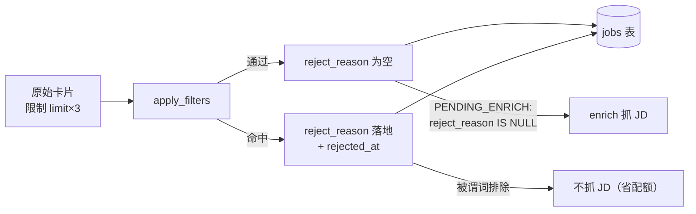

本页解析 JobPilot-CN 的**纯代码过滤链**——一条在岗位列表入库前执行、不调用任何模型、规则完全可审计的确定性过滤器。它回答三个工程问题：过滤发生在流水线哪个位置、规则以什么顺序短路、被淘汰的岗位为何仍要落库。理解这条链，是理解整个 discover → enrich 数据总线为何不会被噪声灌满的前提。

## 设计定位：确定性、可审计、零模型

过滤链的全部逻辑集中在 `discovery/base.py` 的 `apply_filters()` 一个函数中，文件头注释即点明其契约——「Discoverer 公共基类 + 纯代码过滤链（不调用任何模型，规则可审计）」。这一选择的工程含义是：过滤结果**完全由 profile 配置与岗位字段文本决定**，不引入任何概率性或网络依赖，因而可在单元测试中逐条精确断言，也不会因模型抖动而产生不可复现的淘汰。

Sources: [src/jobpilot/discovery/base.py](src/jobpilot/discovery/base.py#L1-L10)

过滤链在流水线中的位置是「列表采集的收尾」：两个平台的 Discoverer（`BossDiscoverer` / `LiepinDiscoverer`）在各自抓完原始卡片后，统一调用基类 `BaseDiscoverer._finalize()`，由它加载 profile、逐卡调用 `apply_filters`。这意味着过滤属于 discover 阶段的最后一步，位于 enrich（JD 全文抓取）之前。

Sources: [src/jobpilot/discovery/base.py](src/jobpilot/discovery/base.py#L165-L172)

## 过滤链执行顺序与短路语义

`apply_filters(job, profile)` 返回 `str | None`：命中任一规则就返回该规则的 `reject_reason` 字符串，全部通过则返回 `None`。函数 docstring 明确规定了检查顺序——**标题黑名单 → 日结岗 → HR 不活跃 → 公司黑名单 → 薪资 → 年限 → 学历**——且每个分支都是 `return`，因此是典型的**短路求值**：一旦命中即终止，后续规则不再评估。

Sources: [src/jobpilot/discovery/base.py](src/jobpilot/discovery/base.py#L89-L93)

这一顺序并非随意：前置的是**廉价且高置信的文本规则**（标题/日结/活跃度/公司名），随后才是需要数值解析的薪资与区间求交的年限、学历。短路设计的收益是绝大多数明显噪声岗在第一步就被淘汰，避免为它们做后续解析。

Sources: [src/jobpilot/discovery/base.py](src/jobpilot/discovery/base.py#L95-L119)

## 逐条规则解析

每条规则都产出**结构化、可读的淘汰原因**（`reject_reason`），而非布尔值——这让淘汰决策可追溯到具体命中项。下表汇总了各规则的触发条件、原因格式与配置来源。

| 规则 | 触发条件 | reject_reason 格式 | 配置项 |
|------|----------|-------------------|--------|
| 标题黑名单 | `re.search(pattern, title)` 命中 | `title_blacklist:{pattern}` | `preferences.title_blacklist[]` |
| 日结岗 | `salary_raw` 含 `元/天` | `daily_wage:日结岗` | 无（硬编码） |
| HR 不活跃 | `hr_active` 含 `月前活跃`/`年前活跃` | `hr_inactive:{active}` | 无（硬编码） |
| 公司黑名单 | 小写公司名包含小写关键词 | `company_blacklist:{name}` | `preferences.company_blacklist[]` |
| 薪资下限 | 折算中位数 `< salary_min_k` | `salary_below:{median:.0f}K < {N}K` | `preferences.salary_min_k` |
| 年限 | 岗位年限区间与可接受区间无交集 | `experience:{raw}（...）` | `preferences.experience` |
| 学历 | 归一档位不在允许名单内 | `education:{raw} 不在可接受 [...]` | `preferences.education` |

Sources: [src/jobpilot/discovery/base.py](src/jobpilot/discovery/base.py#L94-L153)

**标题黑名单**使用 `re.search` 而非字符串相等，因此黑名单项本身是**正则表达式**——默认模板给出 `["外包", "驻场", "实习"]`，示例测试中「外包装配工」因含「外包」被淘汰，原因字符串精确到命中的 pattern。

Sources: [src/jobpilot/discovery/base.py](src/jobpilot/discovery/base.py#L97-L99)、[tests/test_filters.py](tests/test_filters.py#L21-L22)

**日结岗**与 **HR 不活跃**是两条**硬编码启发式**（无配置开关）：前者匹配薪资文本中的「元/天」，用于剔除日结/兼职；后者在 `hr_active` 含「月前活跃」「年前活跃」时淘汰，用于过滤长期未回应的招聘帖。注意二者有防御性判断——`"元/天" in (job.get("salary_raw") or "")` 与 `if active and ...`——空字段不会误判。

Sources: [src/jobpilot/discovery/base.py](src/jobpilot/discovery/base.py#L101-L106)

**公司黑名单**采用**大小写不敏感的子串包含**（双方 `.lower()` 后做 `in`），而非精确匹配，因此配置「某某人力」即可覆盖「某某人力资源」。测试用例验证了这一点：公司名「某某人力资源」因包含黑名单词「某某人力」被淘汰。

Sources: [src/jobpilot/discovery/base.py](src/jobpilot/discovery/base.py#L108-L111)、[tests/test_filters.py](tests/test_filters.py#L25-L27)

**薪资下限**是三段保护后才计算的：仅当 `salary_min` 与 `salary_max` 同时存在、且 `salary_min_k` 已配置时才生效。它把区间中值按年薪月数折算为「月薪口径」——`median = (min + max) / 2 * months / 12`，其中 `months` 缺省为 12；`12薪` 与 `16薪` 的岗位因此可跨口径比较。淘汰原因把折算值一并写入，便于人工复核。

Sources: [src/jobpilot/discovery/base.py](src/jobpilot/discovery/base.py#L113-L119)

**年限**与**学历**两条规则的核心是「解析 → 比对」，其区间语义与档位归一化的细节分别由 [年限解析与左开右闭区间过滤](13-nian-xian-jie-xi-yu-zuo-kai-you-bi-qu-jian-guo-lu) 与 [学历档位归一化过滤](14-xue-li-dang-wei-gui-hua-guo-lu) 两页专述。在本页视角下只需注意其**接入契约**：两条规则都是「`cfg` 存在才启用」（`if cfg:` / `if edu_cfg:`），且**解析失败（返回 `None`）时一律不误杀**——实习卡只有「4天/周」这类标签，无法解析年限，会被显式放行。

Sources: [src/jobpilot/discovery/base.py](src/jobpilot/discovery/base.py#L122-L145)

年限规则使用 `parse_experience` 把文本转为 `(下限, 上限)` 元组，`经验不限` 被归为 `(0, UNLIMITED_YEARS)`（`UNLIMITED_YEARS = 99`）。由于该区间与任何可接受区间都有交集，代码对其**单独判断**：仅当 `allow_unlimited` 被显式设为 `False` 时才淘汰「经验不限」岗。学历规则则采用**白名单语义**：把配置的 allowed 列表逐项归一化后组成集合，岗位档位不在集合内即淘汰。

Sources: [src/jobpilot/discovery/base.py](src/jobpilot/discovery/base.py#L16-L22)、[src/jobpilot/discovery/base.py](src/jobpilot/discovery/base.py#L128-L153)

## 拒绝不是丢弃：reject_reason 的落库与下游影响

这是整条链最关键的设计决策：**被淘汰的岗位照样写入数据库，只是打上 `reject_reason` 与 `rejected_at` 标记**。

Sources: [src/jobpilot/discovery/base.py](src/jobpilot/discovery/base.py#L172-L177)

`_finalize` 的实现细节印证了这一点：它把原始卡片**过采样**到 `limit * 3` 条送去过滤（因为过滤会淘汰一部分，需要多取才能凑够通过配额）；通过的被标记为无 `reject_reason`，被拒的保留原因，两者**都 append 进返回列表**，最终统一经 `upsert_job` 落库。代码内注释明确写出意图——「通过过滤的够数即停；被拒的继续收集（报告尾供翻案）」，即被拒岗保留下来供人工「翻案」。

Sources: [src/jobpilot/discovery/base.py](src/jobpilot/discovery/base.py#L170-L181)

需要提醒维护者注意一处**注释与实现的细微不一致**：上述「够数即停」分支的判断体是 `pass`，并未真正 `break`，因此实际行为是处理满 `raw_jobs[:limit * 3]` 为止，而非一凑够通过配额就提前退出。

Sources: [src/jobpilot/discovery/base.py](src/jobpilot/discovery/base.py#L178-L180)

`reject_reason` 在库表层面是一等公民，与 `rejected_at` 同列在「过滤（纯代码规则淘汰）」注释之下。它直接影响 enrich 阶段的选材：待抓 JD 的锚定谓词 `PENDING_ENRICH` 要求 `reject_reason IS NULL`，因此**被拒岗永远不会进入 JD 全文抓取**——这是过滤链放在 enrich 之前的最大收益：省下宝贵的浏览器会话与登录态配额。

Sources: [src/jobpilot/db.py](src/jobpilot/db.py#L44-L46)、[src/jobpilot/models.py](src/jobpilot/models.py#L15-L23)、[src/jobpilot/enrichment/detail.py](src/jobpilot/enrichment/detail.py#L38-L43)

## 配置来源与默认模板

所有可配置规则都收敛到 `~/.jobpilot-cn/profile.json` 的 `preferences` 段。该文件由 `jp init` 从包内 `DEFAULT_PROFILE` 模板写出，加载由 `config.load_profile()` 完成，`_finalize` 每次过滤前都会重新读取。模板中每一项都带有行内注释，明确其语义与「`null` = 不过滤」的默认约定。

Sources: [src/jobpilot/config.py](src/jobpilot/config.py#L14-L31)、[src/jobpilot/config.py](src/jobpilot/config.py#L81-L85)

| 配置项 | 类型 | 默认值 | 语义 |
|--------|------|--------|------|
| `title_blacklist` | 正则数组 | `["外包","驻场","实习"]` | 命中任一正则即淘汰（`re.search`） |
| `company_blacklist` | 字符串数组 | `[]` | 公司名小写包含任一词即淘汰 |
| `salary_min_k` | 整数 / null | `null` | 月薪中位数下限（按 12 月折算）；null 不过滤 |
| `experience` | 对象 / null | `null` | 可接受年限区间 `[min_years, max_years]` 与 `allow_unlimited` |
| `education` | 对象 / null | `null` | 学历白名单 `allowed[]` 与 `allow_unlimited` |

Sources: [src/jobpilot/config.py](src/jobpilot/config.py#L16-L31)

需要区分**本地过滤**与服务端筛选参数：服务端参数（写进 `searches.yaml` 的 `experience`/`education`）作用于搜索引擎请求层，见 [服务端筛选参数（年限/学历/薪资）](15-fu-wu-duan-shai-xuan-can-shu-nian-xian-xue-li-xin-zi)；而本页的过滤链是**二次兜底**——猎聘没有可用的服务端年限参数，其年限筛选只能依赖 `preferences.experience` 的本地过滤。

Sources: [src/jobpilot/searches.example.yaml](src/jobpilot/searches.example.yaml#L9-L17)

## 可观测性：计数板与导出

过滤不是黑盒，链上决策在两处被观测。其一是 `jp status` 的计数板，`db.counts()` 通过 `reject_reason IS NOT NULL` 统计「已过滤」总数，与「待抓 JD」「抓 JD 失败」等口径并列展示。

Sources: [src/jobpilot/db.py](src/jobpilot/db.py#L119-L134)、[src/jobpilot/cli.py](src/jobpilot/cli.py#L41-L52)

其二是导出环节：`export.select_rows` **默认只导出 `reject_reason IS NULL` 的通过岗**，被拒岗需显式开启才纳入。`jp export --include-rejected` 即暴露该开关，导出字段中包含 `reject_reason` 列，便于把淘汰原因带到下游分析或人工复核。

Sources: [src/jobpilot/export.py](src/jobpilot/export.py#L27-L33)、[src/jobpilot/export.py](src/jobpilot/export.py#L17-L24)、[src/jobpilot/cli.py](src/jobpilot/cli.py#L148-L154)

## 测试锚点

过滤链的正确性由 `tests/test_filters.py` 逐条锁定：文件内定义一份含三项规则的最小 `PROFILE`，分别验证「正常岗通过返回 `None`」「标题黑名单返回精确原因」「公司黑名单子串命中」「薪资低于下限返回 `salary_below:` 前缀」「日结岗返回 `daily_wage:日结岗`」。这些用例是理解每条规则边界行为最直接的入口。

Sources: [tests/test_filters.py](tests/test_filters.py#L1-L40)

## 小结与下一步

纯代码过滤链的设计可归纳为三条原则：**纯代码、可审计**（无模型调用，规则即配置）；**短路、分级**（廉价高置信规则前置，命中即终止）；**拒绝留痕、入库可翻案**（`reject_reason` 一等公民，且被谓词排除于 enrich 之外以省配额）。

建议按目录结构继续阅读以补全过滤规则的完整语义：先看 [年限解析与左开右闭区间过滤](13-nian-xian-jie-xi-yu-zuo-kai-you-bi-qu-jian-guo-lu) 理解 `(jmin, jmax]` 的半开区间求交，再看 [学历档位归一化过滤](14-xue-li-dang-wei-gui-hua-guo-lu) 理解档位归一与白名单语义；若关心过滤与采集的耦合点，可回看 [模块边界与阶段编排契约](7-mo-kuai-bian-jie-yu-jie-duan-bian-pai-qi-yue) 与 [列级状态机与幂等续传机制](5-lie-ji-zhuang-tai-ji-yu-mi-deng-xu-chuan-ji-zhi)。