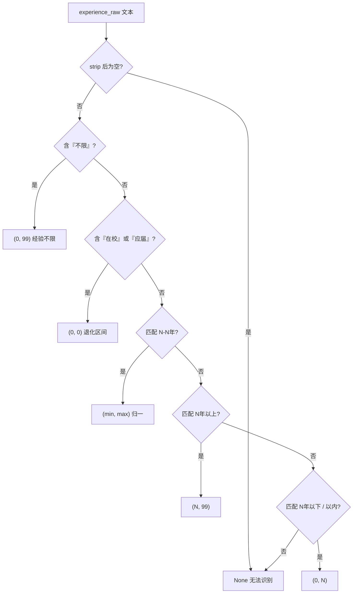
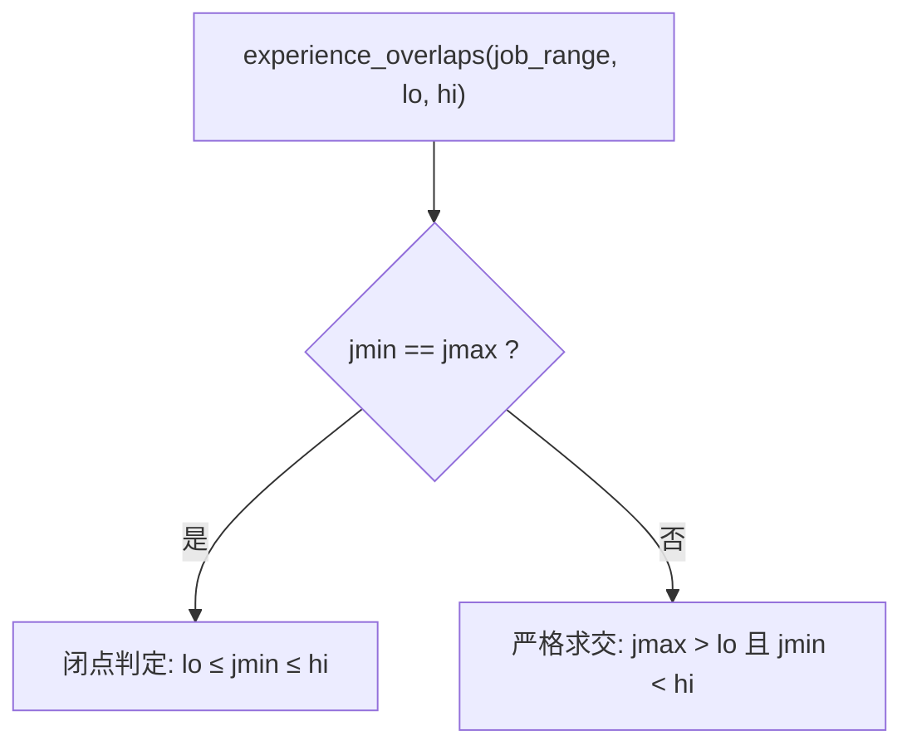
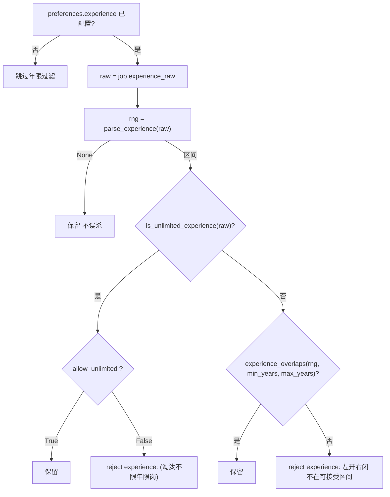
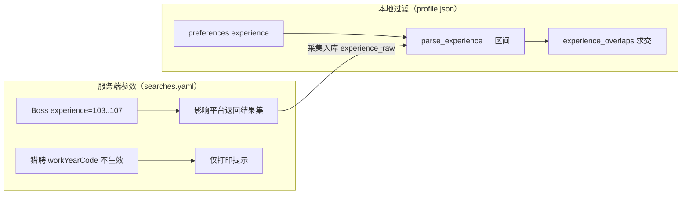

本页聚焦招聘岗位「工作年限」这一非结构化字段的**文本解析**与**区间求交过滤**两个环节，对应纯代码过滤链中紧邻薪资之后的第四道关卡。核心实现集中在 `discovery/base.py` 的 `parse_experience` 与 `experience_overlaps` 两个函数，二者被 `apply_filters` 的年限分支统一编排。本页不展开学历归一化（见 [学历档位归一化过滤](14-xue-li-dang-wei-gui-hua-guo-lu)）与服务端筛选参数映射（见 [服务端筛选参数（年限/学历/薪资）](15-fu-wu-duan-shai-xuan-can-shu-nian-xian-xue-li-xin-zi)），仅讨论「平台原文 → 数值区间 → 是否淘汰」的完整链路。

Sources: [base.py](src/jobpilot/discovery/base.py#L16-L86), [base.py](src/jobpilot/discovery/base.py#L121-L137)

## 问题域：年限字段的来源与形态

「工作年限」在各平台的原始载体并不统一，且与实习/兼职标签混杂在同一个标签列表里。Boss 直聘的年限**藏在标签列表**（`ul.tag-list li`）中，采集端用 `next((t for t in tags if parse_experience(t)), "")` 挑出第一个能被年限解析器识别的标签——若整张卡只有 `4天/周` 这类实习标签，则 `experience_raw` 落为空值；猎聘则直接从 XHR 返回体的 `requireWorkYears` 字段取值。两种来源最终都写入统一的 `experience_raw` 字段，由下游过滤链消费。

| 平台 | 原始字段/载体 | 典型取值 | 引用位置 |
|------|--------------|---------|---------|
| Boss 直聘 | 标签列表过滤 | `3-5年`／`经验不限`／`在校/应届`；`4天/周`→空 | `boss.py` L188-189, L204 |
| 猎聘 | XHR `requireWorkYears` | `3-5年`／`5年以上`／`经验不限` | `liepin.py` L162-163, L182 |

这种「原始文本先入库存原样、过滤时再解析」的设计，使 `experience_raw` 始终保留平台原文供人工复核（拒绝原因会原样带回该文本），而解析逻辑可独立测试、独立演进。

Sources: [boss.py](src/jobpilot/discovery/boss.py#L184-L206), [liepin.py](src/jobpilot/discovery/liepin.py#L160-L189)

## 正则解析：五类文本到数值区间

`parse_experience` 采用「三条正则 + 两条特殊分支」的优先级判定，把一个年限文本映射为 `(下限, 上限)` 元组；无法识别时返回 `None`。三条正则分别覆盖区间型、上开型、下闭型三种句式，`UNLIMITED_YEARS = 99` 作为「无上界」的哨兵值，用于把开区间折叠为可直接求交的闭区间表示。

```python
_EXP_RANGE_RE = re.compile(r"(\d+)\s*-\s*(\d+)\s*年")   # 3-5年
_EXP_ABOVE_RE = re.compile(r"(\d+)\s*年以上")            # 5年以上
_EXP_BELOW_RE = re.compile(r"(\d+)\s*年(?:以下|以内)")   # 1年以下 / 1年以内
```

判定顺序至关重要：先做特殊分支（`不限`、`在校/应届`）再走正则，保证语义优先级不被数值模式抢占。其中 `在校`/`应届` 被映射为退化区间 `(0, 0)`，而 `经验不限` 映射为 `(0, 99)`。区间型命中后还会做一次 `min/max` 归一，防止 `5-3年` 这类倒序写法破坏后续求交的方向性。



下表列出解析器的完整输入输出契约。注意 `4天/周`、`6个月`、`本科` 这类实习/兼职/学历标签**必须**返回 `None`——这是避免「把出勤天数或修业年限误当作工作经验」而误杀岗位的关键防线。

| 输入文本 | 输出区间 | 语义 |
|---------|---------|------|
| `3-5年` / `1-3年` / `2-10年` | `(3,5)` / `(1,3)` / `(2,10)` | 区间型，min/max 归一 |
| `5年以上` / `10年以上` | `(5,99)` / `(10,99)` | 上开，折叠为 99 |
| `1年以下` / `1年以内` | `(0,1)` | 下闭；Boss 用「以内」、猎聘用「以下」 |
| `经验不限` | `(0,99)` | 无界，需单独判定 |
| `在校/应届` | `(0,0)` | 退化区间，按闭点处理 |
| `4天/周` / `6个月` / `本科` / 空串 | `None` | 不可识别 → 不参与过滤 |

Sources: [base.py](src/jobpilot/discovery/base.py#L16-L45), [test_experience.py](tests/test_experience.py#L18-L44)

## 左开右闭区间求交：核心过滤语义

`experience_overlaps` 是本页的语义核心。它把「岗位要求的年限区间」与「求职者可接受区间 `[lo, hi]`」做交集判定，且岗位要求被刻意按**左开右闭** `(jmin, jmax]` 理解——其直觉是「`3-5年` 意味着要 3 年以上的人，**刚满 3 年**的应聘者不算数」。因此在可接受 0-3 年时，`[3,5]` 必须被判为**无交集**：为体现这一点，求交条件在两端都使用**严格不等式** `jmax > lo and jmin < hi`，与 `(jmin, jmax]` 的标准区间求交公式一致。

```python
def experience_overlaps(job_range, lo, hi) -> bool:
    jmin, jmax = job_range
    if jmin == jmax:                 # 退化区间按闭点，避免空区间误杀
        return lo <= jmin <= hi
    return jmax > lo and jmin < hi
```

退化区间 `(jmin == jmax)` 需特判：`在校/应届` 被表示为 `(0,0)`，若照搬 `jmax > lo and jmin < hi` 会得到 `0 > 0` 恒假，导致任何应届岗位都被淘汰。特判改用闭点判定 `lo <= jmin <= hi`，从而「可接受 0-3 年」或「可接受 0-0 年」时保留应届岗，而「可接受 3-5 年」时仍正确淘汰应届岗。



下表以「可接受 0-3 年」（`lo=0, hi=3`）为基准，验证四类边界情形的判定结果，与测试用例一一对应。

| 岗位要求 | 解析区间 | `jmax > lo` | `jmin < hi` | 结果 | 判定理由 |
|---------|---------|:-----------:|:-----------:|------|---------|
| `1-3年` | `(1,3)` | `3>0` ✓ | `1<3` ✓ | 保留 | 真实交叠 `(1,3]` |
| `2-10年` | `(2,10)` | `10>0` ✓ | `2<3` ✓ | 保留 | 真实交叠 `(2,3]` |
| `1年以内` | `(0,1)` | `1>0` ✓ | `0<3` ✓ | 保留 | 下闭型 `(0,1]` |
| `3-5年` | `(3,5)` | `5>0` ✓ | `3<3` ✗ | **淘汰** | 左开：刚满 3 年不算 |
| `3年以上` | `(3,99)` | `99>0` ✓ | `3<3` ✗ | **淘汰** | 同上，左开右无界 |
| `在校/应届` | `(0,0)` | 退化 | 退化 | 保留 | 闭点 `0≤0≤3` |

Sources: [base.py](src/jobpilot/discovery/base.py#L76-L86), [test_experience.py](tests/test_experience.py#L61-L79)

## 过滤链编排：apply_filters 中的年限分支

年限过滤是纯代码过滤链的第 6 道条件（顺序：标题黑名单 → 日结岗 → HR 不活跃 → 公司黑名单 → 薪资 → **年限** → 学历），只有当 `preferences.experience` 被显式配置时才启用，否则整段跳过。分支内部先取 `experience_raw` 并解析：**解析失败即放行**（`rng is None` 直接跳过，不误杀实习卡）；解析成功后分两条路径——`经验不限` 走 `allow_unlimited` 开关单独判定，其余区间走 `experience_overlaps` 求交。



`经验不限` 之所以要单独判定，是因为其区间 `(0, 99)` 与任何可接受区间都必然相交，「求交」这条路径无法表达「用户主动排除不限年限岗位」的意图，故只能靠 `allow_unlimited`（默认 `True`）显式开闭。`min_years`/`max_years` 分别默认 `0` 与 `UNLIMITED_YEARS`（99），所以只配一个边界也能工作。被淘汰的岗位会写入带上下文的 `reject_reason`，其格式为 `experience:{原文}（按左开右闭 ({jmin},{jmax}] 年）不在可接受 {lo}-{hi} 年内`，便于人工翻案时回溯。

| 场景 | 配置 | 岗位 `experience_raw` | 结果 |
|------|------|----------------------|------|
| 未配置年限 | `experience: null` | 任意 | 全部放行（默认关闭） |
| 交集存在 | `min_years:0, max_years:3` | `1-3年` / `经验不限` | 保留 |
| 要求过高 | `min_years:0, max_years:3` | `5-10年` / `5年以上` | 淘汰 |
| 左开边界 | `min_years:0, max_years:3` | `3-5年` | 淘汰（左开语义） |
| 解析失败 | 任意已配置 | `""` / `4天/周` | 保留（不误杀） |
| 排除不限 | `allow_unlimited:false` | `经验不限` | 淘汰 |
| 应届退化 | `min_years:0, max_years:0` | `在校/应届` | 保留（闭点） |

Sources: [base.py](src/jobpilot/discovery/base.py#L89-L137), [test_experience.py](tests/test_experience.py#L47-L97), [config.py](src/jobpilot/config.py#L24-L26)

## 配置边界与相邻职责划分

年限配置仅存在于 `profile.json` 的 `preferences.experience` 下，默认模板值为 `None`，即开箱即用的行为是**不做任何年限过滤**。需与相邻机制明确区分：搜索配置 `searches.yaml` 里的 `experience` 是**服务端 URL 参数**（Boss 专属，映射为 `experience=103..107`，取值非法会 `raise ValueError`），它改变的是「平台返回什么岗位」，而本页讨论的 `profile.json preferences.experience` 是**本地离线过滤**，改变的是「已采集岗位是否保留」。猎聘的 `workYearCode` 服务端参数实测不生效，其采集端只打印提示并引导用户改用本地过滤。这两条链路的取值语义、生效范围与失败模式均不同，配置时切勿混淆。



本地过滤链的完整设计见 [纯代码过滤链设计](12-chun-dai-ma-guo-lu-lian-she-ji)，服务端参数取值表见 [服务端筛选参数（年限/学历/薪资）](15-fu-wu-duan-shai-xuan-can-shu-nian-xian-xue-li-xin-zi)，紧接其后的学历白名单过滤见 [学历档位归一化过滤](14-xue-li-dang-wei-gui-hua-guo-lu)。整套规则的回归保护由 `tests/test_experience.py` 承担，其用例即本页所描述契约的可执行规范。