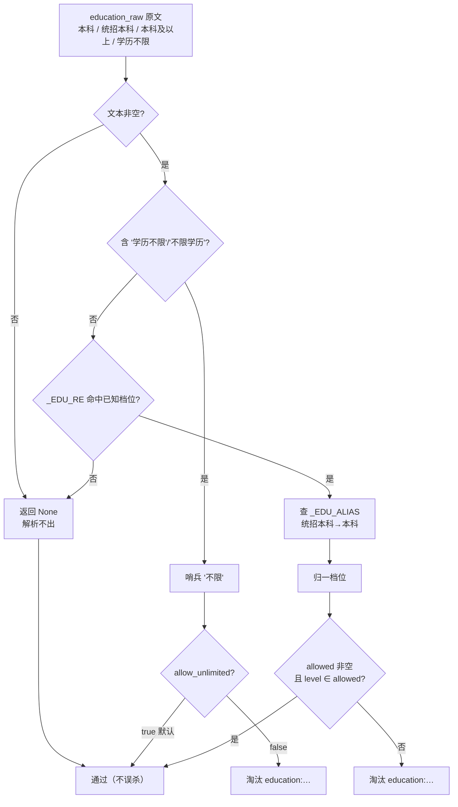
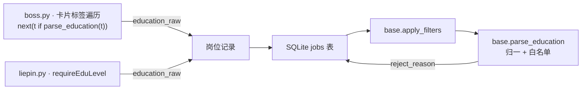

不同招聘平台对同一个学历要求的写法各不相同：Boss 直聘在卡片标签里写「本科及以上」，猎聘在 `requireEduLevel` 字段里写「统招本科」，而用户的心里只有「本科」这一个概念。本文聚焦 `jobpilot` 如何把这些五花八门的原文**归一到有限档位**，再以**白名单语义**执行过滤——这是「纯代码过滤链」中专属于学历的一环，与年限过滤并列、互不干扰。

Sources: [base.py](src/jobpilot/discovery/base.py#L52-L73), [test_education.py](tests/test_education.py#L1-L93)

## 为什么需要「归一化」：同一个学历，多种写法

过滤的前提是**可比较**。如果直接拿岗位原文去和用户配置做字符串比对，那么「统招本科」就不等于「本科」，一个招聘统招本科的岗位就会被错误地当成「非本科」而拦下。`jobpilot` 的解决思路是插入一个**归一化层**：先把任意原始文本映射到一组稳定的、有限的「档位」字符串，再让过滤逻辑只在这组档位上运行。

原始文本来自两条完全不同的采集路径：Boss 的学历藏在列表卡的**标签数组**里（如「本科」「学历不限」），通过遍历标签找到第一个能被识别的项得出；猎聘则直接读取 XHR JSON 里的 **`requireEduLevel`** 字段。两者取到原文后统一写入数据库的 `education_raw` 列，过滤阶段完全不关心它来自哪个平台。

Sources: [boss.py](src/jobpilot/discovery/boss.py#L186-L206), [liepin.py](src/jobpilot/discovery/liepin.py#L161-L183)

## 归一化规则：正则捕获 + 别名表

归一化的入口是 `parse_education(text)`，它接受任意字符串，返回**档位字符串、哨兵值「不限」或 `None`**（无法识别）。整个逻辑只有三行有效代码，却覆盖了平台差异：

第一道判据是「不限」的显式短路——只要原文含有「学历不限」或「不限学历」，直接返回哨兵常量 `EDU_UNLIMITED`（其值为字符串 `"不限"`）。第二道判据用正则 `_EDU_RE` 在原文中**搜索**（`re.search`，非全匹配）已知档位词，命中即取该档位；随后查别名表 `_EDU_ALIAS` 做替换。第三道是兜底：全部不命中则返回 `None`。

Sources: [base.py](src/jobpilot/discovery/base.py#L53-L73)

正则 `_EDU_RE` 的设计包含两个关键决策。其一是**别名前置**：`统招本科` 写在 `本科` 之前、`初中及以下` 写在 `初中` 之前，利用正则交替「首个匹配优先」的特性，保证更具体的写法被先捕获。其二是**后缀容忍**：末尾的 `(?:及以上|以上)?` 让「本科及以上」也能落在捕获组 `本科` 上——Boss 的委婉写法因此被自动取基准档。

| 原文 | 来源平台 | 归一档位 |
| --- | --- | --- |
| `本科` | 通用 | `本科` |
| `统招本科` | 猎聘 `requireEduLevel` | `本科`（别名替换） |
| `本科及以上` | Boss 卡片标签 | `本科`（后缀被正则吃掉） |
| `大专` / `高中` / `中专` / `中技` | 通用 | 同名档位 |
| `初中` / `初中及以下` | Boss | 同名档位 |
| `硕士` / `博士` | 通用 | 同名档位 |
| `学历不限` / `不限学历` | 通用 | `不限`（哨兵） |
| `经验不限` / `3-5年` / `4天/周` / 空串 | 其它标签 | `None` |

Sources: [base.py](src/jobpilot/discovery/base.py#L54-L72), [test_education.py](tests/test_education.py#L13-L33)

## 解析的边界：宁可漏判，不可误判

`parse_education` 面对一个真实岗位时会「顺带」看到很多非学历文本，因为 Boss 的标签列表里混着年限、出勤等信息。设计上选择了**保守策略**：只有明确命中已知档位词才返回结果，否则一律 `None`。这样「经验不限」「3-5年」「4天/周」这些标签都不会被误读成学历，空字符串同样返回 `None`。这一策略的直接收益是——识别不出学历的岗位在后续过滤中会被**保留而非淘汰**，避免因解析能力不足而错杀。

需要特别注意的是「不限」这个词的双重含义：`parse_education("经验不限")` 返回 `None`（那是年限），而 `parse_education("学历不限")` 返回哨兵 `"不限"`。两者的分流发生在正则之前：「学历不限 / 不限学历」被显式短路，不含「学历」二字的「经验不限」自然落到正则上，因无学历档位词而返回 `None`。

Sources: [base.py](src/jobpilot/discovery/base.py#L66-L73), [test_education.py](tests/test_education.py#L28-L33)

## 白名单过滤语义：五条分支的决策树

过滤逻辑位于 `apply_filters` 的末尾（顺序上排在标题黑名单、日结岗、HR 不活跃、公司黑名单、薪资、年限**之后**）。配置取自 `profile.preferences.education`，其结构为 `{"allowed": [...], "allow_unlimited": true}`。当该配置缺省或为 `null` 时整段跳过，即默认不做学历过滤。

进入过滤后，`parse_education` 产出的归一档位决定走向：

- **`None`（解析不出）** → 直接通过，不误杀。
- **哨兵 `"不限"`** → 取决于 `allow_unlimited`；默认 `true` 保留，显式设为 `false` 时淘汰并记 `reject_reason`。
- **具体档位** → 走白名单：把 `allowed` 列表中的每一项**也做一次归一化**（`parse_education(x) or str(x).strip()`），然后判断该档位是否落在集合内。若 `allowed` 为空集，视为未启用过滤；若 `allowed` 非空且不含该档位，则淘汰。

Sources: [base.py](src/jobpilot/discovery/base.py#L139-L153)

「把 allowed 也归一化」这一点值得展开：用户即使把「统招本科」写进配置，它也会先被归成 `本科` 再参与比对，因此别名表对**配置侧与数据侧同时生效**，两端写法不一致也不会导致漏配。过滤命中时返回的 `reject_reason` 形如 `education:博士 不在可接受 ['本科', '硕士']`，既记录原文又暴露归一后的比较依据，便于事后翻案排查。

Sources: [base.py](src/jobpilot/discovery/base.py#L149-L153), [test_education.py](tests/test_education.py#L41-L68)

## 决策流程图

下图刻画从原始文本到最终判定（通过 / 淘汰）的完整路径。左半是归一化，右半是白名单过滤，`None` 分支在两侧都代表「放行」。

Sources: [base.py](src/jobpilot/discovery/base.py#L61-L73), [base.py](src/jobpilot/discovery/base.py#L139-L153)

## 与配置、服务端参数的关系

学历在 `jobpilot` 中出现**两次**，切勿混淆：一次是**服务端筛选参数**（Boss 的 `&degree=`、猎聘的 `&eduLevel=`，在构造搜索 URL 时拼入，属于「服务端筛选参数」页的主题），另一次就是本文的**本地白名单过滤**（在抓取结果上运行，读 `education_raw`）。两者可以共存：服务端参数先粗筛，本地过滤再精筛，且本地过滤使用的正是上文同一套档位字符串，因此配置写法对二者是一致的。

用户侧的配置样例如下，它是「服务端参数」与「本地过滤」共用的语言：

| 配置项 | 取值示例 | 含义 |
| --- | --- | --- |
| `education`（服务端） | `"本科"` | 拼成 Boss `degree` / 猎聘 `eduLevel`；非法值显式报错 |
| `preferences.education`（本地） | `{"allowed": ["本科","硕士"], "allow_unlimited": true}` | 白名单；`allowed` 为空或 `null` 则不启用 |
| `preferences.education.allow_unlimited` | `true`（默认） | `false` 时连「学历不限」岗位一并淘汰 |

Sources: [config.py](src/jobpilot/config.py#L16-L31), [README.md](README.md#L113-L157), [boss.py](src/jobpilot/discovery/boss.py#L36-L43), [liepin.py](src/jobpilot/discovery/liepin.py#L28-L30)

## 模块交互与数据流

学历过滤并非孤立函数，而是嵌入在「采集 → 入库 → 过滤」的流水线中。采集层负责把原文写进 `education_raw`，`apply_filters` 在 `_finalize` 中被调用，命中拒绝的岗位**仍然入库**，只额外标注 `reject_reason`，默认导出时被跳过。

值得注意的是，采集层在提取 `education_raw` 时用的正是同一个 `parse_education` 作为**筛选器**——Boss 的 `next((t for t in tags if parse_education(t)), "")` 会从标签列表中挑出第一个能被识别为学历的项，从而把学历与年限标签区分开。这意味着归一化函数在「采集」与「过滤」两处被复用，是学历链路的单一事实来源。

Sources: [boss.py](src/jobpilot/discovery/boss.py#L186-L206), [liepin.py](src/jobpilot/discovery/liepin.py#L161-L183), [base.py](src/jobpilot/discovery/base.py#L165-L181)

## 测试覆盖与相邻主题

`tests/test_education.py` 覆盖了本页的每条分支：档位解析、别名/后缀归一、非学历文本返回 `None`、白名单保留与淘汰、`allow_unlimited` 开关、默认禁用，以及「学历与年限过滤相互独立」的组合断言——后者确保学历淘汰不会被年限结果覆盖（失败时 `reject_reason` 前缀分别是 `education:` 与 `experience:`）。

如需回看这条过滤链的整体编排（各环节顺序与 `reject_reason` 约定），见 [纯代码过滤链设计](12-chun-dai-ma-guo-lu-lian-she-ji)；与之并列、采用区间求交而非白名单的年限过滤，见 [年限解析与左开右闭区间过滤](13-nian-xian-jie-xi-yu-zuo-kai-you-bi-qu-jian-guo-lu)；而作为搜索参数拼进 URL 的那一套学历编码（`degree` / `eduLevel`），见 [服务端筛选参数（年限/学历/薪资）](15-fu-wu-duan-shai-xuan-can-shu-nian-xian-xue-li-xin-zi)。