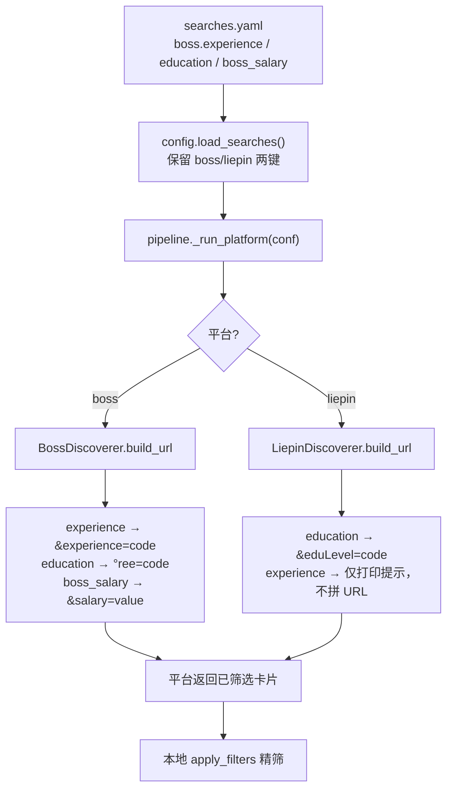

本文聚焦 **JobPilot-CN 在发起搜索请求时，直接拼进 URL / 请求体的平台服务端筛选参数**——即「年限（experience）」「学历（education）」「薪资（boss_salary）」这三类。它们与 `~/.jobpilot-cn/searches.yaml` 的搜索配置同生共死，作用是在平台侧先把结果集筛一轮，减少后续本地过滤链的压力。阅读本文前，建议先了解 [纯代码过滤链设计](12-chun-dai-ma-guo-lu-lian-she-ji) 中的本地过滤机制，二者构成「服务端预筛 + 客户端精筛」的两级架构。

## 服务端筛选 vs 本地筛选：两级过滤架构

JobPilot-CN 的筛选能力分两层。**服务端筛选参数**写在 `searches.yaml` 里，由 `build_url` 拼成查询串交给平台，平台返回的卡片已经是筛过的结果；**本地过滤**则由 `profile.json` 驱动，在 `apply_filters` 里对已抓取的卡片逐条判断。前者越精准，后者需要处理的噪声越少，但服务端参数受平台能力约束（例如猎聘根本不提供可用的服务端年限参数）。

两级过滤的能力边界如下表所示，其中服务端参数的可用范围完全取决于各平台接口的实测行为：

| 维度 | 配置位置 | 拼接目标 | Boss | 猎聘 |
| --- | --- | --- | --- | --- |
| 年限 | `searches.yaml` 的 `experience` | Boss `&experience=` | ✅ 支持（5 档） | ❌ 不支持（仅打印提示） |
| 学历 | `searches.yaml` 的 `education` | Boss `&degree=` / 猎聘 `&eduLevel=` | ✅ 支持（5 档） | ✅ 支持（3 档） |
| 薪资 | `searches.yaml` 的 `boss_salary` | Boss `&salary=` | ✅ 原样透传 | ❌ 未配置 |
| 年限（本地） | `profile.json` 的 `preferences.experience` | 客户端区间求交 | ✅ | ✅ |
| 学历（本地） | `profile.json` 的 `preferences.education` | 客户端白名单 | ✅ | ✅ |

Sources: [searches.example.yaml](src/jobpilot/searches.example.yaml#L4-L17), [config.py](src/jobpilot/config.py#L13-L30)

## 配置入口与参数流转链路

服务端筛选参数全部集中在 `searches.yaml` 的平台段下（`boss:` / `liepin:`）。`load_searches` 读取该文件并**只保留 `boss`、`liepin` 两个键**，避免误配置污染其它段落；加载结果作为 `conf` 逐平台传入 `_run_platform`，最终交给各平台的 `run` → `build_url` 使用 [config.py](src/jobpilot/config.py#L88-L94) [pipeline.py](src/jobpilot/pipeline.py#L59-L66)。

整个链路是**「配置驱动、构建即校验」**：`build_url` 在拼接 URL 时同步做档位查表，遇到非法取值立即抛 `ValueError`，而不是静默忽略。下列流程图展示了从 YAML 到最终搜索 URL 的完整路径：

Sources: [config.py](src/jobpilot/config.py#L88-L94), [pipeline.py](src/jobpilot/pipeline.py#L59-L70), [boss.py](src/jobpilot/discovery/boss.py#L86-L105), [liepin.py](src/jobpilot/discovery/liepin.py#L41-L57)

## Boss：年限参数 experience

Boss 的年限筛选通过 `&experience=<code>` 生效，中文档位到数字代码的映射由模块级常量 `EXPERIENCE_CODES` 定义。`build_url` 先对输入做 `str(exp).strip()` 归一，再查表；**查不到就抛错**，防止用户以为配置生效、实则被平台忽略 [boss.py](src/jobpilot/discovery/boss.py#L91-L97)。

| 配置取值 | 拼入 URL 的代码 | 说明 |
| --- | --- | --- |
| `1年以下` / `1年以内` | `103` | 两个中文写法映射到同一代码 |
| `1-3年` | `104` | |
| `3-5年` | `105` | |
| `5-10年` | `106` | |
| `10年以上` | `107` | |

档位常量注释明确记录了实测依据：「2026-09 逐个实测：103/104/105/106/107 各 15 张卡全中」，即每个代码都经过 15 张卡片的验证，属于**经实证锚定的映射**而非常识推断 [boss.py](src/jobpilot/discovery/boss.py#L26-L34)。示例配置中该字段的注解也提示「不需要就删掉这两行（不配 = 不限）」 [searches.example.yaml](src/jobpilot/searches.example.yaml#L22-L23)。

## Boss：学历参数 education

Boss 的学历筛选通过 `&degree=<code>` 生效，映射表为 `DEGREE_CODES`。拼接逻辑与年限完全对称：`str(edu).strip()` 归一后查表，未命中即抛 `ValueError`，错误信息会列出全部合法档位方便自查 [boss.py](src/jobpilot/discovery/boss.py#L98-L104)。

| 配置取值 | 拼入 URL 的代码 |
| --- | --- |
| `高中` | `206` |
| `大专` | `202` |
| `本科` | `203` |
| `硕士` | `204` |
| `博士` | `205` |

档位常量注释特别标注「201 是混合档不采用」，说明映射表的取舍原则是**只收录行为明确的纯档位**，对语义含混的代码保持克制 [boss.py](src/jobpilot/discovery/boss.py#L36-L43)。

## Boss：薪资参数 boss_salary

薪资参数与年限/学历的校验范式不同——它以 `boss_salary` 键直接透传：只要配置非空，就原样拼成 `&salary=<value>`，**不做档位查表、不做合法性校验** [boss.py](src/jobpilot/discovery/boss.py#L89-L90)。示例注释给出取值范例：`"402"` 表示 20-30K，即该字段使用的是 Boss 自身的薪资编码体系 [searches.example.yaml](src/jobpilot/searches.example.yaml#L9)。由于代码内未内置薪资代码表，使用者需要自行确认目标薪资档对应的数字码。

## 猎聘：学历参数 education

猎聘的学历筛选拼成 `&eduLevel=<code>`，映射表为 `EDU_CODES`，校验逻辑与 Boss 一致（未命中即抛 `ValueError`） [liepin.py](src/jobpilot/discovery/liepin.py#L50-L56)。

| 配置取值 | 拼入 URL 的代码 |
| --- | --- |
| `本科` | `040` |
| `硕士` | `030` |
| `大专` | `050` |

值得注意的是猎聘**未内置博士档**：常量注释解释「020 与 030 结果相同，博士档无法确认，故未内置」——这是「宁可缺失也不猜」的证据标准的体现 [liepin.py](src/jobpilot/discovery/liepin.py#L28-L30)。示例配置也明确猎聘「没有服务端年限参数，但学历参数可用」 [searches.example.yaml](src/jobpilot/searches.example.yaml#L29)。

## 猎聘：年限参数不受支持

猎聘的 URL 上虽有 `workYearCode` 参数，但**实测不改变结果**。因此当 `searches.yaml` 的 `liepin.experience` 被配置时，代码不会静默失败，也不会假装生效，而是打印一条明确提示，引导使用者改用 `profile.json` 的 `preferences.experience` 做本地过滤 [liepin.py](src/jobpilot/discovery/liepin.py#L42-L45)。

这一设计的一致性意图是：任何「配了却无效」的情况都要**显式告知**，而非让用户误以为筛选已生效。对应常量注释与示例配置也都重申了同一结论：「猎聘的 workYearCode= URL 参数实测不生效，那边只能靠 profile 的本地年限过滤」 [boss.py](src/jobpilot/discovery/boss.py#L26-L27) [searches.example.yaml](src/jobpilot/searches.example.yaml#L10-L13)。

## 校验失败的行为与错误传播

三类参数里，`experience`/`education` 走**构建即校验**，`boss_salary` 走原样透传。当年限或学历传入非法档位时，`build_url` 抛出的 `ValueError` 会被 `pipeline` 在**单关键词粒度**捕获，写入 `result.errors` 后继续处理下一个关键词，并让其它平台照常运行——即「单点配置错误不拖垮全局」 [pipeline.py](src/jobpilot/pipeline.py#L63-L70)。

下表对比了各参数的失败语义，帮助快速定位配置问题：

| 参数 | 非法输入时的行为 | 影响范围 |
| --- | --- | --- |
| `boss.experience` | 抛 `ValueError`，含合法档位清单 | 该关键词失败，其它关键词/平台继续 |
| `boss.education` | 抛 `ValueError`，含合法档位清单 | 同上 |
| `boss_salary` | 不校验，原样拼入 | 由平台侧决定是否生效 |
| `liepin.education` | 抛 `ValueError`，含合法档位清单 | 同上 |
| `liepin.experience` | 打印提示，不拼 URL | 不影响流程，仅提示 |

Sources: [boss.py](src/jobpilot/discovery/boss.py#L89-L104), [liepin.py](src/jobpilot/discovery/liepin.py#L42-L56), [pipeline.py](src/jobpilot/pipeline.py#L63-L70)

## 小结与延伸阅读

服务端筛选参数是 JobPilot-CN 过滤体系的第一道闸门：`searches.yaml` 提供声明式配置，`build_url` 负责将中文档位映射为平台代码并在构建期校验，`pipeline` 负责隔离单点错误。它与 `profile.json` 的本地过滤链协同，构成「平台预筛 + 客户端精筛」的纵深防御。

若想进一步理解各维度的过滤细节，可继续阅读：
- [纯代码过滤链设计](12-chun-dai-ma-guo-lu-lian-she-ji)：本地过滤的执行顺序与整体骨架
- [年限解析与左开右闭区间过滤](13-nian-xian-jie-xi-yu-zuo-kai-you-bi-qu-jian-guo-lu)：本地年限区间求交的数学语义
- [学历档位归一化过滤](14-xue-li-dang-wei-gui-hua-guo-lu)：本地学历白名单与档位归一
- [城市代码映射与多城配额分配](16-cheng-shi-dai-ma-ying-she-yu-duo-cheng-pei-e-fen-pei)：另一类搜索 URL 参数（`city`/`dq`）的映射与配额
- [运行时目录与配置体系](4-yun-xing-shi-mu-lu-yu-pei-zhi-ti-xi)：`searches.yaml` 与 `profile.json` 的落盘位置与初始化