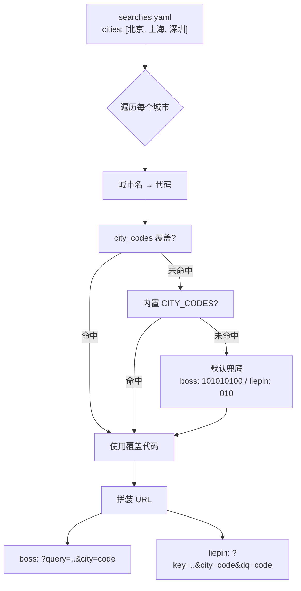
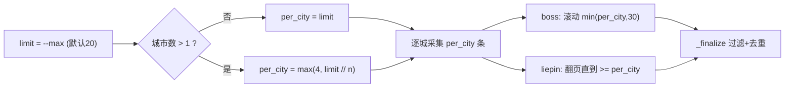

搜索配置 `searches.yaml` 的核心结构是「关键词 × 城市」的笛卡尔积：每个关键词会针对 `cities` 里列出的每一个城市分别发起一次请求。这一页聚焦于支撑该结构的两块机制——**城市名称到平台内部代码的映射**（把「上海」翻译成 Boss 的 `101020100` 或猎聘的 `020`），以及**多城市场景下的配额分配**（把一次搜索的总条数上限 `--max` 公平地摊到各个城市）。两者都集中在两个平台 discoverer 的 `CITY_CODES` 常量与 `run()` 方法中，与 `searches.yaml` 的配置项、CLI 的 `--max` 参数以及 pipeline 的 `max_per_search` 选项共同构成一条参数传递链。理解它们，是排查「配了城市却抓不到岗」和「后面的城市总被跳过」这类问题的前提。

Sources: [searches.example.yaml](src/jobpilot/searches.example.yaml#L1-L30), [pipeline.py](src/jobpilot/pipeline.py#L63-L70)

## 两套彼此独立的城市代码表

每个平台维护一份**互不通用**的 `CITY_CODES` 字典：Boss 使用 9 位数字编码（如北京 `101010100`），猎聘使用短码（如北京 `010`、深圳 `050090`）。两份字典当前都内置了 11 个城市，覆盖北京、上海、深圳、广州、杭州、成都、南京、苏州、武汉、西安、合肥，且键名统一为城市中文名。这意味着 `searches.yaml` 中 `cities` 字段必须写中文名，而非代码——代码由程序按平台自动查表填充。

Sources: [boss.py](src/jobpilot/discovery/boss.py#L18-L24), [liepin.py](src/jobpilot/discovery/liepin.py#L17-L23)

| 城市（键） | Boss 代码 | 猎聘代码 |
| --- | --- | --- |
| 北京 | `101010100` | `010` |
| 上海 | `101020100` | `020` |
| 深圳 | `101280600` | `050090` |
| 广州 | `101280100` | `050020` |
| 杭州 | `101210100` | `070020` |
| 成都 | `101270100` | `280020` |
| 南京 | `101190100` | `060020` |
| 苏州 | `101190400` | `060080` |
| 武汉 | `101200100` | `170020` |
| 西安 | `101110100` | `270020` |
| 合肥 | `101220100` | `150020` |

Sources: [boss.py](src/jobpilot/discovery/boss.py#L19-L24), [liepin.py](src/jobpilot/discovery/liepin.py#L18-L23)

## city_codes 覆盖机制与静默兜底

查表逻辑采用「**三级回退**」的短路写法：优先读 `searches.yaml` 中该平台下的 `city_codes` 覆盖字典，其次读内置 `CITY_CODES`，两者都未命中时落到**默认值**。Boss 的默认值是北京的 `101010100`，猎聘的默认值是北京的 `010`。这一兜底意味着：若你填写了一个未收录的城市名（例如「东莞」）又忘了在 `city_codes` 里补充，程序**不会报错**，而是静默地按北京去搜索——这往往是「城市配了却没产出」问题的根源。`searches.example.yaml` 的头部注释明确指引：未收录的城市用 `city_codes: {城市名: 代码}` 覆盖。

Sources: [boss.py](src/jobpilot/discovery/boss.py#L86-L88), [liepin.py](src/jobpilot/discovery/liepin.py#L41-L49), [searches.example.yaml](src/jobpilot/searches.example.yaml#L4-L17)

覆盖写法的等价值判断已由测试锁定：传入 `{"city_codes": {"火星": "999"}}` 后，猎聘 URL 中 `city=999` 与 `dq=999` 同时生效。

Sources: [test_liepin_city.py](tests/test_liepin_city.py#L36-L39)

## 城市参数如何拼进请求 URL

拿到代码后，两个平台的拼装方式不同，这是城市映射在实现层的关键分歧点。**Boss** 只需把代码写进 `city` 查询参数，URL 形如 `/web/geek/jobs?query=...&city=<code>`。**猎聘** 则需要**同时**写入 `city` 与 `dq` 两个参数：代码中留有实测注释说明——猎聘真正生效的过滤参数是 `dq`（地区），而 `city` 只影响页面展示；若只给 `city`，XHR 请求体里的 `dq` 会落到默认值，结果会混杂全国岗位。因此猎聘 URL 形如 `/zhaopin/?key=...&city=<code>&dq=<code>`，两个参数共享同一个城市代码值。

Sources: [boss.py](src/jobpilot/discovery/boss.py#L86-L105), [liepin.py](src/jobpilot/discovery/liepin.py#L46-L57), [test_liepin_city.py](tests/test_liepin_city.py#L29-L33)

Sources: [boss.py](src/jobpilot/discovery/boss.py#L86-L105), [liepin.py](src/jobpilot/discovery/liepin.py#L46-L57)

## 多城配额分配：为何要按城市拆分

配额分配逻辑位于各平台 `run()` 方法的开头。代码注释直言其动机：早期实现是「攒够 `limit*2` 就停」，其后果是**排在前面的城市会吃光全部配额，排在后面的城市被整体跳过**——在五城场景下会直接导致某些城市一条产出都没有。修复方案是引入 **`per_city`（每城配额）**，先算出一个城市理应分到的条数，再让每个城市**独立抓满自己的份额**，最后统一汇总，从而保证「每个配置城市都有产出」。

Sources: [boss.py](src/jobpilot/discovery/boss.py#L107-L116), [liepin.py](src/jobpilot/discovery/liepin.py#L59-L67)

## per_city 计算公式

两个平台使用**完全相同**的一行公式：单城时 `per_city = limit`，多城时 `per_city = max(4, limit // len(cities))`。也就是说，多城场景下先做整除均分，再施加一个**下限 4** 的保护值，避免城市数一多、每城拿到的份额过小而抓不到有效岗位。`limit` 本身来自 CLI 的 `--max`（默认 20），经 `RunOptions.max_per_search` 传入 pipeline，最终作为 `run(..., limit=...)` 的参数落到各 discoverer。

Sources: [boss.py](src/jobpilot/discovery/boss.py#L112-L116), [liepin.py](src/jobpilot/discovery/liepin.py#L66-L72), [pipeline.py](src/jobpilot/pipeline.py#L13-L18), [cli.py](src/jobpilot/cli.py#L106-L117)

| `limit`（--max） | 城市数 | `limit // n` | `per_city = max(4, ·)` | 各城合计目标 |
| --- | --- | --- | --- | --- |
| 20 | 1 | — | 20（单城直取） | 20 |
| 20 | 3 | 6 | 6 | 18 |
| 20 | 5 | 4 | 4 | 20 |
| 20 | 6 | 3 | 4（下限生效） | 24 |
| 10 | 3 | 3 | 4（下限生效） | 12 |

Sources: [boss.py](src/jobpilot/discovery/boss.py#L113), [liepin.py](src/jobpilot/discovery/liepin.py#L67)

## 配额在采集循环中的落地

`per_city` 算出后即刻进入逐城循环：Boss 与猎聘都是 `for city in cities: 抓取该城 per_city 条` 的模式。在 Boss 侧，`per_city` 作为 `_scrape_city` 的 `limit` 传入，进一步约束滚动加载目标 `min(limit, 30)`——即单城最多触发 30 张卡片的滚动采集。在猎聘侧，`per_city` 传入 `_scrape_city` 用于控制翻页循环的终止条件（`len(captured) >= limit` 时停止翻页）。两城/多城结束后，各自把原始结果汇总给 `_finalize` 做统一过滤与去重。

Sources: [boss.py](src/jobpilot/discovery/boss.py#L114-L136), [liepin.py](src/jobpilot/discovery/liepin.py#L68-L84), [liepin.py](src/jobpilot/discovery/liepin.py#L113-L136)

Sources: [boss.py](src/jobpilot/discovery/boss.py#L107-L136), [liepin.py](src/jobpilot/discovery/liepin.py#L59-L84)

## 城市集合驱动的客户端兜底

猎聘路径上，`cities` 还有第二个用途：在进入逐城循环前，`run()` 会用 `_norm_city` 把配置城市名归一化成一个 `allowed` 集合，并在 `_map_card` 中用它做**二次过滤**。这是因为即使 `dq` 参数生效，猎聘仍会混入约 5% 的外地推荐卡。`_norm_city` 的归一规则是「按 `-` 切分取首段，再去掉结尾的『市』」，因此「上海-浦东新区」和「北京市」都能正确归并为「上海」「北京」。当 `dq` 为空、无法判定时，实现选择**保留而非误杀**（返回非 None），这一系列行为均有独立测试覆盖。

Sources: [liepin.py](src/jobpilot/discovery/liepin.py#L62-L84), [liepin.py](src/jobpilot/discovery/liepin.py#L156-L160), [liepin.py](src/jobpilot/discovery/liepin.py#L192-L195), [test_liepin_city.py](tests/test_liepin_city.py#L42-L59)

## 汇总阶段的条数收口

各城市抓回的原始结果汇总后，统一交给基类 `_finalize` 处理：它先把 `raw_jobs` 截断到 `limit * 3`（预留过滤淘汰的余量），再逐条走纯代码过滤链并补齐 `platform` / `search_source` 等字段。注意 `limit` 在这里是**关键词级总上限**（即 `--max`），而 `per_city` 只是循环内部的分配粒度——两者层级不同，这正是「多城配额 → 关键词总配额」的收口点。猎聘在汇总前还会额外按 `url`（退化到标题）去重，因为多城多页可能产生重复卡片。

Sources: [base.py](src/jobpilot/discovery/base.py#L165-L181), [liepin.py](src/jobpilot/discovery/liepin.py#L75-L84), [pipeline.py](src/jobpilot/pipeline.py#L63-L68)

## 配置项速查表

| 配置项 | 位置 | 作用 | 影响城市映射/配额的方式 |
| --- | --- | --- | --- |
| `cities` | `searches.yaml` 各平台下 | 中文城市名列表 | 决定循环次数 `n`（配额分母）与客户端兜底集合 |
| `city_codes` | `searches.yaml` 各平台下（选填） | `{城市名: 代码}` 覆盖表 | 覆盖内置 `CITY_CODES`，用于未收录城市 |
| `--max` | CLI `discover` / `enrich` / `run` | 每关键词抓取上限（默认 20） | 作为 `limit` 输入 `per_city` 公式与 `_finalize` 截断 |
| `CITY_CODES` | `boss.py` / `liepin.py` | 内置 11 城代码字典 | 映射的第二级回退来源 |

Sources: [searches.example.yaml](src/jobpilot/searches.example.yaml#L4-L29), [cli.py](src/jobpilot/cli.py#L106-L145), [boss.py](src/jobpilot/discovery/boss.py#L18-L24)

## 常见边界与排查提示

**城市拼错或未收录**：由于三级回退存在默认值（两市都默认北京），拼错的城市名不会抛错，而是静默按北京搜索。排查时应先确认 `cities` 里的名字与 `CITY_CODES` 的键完全一致——`load_searches` 只保留顶层 `boss` / `liepin` 两个平台键，其余字段原样透传。

**多城导致单城份额被压到下限**：当城市数 ≥ 5 时，`limit // n` 会触及下限 `4`，此时各城合计目标（如 6 城 × 4 = 24）会超过 `limit`（20）。这是设计上的取舍：宁可多抓一点，也要保证每个城市都有产出，最终由 `_finalize` 的 `limit * 3` 与过滤链收口。

**猎聘只配 `cities` 不配 `dq` 不生效**：猎聘的城市精度完全依赖 `dq`，实现已强制同码写入，无需手动处理；但这也意味着覆盖时改的是同一个值。

Sources: [config.py](src/jobpilot/config.py#L88-L95), [boss.py](src/jobpilot/discovery/boss.py#L87-L88), [liepin.py](src/jobpilot/discovery/liepin.py#L48-L49), [base.py](src/jobpilot/discovery/base.py#L165-L171)

## 延伸阅读

城市代码是「搜索配置与服务端参数」这一模块的组成部分。若要了解与之协作的服务端筛选（年限 / 学历 / 薪资）如何拼参，请见 [服务端筛选参数（年限/学历/薪资）](15-fu-wu-duan-shai-xuan-can-shu-nian-xian-xue-li-xin-zi)；若要深入了解猎聘 `dq` 与列表采集的完整实现，请见 [猎聘 XHR 拦截与城市纠偏](10-xi-pin-xhr-lan-jie-yu-cheng-shi-jiu-pian)；若关心 `cities` 配置文件的加载与运行时目录体系，请见 [运行时目录与配置体系](4-yun-xing-shi-mu-lu-yu-pei-zhi-ti-xi)。