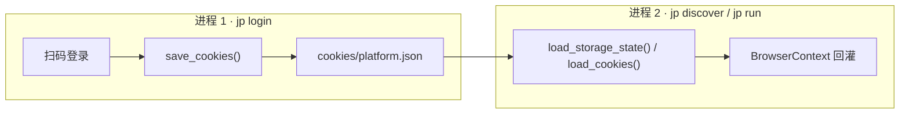
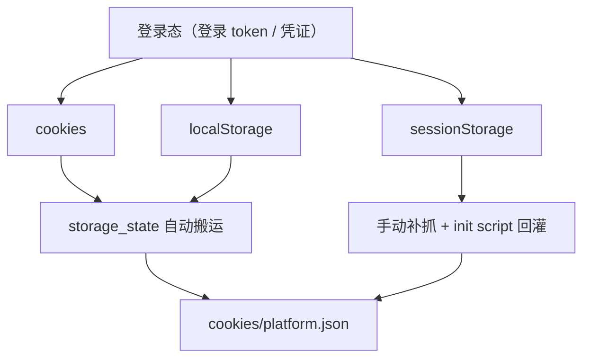
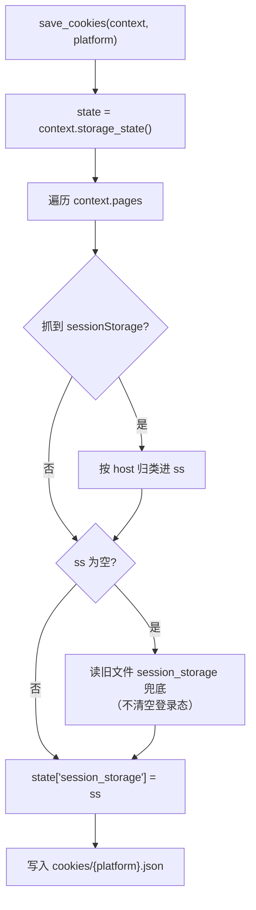
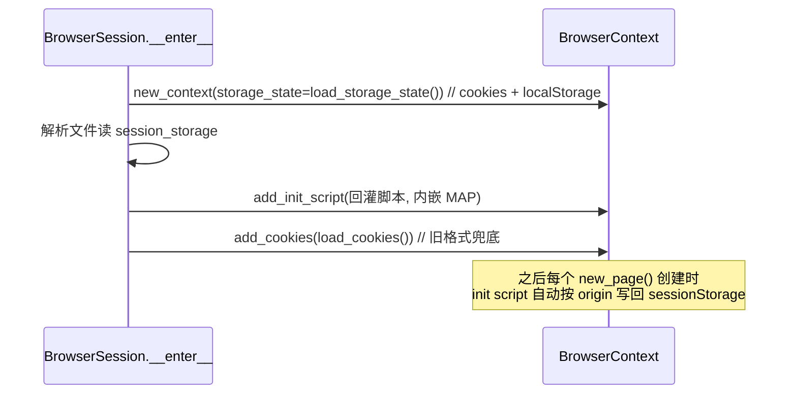
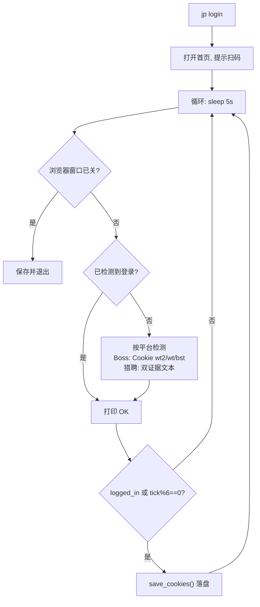
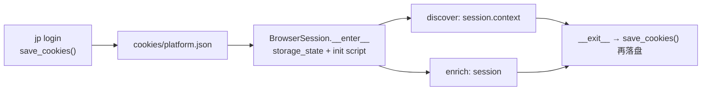

Boss 直聘与猎聘的岗位数据都必须携带登录态才能采集，但抓取流程被拆成了多个**独立进程**：`jp login` 扫码登录、`jp discover` 抓列表、`jp enrich` 抓 JD 全文各跑各的，浏览器进程每次都会重生。本页聚焦这套跨进程登录态是如何**落盘**（`~/.jobpilot-cn/cookies/{platform}.json`）、又如何在下一个进程启动时**回灌**进新的 `BrowserContext` 的，尤其是猎聘独有的 `sessionStorage` 补抓与按 origin 回灌机制。相邻主题——浏览器单点封装与反检测注入见 [Playwright 浏览器单点封装与反检测](8-playwright-liu-lan-qi-dan-dian-feng-zhuang-yu-fan-jian-ce)，登录后遇到滑块/验证页的人工暂停见 [滑块/验证页人工暂停机制](18-hua-kuai-yan-zheng-ye-ren-gong-zan-ting-ji-zhi)。

## 问题域：为什么登录态必须落盘再回灌

登录态持久化的根因是**进程边界**。`jp login` 与后续的 `jp discover`/`jp run` 是两次完全独立的命令调用，Playwright 每次都会新建浏览器进程与全新的 `BrowserContext`，内存里的 Cookie 与存储介质在进程退出时全部消失。要跨进程复用扫码结果，唯一办法是在退出前把登录态序列化到磁盘、在新进程启动时反序列化回浏览器。README 明确把这一步列为快速开始第 2 步，并给出预期有效期「约一周」。

Sources: [README.md](README.md#L46-L48), [cli.py](src/jobpilot/cli.py#L55-L57)

落盘位置由 `config.py` 单独定义：`cookies_dir()` 返回运行时目录下的 `cookies/` 子目录（默认 `~/.jobpilot-cn/cookies/`，可用环境变量 `JOBPILOT_HOME` 整体改址），每个平台一个文件，即 `cookies/boss.json` 与 `cookies/liepin.json`。把所有平台写死进同一个文件会让两个平台的存储介质互相污染，因此按 `{platform}.json` 拆分。

Sources: [config.py](src/jobpilot/config.py#L34-L47), [README.md](README.md#L58)

整个持久化链路与进程的关系可以概括为下图——登录进程负责「抓取并写盘」，采集进程负责「读盘并回灌」，两者之间只通过磁盘文件通信：

Sources: [cli.py](src/jobpilot/cli.py#L96-L103), [browser.py](src/jobpilot/discovery/browser.py#L165-L187)

## 三种存储介质：为什么只存 Cookie 会丢登录态

要理解 sessionStorage 回灌的必要性，先要区分浏览器里三种互不相干的存储介质。Playwright 的 `storage_state` 只覆盖其中两种（`cookies` 与 `origins`/`localStorage`），**不包含 `sessionStorage`**。而猎聘恰恰把部分登录 token 放进了 `sessionStorage`，源码注释直接点明了这个坑：「猎聘把登录 token 放 sessionStorage（storage_state 不含它），从仍打开的页面补抓」；`load_storage_state` 的文档字符串也补充说「猎聘登录态在 localStorage 里，只存 cookies 会丢登录」。

Sources: [browser.py](src/jobpilot/discovery/browser.py#L70-L74), [browser.py](src/jobpilot/discovery/browser.py#L85-L87)

下面的对比表梳理了三种介质的归属：Boss 的登录态主要靠 Cookie，猎聘则同时依赖 localStorage 与 sessionStorage，因此猎聘是驱动「抓取 + 回灌 sessionStorage」这套额外逻辑的唯一动因。

| 存储介质 | Playwright `storage_state` 是否包含 | 本项目落盘方式 | 典型归属平台 |
| --- | --- | --- | --- |
| `cookies` | ✅ 含于 `cookies` 字段 | `new_context(storage_state=…)` / `add_cookies()` | Boss、猎聘 |
| `localStorage` | ✅ 含于 `origins` 字段 | `new_context(storage_state=…)` | 猎聘 |
| `sessionStorage` | ❌ 不含 | 手工抓取 → 写 `session_storage` 字段 → init script 回灌 | 猎聘 |

Sources: [browser.py](src/jobpilot/discovery/browser.py#L58-L82), [browser.py](src/jobpilot/discovery/browser.py#L85-L112)

三种介质与「落盘 → 回灌」两条路径的对应关系如下：

Sources: [browser.py](src/jobpilot/discovery/browser.py#L70-L82), [browser.py](src/jobpilot/discovery/browser.py#L171-L184)

## 双轨文件格式：cookie 列表 vs storage_state

同一个 `{platform}.json` 文件实际上支持**两种格式**，读取端通过类型判定自动识别，从而兼容历史上只存 Cookie 的旧文件，无需任何迁移脚本。判定逻辑非常轻量：`load_cookies()` 只在文件是 **JSON 数组**（`isinstance(data, list)`）时返回它，代表「纯 Cookie 列表」的旧格式；`load_storage_state()` 只在文件是 **含 `cookies` 键的字典**（`isinstance(data, dict) and "cookies" in data`）时返回该文件路径字符串，代表「storage_state」的新格式。两者对同一路径做互斥识别，任一失败都返回 `None` 而不抛异常。

Sources: [browser.py](src/jobpilot/discovery/browser.py#L58-L82)

两个读取函数返回的数据被送往不同的回灌入口，这是双轨格式的关键差异：

| 函数 | 判定条件 | 返回值 | 消费位置 | 覆盖介质 |
| --- | --- | --- | --- | --- |
| `load_cookies(platform)` | 文件为 JSON 数组 | `list[dict]` 或 `None` | `context.add_cookies(...)` | 仅 cookies |
| `load_storage_state(platform)` | 文件为含 `cookies` 键的字典 | 文件路径字符串 或 `None` | `new_context(storage_state=…)` | cookies + localStorage |

Sources: [browser.py](src/jobpilot/discovery/browser.py#L58-L82), [browser.py](src/jobpilot/discovery/browser.py#L165-L169), [browser.py](src/jobpilot/discovery/browser.py#L185-L186)

此外还有一个兼容性助手 `has_valid_cookie()`，它只是对 `load_cookies()` 结果取布尔值，因此**只对旧格式（JSON 数组）返回真**——对新的 `storage_state` 格式文件会返回假。判断登录态是否可用的代码不应依赖它，而应看文件结构与实际回灌结果。

Sources: [browser.py](src/jobpilot/discovery/browser.py#L115-L116)

## 保存：storage_state + sessionStorage 补抓

`sccookies` 的落盘由 `save_cookies(context, platform)` 完成，它把 Playwright 自动产物与手工补抓的 `sessionStorage` 拼装成同一个 JSON 后一次性写入。函数分四步走：第一步调用 `context.storage_state()` 拿到 Playwright 已覆盖的 `cookies` 与 `origins`；第二步遍历 `context.pages` 里**仍打开的页面**，逐页用 `page.evaluate` 读出该页的 `sessionStorage` 全部键值，并以页面 host（`re.match(r"https?://([^/]+)", page.url)` 捕获）为键归类；第三步处理「没有活页面可抓」的边界——此时保留文件里旧的 `session_storage`，注释写明目的是「避免登录态被空覆盖」；第四步把结果写入 `state["session_storage"]` 并落盘。

Sources: [browser.py](src/jobpilot/discovery/browser.py#L85-L112)

这里有两处值得注意的健壮性设计。其一是**逐页 try/except 吞异常**：单页读取失败（例如页面正在导航）只跳过该页，不影响其它页的抓取。其二是**空值保护**：如果 `context.pages` 全被关闭或全部读取失败，`ss` 会为空，此时回退到旧文件读取——这避免了「一次异常把好端端的登录态清空」。下图为保存流程：

Sources: [browser.py](src/jobpilot/discovery/browser.py#L85-L112)

## 回灌：context 装配时装载 + init script 逐页注入

回灌发生在 `BrowserSession.__enter__` 中，与浏览器装配严格同序。`new_context(...)` 先带上 `storage_state=load_storage_state(self.platform)` 参数，一次性还原 `cookies` 与 `localStorage`；紧接着若文件里存在 `session_storage`，则通过 `context.add_init_script(...)` 注册一段回灌脚本；最后再用 `context.add_cookies(...)` 兜底旧格式的 Cookie 列表。**Cookie 与 localStorage 是「创建上下文即还原」，而 sessionStorage 必须先注入脚本再靠脚本自执行**——这正是两者的本质差别。

Sources: [browser.py](src/jobpilot/discovery/browser.py#L165-L187)

回灌脚本以 `location.host`（退化时用 `location.origin`）为键匹配之前按 host 归类保存的字典，命中后逐键 `sessionStorage.setItem`，并用 `try/catch` 吞掉配额或安全异常。选择 `add_init_script` 而非常规的一次性注入，原因在于 `init script` 会在**每个新页面创建时**都自动执行一遍：采集流程里 Boss 每城开一张页、猎聘分页反复开页、enrich 阶段还会为新 JD 继续开页，只有每次新页面都重放，`sessionStorage` 才不会在后续页面里断档。

Sources: [browser.py](src/jobpilot/discovery/browser.py#L171-L184), [browser.py](src/jobpilot/discovery/browser.py#L201-L203), [boss.py](src/jobpilot/discovery/boss.py#L122)

完整回灌时序如下，可看到 `session_storage` 是「注册脚本」，而 `storage_state` 是「构造参数」：

Sources: [browser.py](src/jobpilot/discovery/browser.py#L165-L187)

## 按 origin 分区：sessionStorage 的隔离语义

`sessionStorage` 是**按 origin（协议 + 主机 + 端口）隔离**的，把它跨站点混写会污染别的域。保存端与回灌端因此采用对称的分区键：保存时以 URL 的 host 部分（`re.match` 捕获组）作为字典键；回灌时用 `MAP[location.host] || MAP[location.origin]` 查找，优先精确匹配 `host`，退化匹配 `origin`。这种「按域名归类、按域名取用」的设计，保证同一个 `session_storage` 字典里可以安全容纳多个网站的键值而不串味。

Sources: [browser.py](src/jobpilot/discovery/browser.py#L87-L101), [browser.py](src/jobpilot/discovery/browser.py#L179-L184)

| 阶段 | 使用的键 | 源码依据 |
| --- | --- | --- |
| 保存（抓取） | `re.match(r"https?://([^/]+)", page.url)` 捕获的 host | [browser.py](src/jobpilot/discovery/browser.py#L91-L99) |
| 回灌（恢复） | `location.host`，退化 `location.origin` | [browser.py](src/jobpilot/discovery/browser.py#L180-L184) |

## 登录命令：`jp login` 的轮询与登录态检测

`jp login` 是把上述保存逻辑投入实战的地方，其结构是一条**有头浏览器里的轮询循环**。命令先 `page.goto` 到平台首页并提示「请在浏览器中完成扫码登录」，然后每 5 秒一轮（`time.sleep(5)`）检查两件事：一是浏览器是否已被用户关闭（`not session.context.pages`），二是登录态是否出现。检测手段按平台分化：Boss 直接看 Cookie 名字集合是否命中 `{wt2, wt, bst}`；猎聘则用「双证据防假阳性」——页面正文里「登录/注册」消失**且**出现「消息 / 我的简历 / 退出」任一登录后导航词，才算登录成功。

Sources: [cli.py](src/jobpilot/cli.py#L62-L92)

落盘节奏是这套循环的稳定性关键。设计上采取**三重触发**：一旦检测到登录就**每轮落盘**（把最新 sessionStorage 持续存下来）；即便还没检测到登录，也每 30 秒（`tick % 6 == 0`）兜底存一次，注释说明「检测失误也不丢态」；浏览器窗口被关闭时再存一次后退出。这种「宁可多存、绝不漏存」的策略，使登录检测的正/负误差都不会导致登录态丢失。

Sources: [cli.py](src/jobpilot/cli.py#L95-L103)

| 触发条件 | 频率 | 目的 |
| --- | --- | --- |
| `logged_in` 为真 | 每轮（5s） | 登录后持续刷新 sessionStorage |
| 未登录兜底 | 每 30s（`tick % 6`） | 检测误判时不丢登录态 |
| 浏览器窗口关闭 | 一次 | 退出前最后一次落盘 |

Sources: [cli.py](src/jobpilot/cli.py#L95-L102)

Sources: [cli.py](src/jobpilot/cli.py#L72-L103)

## 登录态的消费：单平台会话内一次性复用

回灌后的登录态在一次采集进程内被 discover 与 enrich **共用同一会话**，避免重复验态。`pipeline.py` 用 `with BrowserSession(platform) as session:` 打开唯一会话，注释写明「discover 与 enrich 共用同一浏览器会话，登录态只验一次」，随后把 `session.context` 传给 `BossDiscoverer`/`LiepinDiscoverer` 的 `run()`，并把 `session` 本身传给 `enrich_jobs()`。enrich 模块只 `from ..discovery.browser import BrowserSession` 作为类型标注，自己并不直接碰 Playwright，也就自然继承了已回灌的登录态。

Sources: [pipeline.py](src/jobpilot/pipeline.py#L56-L65), [pipeline.py](src/jobpilot/pipeline.py#L72-L78), [detail.py](src/jobpilot/enrichment/detail.py#L14-L37)

因此，登录态的生命周期可以概括为一次「写—读—灌」的闭环：

Sources: [cli.py](src/jobpilot/cli.py#L96-L103), [browser.py](src/jobpilot/discovery/browser.py#L189-L199), [pipeline.py](src/jobpilot/pipeline.py#L57-L76)

## 边界、失效与后续阅读

若干需要明确的边界：登录态**大约一周有效**（README 原文），过期后重新 `jp login` 即可覆盖；由于读取端做双格式识别，**旧版仅存 Cookie 的文件仍可被读入**，不会因升级而失效；`__exit__` 会在关闭浏览器前再尝试一次 `save_cookies()`（异常被吞掉以保证关闭必达），确保采集进程结束时登录态也能回写磁盘。此外，CHANGELOG 的待办里记录了一项已知体验问题：「`jp login` 检测到登录态后自动退出」尚未实现，当前仍需手动关窗口或 Ctrl+C。

Sources: [README.md](README.md#L46-L48), [browser.py](src/jobpilot/discovery/browser.py#L58-L82), [browser.py](src/jobpilot/discovery/browser.py#L189-L199), [CHANGELOG.md](CHANGELOG.md#L122)

与登录态持久化天然相邻的两条线值得对照阅读：其一是[Playwright 浏览器单点封装与反检测](8-playwright-liu-lan-qi-dan-dian-feng-zhuang-yu-fan-jian-ce)，它解释了这些回灌逻辑为什么被集中在唯一入口 `discovery/browser.py`，以及 `new_context` 装配时同一批次还做了哪些身份伪装；其二是[滑块/验证页人工暂停机制](18-hua-kuai-yan-zheng-ye-ren-gong-zan-ting-ji-zhi)，它处理登录态之外的另一类「非预期页面」——即登录虽在、但被平台风控拦到验证页时的应对。