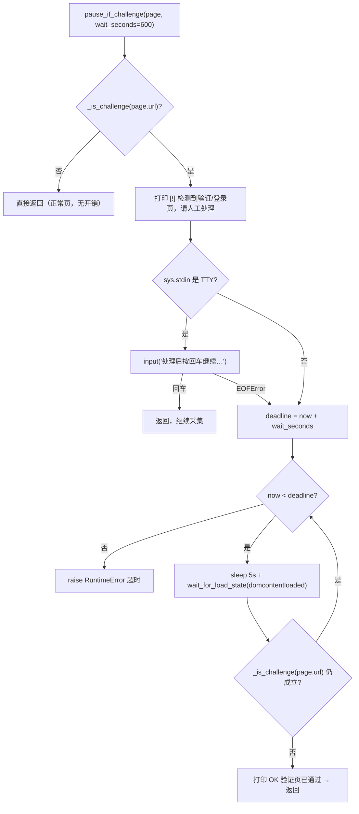
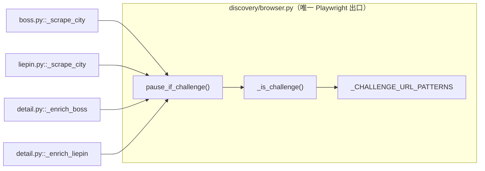

JobPilot-CN 的采集链路默认假设"页面能顺利打开、能稳定拿到内容"，但 Boss 直聘与猎聘随时可能在两次请求之间抛出滑块、短信验证或登录页——这类页面既不会被普通选择器命中，也不会自动消失。本页聚焦 `discovery/browser.py` 中承担「识别挑战页 → 交还人类 → 恢复或超时」职责的小型机制。它的产品定位刻意保守：**只暂停、不破解**，把通过验证的责任交还给操作者，同时保证在无人值守（后台任务 / 定时脚本）场景下进程不会永久挂死。理解它的关键在于三个方面——挑战页的识别口径、TTY / 非 TTY 双分支的等待策略，以及失败如何与「幂等续传」的上层设计衔接。

## 问题域：为什么自动化流程必须给人工让位

这套机制的动因是**风控页的不可预测性**。抓取流程被拆成多个平台、多个关键词、多个城市的循环，任何一个页面在任意时刻都可能被风控拦截：Boss 侧表现为滑块验证页，猎聘侧除登录页外还有专门的风控域（`safe.liepin.com` 下的 `verifysms` 短信验证）。由于本项目明确"只做数据采集"、不引入任何绕过验证的对抗逻辑，面对这类页面唯一可审计的做法就是**停下来、打印提示、等人处理**，处理完再从当前上下文继续。这一取舍在 README 中被概括为浏览器单点封装内"含登录态持久化与验证页人工暂停"的一项能力。

Sources: [browser.py](src/jobpilot/discovery/browser.py#L1-L5), [README.md](README.md#L18)

## 挑战页识别：基于 URL 特征的判定口径

识别的第一性判断非常轻量：**只看当前页面的 URL**，不做 DOM 内容或视觉分析。`_CHALLENGE_URL_PATTERNS` 是一组子串特征，`_is_challenge(url)` 用 `any(pat in url.lower() for pat in ...)` 做大小写无关的包含匹配。选择 URL 而非页面内容，是因为挑战页的 URL 路径通常稳定且早于内容渲染出现，可在页面尚未水合完成时即完成判定。下表梳理了各特征针对的拦截场景：

| 特征子串 | 对应平台 / 场景 | 说明 |
| --- | --- | --- |
| `safe/verify` | 猎聘 | 风控校验路径 |
| `verify-slider` | Boss | 滑块验证页 |
| `signin` | Boss / 通用 | 登录跳转 |
| `login` | 通用 | 登录页（子串较宽，兼容各平台登录路径） |
| `safe.liepin.com` | 猎聘 | 风控专用域 |
| `verifysms` | 猎聘 | 短信验证页 |

值得注意的是 `login` 作为子串非常宽泛，可能命中任何含该词的 URL——这是**刻意的过度匹配**：宁可把正常的登录跳转也视为挑战页并要求人工确认，也不愿漏判真正的验证页而让采集静默失败。

Sources: [browser.py](src/jobpilot/discovery/browser.py#L51-L55), [browser.py](src/jobpilot/discovery/browser.py#L119-L120)

## 双分支等待策略：TTY 交互 vs 后台任务

`pause_if_challenge(page, wait_seconds=600)` 的核心设计是为**两种运行环境**准备两条并行路径。若 URL 未命中挑战特征，函数立即返回，零开销；命中后先打印 `[!]` 提示并等待人工处理，随后按 stdin 是否连接交互终端（`sys.stdin.isatty()`）分流。整个控制流如下：

**交互分支**面向人工值守场景（如 `jp run` 直接在终端里跑）：命中挑战页后直接 `input("处理后按回车继续…")` 阻塞等回车，操作者在浏览器里过掉验证后回车即恢复。**非 TTY 分支**面向后台任务 / 定时脚本：此时 `input()` 会立即抛 `EOFError` 或根本无人可读，因此在 `input()` 外再包一层 `try/except EOFError`，异常时"落入下方 URL 轮询"。轮询以 5 秒为步长反复 `page.wait_for_load_state("domcontentloaded")` 并重新判定 URL，一旦挑战特征消失即打印 `OK 验证页已通过` 返回。函数文档字符串把这条底线讲得很直白——"超时抛错，绝不能死等 `input()` 把进程挂死"。

Sources: [browser.py](src/jobpilot/discovery/browser.py#L123-L145)

## 超时与失败策略：轮询有界、失败可续

非 TTY 分支的等待是**有界**的。函数用 `time.monotonic()`（单调时钟，不受系统时间回拨影响）计算截止时刻 `deadline`，循环条件 `time.monotonic() < deadline` 保证最多等待 `wait_seconds`（默认 600 秒，即 10 分钟）。超时后抛出 `RuntimeError`，异常消息里带上已等待秒数与当前 URL，便于事后定位。`monotonic` 而非 `time.time()` 的选择避免了夏令时或 NTP 校正导致的等待时长漂移，这对长时间后台任务尤其重要。

Sources: [browser.py](src/jobpilot/discovery/browser.py#L138-L145)

超时抛错并非终点，而是接入上层**容错与续传**体系的入口。在 discover 阶段，`pipeline.py` 对每个关键词的抓取包了一层 `except Exception`，把异常收进 `result.errors`（如 `discover:boss:算子开发`），而单个平台崩溃又被更外层 `_run_platform` 的捕获隔离，使另一平台不受影响；在 enrich 阶段，`enrich_jobs` 对每一行 JD 单独 `try/except`，超时只会把该行记入 `enrich_error` 并递增 `enrich_attempts`（上限 3 次），随后继续处理下一行。由于整个流程靠**列级状态机**幂等续传，重跑 `jp run` 时会自动跳过已完成的行、只补齐未完成的——一次滑块超时不会污染已抓数据，也不会阻塞后续批次。

Sources: [pipeline.py](src/jobpilot/pipeline.py#L37-L40), [pipeline.py](src/jobpilot/pipeline.py#L63-L70), [detail.py](src/jobpilot/enrichment/detail.py#L64-L71), [CHANGELOG.md](CHANGELOG.md#L51)

## 调用点：暂停函数如何嵌入各平台流程

`pause_if_challenge` 采用**延迟导入**（函数内 `from .browser import pause_if_challenge`）从 `browser` 单点引入，集中插在"页面跳转完成之后、真正解析内容之前"这一关键位置——即只有当目标页已加载、URL 已稳定时才做挑战判定。四个调用点覆盖了两个平台的发现与富化两条链路，构成机制的全部接入面：

| 调用点 | 位置 | 时机 | 依据 |
| --- | --- | --- | --- |
| `boss.py` · `_scrape_city` | L120 导入 / L130 调用 | `page.goto` 之后、`wait_for_selector(job_card)` 之前 | [boss.py](src/jobpilot/discovery/boss.py#L120-L131) |
| `liepin.py` · `_scrape_city` | L90 导入 / L110 调用 | `page.goto` 之后、翻页循环之前 | [liepin.py](src/jobpilot/discovery/liepin.py#L90-L111) |
| `detail.py` · `_enrich_boss` | L87 导入 / L104 调用 | 详情 API 拦截或 DOM 兜底加载之后 | [detail.py](src/jobpilot/enrichment/detail.py#L87-L106) |
| `detail.py` · `_enrich_liepin` | L113 导入 / L121 调用 | `page.goto` 详情页之后、正文轮询之前 | [detail.py](src/jobpilot/enrichment/detail.py#L113-L129) |

调度关系可归纳为下图：消费方只持有 `context` / `page`，挑战检测逻辑完全收敛在 `browser.py` 内部，符合"Playwright 只在 `browser.py` 单点封装"的架构约束。

Sources: [browser.py](src/jobpilot/discovery/browser.py#L1-L5), [boss.py](src/jobpilot/discovery/boss.py#L120-L130), [liepin.py](src/jobpilot/discovery/liepin.py#L90-L110), [detail.py](src/jobpilot/enrichment/detail.py#L104-L121)

## 设计权衡与边界

**不自动过滑块**是第一原则。函数文档字符串明确"不自动过滑块"，这意味着机制的目标是**可用性**而非**绕过能力**：它保证有人在场时流程能继续，无人时流程能优雅失败，而不承诺在对抗场景下拿到数据。**有头模式**是这条原则的隐性前提——`BrowserSession` 默认 `headed=True`，人工处理验证页时能看到浏览器窗口并亲手操作。

**ASCII 标记**是第二个工程细节。提示文本使用 `[!]`、`OK` 而非 `✓` / `⚠️`，源码注释与变更记录均说明这是为规避中文 Windows（GBK）控制台的 `UnicodeEncodeError` 崩溃。因此在本机制中新增日志时，若引入非 ASCII 符号，可能在 Windows 环境下直接崩掉。

**可替换性**是第三个边界。上述"检测 → 暂停 → 恢复/超时抛错"的行为被当作稳定契约：当 Playwright 底座整体替换为 nodriver / patchright 时，`pause_if_challenge(page, wait_seconds)` 的签名与语义需保持不变，上层无需改动。

Sources: [browser.py](src/jobpilot/discovery/browser.py#L123-L145), [browser.py](src/jobpilot/discovery/browser.py#L131-L137), [CHANGELOG.md](CHANGELOG.md#L40), [browser.py](src/jobpilot/discovery/browser.py#L151-L153)

## 阅读延伸

本页描述的是"验证页拦路时流程如何让位与恢复"。与之紧密衔接的阅读方向：

- [Playwright 浏览器单点封装与反检测](8-playwright-liu-lan-qi-dan-dian-feng-zhuang-yu-fan-jian-ce)：`pause_if_challenge` 作为 `browser.py` 对外契约的一环是如何被组织进单点封装的。
- [登录态持久化与 sessionStorage 回灌](17-deng-lu-tai-chi-jiu-hua-yu-sessionstorage-hui-guan)：挑战页与登录页往往同源，登录态可用时长直接决定挑战页出现的频率。
- [列级状态机与幂等续传机制](5-lie-ji-zhuang-tai-ji-yu-mi-deng-xu-chuan-ji-zhi)：超时抛错后为何"重跑即可续传"的底层原理。
- [故障排查与自动化测试](20-gu-zhang-pai-cha-yu-zi-dong-hua-ce-shi)：当挑战页持续出现或超时频发时的排查路径。