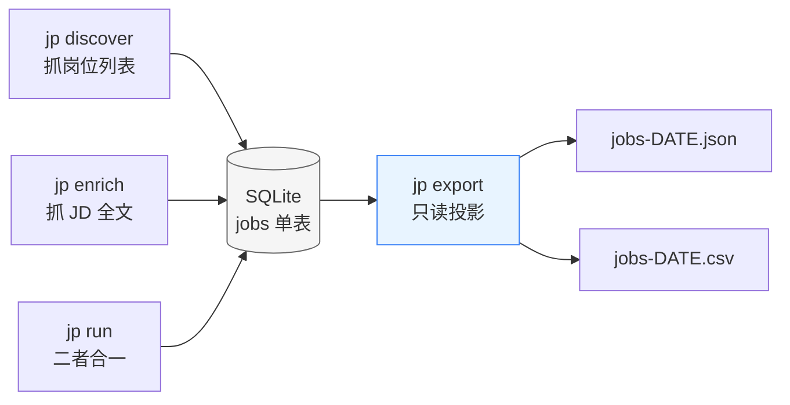
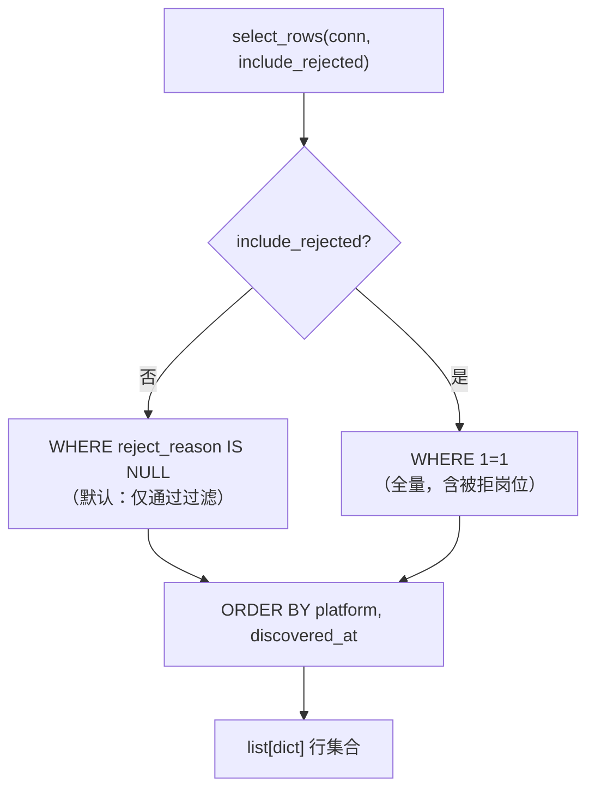
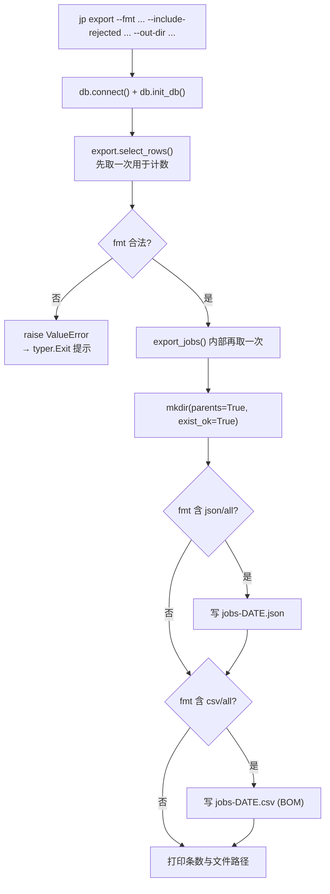

本页聚焦 `jobpilot` 流水线的**最后一公里**：把已经落库到 SQLite 的岗位数据（含 JD 全文）导出成便于人工查看或下游分析的 **JSON / CSV** 文件。导出模块是一个**只读快照器**——它从不修改数据库，只是把 `jobs` 表中的若干列按固定顺序投影到磁盘文件，因此「导出失败」不会损坏任何采集状态，重复执行也只是覆盖同名文件。

需要先建立一个关键心智模型：**导出不是数据流转出库的动作，而是对单表的投影**。所有采集与过滤的结果都持久化在 `~/.jobpilot-cn/db.sqlite3` 的 `jobs` 单表里，导出只是换一种查看姿势。
Sources: [export.py](src/jobpilot/export.py#L1-L4), [db.py](src/jobpilot/db.py#L1-L5)

## 导出在整体流水线中的位置

`jobpilot` 的阶段编排是 `discover（抓列表）→ enrich（抓 JD 全文）→ export（导出）`。前两个阶段通过 `pipeline.py` 编排并写入数据库，导出则是独立的一条命令，不参与浏览器自动化，也不需要登录态。这意味着一件事：**你可以反复导出而不触发任何网络请求或反爬风险**。

导出命令的实现入口是 `export_cmd`，它先连接数据库并确保表结构存在，再调用导出函数。整个命令不依赖 `RunOptions` / `run_pipeline`，是唯一一个「纯本地、零网络」的顶层命令。
Sources: [cli.py](src/jobpilot/cli.py#L148-L167), [pipeline.py](src/jobpilot/pipeline.py#L27-L43)

## 命令用法与参数说明

最简用法就是 `jp export`，默认同时产出 JSON 与 CSV 两个文件到运行时目录的 `exports/` 子目录下。所有参数都是可选的 `--选项` 形式。

| 参数 | 取值 | 默认值 | 作用 |
| --- | --- | --- | --- |
| `--fmt` | `json` / `csv` / `all` | `all` | 决定产出哪个格式；`all` 同时输出两份 |
| `--include-rejected` | 布尔开关 | 关闭 | 是否把被纯代码过滤淘汰的岗位也一并导出 |
| `--out-dir` | 任意路径 | `~/.jobpilot-cn/exports/` | 自定义输出目录，目录不存在会自动创建 |

一个合法的调用示例是 `jp export --fmt csv --out-dir D:\data`，它只产出 CSV 并写到 `D:\data`。命令执行成功后会打印导出的条数与每个文件的完整路径，方便你直接复制路径去打开文件。
Sources: [cli.py](src/jobpilot/cli.py#L148-L167), [README.md](README.md#L53-L56)

## 导出字段清单

导出并非整表照搬，而是从 `jobs` 表的全部列中**精心挑选了 22 列**，按固定顺序排列后既用于 JSON 的键顺序，也用于 CSV 的表头。字段被有意分成三组，理解分组能帮你快速读懂产出文件。

| 分组 | 字段 | 含义 |
| --- | --- | --- |
| 标识 | `url` / `platform` | 岗位 URL（表主键）与所属平台（`boss` / `liepin`） |
| 岗位信息 | `job_title` / `company` / `city` / `district` | 标题、公司、城市、区县 |
| 薪资 | `salary_raw` / `salary_min` / `salary_max` / `salary_months` | 原文与解析后的区间上下限、月数 |
| 要求 | `experience_raw` / `education_raw` / `job_tags` | 年限原文、学历原文、标签串 |
| HR 与来源 | `hr_name` / `hr_title` / `hr_active` / `search_source` | HR 姓名/职位/活跃度、命中的搜索词来源 |
| 正文 | `full_description` / `apply_url` | JD 全文、投递链接 |
| 时间戳 | `discovered_at` / `detail_scraped_at` | 发现时间、JD 抓取完成时间 |
| 过滤 | `reject_reason` | 被淘汰的原因（为空表示通过过滤） |

需要注意**哪些列被刻意排除**：`enrich_error`（抓取失败原因）与 `enrich_attempts`（尝试次数）属于内部运维字段，`rejected_at`（淘汰时间）也未导出。也就是说导出面向的是**数据消费方**而非调试方；排查抓取失败请用 `jp status` 或直接查库。
Sources: [export.py](src/jobpilot/export.py#L17-L24), [db.py](src/jobpilot/db.py#L14-L47), [README.md](README.md#L163-L173)

## 过滤语义：默认排除被拒岗位

导出查询的 `WHERE` 子句只有两种情况：默认是 `reject_reason IS NULL`（只导出通过纯代码过滤的岗位），加上 `--include-rejected` 时退化为 `1=1`（全量导出）。这是导出模块与过滤链之间唯一的耦合点——它只认 `reject_reason` 这一列是否为空，而完全不关心淘汰规则本身。

被淘汰的岗位其实**一直在库里**，记录着 `reject_reason`（如 `title_blacklist:外包`），只是默认不出现在导出结果中。因此当你怀疑「过滤是否误杀」时，正确做法是 `jp export --include-rejected` 拉一份全量快照，去比对 `reject_reason` 列，而不是去翻配置文件反推。
Sources: [export.py](src/jobpilot/export.py#L27-L33), [db.py](src/jobpilot/db.py#L44-L47), [README.md](README.md#L159-L159)

查询结果一律按 `platform, discovered_at` 排序，这带来一个稳定且实用的产出特征：**同一平台内按发现时间从早到晚排列**，两个平台各成一段。这样每次导出的文件行序是确定的，便于用 diff 工具比较两次导出之间的增量。
Sources: [export.py](src/jobpilot/export.py#L29-L32)

## 输出文件：命名、位置与编码

导出文件采用 `jobs-{日期}.json` 与 `jobs-{日期}.csv` 的命名，日期取自执行当天的 `date.today().isoformat()`（形如 `2026-09-01`）。因此**同一天多次导出会覆盖同名文件**，只保留最后一次结果——如果你需要留存历史快照，请用 `--out-dir` 指到带日期的自定义目录，或先手动改名。

输出目录的确定遵循一条回退链：命令行给了 `--out-dir` 就用它，否则用 `config.exports_dir()`。后者返回 `~/.jobpilot-cn/exports/`，且该目录会在运行时目录初始化时就被 `runtime_dir()` 自动创建。整个运行时根目录可以用环境变量 `JOBPILOT_HOME` 重定向到别处，导出目录随之迁移——这也是自动化测试隔离落盘位置的原理。
Sources: [export.py](src/jobpilot/export.py#L56-L58), [export.py](src/jobpilot/export.py#L61-L68), [config.py](src/jobpilot/config.py#L34-L39), [config.py](src/jobpilot/config.py#L50-L51)

| 输出项 | 编码 | 格式化参数 | 设计意图 |
| --- | --- | --- | --- |
| JSON | UTF-8 | `ensure_ascii=False`、`indent=2` | 保留中文原文、缩进便于人眼阅读 |
| CSV | **UTF-8 带 BOM**（`utf-8-sig`） | 标准 `csv.DictWriter` | Excel 双击打开不乱码 |

CSV 使用 `utf-8-sig`（即 UTF-8 with BOM）是一个**面向 Windows/Excel 用户的务实选择**：没有 BOM 时 Excel 会把中文按本地编码误读成乱码。而 JSON 侧用 `ensure_ascii=False` 保证中文以原字符而非 `\uXXXX` 转义形式写出，直接可读。
Sources: [export.py](src/jobpilot/export.py#L36-L45), [export.py](src/jobpilot/export.py#L65-L68), [README.md](README.md#L175-L175)

## 两种格式的技术实现差异

JSON 与 CSV 走的是两条不同代码路径，理解它们的差异能解释实际观察到的文件特征。

| 维度 | `to_json` | `to_csv` |
| --- | --- | --- |
| 依赖 | 标准库 `json` | 标准库 `csv` + `io.StringIO` |
| 输出方式 | `json.dumps` 一次性序列化整个列表 | `DictWriter` 逐行写入内存缓冲区 |
| 表头/键 | 无显式表头，字典键即字段名 | `writeheader()` 显式写表头，顺序取自 `FIELDS` |
| 多余字段处理 | 不适用（字典直接序列化） | `extrasaction="ignore"` 静默忽略多余键 |
| 缺失字段 | 键可能缺失 | `DictWriter` 会填空值列保持对齐 |

一个关键细节是 CSV 写入器配置了 `extrasaction="ignore"`：即便未来 `jobs` 表新增了列而 `FIELDS` 未同步更新，CSV 也只会忽略多余字段而不会抛异常。这保证了导出代码对表结构演进有一定**前向兼容**能力。`fieldnames=FIELDS` 则确保**即使某些行缺失某个键，CSV 列仍然对齐**——这是 JSON 做不到的（JSON 里缺失键就是缺失键）。
Sources: [export.py](src/jobpilot/export.py#L36-L45)

## 完整执行流程

从按下回车到文件落盘，`jp export` 的完整链路可以拆成「参数校验 → 取数 → 落盘」三段，其中参数校验失败会以友好错误退出而非抛栈。

值得留意的一处实现细节：`export_cmd` 会**先调用一次 `select_rows` 拿到行数用于打印**，随后 `export_jobs` 内部又独立查询了一次。这是为了在导出前后给出「导出 N 条」的反馈，代价是查询被重复执行了一遍——对本地 SQLite 而言开销可忽略。
Sources: [cli.py](src/jobpilot/cli.py#L155-L167), [export.py](src/jobpilot/export.py#L48-L69)

格式校验是一个**快速失败**设计：`fmt` 会被 `lower()` 归一化后检查是否属于 `json` / `csv` / `all`，否则抛出 `ValueError`，由命令行层捕获后转成 `typer.Exit`。这意味着传入 `--fmt xlsx` 会得到一条清晰的错误信息而非产生一个空文件或静默失败。
Sources: [export.py](src/jobpilot/export.py#L52-L54), [cli.py](src/jobpilot/cli.py#L158-L163)

## 自动化测试如何验证导出

导出行为由 `tests/test_export.py` 覆盖，测试通过 `JOBPILOT_HOME` 环境变量把运行时目录重定向到 `tmp_path`，从而做到**完全隔离、不污染真实数据**。三条测试分别锁定了导出的三个核心契约。

| 测试 | 验证的契约 |
| --- | --- |
| `test_export_json_and_csv` | 两种格式都产出、文件名后缀正确、JSON 内容与 CSV 表头可被正确读回 |
| `test_export_skips_rejected_by_default` | 默认排除被拒岗位（1 条），`include_rejected=True` 时全量（2 条） |
| `test_export_bad_format` | 非法 `fmt` 抛出 `ValueError` |

测试数据构造很有代表性：一条正常岗位、一条标题命中黑名单（`reject_reason="title_blacklist:外包"`）的岗位，用最小的两条数据就同时验证了「默认过滤」和「全量导出」两种语义。读回时 JSON 用 `json.loads`、CSV 用 `utf-8-sig` 解码后交给 `csv.DictReader`，恰好也验证了前面提到的 BOM 编码是正确的。
Sources: [test_export.py](tests/test_export.py#L33-L44), [test_export.py](tests/test_export.py#L47-L58), [test_export.py](tests/test_export.py#L61-L75)

## 常见问题排查

| 现象 | 可能原因 | 处理方式 |
| --- | --- | --- |
| Excel 打开 CSV 是乱码 | 文件被再次转存为非 UTF-8 | 直接用原文件打开，勿用「另存为 CSV」二次转换 |
| 导出条数少于 `jp status` 的「总岗位」 | 被过滤岗位默认不导出 | 加 `--include-rejected` 导出全量 |
| 找不到导出文件 | 运行时目录被 `JOBPILOT_HOME` 改了 | 查看命令打印的完整路径，或检查环境变量 |
| 报错「fmt 只能是 json / csv / all」 | 传了不支持的格式（如 `xlsx`） | 改用 `json` / `csv` / `all` |
| 两次导出内容重复、以为是没更新 | 同日导出覆盖同名文件 | 用 `--out-dir` 分目录留存，或对比 `discovered_at` |
| 文件里没有 `enrich_error` 字段 | 该列为内部调试字段，不导出 | 用 `jp status` 或 SQLite 客户端查库 |

需要强调的是导出**只是快照**：不导出数据也一直在库里，任何时候都可以重新导出，或直接用 SQLite 客户端（如 DBeaver 只读模式）打开 `~/.jobpilot-cn/db.sqlite3` 查询。
Sources: [README.md](README.md#L177-L189), [cli.py](src/jobpilot/cli.py#L158-L163), [export.py](src/jobpilot/export.py#L17-L24)

## 小结与延伸阅读

导出模块用约 70 行代码完成了三件事：**以固定字段投影单表数据、按 `reject_reason` 分流过滤、把结果序列化为对中文和 Excel 友好的 JSON/CSV**。它的简洁来自上游设计——单表数据总线让导出无需 Join、无需跨表拼装。

如果你想理解导出的数据从何而来，建议继续阅读：

- [SQLite 单表数据总线与表结构](6-sqlite-dan-biao-shu-ju-zong-xian-yu-biao-jie-gou)——理解 `jobs` 表每一列的来源与含义
- [列级状态机与幂等续传机制](5-lie-ji-zhuang-tai-ji-yu-mi-deng-xu-chuan-ji-zhi)——理解 `reject_reason` / `detail_scraped_at` 如何驱动状态
- [纯代码过滤链设计](12-chun-dai-ma-guo-lu-lian-she-ji)——理解写入 `reject_reason` 的规则
- [故障排查与自动化测试](20-gu-zhang-pai-cha-yu-zi-dong-hua-ce-shi)——把 `test_export.py` 放进完整的测试版图