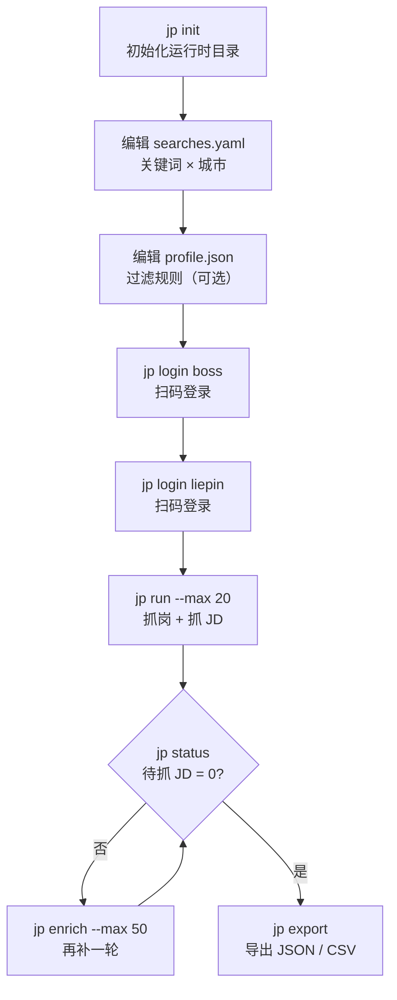
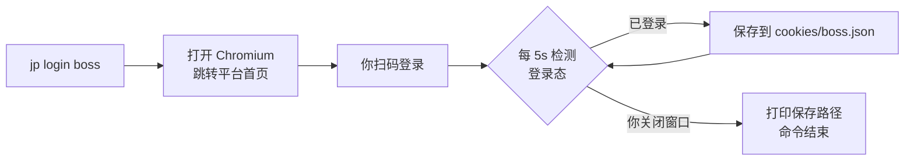

本页面向**初次接触本项目的开发者**，目标是在最短路径内完成「装环境 → 初始化 → 登录 → 抓取 → 导出」的端到端闭环。JobPilot-CN 是一个命令行工具，核心工作流只有四类命令：`jp init` / `jp login` / `jp run` / `jp export`。本页只讲「怎么把它跑起来」，关于各阶段的内部机制（列级状态机、平台采集实现、过滤规则等）请参见后续 Deep Dive 页面。

如果你还不清楚这个工具「能做什么、为什么这么设计」，建议先读 [项目概述](1-xiang-mu-gai-shu)，再回到本页动手实操。

## 环境要求

在动手前，请确认本机满足以下前提。工具的运行时依赖由 `pyproject.toml` 声明，其中 Playwright 是核心依赖，用于驱动真实浏览器采集。

| 项目 | 要求 | 说明 |
| --- | --- | --- |
| Python | **3.11+** | `requires-python = ">=3.11"`，低于此版本无法安装 |
| 浏览器底座 | **Chromium** | 必须单独安装，否则 `jp discover / enrich / run` 会报 `Executable doesn't exist` |
| 网络 | 可访问目标平台 | 采集需联网并扫码登录 |
| 依赖包 | typer / rich / pyyaml / playwright | 用于 CLI、终端渲染、YAML 解析与浏览器自动化 |

Sources: [pyproject.toml](pyproject.toml#L1-L25), [README.md](README.md#L20-L35)

## 安装

推荐使用 `uv`（速度更快、环境隔离更干净）；若已习惯 `pip`，也可用虚拟环境方式安装。两种方式**最后一步都必须安装 Chromium**。

```powershell
# 方式一：uv（推荐）
uv sync
uv run playwright install chromium

# 方式二：pip
python -m venv .venv
.venv\Scripts\activate
pip install -e .
playwright install chromium
```

安装完成后，`pyproject.toml` 会注册一个名为 `jp` 的命令行入口，其指向 `jobpilot.cli:main`。也就是说，后续所有命令都以 `jp` 开头（若用 `uv` 管理，也可写作 `uv run jp ...`）。

Sources: [pyproject.toml](pyproject.toml#L12-L25), [README.md](README.md#L22-L35)

## 端到端流程一览

下图串起整个上手路径与每步对应的命令。注意：**只有 `jp login` 是人工交互步骤（扫码），其余均为自动化**；`jp run` 在中断后可以重复执行来续传，不必从头再来。



Sources: [README.md](README.md#L37-L82), [src/jobpilot/cli.py](src/jobpilot/cli.py#L26-L145)

## 第一步：初始化运行时目录（`jp init`）

`jp init` 是整个流程的起点。它会做两件事：**建立运行时目录结构**（数据库 + cookies + exports 子目录），并**写入两个配置模板文件**供你按需编辑。运行后终端会打印出两个生成文件的路径，并提示下一步操作。

```powershell
jp init
# OK 已初始化 C:\Users\<你>\.jobpilot-cn
# - 过滤配置: C:\Users\<你>\.jobpilot-cn\profile.json
# - 搜索配置: C:\Users\<你>\.jobpilot-cn\searches.yaml
# 下一步：编辑上面两个文件，然后 jp login boss / jp login liepin 扫码登录
```

运行时目录默认落在用户主目录下的 `.jobpilot-cn/`，但可通过环境变量 **`JOBPILOT_HOME`** 改到别处（例如放到独立数据盘）。此外，`jp discover / enrich / run / status / export` 在运行时都会自动补建数据库与所需目录，因此即使跳过 `jp init`，首次抓取也不会因缺库而报错——但**配置模板仍建议用 `jp init` 生成后再改**。

Sources: [src/jobpilot/cli.py](src/jobpilot/cli.py#L26-L38), [src/jobpilot/config.py](src/jobpilot/config.py#L34-L51), [src/jobpilot/config.py](src/jobpilot/config.py#L62-L78)

若想重新生成模板（例如改乱了想恢复默认），加 `--force` 覆盖已存在的文件即可：

```powershell
jp init --force
```

Sources: [src/jobpilot/cli.py](src/jobpilot/cli.py#L27-L28), [src/jobpilot/config.py](src/jobpilot/config.py#L62-L78)

### 生成的运行时目录结构

初始化后（并在后续运行中），运行时目录呈现如下形态。理解各文件位置有助于排查问题：**数据一直在库里，导出只是快照**。

```
~/.jobpilot-cn/                # 可用 JOBPILOT_HOME 重定向
├── db.sqlite3                 # 唯一数据总线（SQLite 单表 jobs，WAL 模式）
├── db.sqlite3-wal             # WAL 预写日志（拷贝数据库时需一并带上）
├── db.sqlite3-shm             # WAL 共享内存文件
├── profile.json               # 过滤规则（标题/公司/薪资/年限/学历）
├── searches.yaml              # 搜索配置（关键词 × 城市，含服务端筛选参数）
├── cookies/                   # 登录态持久化，按平台分文件
│   ├── boss.json              #   含 cookies + localStorage + sessionStorage
│   └── liepin.json
└── exports/                   # jp export 的默认输出目录
    ├── jobs-<日期>.json
    └── jobs-<日期>.csv
```

Sources: [src/jobpilot/config.py](src/jobpilot/config.py#L34-L59), [src/jobpilot/export.py](src/jobpilot/export.py#L56-L68)

## 第二步：编辑配置

`jp init` 生成的两个文件决定了「抓什么」和「留下什么」。**上手阶段最少只需改 `searches.yaml` 的关键词与城市**；`profile.json` 的过滤规则不配也能跑（默认 `null` 表示不过滤）。

| 文件 | 作用 | 上手建议 |
| --- | --- | --- |
| `searches.yaml` | 每平台的 `keywords` × `cities`，以及可选的服务端筛选参数（年限/学历/薪资） | **必改**：按你的目标岗位填写关键词与城市 |
| `profile.json` | 纯代码过滤规则：标题黑名单、公司黑名单、薪资下限、年限区间、学历白名单 | 可选：不配则不过滤，后续再按需收紧 |

```yaml
# ~/.jobpilot-cn/searches.yaml（节选）
boss:
  keywords: ["算子开发", "GPU 优化", "CUDA"]
  cities: ["北京", "上海", "深圳"]
liepin:
  keywords: ["算子开发", "异构计算"]
  cities: ["北京", "上海"]
  max_pages: 3
```

配置项的完整语义（各字段含义、可选服务端参数、内置城市代码、`profile.json` 每条过滤规则的判定逻辑）属于另一页的职责，请参见 [运行时目录与配置体系](4-yun-xing-shi-mu-lu-yu-pei-zhi-ti-xi)。一个上手要点：`searches.yaml` 若在首次抓取时仍不存在，`jp run` 会**自动从包内模板生成**一份，因此不会因缺文件而中断。

Sources: [src/jobpilot/searches.example.yaml](src/jobpilot/searches.example.yaml#L1-L30), [src/jobpilot/config.py](src/jobpilot/config.py#L88-L94), [README.md](README.md#L84-L90)

## 第三步：扫码登录（`jp login`）

由于两个平台都需要登录态才能看到完整岗位与 JD，登录是**唯一必须人工介入**的步骤。`jp login` 会打开一个有头 Chromium 窗口并跳转到平台首页，你在其中完成扫码即可。Boss 与猎聘各登录一次。

```powershell
jp login boss      # 打开 zhipin.com，扫码登录
jp login liepin    # 打开 liepin.com，微信扫码登录
```

登录过程有两个**对新手很关键的行为**：

- **登录态会自动、持续地落盘**。命令会每 5 秒轮询一次登录状态；一旦检测到已登录，立即保存，并且之后每次心跳都会再存一次；即使检测有误，也会每 30 秒兜底保存一次，避免白登。
- **关掉浏览器窗口即退出**。命令不会自己结束，而是等你关闭窗口；窗口关闭后它才打印「登录态已保存到 .../cookies/<平台>.json」并返回。登录态约一周有效。



需注意：登录态文件里除了 cookies，还额外保存了 **localStorage 与 sessionStorage**（猎聘的登录 token 就放在 sessionStorage 中，只存 cookies 会丢登录态）。这也是为什么**换台机器或清空该目录后必须重新登录**。

Sources: [src/jobpilot/cli.py](src/jobpilot/cli.py#L55-L103), [README.md](README.md#L46-L48), [src/jobpilot/discovery/browser.py](src/jobpilot/discovery/browser.py#L84-L108)

## 第四步：抓取岗位与 JD（`jp run`）

登录完成后即可开始抓取。最常用的就是一步到位的 `jp run`，它等价于 `jp discover`（抓岗位列表）+ `jp enrich`（抓 JD 全文）的组合。默认抓两个平台，用 `--platform` 可只针对单个平台。

```powershell
jp run --max 20            # 两个平台都抓
jp run --platform boss     # 只抓 Boss 直聘
jp run --max 20 --platform liepin   # 只抓猎聘，每关键词上限 20
```

命令执行后会输出一张**执行统计表**（各关键词新增岗位数、本轮 enrich 成功数）；若某平台出错，会在错误区单独列出，但**单平台崩溃不影响另一平台**，仍可重跑续传。

```powershell
jp discover [--platform all] [--max 20]   # 只抓岗位列表入库
jp enrich   [--platform all] [--max 20]   # 只给已入库岗位补抓 JD 全文
```

关于 `--max`，有一个**新手最容易困惑的点**：它既是「每个关键词 × 每个城市」的列表抓取上限，**也是本轮抓 JD 的条数上限**。因此当岗位总数多于 `--max` 时，会有部分行的 JD 仍未抓取——**这是正常现象，不是失败**。

| 参数 | 取值 | 作用 |
| --- | --- | --- |
| `--platform` | `boss` / `liepin` / `all`（默认 `all`） | 指定采集的平台 |
| `--max` | 整数（默认 `20`） | 列表每关键词上限，同时是本轮抓 JD 条数上限 |

抓 JD 时每条之间会**随机间隔 2-4 秒**以降低风控风险，因此 50 条约需 3 分钟。过程中 **Ctrl+C 无害**：已完成的行会被 `detail_scraped_at` 标记，重跑只会补未完成的。

Sources: [src/jobpilot/cli.py](src/jobpilot/cli.py#L106-L145), [src/jobpilot/pipeline.py](src/jobpilot/pipeline.py#L46-L78), [src/jobpilot/enrichment/detail.py](src/jobpilot/enrichment/detail.py#L37-L70), [README.md](README.md#L72-L82)

## 第五步：查看进度与续抓（`jp status` / `jp enrich`）

`jp status` 是判断「是否抓完」的**官方依据**，它会以计数板形式输出各阶段数量。

```powershell
jp status
```

| 计数项 | 含义 |
| --- | --- |
| 总岗位 | 库中全部岗位数 |
| 已有 JD 全文 | `full_description` 非空的行数 |
| 待抓 JD | 已发现、未抓、且未被过滤的行数 |
| 抓 JD 失败 | 尝试抓取但失败（`enrich_error` 非空）的行数 |
| 已过滤 | 被纯代码规则淘汰（`reject_reason` 非空）的行数 |

续抓的操作范式很简单：**只要「待抓 JD」不为 0，就再跑一次 `jp enrich`**。因为缺省时每行最多尝试 3 次（`enrich_attempts < 3`），已成功的行不会重复抓取。

```powershell
jp enrich --max 50      # 跑完看 jp status 的「待抓 JD」，不为 0 就再跑一次
```

Sources: [src/jobpilot/cli.py](src/jobpilot/cli.py#L41-L52), [src/jobpilot/db.py](src/jobpilot/db.py#L119-L134), [src/jobpilot/models.py](src/jobpilot/models.py#L17-L24), [README.md](README.md#L74-L82)

## 第六步：导出数据（`jp export`）

抓取完成后，用 `jp export` 把数据落成文件。默认同时导出 JSON 与 CSV，输出到 `~/.jobpilot-cn/exports/`，文件名带当天日期。CSV 为 **UTF-8 BOM** 编码，Excel 双击打开不乱码。

```powershell
jp export                              # 同时导出 JSON + CSV
jp export --fmt csv                    # 只导出 CSV
jp export --fmt json --out-dir D:\data # 只导出 JSON，指定输出目录
jp export --include-rejected           # 连被过滤的岗位一起导出查看
```

| 参数 | 取值 | 默认 | 作用 |
| --- | --- | --- | --- |
| `--fmt` | `json` / `csv` / `all` | `all` | 导出格式；`all` 表示两种都导 |
| `--include-rejected` | 开关 | 关 | 是否一并导出被过滤岗位 |
| `--out-dir` | 路径 | `~/.jobpilot-cn/exports/` | 输出目录 |

需强调：**导出只是对当前库的一次快照**，不导出数据也一直在库中。若想直接查库，可用任意 SQLite 客户端打开 `~/.jobpilot-cn/db.sqlite3`（注意 WAL 模式下需连同 `-wal` / `-shm` 一起拷贝）。

Sources: [src/jobpilot/cli.py](src/jobpilot/cli.py#L148-L166), [src/jobpilot/export.py](src/jobpilot/export.py#L48-L69), [README.md](README.md#L53-L55)

## 命令速查表

下表汇总上手阶段会用到的全部命令，可作为日常速查。

| 命令 | 作用 |
| --- | --- |
| `jp init [--force]` | 建库并生成 `profile.json` / `searches.yaml` 模板（`--force` 覆盖） |
| `jp login boss\|liepin` | 开浏览器扫码登录，关掉窗口即保存登录态 |
| `jp discover [--platform all] [--max 20]` | 只抓岗位列表入库 |
| `jp enrich [--platform all] [--max 20]` | 只给已入库岗位补抓 JD 全文（可重复跑续抓） |
| `jp run [--platform all] [--max 20]` | discover + enrich，一条命令跑完（幂等，可重复跑） |
| `jp export [--fmt json\|csv\|all] [--include-rejected] [--out-dir PATH]` | 导出数据 |
| `jp status` | 计数板：总岗位 / 已有 JD / 待抓 JD / 抓 JD 失败 / 已过滤 |

Sources: [README.md](README.md#L60-L70), [src/jobpilot/cli.py](src/jobpilot/cli.py#L26-L166)

## 常见问题速查

| 现象 | 原因 | 处理 |
| --- | --- | --- |
| 报 `Executable doesn't exist` | 未安装 Chromium 底座 | 执行 `playwright install chromium`（uv 用户用 `uv run playwright install chromium`） |
| 抓取中出现验证/登录页 | 触发滑块或风控 | 工具会**人工暂停**并提示你处理，不自动过滑块；处理后按回车继续（后台运行时它会轮询等待） |
| `jp status` 显示「待抓 JD」不为 0 | `--max` 限制未抓完 | 正常现象，再跑 `jp enrich` 即可补齐 |
| 被抓过的岗位重复出现 | 不会，`url` 为主键 | 已存在行会被忽略，续传靠列状态判断，不会重复入库 |

关于验证页人工暂停、故障排查与自动化测试的更完整内容，参见 [故障排查与自动化测试](20-gu-zhang-pai-cha-yu-zi-dong-hua-ce-shi) 与 [滑块/验证页人工暂停机制](18-hua-kuai-yan-zheng-ye-ren-gong-zan-ting-ji-zhi)。

Sources: [README.md](README.md#L34-L35), [src/jobpilot/discovery/browser.py](src/jobpilot/discovery/browser.py#L111-L136), [src/jobpilot/db.py](src/jobpilot/db.py#L90-L105)

## 下一步阅读

你已经跑通了完整闭环，接下来可按目录结构按需深入：

- **[命令行命令全览](3-ming-ling-xing-ming-ling-quan-lan)**：逐命令精讲，含更多参数与边界行为。
- **[运行时目录与配置体系](4-yun-xing-shi-mu-lu-yu-pei-zhi-ti-xi)**：`searches.yaml` 与 `profile.json` 每个字段的完整语义。
- **[列级状态机与幂等续传机制](5-lie-ji-zhuang-tai-ji-yu-mi-deng-xu-chuan-ji-zhi)**：理解「为什么重跑只补未完成的」。
- **[SQLite 单表数据总线与表结构](6-sqlite-dan-biao-shu-ju-zong-xian-yu-biao-jie-gou)**：`jobs` 表每列的职责与状态谓词。
- **[Playwright 浏览器单点封装与反检测](8-playwright-liu-lan-qi-dan-dian-feng-zhuang-yu-fan-jian-ce)**：登录态持久化与反检测注入的原理。