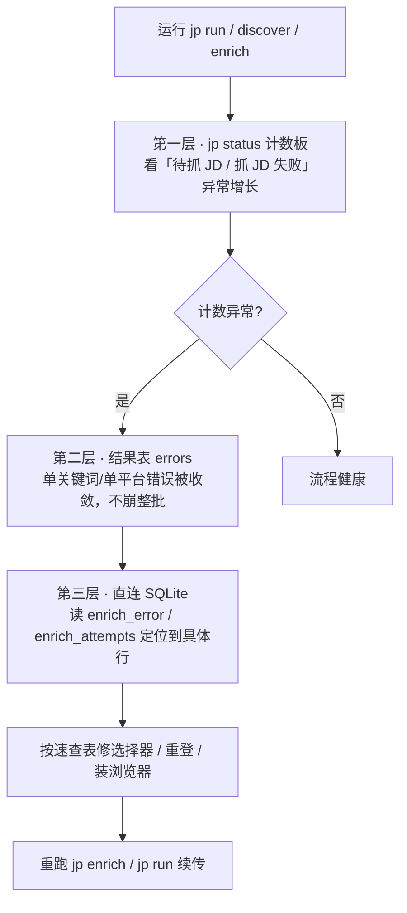
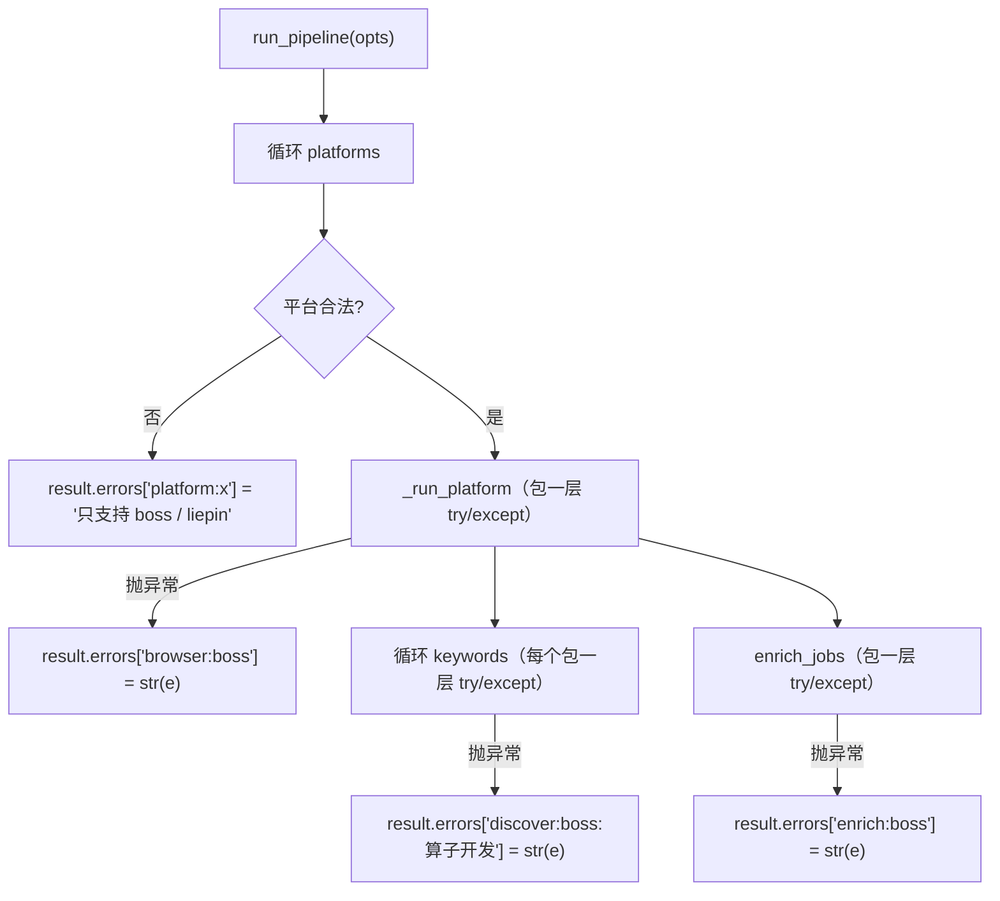
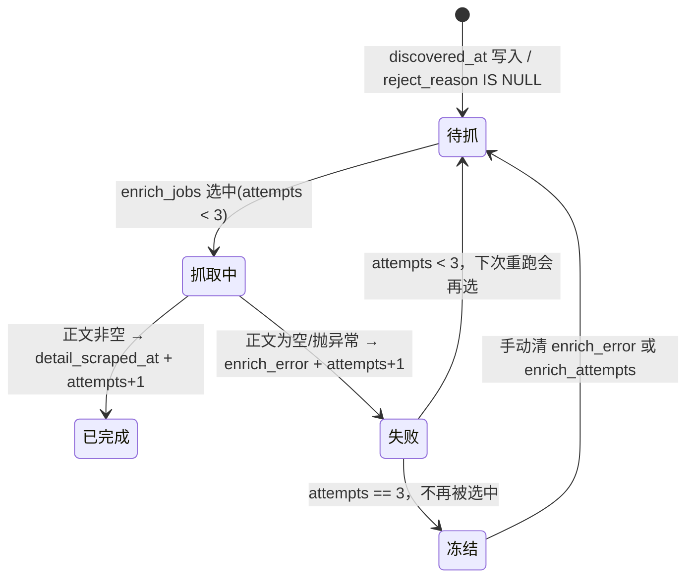
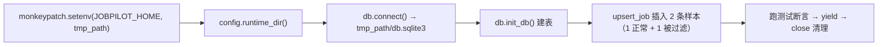

本页覆盖 JobPilot-CN 的**两层工程质量保障**：一是运行期出问题时的**故障排查路径**——从 `jp status` 计数板到错误收敛表，再到具体列的定位；二是把这些排查结论固化为可回归验证的**自动化测试套件**——`tests/` 下 44 项 pytest 用例如何组织、如何隔离、如何与生产代码契约一一对应。理解这两层的关系，能让「平台改版抓不到数据」从一次盲猜变成一次可复现、可验证的修复。

Sources: [README.md](README.md#L220-L229), [CHANGELOG.md](CHANGELOG.md#L116)

## 排错的三层漏斗：先看总数，再收错误，最后定位到列

JobPilot-CN 的排错设计遵循一个清晰的心智模型：**问题不会被吞掉，只会被分层收敛到可查询的位置**。这样做的根本原因是采集链路的脆弱点几乎全在外部——平台改版、风控拦截、登录态过期、浏览器未安装——任何一环失败都可能是「个别岗位失败」「单个关键词失败」或「整个平台失败」，必须让这三个粒度互不牵连。



这套漏斗的每一层都对应代码里的一个稳定契约：计数板来自 `db.counts()` 的固定五格查询，错误收敛来自 `pipeline.py` 的多层 `try/except`，具体定位依赖单表 `jobs` 上的运维列。下面逐层展开。

Sources: [db.py](src/jobpilot/db.py#L119-L134), [pipeline.py](src/jobpilot/pipeline.py#L27-L43), [README.md](README.md#L220-L225)

## 第一层入口：`jp status` 五格计数板

排查的起点永远是 `jp status`。它不带任何参数，连接数据库后调用 `db.counts()` 并把结果渲染成一张 Rich 表格，五格计数分别回答五个不同的问题。这套查询被刻意设计成**互斥可读**——每一格对应数据在状态机里的一个确定位置，而不是模糊的「有多少条数据」。

| 计数格 | SQL 谓词 | 排查含义 |
| --- | --- | --- |
| 总岗位 | `COUNT(*)` | 库里累计的岗位总数（含被过滤） |
| 已有 JD 全文 | `full_description IS NOT NULL` | enrich 阶段已完成的岗位 |
| 待抓 JD | `discovered_at IS NOT NULL AND detail_scraped_at IS NULL AND reject_reason IS NULL` | 还没轮到的「健康待办」，为 0 才算抓完 |
| 抓 JD 失败 | `detail_scraped_at IS NULL AND enrich_error IS NOT NULL AND reject_reason IS NULL` | **重点排查对象**：抓取报错的岗位数 |
| 已过滤 | `reject_reason IS NOT NULL` | 被纯代码过滤链淘汰的岗位数 |

排错时最该盯的是「**抓 JD 失败**」这一格。它的谓词与 `models.py` 里的 `ENRICH_FAILED` 完全一致——「已发现、未抓成、且带错误、且未被过滤」。如果它持续增长而不回落，说明选择器过期、登录态失效或风控拦截正在系统性发生。而「待抓 JD」在反复执行 `jp enrich` 后应单调下降直到 0，若它卡在某个数量不动，通常意味着剩余行已耗尽 `enrich_attempts` 重试额度。

Sources: [db.py](src/jobpilot/db.py#L119-L134), [cli.py](src/jobpilot/cli.py#L42-L52), [models.py](src/jobpilot/models.py#L20-L23)

## 第二层：错误收敛——单点崩溃不拖垮整批

采集是「多平台 × 多关键词 × 多城市」的嵌套循环，如果任何一处异常直接抛出，整轮任务就会中途死掉、已抓数据虽在库里但后续阶段全被跳过。`pipeline.py` 用**三层嵌套的容错**解决了这个问题，让错误被收敛进 `RunResult.errors` 字典而不是冒泡崩溃。



三层的粒度各司其职：**平台层**（`browser:{platform}`）兜住浏览器启动、登录态、整个平台崩溃；**关键词层**（`discover:{platform}:{kw}`）兜住单次搜索失败，其它关键词继续；**enrich 层**（`enrich:{platform}`）兜住 JD 抓取阶段的整体异常。注意 `discover` 与 `enrich` 共用同一个 `BrowserSession`，因此登录态只验证一次，一个平台只开一个浏览器。

这些错误最终由 `cli.py` 的 `_print_result()` 统一渲染：成功的统计进一张「执行统计」表，失败进红色「错误」列表并截断到 200 字符，并明确提示「**不影响其他阶段，重跑 jp run 可续传**」。这正是可续传设计在排错侧的价值——错误不是终点，而是一条可以带病继续、事后重跑的记录。

Sources: [pipeline.py](src/jobpilot/pipeline.py#L27-L43), [pipeline.py](src/jobpilot/pipeline.py#L58-L78), [cli.py](src/jobpilot/cli.py#L170-L181)

## 第三层：定位到具体列——直接读单表运维列

当计数板显示「抓 JD 失败」不为 0 时，`jp status` 只告诉你数量，不告诉你原因。此时需要**直连 SQLite** 查看具体行——`enrich_jobs()` 在每次失败时都会把原因写进 `enrich_error` 列，并把 `enrich_attempts` 自增。

| 列 | 写入时机 | 排查用途 |
| --- | --- | --- |
| `enrich_error` | 选择器未命中（`"未找到 JD 正文（选择器可能过期）"`）或抓取抛异常（`str(e)[:200]`） | 直接看到失败原因文本 |
| `enrich_attempts` | 每次尝试（无论成败）自增 | 判断是否已耗尽重试额度（`< 3` 才会被再抓） |
| `reject_reason` | 纯代码过滤链命中时 | 判断是否被误过滤（详见过滤链页面） |

`enrich_jobs()` 的失败写入有两条分支：一是**抓到了页面但正文为空**（`_extract_text` 返回空），写入固定的「未找到 JD 正文（选择器可能过期）」；二是**抓取过程抛异常**（网络、超时、页面结构变化），写入异常字符串的前 200 字符。这两种写法把「选择器过期」和「运行时报错」区分开来，读 `enrich_error` 即可初步判断是改版还是环境问题。

Sources: [detail.py](src/jobpilot/enrichment/detail.py#L38-L71), [db.py](src/jobpilot/db.py#L14-L47), [README.md](README.md#L224-L225)

## 重试与续传的排错语义

排错时最容易踩坑的是「改完代码为什么还是抓不到同一个岗」。答案藏在 `enrich_attempts < 3` 这个门槛里：`enrich_jobs()` 取待抓行时，查询条件是 `PENDING_ENRICH AND platform = ? AND enrich_attempts < 3`。**一个岗位失败 3 次后就不再被选中**，即使你已修好选择器，重跑 `jp enrich` 也不会碰它。



同样地，**被过滤的岗位不会自动翻案**：`PENDING_ENRICH` 要求 `reject_reason IS NULL`，所以放宽过滤规则后，已被标记淘汰的行依然不会被 re-enrich，必须先 `UPDATE jobs SET reject_reason=NULL`。这两条约束被明确列为「关键设计约束（改动时别破坏）」，排错时务必记住——**问题修好了，但状态列没清，症状就不会消失**。

Sources: [detail.py](src/jobpilot/enrichment/detail.py#L38-L43), [models.py](src/jobpilot/models.py#L15-L23), [CHANGELOG.md](CHANGELOG.md#L49-L57)

## 常见故障速查表

下表把散落在 README「维护与排错」与变更记录里的经验汇总成一张可对照的速查表。核心规律是：**绝大多数「抓不到 / 字段为空」都是选择器或接口特征过期，修复点高度收敛**——Boss 与猎聘各自顶部的 `LOCATORS` 字典与 XHR 特征，改完其余代码不用动。

| 现象 | 根因 | 处理方式 |
| --- | --- | --- |
| 抓不到列表 / 字段为空 | 平台改版，选择器失效 | 改 `discovery/boss.py`、`discovery/liepin.py` 的 `LOCATORS` 与 `XHR_MARKER` |
| 抓 JD 失败数不降 | 选择器过期或未登录（累加 3 次后不再自动重试） | 查 `enrich_error` 列定位，修好后清 `enrich_attempts` 再 `jp enrich` |
| 登录态失效 | Cookie 约一周过期 | 重新 `jp login <平台>` |
| 遇滑块 / 验证页 | 风控拦截 | 程序自动暂停等人工处理，不会自动过验证 |
| `Executable doesn't exist` | 未装 Chromium 浏览器底座 | `playwright install chromium`（换机器需重装） |
| `jp init` 报 `UnicodeEncodeError` | 旧版在中文 Windows GBK 控制台打印 `✓` / `⚠️` | 已修复为 ASCII 标记（`OK` / `[!]`） |
| 服务端参数写错静默失效 | `experience` / `education` 传了不在映射表内的值 | 代码显式 `raise ValueError`，按其提示改用合法档位 |

其中「遇滑块 / 验证页」的语义需要精确理解：`pause_if_challenge` 只在 URL 命中挑战特征时介入，**交互终端等回车、非 TTY 环境最多轮询 10 分钟再抛 `RuntimeError`**，绝不自动过滑块。抛错后同样被 `pipeline.py` 收敛进 `errors`，因此「暂停超时」也是一种可续传的失败而非崩溃。此外服务端参数刻意「快速失败」——Boss 的年限/学历、猎聘的学历写非法值会直接报错，避免静默返回一堆无关岗位。

Sources: [README.md](README.md#L220-L229), [browser.py](src/jobpilot/discovery/browser.py#L123-L145), [CHANGELOG.md](CHANGELOG.md#L40), [CHANGELOG.md](CHANGELOG.md#L132-L134), [boss.py](src/jobpilot/discovery/boss.py#L54-L60), [liepin.py](src/jobpilot/discovery/liepin.py#L25-L35)

## 自动化测试版图：`tests/` 覆盖了什么

`tests/` 下的 6 个文件、共 44 项用例，全部聚焦**纯逻辑层**——薪资/学历/年限解析、过滤链、城市归一、导出。测试刻意不启动浏览器、不联网：这些是最容易因外部环境波动而 flaky 的部分，被排除在单测之外，改用 CLI 冒烟（`jp init` / `status` / `export`）做人工验证。

| 测试文件 | 覆盖模块 | 验证的核心契约 |
| --- | --- | --- |
| `test_salary_parser.py` | `discovery/boss.py`、`liepin.py` | 字体反爬解码（两代 PUA 段）、薪资正则、倒序兜底、非法值返回 None |
| `test_filters.py` | `discovery/base.py` | 标题/公司黑名单、薪资下限、日结岗的拒绝原因格式 |
| `test_experience.py` | `discovery/base.py`、`boss.py` | 年限解析、左开右闭求交、退化区间、服务端 `experience` 参数映射与非法值报错 |
| `test_education.py` | `discovery/base.py`、`liepin.py` | 学历档位归一、白名单语义、服务端 `eduLevel` 参数与非法值报错 |
| `test_liepin_city.py` | `discovery/liepin.py` | `dq` 参数拼装、城市归一化、外地推荐卡兜底丢弃 |
| `test_export.py` | `export.py`、`db.py` | JSON/CSV 落盘、字段完整、默认跳过被过滤岗位、非法格式报错 |

这张表也解释了测试选择的边界：**哪些逻辑值得测**——有明确输入输出、规则可审计的纯函数；**哪些不测**——依赖真实页面与登录态的采集编排，它们更适合靠 `jp status` 与错误表做运行期验证。

Sources: [test_salary_parser.py](tests/test_salary_parser.py#L1-L43), [test_filters.py](tests/test_filters.py#L1-L40), [test_experience.py](tests/test_experience.py#L1-L122), [test_education.py](tests/test_education.py#L1-L94), [test_liepin_city.py](tests/test_liepin_city.py#L1-L66), [test_export.py](tests/test_export.py#L1-L76)

## 测试的隔离手法：`JOBPILOT_HOME` 重定向到临时目录

测试能安全运行的关键在于**运行时目录可注入**。`config.runtime_dir()` 读取环境变量 `JOBPILOT_HOME`，缺省才回退到 `~/.jobpilot-cn`。`test_export.py` 的 `conn` fixture 正是利用这一点，用 pytest 的 `monkeypatch.setenv("JOBPILOT_HOME", str(tmp_path))` 把数据库重定向到一个临时目录，从而做到**每次测试都从干净的空库开始、绝不污染真实数据**。



fixture 里的样本数据同样精心设计：一条正常岗位、一条标题命中黑名单（`reject_reason="title_blacklist:外包"`）的岗位，**用最小的两条数据同时覆盖「默认过滤」和「全量导出」两种语义**。`tmp_path` 与 `monkeypatch` 都是 pytest 内置 fixture——前者给每个测试独立的临时目录，后者保证环境变量改动在测试结束后自动还原。

Sources: [test_export.py](tests/test_export.py#L33-L44), [config.py](src/jobpilot/config.py#L34-L36), [export.py](src/jobpilot/export.py#L27-L33)

## 运行测试与配置

运行测试无需任何前置步骤，`pyproject.toml` 已经把 `testpaths` 固定为 `["tests"]`、开发依赖声明为 `pytest>=8.0`。推荐用 uv 隔离环境运行，也可先激活虚拟环境后直接 `pytest`。

```powershell
uv run pytest          # 推荐：uv 自动装配 dev 依赖
# 或
pytest                 # 激活虚拟环境后
```

```toml
[dependency-groups]
dev = ["pytest>=8.0"]

[tool.pytest.ini_options]
testpaths = ["tests"]
```

一个值得注意的现实约束：**测试套件不依赖 Playwright 浏览器，但生产采集依赖它**。因此「测试全绿」并不意味着采集一定能跑通——两者验证的是不同的层。变更记录里给出的验证口径是：`pytest` 全过 + CLI 冒烟（`jp init` / `status` / `export` 正常，无浏览器时 `jp discover` 把错误收进结果表而不崩）+ `BrowserSession` 可启动可保存登录态，三者共同构成一次完整的回归验证。

Sources: [pyproject.toml](pyproject.toml#L25-L29), [README.md](README.md#L229), [CHANGELOG.md](CHANGELOG.md#L44-L46)

## 测试与生产代码的契约映射

测试的价值在于它**锁定了生产代码的关键行为不变式**。这些不变式大多来自真实的踩坑修复，一旦被破坏就会回归成线上 bug——因此它们是改代码时最该先跑的用例。

| 测试用例 | 锁定的生产不变式 | 对应真实修复 |
| --- | --- | --- |
| `test_filter_left_open_right_closed` | 年限区间按左开右闭求交，`3-5年` 与 `0-3年` 无交集 | 边界相交导致的误留 bug |
| `test_filter_degenerate_range` | 「在校/应届」0-0 退化区间按闭点处理，不误杀应届生 | 空区间误杀 bug |
| `test_map_card_drops_other_city` | 猎聘外地推荐卡必须被兜底丢弃 | 城市串号 bug（`dq` 未生效） |
| `test_decode_salary_font_2026` | 字体反爬新段 `U+E031-E03A` 可解码 | 平台更换字体导致薪资变乱码 |
| `test_parse_unrecognized`（年限/学历各一） | 实习标签 `4天/周`、`6个月` 不被误判为年限或学历 | 标签串味导致的误过滤 |
| `test_boss_search_experience_param` | 服务端参数只支持固定档位，非法值抛 `ValueError` | 非法参数静默失效 |
| `test_export_bad_format` | 非法导出格式抛 `ValueError` 而非产出空文件 | 快速失败设计 |

这张映射表揭示了一个规律：**每一个测试方法都是一次修复的「防回归快照」**。变更记录里「验证」小节反复出现的「新增 `test_filter_left_open_right_closed` / `test_filter_degenerate_range`」正是这一模式的体现——修复边界 bug 的同时补上锁定该边界的用例。在新平台改版或修改解析逻辑后，先跑 `pytest` 再跑 CLI 冒烟，就能以最低成本确认没有破坏既有契约。

Sources: [test_experience.py](tests/test_experience.py#L88-L122), [test_education.py](tests/test_education.py#L28-L33), [test_liepin_city.py](tests/test_liepin_city.py#L49-L58), [test_salary_parser.py](tests/test_salary_parser.py#L11-L18), [test_export.py](tests/test_export.py#L61-L75), [CHANGELOG.md](CHANGELOG.md#L108-L116)

## 小结与延伸阅读

JobPilot-CN 的故障排查被设计成一条**自顶向下的漏斗**：`jp status` 计数板给出异常信号，`pipeline.py` 的多层容错把错误收敛到可读的结果表，单表的 `enrich_error` / `enrich_attempts` 列让你定位到具体行；而排错的核心规律是「修复点高度收敛、但状态列需手动清理」。自动化测试则用 44 项纯逻辑用例把这些排查结论固化为防回归快照，并用 `JOBPILOT_HOME` 重定向实现零污染隔离。

想更深入理解本页涉及的机制，建议继续阅读：

- [滑块/验证页人工暂停机制](18-hua-kuai-yan-zheng-ye-ren-gong-zan-ting-ji-zhi)——`pause_if_challenge` 的完整判定与等待策略，本页「常见故障速查表」中「遇滑块」一行的底层原理。
- [列级状态机与幂等续传机制](5-lie-ji-zhuang-tai-ji-yu-mi-deng-xu-chuan-ji-zhi)——解释「重跑 `jp run` 可续传」与 `enrich_attempts` 重试语义为何成立。
- [SQLite 单表数据总线与表结构](6-sqlite-dan-biao-shu-ju-zong-xian-yu-biao-jie-gou)——`enrich_error` / `enrich_attempts` 等运维列所在的完整表结构。
- [数据导出（JSON / CSV）](19-shu-dao-chu-json-csv)——`test_export.py` 所覆盖的导出契约与其隔离测试手法。
- [纯代码过滤链设计](12-chun-dai-ma-guo-lu-lian-she-ji)——`reject_reason` 的生成规则，以及为何被过滤岗位需手动翻案。