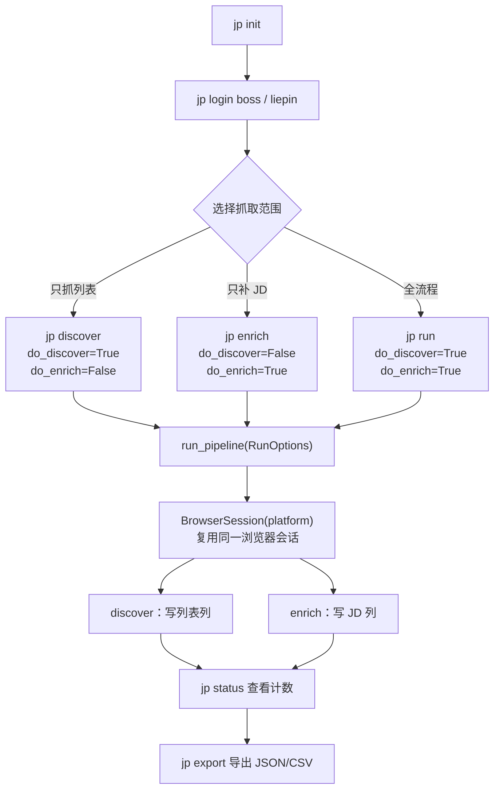

`jp` 是本项目唯一的对外交互入口——所有采集、补抓、导出动作都通过它触发，无需编写任何 Python 代码。本页聚焦**命令与参数本身**：有哪些命令、每个命令做什么、参数如何取值、它们共享哪些约定。命令行底层如何被 `pipeline` 编排、运行时目录具体放在哪里，属于相邻页面的话题，本页只在必要处以链接指向。

`jp` 通过 `pyproject.toml` 的 `[project.scripts]` 注册为控制台脚本，指向 `jobpilot.cli:main`，因此安装后即可在终端直接输入 `jp <子命令>`；命令框架基于 Typer，输出渲染基于 Rich。

Sources: [pyproject.toml](pyproject.toml#L15-L16), [cli.py](src/jobpilot/cli.py#L8-L15)

## 命令全景

整个命令面被 `CHANGELOG.md` 描述为“收敛为 `init / status / login / discover / enrich / run / export`”共 **7 个子命令**，覆盖“初始化 → 登录 → 抓列表 → 抓 JD → 导出 → 看状态”的完整闭环。按“是否依赖浏览器与登录态”可划分为两类：`init`、`status`、`export` 是纯本地命令，直接读写 SQLite 与文件系统；`login`、`discover`、`enrich`、`run` 需要拉起 Playwright 浏览器。

| 命令 | 作用 | 平台参数 | 主要选项 | 需浏览器 | 需登录态 |
| --- | --- | --- | --- | --- | --- |
| `jp init` | 建库并生成配置模板 | — | `--force` | 否 | 否 |
| `jp login <platform>` | 扫码登录并持久化登录态 | 位置参数（`boss` / `liepin`） | — | 是 | —（用于产生登录态） |
| `jp status` | 各阶段计数板 | — | — | 否 | 否 |
| `jp discover` | 只抓岗位列表入库 | `--platform` | `--max` | 是 | 是 |
| `jp enrich` | 只给已入库岗位补抓 JD 全文 | `--platform` | `--max` | 是 | 是 |
| `jp run` | `discover` + `enrich` 一条命令跑完 | `--platform` | `--max` | 是 | 是 |
| `jp export` | 导出已抓岗位为 JSON / CSV | — | `--fmt`、`--include-rejected`、`--out-dir` | 否 | 否 |

Sources: [cli.py](src/jobpilot/cli.py#L26-L167), [CHANGELOG.md](CHANGELOG.md#L29), [README.md](README.md#L60-L72)

## 命令之间的关系与执行流

`discover`、`enrich`、`run` 三者并非彼此独立的功能，而是**同一套 pipeline 编排的三种开关组合**：`run` 打开“抓列表”和“抓 JD”两阶段，`discover` 只打开前者，`enrich` 只打开后者。它们最终都调用 `run_pipeline(RunOptions(...))`，区别仅在于 `do_discover` 与 `do_enrich` 两个布尔量。

上图中的“复用同一浏览器会话”是一个关键实现细节：无论只跑一阶段还是两阶段，`_run_platform` 都在**同一个 `with BrowserSession(platform)` 上下文**内先做 discover 再做 enrich，因此登录态只验证一次。

Sources: [pipeline.py](src/jobpilot/pipeline.py#L27-L78), [cli.py](src/jobpilot/cli.py#L106-L145)

## 逐命令详解

### `jp init` —— 初始化运行时目录

首次使用必须先跑这一步，它会创建运行时目录、初始化数据库表，并写出两个需要你编辑的配置模板。命令输出会明确打印这两个文件的路径，并以一句“下一步”提示你接着编辑配置、然后登录：

- 过滤配置 `profile.json`（由 `config.init_profile()` 写入默认模板）
- 搜索配置 `searches.yaml`（由 `config.init_searches()` 从包内模板复制）

`--force` 用于**覆盖已存在的配置文件**；不带该参数时，若文件已存在则直接跳过（返回原路径），不会覆盖你已有的编辑。注意 `searches.yaml` 的模板来自包内 `src/jobpilot/searches.example.yaml`，随包分发，因此安装后依然可用。

Sources: [cli.py](src/jobpilot/cli.py#L26-L38), [config.py](src/jobpilot/config.py#L62-L78)

### `jp login <platform>` —— 扫码登录并持久化登录态

这是本页面中唯一使用**位置参数**（而非 `--platform` 选项）的命令，取值只能是 `boss` 或 `liepin`（猎聘为微信扫码）。传入其它值会直接以错误信息退出。命令会打开浏览器跳转到平台首页，然后进入一个轮询循环等待你完成扫码。

登录成功与否采用**双证据**判定：Boss 侧通过检查 cookie 名是否出现 `wt2` / `wt` / `bst` 之一；猎聘侧则检查页面文本中“登录/注册”消失且出现“消息 / 我的简历 / 退出”任一关键词。为保证登录态不丢，脚本在“未登录时每 30 秒兜底保存一次、登录后每次循环落盘”两种时机都会写 cookie；**关闭浏览器窗口即退出**，此时会打印登录态文件路径（`~/.jobpilot-cn/cookies/<platform>.json`）。

| 参数 | 类型 | 取值 | 说明 |
| --- | --- | --- | --- |
| `platform` | 位置参数（必填） | `boss` / `liepin` | 指定要登录的平台 |

Sources: [cli.py](src/jobpilot/cli.py#L55-L103)

### `jp discover` —— 只抓岗位列表

只执行采集的第一阶段：抓取岗位列表卡片并写入数据库，包含**纯代码过滤**（标题黑名单、公司黑名单、薪资下限、年限、学历等规则），但不抓 JD 全文。对应地，它以 `do_enrich=False` 调用 pipeline。

| 参数 | 默认值 | 说明 |
| --- | --- | --- |
| `--platform` | `all` | 取值 `boss` / `liepin` / `all`，决定抓哪些平台 |
| `--max` | `20` | 每个关键词的列表抓取上限 |

Sources: [cli.py](src/jobpilot/cli.py#L106-L117), [pipeline.py](src/jobpilot/pipeline.py#L13-L18)

### `jp enrich` —— 补抓 JD 全文

只执行第二阶段：给**已经入库但还没抓到 JD 全文**的岗位补抓正文，需要有效登录态。它以 `do_discover=False` 调用 pipeline，`--max` 表示**本轮抓 JD 的条数上限**——每次只从“待抓 JD”的行里取最多 `--max` 条，抓满即停。

这条命令天然**可续跑**：候选行由 `models.PENDING_ENRICH` 谓词筛选（`discovered_at` 非空、`detail_scraped_at` 为空、`reject_reason` 为空），并且只取 `enrich_attempts < 3` 的行——也就是说**同一行最多重试 3 次**，超过后不再自动重试。每条之间插入 2–4 秒的随机间隔以降低风控风险。

| 参数 | 默认值 | 说明 |
| --- | --- | --- |
| `--platform` | `all` | 取值 `boss` / `liepin` / `all` |
| `--max` | `20` | 本轮抓 JD 的条数上限（可重复跑以续抓） |

Sources: [cli.py](src/jobpilot/cli.py#L120-L131), [detail.py](src/jobpilot/enrichment/detail.py#L35-L71), [models.py](src/jobpilot/models.py#L15-L23)

### `jp run` —— 完整流程

把 `discover` 与 `enrich` 一次跑完，即同时设置 `do_discover=True` 与 `do_enrich=True`。由于 pipeline 的编排顺序固定为“先列表、后 JD”，并且两阶段共享同一浏览器会话，这通常是日常使用中最常用的一条命令。其核心卖点是**幂等**：任何阶段崩溃后重新执行 `jp run` 即续传，无需断点文件。

| 参数 | 默认值 | 说明 |
| --- | --- | --- |
| `--platform` | `all` | 取值 `boss` / `liepin` / `all` |
| `--max` | `20` | 每个关键词抓取上限，同时也是本轮抓 JD 上限 |

Sources: [cli.py](src/jobpilot/cli.py#L134-L145), [pipeline.py](src/jobpilot/pipeline.py#L1-L4)

### `jp export` —— 导出数据

把数据库中选中的行导出为 JSON 与／或 CSV。命令先读取待导出的行数以打印结果条数，再调用 `export.export_jobs` 写文件。默认**不导出被过滤的岗位**（`reject_reason` 为空的才导出），输出文件名为 `jobs-<日期>.json` / `jobs-<日期>.csv`，CSV 使用 `utf-8-sig`（带 BOM）以便 Excel 直接打开不乱码。若 `--fmt` 传入非法值（非 `json` / `csv` / `all`），会捕获异常并转为命令退出提示。

| 参数 | 默认值 | 说明 |
| --- | --- | --- |
| `--fmt` | `all` | 取值 `json` / `csv` / `all` |
| `--include-rejected` | `False` | 一并导出被过滤的岗位 |
| `--out-dir` | `~/.jobpilot-cn/exports/` | 输出目录，可用如 `D:\data` 覆盖 |

Sources: [cli.py](src/jobpilot/cli.py#L148-L167), [export.py](src/jobpilot/export.py#L48-L69)

### `jp status` —— 计数板

以 Rich 表格形式展示各阶段的计数，是判断“还需不需要再跑一次”的主要依据。计数由 `db.counts()` 提供，共五列，且其口径与 `models.py` 的阶段谓词完全一致（例如“待抓 JD”即 `PENDING_ENRICH`）。

| 计数列 | 统计口径 |
| --- | --- |
| 总岗位 | `jobs` 表全部行数 |
| 已有 JD 全文 | `full_description` 非空的行数 |
| 待抓 JD | 已发现、未抓、且未被过滤的行数 |
| 抓 JD 失败 | 未抓到且 `enrich_error` 非空、未被过滤的行数 |
| 已过滤 | `reject_reason` 非空的行数 |

Sources: [cli.py](src/jobpilot/cli.py#L41-L52), [db.py](src/jobpilot/db.py#L119-L134)

## 参数与行为约定

### `--platform` 的取值校验

`discover` / `enrich` / `run` 三个命令共享同一个平台参数解析逻辑 `_platforms()`：它只接受 `boss` / `liepin` / `all` 三种输入，传其它值会以“platform 只能是 boss / liepin / all”直接退出；传入 `all` 时会被展开成 `["boss", "liepin"]` 的列表。注意 `login` 命令**不使用**该逻辑——它只接受 `boss` / `liepin`，不接受 `all`。

Sources: [cli.py](src/jobpilot/cli.py#L20-L23), [cli.py](src/jobpilot/cli.py#L58-L59)

### `--max` 的双重语义

`--max` 在列表阶段是“**每个关键词**（结合城市后即每关键词 × 每城市）的抓取上限”，在 JD 阶段则是“**本轮**抓 JD 的条数上限”。因此当岗位总数大于 `--max` 时，部分行的 `full_description` 会暂时为空，这是正常现象——再跑几次 `jp enrich` 就会补齐。

Sources: [README.md](README.md#L72-L80), [pipeline.py](src/jobpilot/pipeline.py#L63-L76)

### 幂等与续传

整个流程的幂等性建立在**列级状态机**之上：阶段完成等价于该阶段负责的列非 NULL。`discover` 阶段写入列表列（如 `discovered_at`），`enrich` 阶段写入 JD 列（如 `detail_scraped_at`、`full_description`）。因此中断后重跑同一命令，只会补做未完成的列，已完成的行不会被重复处理——这也是为什么“重跑 `jp run` 即续传”。

Sources: [pipeline.py](src/jobpilot/pipeline.py#L1-L4), [models.py](src/jobpilot/models.py#L1-L23)

### 错误收集与执行统计

`discover` / `enrich` / `run` 执行结束后都调用统一的 `_print_result()` 渲染输出：先打印一张“执行统计”表（来自 `RunResult.stats`），若有错误再打印“错误”区块（来自 `RunResult.errors`）。值得初学者注意的是，**单条关键词或单个平台失败不会让命令崩溃**：pipeline 会把异常收进错误表，并在提示中告知“重跑 `jp run` 可续传”。这也解释了为什么 `jp discover` 在无浏览器／无登录态时不会崩，而是把错误收进结果表。

Sources: [cli.py](src/jobpilot/cli.py#L170-L181), [pipeline.py](src/jobpilot/pipeline.py#L37-L43)

## 建议的阅读顺序

你可以按“先会用、再理解原理”的路径推进：

1. 若还没跑通，先回到 **[快速开始](2-kuai-su-kai-shi)** 完成一次 `init → login → run → export` 的最小闭环；
2. 想弄清命令读写的数据到底放在哪、两个配置文件的作用域，阅读 **[运行时目录与配置体系](4-yun-xing-shi-mu-lu-yu-pei-zhi-ti-xi)**；
3. 想理解“为什么重跑不会重复抓、`jp status` 的计数从何而来”，阅读 **[列级状态机与幂等续传机制](5-lie-ji-zhuang-tai-ji-yu-mi-deng-xu-chuan-ji-zhi)** 与 **[SQLite 单表数据总线与表结构](6-sqlite-dan-biao-shu-ju-zong-xian-yu-biao-jie-gou)**；
4. 想调整抓取范围与筛选条件，查阅 **[服务端筛选参数（年限/学历/薪资）](15-fu-wu-duan-shai-xuan-can-shu-nian-xian-xue-li-xin-zi)** 与 **[纯代码过滤链设计](12-chun-dai-ma-guo-lu-lian-she-ji)**；
5. 命令报错时，转到 **[故障排查与自动化测试](20-gu-zhang-pai-cha-yu-zi-dong-hua-ce-shi)**。