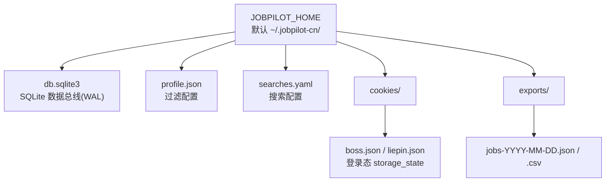
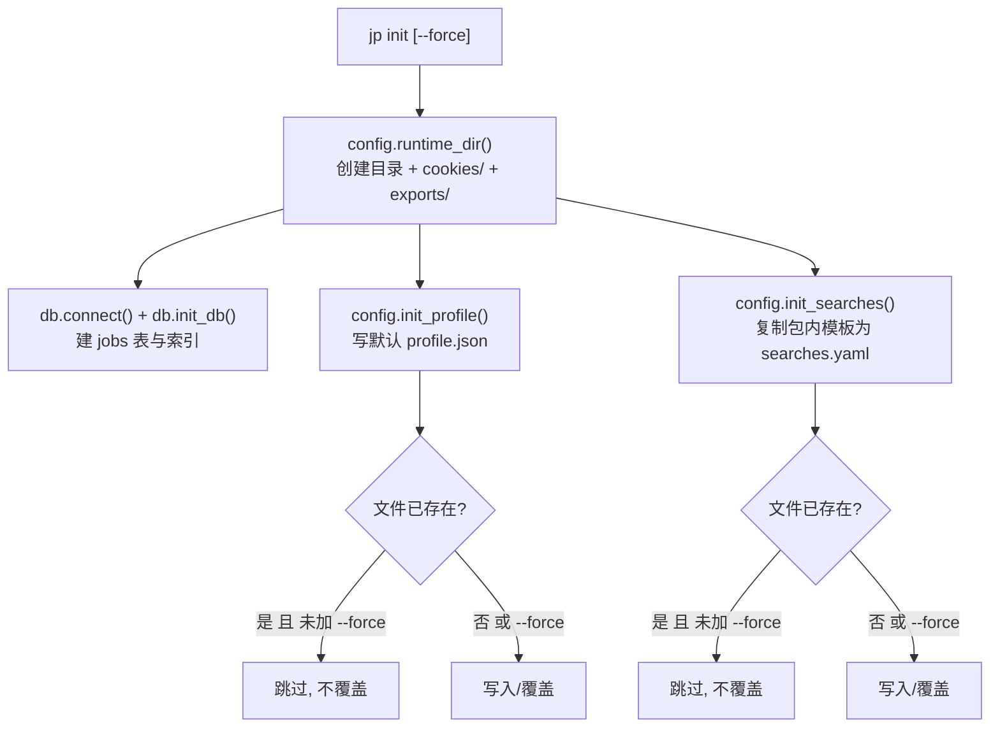
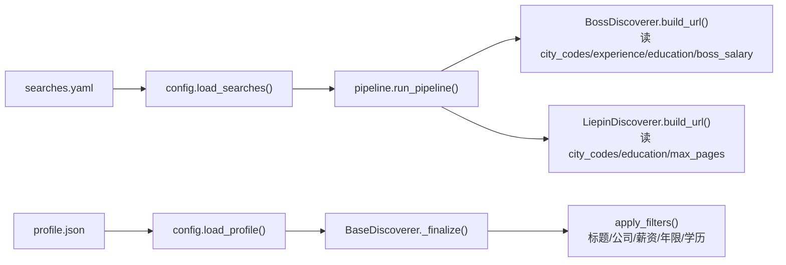

JobPilot-CN 把「代码」与「可变的运行状态」严格分离：源码包本身只读，而数据库、登录态、抓取结果与两类配置文件全部集中写入一个**运行时目录**。本页解释这个目录的默认位置、可调整方式、内部结构，以及 `profile.json`（过滤配置）与 `searches.yaml`（搜索配置）两类配置文件的生成与加载流程。掌握这套体系后，你就能知道 `jp init / login / run / export` 各自把数据写到了哪里，以及应该在哪里改配置。

Sources: [config.py](src/jobpilot/config.py#L34-L59), [README.md](README.md#L37-L58)

## 运行时目录：一个位置管住所有可变状态

运行时目录由 `runtime_dir()` 决定，默认是用户主目录下的 `~/.jobpilot-cn/`（Windows 上即 `C:\Users\<用户名>\.jobpilot-cn\`）。它支持用环境变量 `JOBPILOT_HOME` 整体改到别处，例如把状态放到非系统盘或做多份隔离。该函数在每次调用时都会确保目录本身及两个子目录 `cookies/`、`exports/` 存在（`mkdir(parents=True, exist_ok=True)`），因此**任何命令触达配置路径时都不会因为目录缺失而失败**——这也是首次运行无需手动建目录的原因。

Sources: [config.py](src/jobpilot/config.py#L34-L39), [README.md](README.md#L58)

围绕这个目录，`config.py` 提供了一组**只拼路径、不读内容**的轻量函数，对外统一暴露所有落盘位置：

| 辅助函数 | 返回路径 | 用途 |
| --- | --- | --- |
| `runtime_dir()` | `~/.jobpilot-cn/` | 运行时根目录（顺带创建子目录） |
| `db_path()` | `db.sqlite3` | SQLite 数据总线 |
| `cookies_dir()` | `cookies/` | 登录态文件目录 |
| `exports_dir()` | `exports/` | 导出结果目录 |
| `profile_path()` | `profile.json` | 过滤配置 |
| `searches_path()` | `searches.yaml` | 搜索配置 |

Sources: [config.py](src/jobpilot/config.py#L34-L59)

把这些函数串起来，一次完整使用后运行时目录会呈现如下结构。可以看到它同时容纳了**持久状态**（数据库、登录态）与**配置**（两个配置模板），所有子路径都由上面的函数集中定义：

Sources: [config.py](src/jobpilot/config.py#L42-L59), [browser.py](src/jobpilot/discovery/browser.py#L58-L112), [export.py](src/jobpilot/export.py#L48-L69)

## 初始化流程：`jp init` 做了什么

运行时目录虽然会被自动创建，但**配置文件与数据库表结构需要显式初始化**。`jp init` 命令就是这条入口：它先调用 `config.runtime_dir()` 建目录，再通过 `db.connect()` + `db.init_db()` 建立 `jobs` 表（WAL 模式与索引一并建好），最后分别生成两份配置模板。三个副作用相互独立、可反复执行，命令末尾会打印出实际写出的文件路径，方便你直接去编辑。

Sources: [cli.py](src/jobpilot/cli.py#L26-L38), [db.py](src/jobpilot/db.py#L65-L83)

Sources: [cli.py](src/jobpilot/cli.py#L26-L38), [config.py](src/jobpilot/config.py#L62-L78)

关于覆盖策略，两个生成函数遵循同一约定：**默认「已存在即跳过」，只有显式传入 `--force` 才会覆盖**。这一点很重要——它意味着重复执行 `jp init` 不会把你手改过的过滤规则或搜索关键词冲掉，是一个安全的幂等操作。区别在于内容来源：`init_profile()` 用内联常量 `DEFAULT_PROFILE` 序列化为 JSON；`init_searches()` 则把**源码包内**的 `searches.example.yaml` 原样拷贝出来，因此模板始终与当前安装的版本一致（`PKG_DIR` 指向 `config.py` 所在包目录）。

Sources: [config.py](src/jobpilot/config.py#L62-L78), [config.py](src/jobpilot/config.py#L12)

## 配置一：`searches.yaml`（搜索配置）

`searches.yaml` 描述**去哪儿搜、搜什么**，顶层只有 `boss` 与 `liepin` 两个键。它是 YAML 格式，包内模板 `searches.example.yaml` 顶部有自文档化的注释，列出了每个字段的取值约束。下表汇总了支持的字段：

| 字段 | 作用 | 约束 / 备注 |
| --- | --- | --- |
| `keywords` | 搜索关键词列表 | 逐条 × 逐城市抓取 |
| `cities` | 城市中文名列表 | 代码见平台 `CITY_CODES`，未收录城市用 `city_codes` 覆盖 |
| `city_codes` | `{城市名: 代码}` 覆盖表 | 用于补充或纠正内置城市代码 |
| `max_pages` | 猎聘翻页上限 | 仅猎聘生效，Boss 为滚动采集忽略此项 |
| `boss_salary` | Boss 服务端薪资参数 | 可选，如 `"402"` 表示 20-30K |
| `experience` | 服务端年限筛选 | **仅 Boss 生效**，取值须为固定档位，写错直接报错 |
| `education` | 服务端学历筛选 | 两平台档位不同，写错直接报错 |

Sources: [searches.example.yaml](src/jobpilot/searches.example.yaml#L1-L30), [README.md](README.md#L86-L127)

`experience` 与 `education` 是**服务端筛选参数**，会被拼进搜索 URL，让平台先筛一轮再返回结果。它们对取值极其严格——代码用白名单字典做映射，命中不到就 `raise ValueError`，绝不静默失效。二者的档位映射如下：

| 维度 | 平台 | 可选值 → 代码 |
| --- | --- | --- |
| 年限 | Boss | `1年以下`/`1年以内`→103、`1-3年`→104、`3-5年`→105、`5-10年`→106、`10年以上`→107 |
| 年限 | 猎聘 | 无可用服务端参数，配了只打印提示 |
| 学历 | Boss | `高中`→206、`大专`→202、`本科`→203、`硕士`→204、`博士`→205 |
| 学历 | 猎聘 | `大专`→050、`本科`→040、`硕士`→030 |

Sources: [boss.py](src/jobpilot/discovery/boss.py#L26-L43), [liepin.py](src/jobpilot/discovery/liepin.py#L28-L30), [searches.example.yaml](src/jobpilot/searches.example.yaml#L10-L17)

需要特别留意一个易错点：**猎聘不支持服务端年限筛选**。即使你在 `liepin` 段里配了 `experience`，程序也只会打印一行提示而不改变结果；猎聘的年限筛选必须走 `profile.json` 的本地过滤（见下一节）。此外，城市代码若不在内置表中，会兜底到默认城市，跨城配额则通过 `cities` 列表均匀分配。

Sources: [liepin.py](src/jobpilot/discovery/liepin.py#L41-L57), [boss.py](src/jobpilot/discovery/boss.py#L86-L105)

## 配置二：`profile.json`（过滤配置）

`profile.json` 描述**抓到之后留什么**，是一套**纯代码、可审计**的本地过滤规则（不调用任何模型）。初始内容由内联常量 `DEFAULT_PROFILE` 写出，只有 `preferences` 一个生效层级：

| `preferences` 字段 | 语义 | 默认值 |
| --- | --- | --- |
| `title_blacklist` | 标题命中任一正则（`re.search`）即过滤 | `["外包", "驻场", "实习"]` |
| `company_blacklist` | 公司名包含任一词即过滤 | `[]` |
| `salary_min_k` | 薪资下限（K/月，按 12 个月折算中位数） | `null`（不过滤） |
| `experience` | 可接受年限区间与岗位要求无交集则淘汰 | `null`（不过滤） |
| `education` | 学历白名单，档位不在名单内则淘汰 | `null`（不过滤） |

Sources: [config.py](src/jobpilot/config.py#L14-L31), [README.md](README.md#L129-L158)

加载行为上，`profile.json` 与 `searches.yaml` 有意做得不同：`load_profile()` 在文件不存在时**直接抛 `FileNotFoundError` 并提示「先运行: jp init」**；而 `load_searches()` 不存在时会**自动调用 `init_searches()` 从模板补齐**再读取，并只保留 `boss` / `liepin` 两个键以避免未知字段污染配置。这种差异体现了各自定位——过滤规则是使用者必须主动决策的「意图声明」，不该被悄悄生成默认值；搜索配置则有合理的开箱即用默认。

Sources: [config.py](src/jobpilot/config.py#L81-L94)

## 配置如何流入抓取流程

理解配置体系的关键，是看清**它在哪里被读取、又流向哪里**。配置只在两个入口被加载：`pipeline.run_pipeline()` 在流程开始时一次性 `load_searches()`，把对应平台的字典传给 discoverer；而过滤规则在 `BaseDiscoverer._finalize()` 里 `load_profile()`，交由 `apply_filters()` 逐条判定。

Sources: [pipeline.py](src/jobpilot/pipeline.py#L27-L66), [base.py](src/jobpilot/discovery/base.py#L165-L181), [boss.py](src/jobpilot/discovery/boss.py#L86-L105), [liepin.py](src/jobpilot/discovery/liepin.py#L41-L57)

具体到平台层：`build_url()` 分别从搜索配置里读取 `city_codes`（覆盖内置城市代码）、`experience`、`education`、`boss_salary` 等字段拼接请求 URL；`apply_filters()` 则从 profile 的 `preferences` 里取值执行过滤链。这样，**同一份配置文件被不同平台、不同阶段按需消费**，而路径与解析细节都被 `config.py` 屏蔽在底层。

Sources: [boss.py](src/jobpilot/discovery/boss.py#L86-L105), [base.py](src/jobpilot/discovery/base.py#L89-L155), [pipeline.py](src/jobpilot/pipeline.py#L32-L66)

## 小结与延伸阅读

运行时目录是把 JobPilot-CN 从「一段代码」变成「一个可持续运行的工具」的边界：`~/.jobpilot-cn/`（或 `JOBPILOT_HOME`）承载数据库、登录态、导出与两份配置，`jp init` 负责一次性铺好骨架，`profile.json` 与 `searches.yaml` 则分别控制「留什么」与「去哪搜」。二者共享同一套路径解析与加载约定，却刻意在「缺失时是否自动生成」上表现出不同行为。

想继续深入，建议按以下顺序阅读：

- 了解配置文件里年限/学历档位如何被解析与过滤，见 [服务端筛选参数（年限/学历/薪资）](15-fu-wu-duan-shai-xuan-can-shu-nian-xian-xue-li-xin-zi) 与 [纯代码过滤链设计](12-chun-dai-ma-guo-lu-lian-she-ji)。
- 了解城市代码与多城配额如何分配，见 [城市代码映射与多城配额分配](16-cheng-shi-dai-ma-ying-she-yu-duo-cheng-pei-e-fen-pei)。
- 了解数据库文件本身的结构与状态机，见 [SQLite 单表数据总线与表结构](6-sqlite-dan-biao-shu-ju-zong-xian-yu-biao-jie-gou)。
- 了解登录态文件 `cookies/*.json` 的读写机制，见 [登录态持久化与 sessionStorage 回灌](17-deng-lu-tai-chi-jiu-hua-yu-sessionstorage-hui-guan)。
- 了解导出目录 `exports/` 的输出规则，见 [数据导出（JSON / CSV）](19-shu-ju-dao-chu-json-csv)。