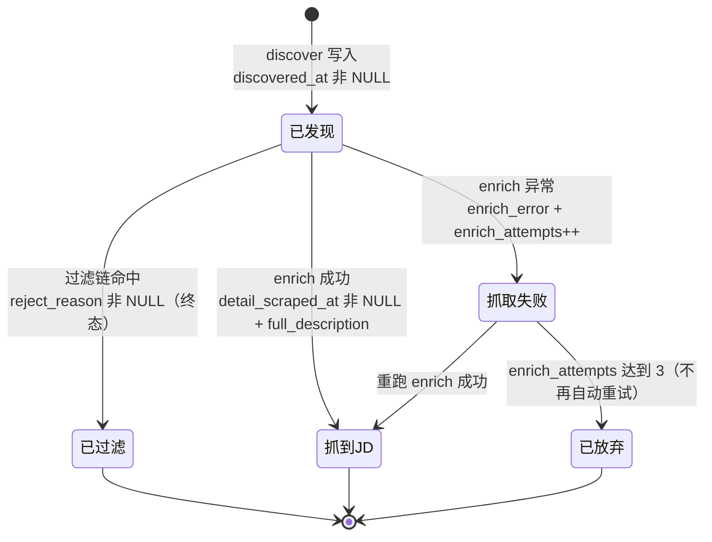
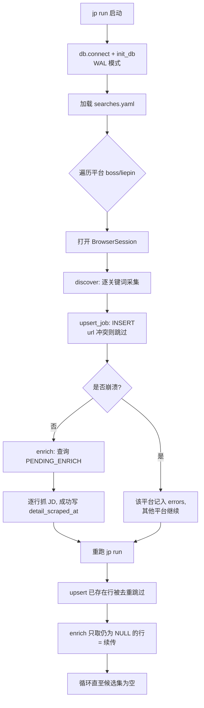

JobPilot-CN 的持久层只有一张表、没有断点文件、也没有集中的 `status` 字段，却能做到「任何阶段崩溃后重跑 `jp run` 即续传」。支撑这一行为的核心设计是一套**列级状态机**（column-level state machine）：每个抓取阶段的推进状态，不由某个显式的状态列记录，而是由该阶段负责写入的若干列是否仍为 `NULL` 推导出来。本页聚焦这一机制的内部构造——列分区与写入边界、状态谓词的定义与复用、幂等的两个源头（去重写与谓词取数）、重试上限与失败隔离，以及它与过滤逻辑的正交关系。至于表结构的完整字段清单，见 [SQLite 单表数据总线与表结构](6-sqlite-dan-biao-shu-ju-zong-xian-yu-biao-jie-gou)；各模块的编排契约细节，见 [模块边界与阶段编排契约](7-mo-kuai-bian-jie-yu-jie-duan-bian-pai-qi-yue)。

Sources: [pipeline.py](src/jobpilot/pipeline.py#L1-L4), [models.py](src/jobpilot/models.py#L1-L4)

## 核心思想：状态即列的 NULL 性

传统流水线通常用一个 `state` 枚举列或一张 `checkpoints` 表来记录进度，重跑时先读状态再决定跳过的行。JobPilot-CN 刻意放弃了这种显式状态：**一个岗位行是否完成了某个阶段，等价于该阶段负责的那组列是否已被填写**。例如「enrich 阶段是否完成」不看任何标志位，而看 `detail_scraped_at` 是否为 `NULL`。这一取舍带来两个直接后果：其一，无需引入额外的状态同步代码，阶段完成与数据落库是**同一次 `UPDATE`**，天然原子；其二，状态永远不会与数据脱节——不存在「标志位说完成了、但数据没写进去」的中间态。

正因为状态是推导出来的，整套系统的续传逻辑不依赖任何进程内内存或磁盘上的进度文件，`pipeline.py` 的模块文档字符串把这一点明确表述为设计目标：「幂等性来自列级状态机：任何阶段崩溃，重跑 `jp run` 即续传，无需断点文件」。

Sources: [pipeline.py](src/jobpilot/pipeline.py#L1-L4), [db.py](src/jobpilot/db.py#L1-L5)

## 列分区与模块写入边界

`jobs` 表的字段按阶段被划分为三个互不重叠的集合，这一划分是状态机成立的前提。discover 阶段（列表页采集）负责写入岗位基础信息，enrich 阶段（JD 全文抓取）负责写入正文与抓取元数据，过滤链负责写入淘汰标记。`db.py` 用 `_DISCOVER_COLUMNS` 与 `ALLOWED_COLUMNS` 两个集合显式编码了这条边界。

| 阶段 | 负责列 | 完成判定列 |
| --- | --- | --- |
| discover（列表页） | `url, platform, job_title, company, city, district, salary_*, experience_raw, education_raw, job_tags, hr_*, search_source, discovered_at` | `discovered_at` 非 NULL |
| enrich（JD 全文） | `full_description, apply_url, detail_scraped_at, enrich_error, enrich_attempts` | `detail_scraped_at` 非 NULL |
| 过滤（纯代码淘汰） | `reject_reason, rejected_at` | `reject_reason` 非 NULL |

模块边界的「铁律」在 `db.py` 顶部注释中被点明：**discovery 只写 discover 列，enrichment 只写 enrich 列**。为强制这一约束，所有写入口都经过白名单校验：`upsert_job` 与 `update_columns` 都会先计算 `set(传入列) - ALLOWED_COLUMNS`，非空即抛 `ValueError`，从而杜绝拼写错误或跨阶段越权写入污染状态推导。

Sources: [db.py](src/jobpilot/db.py#L14-L62), [db.py](src/jobpilot/db.py#L86-L116)

## 状态谓词：阶段衔接的中枢契约

既然状态是「推导」出来的，就必须有一个地方集中定义推导规则。`models.py` 承担了这一角色——它不包含任何业务逻辑，只导出两个 SQL 片段常量作为**状态谓词**（state predicate）：`PENDING_ENRICH`（已发现、未抓 JD、未被过滤）与 `ENRICH_FAILED`（抓取失败过、未被过滤）。这两个谓词是全系统唯一的状态判定来源，discover 阶段写完的行、enrich 阶段的取数查询、`jp status` 的计数板，全部复用同一份文本。

这种「单一事实来源」直接消除了状态定义漂移的风险：如果 enrich 的取数条件与 status 计数条件分别手写，一处改了另一处忘改，就会出现「status 显示待抓 5 条、实际一条都取不到」的割裂。集中定义后，二者永远一致。谓词的字段构成也反过来约束了写入边界——`detail_scraped_at`（完成标记）、`enrich_error`（失败标记）、`reject_reason`（淘汰标记）恰好分属 enrich 与过滤两个阶段，discover 阶段不碰其中任何一个。

Sources: [models.py](src/jobpilot/models.py#L1-L23)

## 幂等源头一：upsert 去重写

幂等的第一道保障发生在**写入发现结果**时。`upsert_job` 并非真正的 `INSERT ... ON CONFLICT`，而是执行一条普通 `INSERT`，然后捕获主键冲突异常：`jobs` 表以 `url` 为 `PRIMARY KEY`，当某岗位 URL 已存在时，SQLite 抛出 `sqlite3.IntegrityError`，函数捕获后返回 `False`（表示未新增）；只有插入成功才返回 `True`（表示新增）。

```python
try:
    conn.execute(f"INSERT INTO jobs ({names}) VALUES ({marks})", tuple(cols.values()))
    conn.commit()
    return True
except sqlite3.IntegrityError:
    return False
```

这一「插入即去重」的策略意味着：重复运行 discover、或同一岗位被多个关键词检索命中时，**已存在的行不会被覆盖也不会报错**，只是静默跳过。pipeline 层据此统计每轮的真实增量——`new = sum(1 for j in jobs if db.upsert_job(conn, j))`，把 `upsert_job` 的布尔返回值累加成「本轮新增岗位数」。需要注意的是，这种「冲突即忽略」的语义也意味着 discover 不会更新已有行的字段（例如平台侧的薪资变动不会回写），这是刻意的幂等取舍。

Sources: [db.py](src/jobpilot/db.py#L86-L99), [pipeline.py](src/jobpilot/pipeline.py#L63-L68)

## 幂等源头二：谓词驱动的续传取数

幂等的第二道保障发生在**读取待处理行**时，这是「续传」真正生效的地方。enrich 阶段每一轮并不记录「上次抓到哪」，而是每次都用 `PENDING_ENRICH` 谓词重新查询全表——凡是 `detail_scraped_at IS NULL`（尚未完成）且未被过滤的行，都是本轮候选。查询按 `discovered_at ASC`（先发现的先抓）排序，再截取前 `limit` 条：

```python
rows = db.fetch(
    conn,
    f"{models.PENDING_ENRICH} AND platform = ? AND enrich_attempts < 3",
    [platform],
    order="ORDER BY discovered_at ASC",
)[:limit]
```

关键在于**完成即出队**：某行抓取成功后，`update_columns` 在同一写入中同时设置 `full_description`、`detail_scraped_at` 与 `apply_url`，此后该行不再满足 `PENDING_ENRICH`，自然从下一轮的候选集中消失。因此进程在任意时刻被 `Ctrl+C` 或崩溃，已经写库的行都已带上了 `detail_scraped_at`，重跑时它们被谓词排除，只有未完成的尾巴会被重新取到——这就是「无需断点文件」的完整机制。

Sources: [enrichment/detail.py](src/jobpilot/enrichment/detail.py#L35-L57), [enrichment/detail.py](src/jobpilot/enrichment/detail.py#L49-L63)

下图刻画单个岗位行在三个阶段之间的状态迁移，其中迁移的「守卫条件」正是各阶段负责列的 NULL 性：



Sources: [models.py](src/jobpilot/models.py#L15-L23), [enrichment/detail.py](src/jobpilot/enrichment/detail.py#L44-L71)

## 重试上限与失败隔离

enrich 的取数条件里带有一个额外守卫 `enrich_attempts < 3`，这构成了状态机的**重试上限**：每次尝试（无论成功或失败）都会把 `enrich_attempts` 自增 1，累计到 3 后该行不再进入候选集，从自动流程中「放弃」。失败时写入的是 `enrich_error` 而非 `detail_scraped_at`，因此失败行既不会污染「已有 JD 全文」的统计，也会被 `ENRICH_FAILED` 谓词单独识别出来供排错。README 明确了这一策略的人工恢复路径：修好选择器或补登录态后**重跑 `jp enrich`** 即可再试。

失败隔离还体现在两个更细的层级。其一是**单行粒度**：`enrich_jobs` 的循环对每行 `try/except`，单行异常只把该行的 `enrich_error` 置为截断到 200 字符的错误文本，不影响循环中其余行，循环末尾 `time.sleep(random.uniform(2, 4))` 的防风控间隔也照常执行。其二是**单平台粒度**：`run_pipeline` 对每个平台包一层 `try/except`，`_run_platform` 内部对每个关键词、每次 enrich 也各自 `try/except`，任一环节抛错只写入 `result.errors` 字典，其余平台与关键词继续执行，正对应 CLI 输出提示「错误（不影响其他阶段，重跑 jp run 可续传）」。

Sources: [enrichment/detail.py](src/jobpilot/enrichment/detail.py#L58-L71), [pipeline.py](src/jobpilot/pipeline.py#L27-L79), [cli.py](src/jobpilot/cli.py#L170-L182), [README.md](README.md#L74-L82)

## 过滤与状态机的正交关系

过滤链（纯代码淘汰）与状态机是两个**正交**的维度：过滤决定一行是否进入导出集，状态机决定一行是否还需要被抓取。二者的耦合点仅在于——`reject_reason IS NULL` 作为合取项被写进了 `PENDING_ENRICH` 与 `ENRICH_FAILED` 两个谓词里。这意味着**被过滤的岗位不会进入 enrich 候选**，从而避免为注定淘汰的行白白抓取 JD 全文。

过滤发生在 discover 阶段：`discovery/base.py` 的 `_finalize` 对每个原始岗位调用 `apply_filters`，命中则写入 `reject_reason` 与 `rejected_at`，并把该行**照样入库**（不丢弃），以便事后通过 `jp export --include-rejected` 翻案审计。这里有一个值得注意的细节：`_finalize` 会为未通过过滤的行也设置 `discovered_at`（通过 `job.setdefault`），因此被过滤行同时满足「已发现」与「已淘汰」，其状态由 `rejected_at`/`reject_reason` 决定，而 `PENDING_ENRICH` 因含 `reject_reason IS NULL` 而将其排除。

| 谓词 | 合取条件 | 消费方 |
| --- | --- | --- |
| `PENDING_ENRICH` | `discovered_at IS NOT NULL AND detail_scraped_at IS NULL AND reject_reason IS NULL` | enrich 取数、`jp status`「待抓 JD」 |
| `ENRICH_FAILED` | `detail_scraped_at IS NULL AND enrich_error IS NOT NULL AND reject_reason IS NULL` | `jp status`「抓 JD 失败」 |

Sources: [models.py](src/jobpilot/models.py#L15-L23), [base.py](src/jobpilot/discovery/base.py#L165-L181), [base.py](src/jobpilot/discovery/base.py#L89-L155)

## 崩溃恢复路径

把上述机制串起来，一次「discover 中崩溃、随后重跑」的完整恢复路径如下。由于 discover 与 enrich 共用同一个 `BrowserSession`，登录态只验一次，重跑会从 `PENDING_ENRICH` 重新划分工作边界：



`run_pipeline` 的 `try/finally` 保证 `conn.close()` 一定执行，中间任何异常都被逐层 `except` 收敛进 `result.errors`，不会让一次崩溃带走整个进程的退出码语义。这正是「重跑即续传」得以成立的编排层配合。

Sources: [pipeline.py](src/jobpilot/pipeline.py#L27-L43), [pipeline.py](src/jobpilot/pipeline.py#L46-L56)

## 状态计数板：谓词的复用验证

`db.counts()` 是状态谓词复用原则最直观的证据。「待抓 JD」与「抓 JD 失败」两个计数分别重写了 `PENDING_ENRICH` 与 `ENRICH_FAILED` 的 SQL 文本，因此计数板展示的数字与 enrich 实际会取到的行数**严格对应**——`jp status` 报「待抓 JD: 0」，就意味着下一轮 `jp enrich` 无行可取。CLI 的 `status` 命令将这份 `counts()` 字典渲染成 rich 表格。

| 计数板项 | 等价谓词 | 说明 |
| --- | --- | --- |
| 总岗位 | `COUNT(*)` | 全表行数 |
| 已有 JD 全文 | `full_description IS NOT NULL` | 完成标记的另一种表达 |
| 待抓 JD | `PENDING_ENRICH` | 下一轮 enrich 的候选集 |
| 抓 JD 失败 | `ENRICH_FAILED` | 可修后重跑的行 |
| 已过滤 | `reject_reason IS NOT NULL` | 淘汰行数 |

值得注意的是，`counts()` 内部用一个局部 lambda `q` 封装 `fetchone`，未命中时回退 `[0]`，使得对空库也能稳定返回 0 而非 `None`，保证计数板在任何状态下都可渲染。

Sources: [db.py](src/jobpilot/db.py#L119-L134), [cli.py](src/jobpilot/cli.py#L41-L52)

## 一致性保障：列白名单、部分索引与 WAL

三处工程细节为状态机的正确运行提供了底座支撑。其一是**列白名单**（已在前述写入边界中说明）——`update_columns` 在无列可写时直接 `return`，避免生成非法 SQL；有列时按 `k = ?` 拼接 set 子句并补 `WHERE url = ?`，单条 `UPDATE` 内完成「数据 + 状态」的原子推进。

其二是**部分索引** `idx_jobs_pending_enrich ON jobs(discovered_at) WHERE detail_scraped_at IS NULL`。这是一个带 `WHERE` 条件的**部分索引**（partial index），只为「尚未抓取」的行建索引，使得 enrich 的候选集查询与 `ORDER BY discovered_at` 的排序都能走索引，同时索引体积随完成行增多而有效缩减——索引本身就编码了「未完成」这一状态。

其三是一致性会话参数与**向前兼容迁移**。`connect()` 开启 WAL 日志模式（读写并发下更稳）并设置 10 秒 `busy_timeout`，降低并发写入冲突。`init_db` 在处理旧库时执行 `_MIGRATIONS`：由于 `CREATE TABLE IF NOT EXISTS` 不会给已存在的表补新列，代码显式检查 `PRAGMA table_info(jobs)` 后对缺失的 `experience_raw` / `education_raw` 执行 `ALTER TABLE ADD COLUMN`，保证老库升级后新列存在（其值为 NULL，与「未完成」语义一致）。

Sources: [db.py](src/jobpilot/db.py#L49-L50), [db.py](src/jobpilot/db.py#L65-L83), [db.py](src/jobpilot/db.py#L108-L116)

## 边界与注意事项

理解状态机的一个实用推论是：**直接修改状态列会破坏续传判断**。README 对用外部 SQLite 客户端（如 DBeaver）查看数据时给出明确警告——建议勾选只读连接，因为「清空 `detail_scraped_at` 会导致 JD 被重复抓取」；同理，手工置空某行的 `discovered_at` 会让它从 `PENDING_ENRICH` 中消失而永不被 enrich。可见状态列既是数据也是控制信号，任何绕过 `db.py` 写入口的修改都可能让推导出的状态与实际数据脱节。

另一处边界在于 `upsert_job` 的「冲突即忽略」：它保证了幂等的下行（不重复插入），但也意味着已存在行的 discover 列**不会随平台数据变化而更新**。若需要刷新某岗位的基础字段，当前机制不提供原地更新路径——这是「幂等」与「最新」之间的取舍，也是本状态机在设计上刻意选择的保守一侧。

Sources: [README.md](README.md#L184-L189), [db.py](src/jobpilot/db.py#L94-L99)

## 小结与延伸阅读

列级状态机把「进度」这一概念彻底数据化：`detail_scraped_at`、`discovered_at`、`reject_reason` 三列既是业务数据，也是阶段完成的唯一凭据，由此衍生出「插入即去重 + 谓词即取数」的双重幂等，以及无断点文件的崩溃续传。要继续深入，建议接着阅读 [SQLite 单表数据总线与表结构](6-sqlite-dan-biao-shu-ju-zong-xian-yu-biao-jie-gou) 了解完整字段与索引布局，再读 [模块边界与阶段编排契约](7-mo-kuai-bian-jie-yu-jie-duan-bian-pai-qi-yue) 理解各模块如何在上述契约下协作；若关心 enrich 阶段具体的抓取降级策略，见 [JD 全文抓取与接口优先/DOM 降级](11-jd-quan-wen-zhua-qu-yu-jie-kou-you-xian-dom-jiang-ji)。