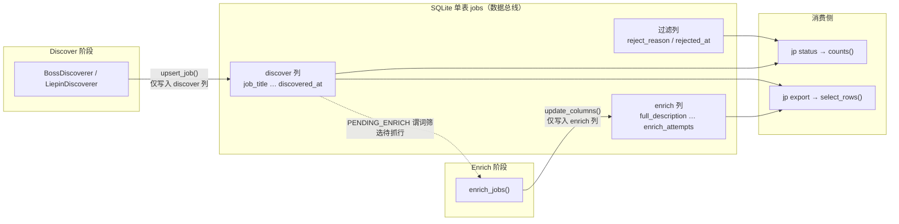
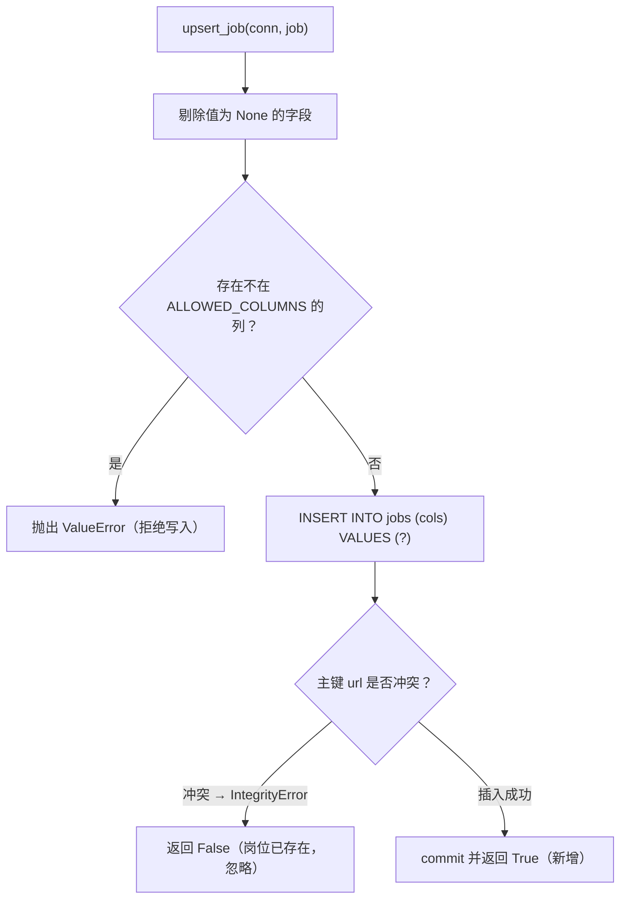

## 本页定位

JobPilot-CN 的整条流水线（采集岗位列表 → 抓取 JD 全文 → 过滤 → 导出）并非通过模块间的函数调用串联，而是围绕**一张 SQLite 表 `jobs`** 协作。这张表既是持久化存储，也是阶段之间的**数据总线（data bus）**——每个阶段只负责写入自己"拥有"的列，阶段之间零直接调用，靠列是否被填充来表达进度。本页聚焦这条总线的物理结构（表定义、索引、连接配置）与写入契约（列所有权、幂等 upsert），帮助读者理解"为什么一张表能承载完整的爬取流水线"。关于列级状态机的谓词语义，请参阅 [列级状态机与幂等续传机制](5-lie-ji-zhuang-tai-ji-yu-mi-deng-xu-chuan-ji-zhi)；阶段编排与模块边界请参阅 [模块边界与阶段编排契约](7-mo-kuai-bian-jie-yu-jie-duan-bian-pai-qi-yue)。

Sources: [db.py](src/jobpilot/db.py#L1-L5), [pipeline.py](src/jobpilot/pipeline.py#L1-L4)

## 设计约束：为什么是单表

传统爬虫项目通常用多张表（如 `jobs` + `job_details` + `rejected`）或中间文件（断点文件、JSON 快照）来隔离阶段。本项目刻意反其道而行，把全部字段塞进一张 `jobs` 表，其核心动机有三点：**其一**，以岗位 URL 作为主键，让"同一岗位被重复采集"天然退化为一次主键冲突，从而获得免费的幂等性；**其二**，把"某阶段是否完成"编码为"该阶段负责的列是否为 NULL"，使崩溃恢复只需重跑命令，无需维护任何断点状态文件；**其三**，单表让 `jp status` 这类计数看板可以用纯 SQL 谓词直接统计各阶段进度，规则完全可审计。这条设计原则在模块文档中有明确表述：discovery 只写 discover 列，enrichment 只写 enrich 列。

Sources: [db.py](src/jobpilot/db.py#L1-L5), [pipeline.py](src/jobpilot/pipeline.py#L1-L4)

## 表结构全貌

`jobs` 表的建表语句按"归属阶段"分为四个语义区块：主键与平台约束、discover（列表页）区块、enrich（JD 全文）区块、过滤区块。数据库文件位于运行时目录下的 `db.sqlite3`，路径由配置模块集中管理。

Sources: [db.py](src/jobpilot/db.py#L14-L51), [config.py](src/jobpilot/config.py#L42-L43)

下表逐列列出字段定义、SQLite 类型与归属阶段，是理解后续写入契约的基础。

| 列名 | 类型 / 约束 | 归属阶段 | 说明 |
| --- | --- | --- | --- |
| `url` | `TEXT PRIMARY KEY` | 主键 | 规范化岗位链接（去除安全参数），整表唯一标识 |
| `platform` | `TEXT NOT NULL CHECK(IN ('boss','liepin'))` | 主键约束 | 平台标识，限定取值 |
| `job_title` | `TEXT` | discover | 岗位标题 |
| `company` | `TEXT` | discover | 公司名 |
| `city` | `TEXT` | discover | 城市 |
| `district` | `TEXT` | discover | 区县（如「浦东新区」） |
| `salary_raw` | `TEXT` | discover | 薪资原始文本 |
| `salary_min` | `INTEGER` | discover | 薪资下限（已解析） |
| `salary_max` | `INTEGER` | discover | 薪资上限（已解析） |
| `salary_months` | `INTEGER` | discover | 发薪月数 |
| `experience_raw` | `TEXT` | discover | 年限原始文本（旧库补列） |
| `education_raw` | `TEXT` | discover | 学历原始文本（旧库补列） |
| `job_tags` | `TEXT` | discover | 标签的 JSON 数组字符串 |
| `hr_name` / `hr_title` / `hr_active` | `TEXT` | discover | HR 名 / 头衔 / 活跃度 |
| `search_source` | `TEXT` | discover | 来源关键词 |
| `discovered_at` | `TEXT` | discover | 发现时间（ISO 秒级） |
| `full_description` | `TEXT` | enrich | JD 全文 |
| `apply_url` | `TEXT` | enrich | 投递链接（回退到 `url`） |
| `detail_scraped_at` | `TEXT` | enrich | JD 抓取完成时间 |
| `enrich_error` | `TEXT` | enrich | 抓取失败原因 |
| `enrich_attempts` | `INTEGER DEFAULT 0` | enrich | 抓取尝试次数 |
| `reject_reason` | `TEXT` | 过滤 | 淘汰原因（NULL = 通过） |
| `rejected_at` | `TEXT` | 过滤 | 淘汰时间 |

Sources: [db.py](src/jobpilot/db.py#L14-L51), [boss.py](src/jobpilot/discovery/boss.py#L194-L210)

## 列所有权：写入契约的代码化

阶段之间的"只写自己的列"这条铁律，并非仅靠约定，而是由 `db.py` 中的两个集合常量在代码层强制执行。`_DISCOVER_COLUMNS` 枚举 discover 阶段负责的全部字段（含主键与平台），`ALLOWED_COLUMNS` 则在它的基础上并入 enrich 与过滤阶段的字段，构成整表合法的全列集合。

Sources: [db.py](src/jobpilot/db.py#L53-L62)

`upsert_job` 与 `update_columns` 两个写入口都会先校验传入的列名是否落在 `ALLOWED_COLUMNS` 内，一旦出现未知列立即抛出 `ValueError`，而非静默忽略。这道校验是总线契约的守护者：任何模块若试图越权写入其他阶段的列，都会在开发期暴露，而不是污染数据后才发现。

Sources: [db.py](src/jobpilot/db.py#L86-L99), [db.py](src/jobpilot/db.py#L108-L116)

下图的 Mermaid 图展示了"列所有权 → 阶段读写 → 消费者"的完整数据总线关系：

Sources: [db.py](src/jobpilot/db.py#L86-L116), [pipeline.py](src/jobpilot/pipeline.py#L63-L76), [export.py](src/jobpilot/export.py#L27-L33)

## 幂等写入：upsert 语义

总线的写入入口是 `upsert_job`。它的行为是"**插入或忽略**"：以 `url` 为主键执行 `INSERT`，若主键冲突抛出 `sqlite3.IntegrityError` 则捕获并返回 `False`（表示该岗位已存在），成功插入返回 `True`。这意味着同一岗位无论被多少个关键词、多少轮采集命中，最终只会在表中留下**一行**，且首次写入的字段不会被后续采集覆盖。

Sources: [db.py](src/jobpilot/db.py#L86-L99)

一个值得注意的实现细节：`upsert_job` 在拼装 SQL 前会过滤掉值为 `None` 的字段（`v is not None`），只把有值的列写入。这避免了用空值覆盖已有数据，也让"缺列的插入"天然安全。而返回值 `True/False` 被流水线用于统计每轮新增数量，即 discover 阶段汇报的 `new` 计数来源。

Sources: [db.py](src/jobpilot/db.py#L88-L97), [pipeline.py](src/jobpilot/pipeline.py#L67-L68)

下图展示这一幂等写入的判定流程：

Sources: [db.py](src/jobpilot/db.py#L86-L99)

## 列级更新：enrich 与过滤的写入方式

与 discover 不同，enrich 阶段针对的是**已存在的行**，因此使用 `update_columns` 做定向更新。该方法同样先校验列名合法性，接受 `url` 定位 + 关键字列参数，动态拼出 `UPDATE ... SET ... WHERE url = ?`。enrich 抓取成功后写入 `full_description`、`apply_url`、`detail_scraped_at` 并累加 `enrich_attempts`；失败或异常时则写入 `enrich_error` 同样累加尝试次数，从而把"失败也要记账"编码进同一套写入契约。

Sources: [db.py](src/jobpilot/db.py#L108-L116), [detail.py](src/jobpilot/enrichment/detail.py#L45-L69)

过滤列则由 discover 阶段的过滤链在 `_finalize` 中就地写入：当 `apply_filters` 返回非空原因时，把 `reject_reason` 与 `rejected_at` 一并写进 job 字典，随后随整行插入总线。因此一条被淘汰的岗位并非不被入库，而是"入库并打上淘汰标记"，这为 `jp status` 的"已过滤"统计与导出时的翻案（`include_rejected`）保留了空间。

Sources: [base.py](src/jobpilot/discovery/base.py#L165-L181), [export.py](src/jobpilot/export.py#L27-L33)

## 连接配置与并发保障

所有数据库访问都经过统一的 `connect()` 入口，它设置了三项关键配置：启用 **WAL（Write-Ahead Logging）日志模式**以获得更好的读写并发与崩溃安全；设置 `busy_timeout=10000` 让锁竞争时自动重试而非立即报错；以及把 `row_factory` 设为 `sqlite3.Row`，使查询结果可按列名访问——这正是 enrich 阶段能用 `r["url"]`、`r["apply_url"]` 等下标读取字段的原因。

Sources: [db.py](src/jobpilot/db.py#L65-L70), [detail.py](src/jobpilot/enrichment/detail.py#L45-L55)

## 轻量迁移：旧库补列

由于 `CREATE TABLE IF NOT EXISTS` 不会给**已存在**的表追加新列，当表结构演进（例如新增 `experience_raw`、`education_raw`）时，老用户的数据库不会自动获得新字段。为此 `init_db` 在执行的建表脚本之后，会读取 `PRAGMA table_info(jobs)` 拿到现有列集合，再对照 `_MIGRATIONS` 元组中声明的补列清单，对缺失的列执行 `ALTER TABLE jobs ADD COLUMN`。这套机制让升级对用户完全透明，`jp init`、`jp status`、`jp export` 等命令每次启动都会先跑一遍。

Sources: [db.py](src/jobpilot/db.py#L73-L83)

## 部分索引与状态查询

总线为"待抓 JD"这一最高频查询建了一个**部分索引（partial index）**：`idx_jobs_pending_enrich` 只索引 `detail_scraped_at IS NULL` 的行，并作用于 `discovered_at`。由于 enrich 阶段每轮都要按 `PENDING_ENRICH` 谓词反复筛选未抓取的行，部分索引把索引体积限制在"尚未完成"的子集上，随着进度推进索引持续收缩，兼顾了查询效率与写入成本。

Sources: [db.py](src/jobpilot/db.py#L49-L50), [detail.py](src/jobpilot/enrichment/detail.py#L38-L43)

`counts()` 函数是 `jp status` 计数看板的数据源，它用一组纯 SQL 聚合把总线状态翻译成人类可读的进度数字。这些查询与 `models.py` 中的谓词常量语义一致，共同构成了状态机可观测性的一环：

| 看板指标 | SQL 谓词（语义等价） |
| --- | --- |
| 总岗位 | `COUNT(*)` |
| 已有 JD 全文 | `full_description IS NOT NULL` |
| 待抓 JD | `PENDING_ENRICH`（已发现 ∧ 未抓 ∧ 未过滤） |
| 抓 JD 失败 | `ENRICH_FAILED`（未抓 ∧ 有错误 ∧ 未过滤） |
| 已过滤 | `reject_reason IS NOT NULL` |

Sources: [db.py](src/jobpilot/db.py#L119-L134), [models.py](src/jobpilot/models.py#L16-L23)

## 查询与消费：fetch 与导出投影

总线对外提供两个读取接口。`fetch` 是一个通用查询函数，接受 `where`、`params` 与 `order`（默认按 `discovered_at DESC`）三个参数，返回整行结果——enrich 阶段正是借助它配合状态谓词拉取待处理行。`export.py` 则定义了显式的 `FIELDS` 投影列表，`select_rows` 只挑选这些列并按 `platform, discovered_at` 排序输出，默认过滤掉 `reject_reason` 非空的行，从而把底层总线行转换成稳定的对外数据结构。

Sources: [db.py](src/jobpilot/db.py#L102-L105), [export.py](src/jobpilot/export.py#L17-L33)

## 小结与延伸阅读

单表数据总线的本质，是把"阶段进度"从控制流中抽离，改由**数据状态（列是否填充）**来表达：主键 `url` 提供幂等锚点，列所有权集合提供写入边界，`upsert/update` 提供两种互补的写入语义，WAL 与部分索引提供并发与查询保障。理解了这层总线，就能理解为什么整个流水线可以"任意崩溃、重跑即续传"。

建议继续阅读以下相邻页面以形成完整认知：数据在列上的流转规则细节见 [列级状态机与幂等续传机制](5-lie-ji-zhuang-tai-ji-yu-mi-deng-xu-chuan-ji-zhi)；阶段如何编排并复用同一条总线见 [模块边界与阶段编排契约](7-mo-kuai-bian-jie-yu-jie-duan-bian-pai-qi-yue)；数据库文件所在目录的约定见 [运行时目录与配置体系](4-yun-xing-shi-mu-lu-yu-pei-zhi-ti-xi)；总线的下游消费方式见 [数据导出（JSON / CSV）](19-shu-ju-dao-chu-json-csv)。