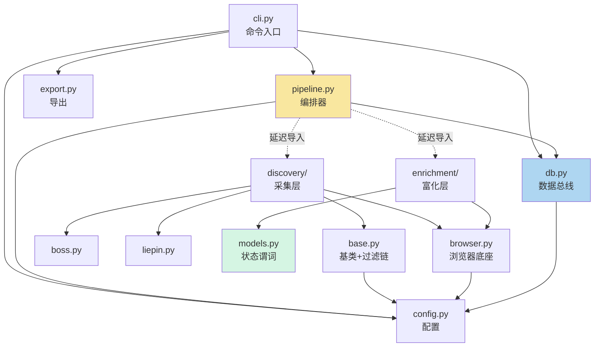
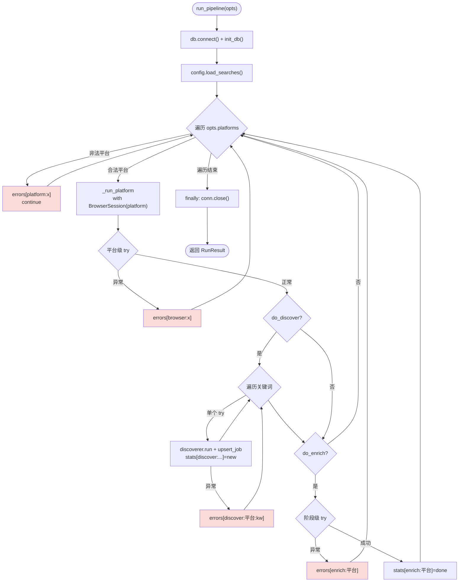
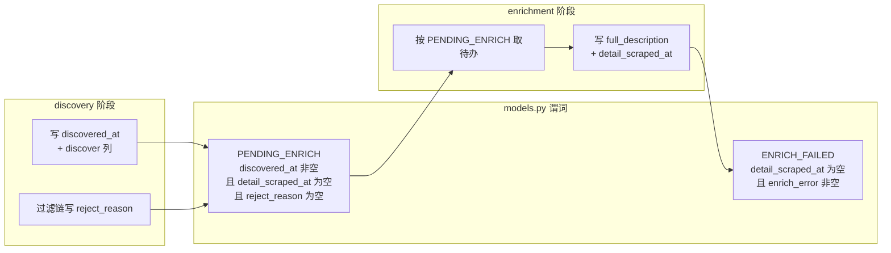

JobPilot-CN 的核心设计不是"一个爬虫脚本"，而是**以 SQLite 单表为数据总线、以列级状态为阶段进度、以编排器为唯一指挥中心**的模块化流水线。本页聚焦于回答一个问题：**代码被切成了哪些模块，它们之间通过什么"契约"协作，谁有权力写哪些数据**。

理解这套契约后，你将能安全地新增一个采集平台、替换浏览器底座，或新增一个处理阶段，而不会破坏幂等续传能力。若你还不熟悉"列级状态机"的基本概念，建议先阅读 [列级状态机与幂等续传机制](5-lie-ji-zhuang-tai-ji-yu-mi-deng-xu-chuan-ji-zhi) 与 [SQLite 单表数据总线与表结构](6-sqlite-dan-biao-shu-ju-zong-xian-yu-biao-jie-gou)。

Sources: [pipeline.py](src/jobpilot/pipeline.py#L1-L4), [db.py](src/jobpilot/db.py#L1-L5)

## 模块分层与边界铁律

项目按**职责垂直切分**为若干模块，每个模块有单一且明确的写入权限。最核心的一条不变式写在 `db.py` 的模块文档字符串里——"**discovery 只写 discover 列，enrichment 只写 enrich 列**"。

| 模块 | 文件 | 职责 | 可写列 |
| --- | --- | --- | --- |
| 配置层 | `config.py` | 运行时目录、profile/searches 加载 | 无（只读文件） |
| 数据总线 | `db.py` | 建表、upsert、查询、列白名单校验 | 为所有列把关 |
| 状态谓词 | `models.py` | 阶段完成谓词的集中定义 | 无（纯函数） |
| 采集层 | `discovery/` | 列表页采集 + 过滤链 | discover 列 + 过滤列 |
| 富化层 | `enrichment/` | JD 全文抓取 | enrich 列 |
| 编排层 | `pipeline.py` | 阶段调度、会话复用、错误隔离 | 无（只调用） |
| 入口层 | `cli.py` | 参数解析、命令映射 | 无（只调用） |
| 导出层 | `export.py` | JSON/CSV 快照 | 无（只读表） |

模块之间**不直接互相调用业务方法**，而是全部围绕同一张 `jobs` 表和 `db.py` 暴露的少数几个函数协作。`config.py` 是纯粹的基础设施（路径与配置加载），`models.py` 是纯粹的语义层（谓词常量），二者都不产生副作用。

Sources: [db.py](src/jobpilot/db.py#L1-L5), [config.py](src/jobpilot/config.py#L1-L2), [models.py](src/jobpilot/models.py#L1-L4)

下图展示模块依赖方向：所有实心箭头均指向"被依赖方"，编排层是唯一的"知情者"。

一个值得注意的细节是：`pipeline.py` 对采集层与富化层采用**函数内延迟导入**（第 48-51 行），而非模块顶层导入。这使得编排逻辑在不需要（例如只跑 export 命令）时无需拉起 Playwright 依赖，同时也让模块边界在"导入图"层面更清晰。

Sources: [pipeline.py](src/jobpilot/pipeline.py#L46-L51), [db.py](src/jobpilot/db.py#L27-L43), [cli.py](src/jobpilot/cli.py#L12-L16)

## 阶段编排契约：RunOptions 与 RunResult

编排器的对外契约由两个数据类定义，它们就是"调用方与编排器之间的接口协议"。

`RunOptions` 描述**要做什么**：平台列表、单次抓取上限、以及两个阶段开关 `do_discover` / `do_enrich`。`RunResult` 描述**做完了什么**：`stats`（各阶段新增/成功计数）与 `errors`（分阶段、分平台的错误消息），编排器**从不抛异常返回给调用方**，而是把所有问题装进 `RunResult`。

| 字段 | 类型 | 默认值 | 语义 |
| --- | --- | --- | --- |
| `platforms` | `list[str]` | `["boss", "liepin"]` | 目标平台 |
| `max_per_search` | `int` | `20` | 每个关键词的列表上限，同时是本轮 enrich 上限 |
| `do_discover` | `bool` | `True` | 是否执行列表采集阶段 |
| `do_enrich` | `bool` | `True` | 是否执行 JD 全文富化阶段 |
| `RunResult.errors` | `dict[str, str]` | `{}` | 键为 `阶段:平台[:关键词]`，值为错误文本 |
| `RunResult.stats` | `dict[str, int]` | `{}` | 键为 `阶段:平台[:关键词]`，值为计数 |

命令层正是通过翻转这两个开关来复用同一编排器——这就是"命令即旗标组合"的设计。`discover` 命令传 `do_enrich=False`，`enrich` 命令传 `do_discover=False`，`run` 命令两者皆真。

Sources: [pipeline.py](src/jobpilot/pipeline.py#L13-L24), [cli.py](src/jobpilot/cli.py#L106-L145)

## 单次编排流程与错误隔离

`run_pipeline` 的执行骨架遵循"建立连接 → 初始化库 → 逐平台调度"三段式，并保证连接在 `finally` 中关闭。真正的调度逻辑在 `_run_platform` 中。

编排器的错误处理采用**三级纺锤式隔离**，这是保证"一个平台崩溃不影响另一个平台、一个关键词崩溃不影响另一个关键词"的关键：

1. **平台级**：`_run_platform` 整体被 `try/except` 包裹，异常记入 `errors["browser:{platform}"]`；
2. **关键词级**：每个关键词的 `discoverer.run` 单独 `try/except`，异常记入 `errors["discover:{platform}:{kw}"]`；
3. **阶段级**：enrich 阶段单独 `try/except`，异常记入 `errors["enrich:{platform}"]`。

此外，`run_pipeline` 对平台名做白名单校验（只支持 `boss`/`liepin`），非法平台被记录为 `platform:{platform}` 错误后 `continue`，不会中断其余平台。

Sources: [pipeline.py](src/jobpilot/pipeline.py#L27-L43), [pipeline.py](src/jobpilot/pipeline.py#L33-L36), [pipeline.py](src/jobpilot/pipeline.py#L63-L70), [pipeline.py](src/jobpilot/pipeline.py#L72-L78)

**会话复用契约**：discover 与 enrich 共用同一个 `BrowserSession`（第 56-57 行注释明示"登录态只验一次"）。这意味着两个阶段共享同一个浏览器上下文，避免了重复启动浏览器与重复校验登录态的开销——但也隐含一个约束：同一平台的 discover 与 enrich 是**串行**的，且任意一阶段抛出的浏览器级异常会使整个平台的两阶段一同失败。

Sources: [pipeline.py](src/jobpilot/pipeline.py#L56-L78)

## 列白名单：写入权限的运行时闸门

`db.py` 用一组 Python 集合把"模块边界铁律"从注释变成了**运行时强制的校验**。`_DISCOVER_COLUMNS`（第 53-58 行）显式列举了 discover 阶段允许写入的所有列，`ALLOWED_COLUMNS` 在此基础上并入富化列与过滤列（第 59-62 行）。

两个写入函数都执行"未知列即报错"的校验：

- `upsert_job` 在插入前检查 `set(job) - ALLOWED_COLUMNS`，非空则抛出 `ValueError(f"未知列: {bad}")`；
- `update_columns` 同样拒绝白名单之外的列。

这条契约的价值在于：任何模块若试图写入一个不属于自己职责的列（例如富化层误写 `salary_min`），会在开发阶段立即暴露为异常，而不是在生产环境中静默污染状态机。`upsert_job` 还利用 `url` 主键 + `INSERT` 捕获 `IntegrityError` 实现幂等插入——冲突即跳过并返回 `False`，这使"重跑不产生重复行"成为数据总线级别的保证。

| 写入函数 | 调用方 | 幂等机制 | 越权行为 |
| --- | --- | --- | --- |
| `upsert_job` | discovery 层 | `url` 主键冲突忽略 | 抛 `ValueError` |
| `update_columns` | enrichment 层 | 依赖谓词限定目标行 | 抛 `ValueError` |

Sources: [db.py](src/jobpilot/db.py#L53-L62), [db.py](src/jobpilot/db.py#L86-L99), [db.py](src/jobpilot/db.py#L108-L116)

## 状态谓词：阶段之间的"零直接调用"接口

`models.py` 是整套契约中最精妙的部分。它的理念是：**某阶段完成 = 该阶段负责的列非 NULL**。因此阶段之间不需要任何直接函数调用或事件通知，只需查表时套用同一组谓词。

`PENDING_ENRICH` 谓词是 discover 与 enrich 之间的**唯一接口**：enrich 层用 `models.PENDING_ENRICH` 过滤待处理行，同时 `db.counts`（`jp status` 的数据源）也复用**完全相同的谓词字符串**。这种"谓词集中定义、双端复用"消除了"状态判断逻辑在两处漂移"的风险——谓词一旦修改，待办查询与状态计数会同步改变。

富化层还会追加两个本地条件：`platform = ?`（只处理当前平台）与 `enrich_attempts < 3`（限制重试次数上限，防止坏数据无限重抓）。

Sources: [models.py](src/jobpilot/models.py#L16-L24), [db.py](src/jobpilot/db.py#L119-L134), [enrichment/detail.py](src/jobpilot/enrichment/detail.py#L38-L43)

## 采集层的内部契约：基类与过滤链

`discovery/base.py` 定义了两个协作契约。第一个是 `BaseDiscoverer` 抽象基类，它规定所有平台的 discoverer 必须实现 `run(context, keyword, conf, limit) -> list[dict]` 这一接口——`pipeline.py` 只需按平台名选择 `BossDiscoverer` 或 `LiepinDiscoverer`，无需关心二者内部差异。

第二个是 `_finalize` 模板方法，它承载了**过滤链 + 公共字段补齐**的公共逻辑：加载 `profile.json`，对每个原始岗位调用 `apply_filters`，命中则写入 `reject_reason`/`rejected_at`，最后补齐 `platform` 与 `search_source`、设置 `discovered_at`。这意味着平台子类只负责"把页面变成字典"，而"如何过滤、如何打标"由基类统一裁决——这正是过滤列写入权归属 discovery 层的实现方式。

| 契约 | 位置 | 规定内容 |
| --- | --- | --- |
| `BaseDiscoverer.run` | `base.py` L161-L163 | 平台子类必须实现的抽象方法 |
| `BaseDiscoverer._finalize` | `base.py` L165-L181 | 过滤链 + 公共字段补齐的模板方法 |
| `apply_filters` | `base.py` L89-L155 | 返回 `reject_reason` 或 `None`，顺序固定 |
| `parse_experience` / `parse_education` | `base.py` L25-L73 | 文本归一化，供过滤与平台解析共用 |

值得注意的是，`boss.py` 与 `liepin.py` 都从 `base.py` 导入 `parse_experience` / `parse_education` 用于**从标签中挑选字段**（如"年限藏在标签里"），而 `apply_filters` 又用同一对函数做**过滤判定**。这种函数级复用保证了"解析口径"与"过滤口径"永远一致，不会出现"解析成 3-5、过滤按 3 以上"的口径分裂。

Sources: [discovery/base.py](src/jobpilot/discovery/base.py#L158-L181), [discovery/base.py](src/jobpilot/discovery/base.py#L89-L155), [discovery/boss.py](src/jobpilot/discovery/boss.py#L14-L14), [discovery/liepin.py](src/jobpilot/discovery/liepin.py#L13-L13)

## 浏览器单点封装：底座契约

`discovery/browser.py` 是所有浏览器操作的**唯一下沉出口**。它的模块文档明确了"单点封装原则"：将来若 Playwright 被指纹检测，整体替换为 nodriver/patchright 只需改这一个文件。

这个底座向采集层与富化层同时暴露三类能力：`BrowserSession` 上下文管理器（有头 Chromium + Cookie/sessionStorage 回灌）、`pause_if_challenge`（滑块/验证页人工暂停）、以及 Cookie 持久化函数。`enrichment/detail.py` 通过 `from ..discovery.browser import BrowserSession` 复用同一底座——**富化层依赖浏览器底座，但不依赖采集层的任何业务逻辑**，二者是"共享基础设施"的平行关系，而非上下级调用。

| 底座能力 | 函数/类 | 消费方 |
| --- | --- | --- |
| 会话生命周期 | `BrowserSession` | pipeline（传给 discover + enrich） |
| 挑战页暂停 | `pause_if_challenge` | boss.py / liepin.py / detail.py |
| 登录态持久化 | `save_cookies` / `load_storage_state` | cli.login / BrowserSession |

需要强调的是，`BrowserSession` 由编排层创建并作为参数**注入**给 discover 与 enrich（见 `_run_platform` 第 57 行 `with BrowserSession(platform) as session`），而非由各阶段自行创建。这既是"会话复用"的实现，也是"编排层掌握阶段生命周期"这一契约的体现。

Sources: [discovery/browser.py](src/jobpilot/discovery/browser.py#L1-L5), [discovery/browser.py](src/jobpilot/discovery/browser.py#L148-L187), [enrichment/detail.py](src/jobpilot/enrichment/detail.py#L14-L14), [pipeline.py](src/jobpilot/pipeline.py#L57-L57)

## 边界不变式与扩展指引

综合以上契约，可以提炼出四条**架构不变式**，它们是这套模块边界体系的"宪法"：

1. **单表即总线**：所有阶段只通过 `jobs` 表交互，没有中间队列、没有内存传递的状态；
2. **列即权限**：每个模块只能写自己职责内的列，`db.py` 的白名单在运行时强制这一点；
3. **谓词即接口**：阶段间的衔接由 `models.py` 的集中谓词表达，阶段之间零直接调用；
4. **编排器即唯一指挥**：阶段开关、会话创建、错误隔离全部集中在 `pipeline.py`，采集/富化层被设计为"可被编排的纯执行单元"。

基于这些不变式，扩展项目的方式也变得有章可循：

| 扩展目标 | 应改动 | 契约约束 |
| --- | --- | --- |
| 新增采集平台 | 在 `discovery/` 新增子类继承 `BaseDiscoverer`，在 `pipeline.py` 的 `_run_platform` 分支中注册 | 必须实现 `run` 接口，用 `_finalize` 走过滤链 |
| 替换浏览器底座 | 只改 `discovery/browser.py` | 保持 `BrowserSession` / `pause_if_challenge` 接口签名不变 |
| 新增处理阶段 | 在 `db.py` 的 `ALLOWED_COLUMNS` 扩容 + 在 `models.py` 定义新谓词 + 在 `pipeline.py` 增加阶段开关 | 不得写入其他阶段已有的列 |

任意平台崩溃都不会污染其他平台的进度，任意阶段崩溃后重跑 `jp run` 都会依据列级状态自动续传——这正是"模块边界"与"阶段编排契约"共同服务的最终目标。

Sources: [db.py](src/jobpilot/db.py#L59-L62), [models.py](src/jobpilot/models.py#L1-L4), [pipeline.py](src/jobpilot/pipeline.py#L39-L40), [discovery/base.py](src/jobpilot/discovery/base.py#L158-L163)

**继续阅读**：若你想深入单个平台采集的"怎么抓"细节，请前往 [Boss 直聘列表采集与薪资字体反爬](9-boss-zhi-pin-lie-biao-cai-ji-yu-xin-zi-zi-ti-fan-pa) 与 [猎聘 XHR 拦截与城市纠偏](10-xi-pin-xhr-lan-jie-yu-cheng-shi-jiu-pian)；若关注富化阶段，请阅读 [JD 全文抓取与接口优先/DOM 降级](11-jd-quan-wen-zhua-qu-yu-jie-kou-you-xian-dom-jiang-ji)。