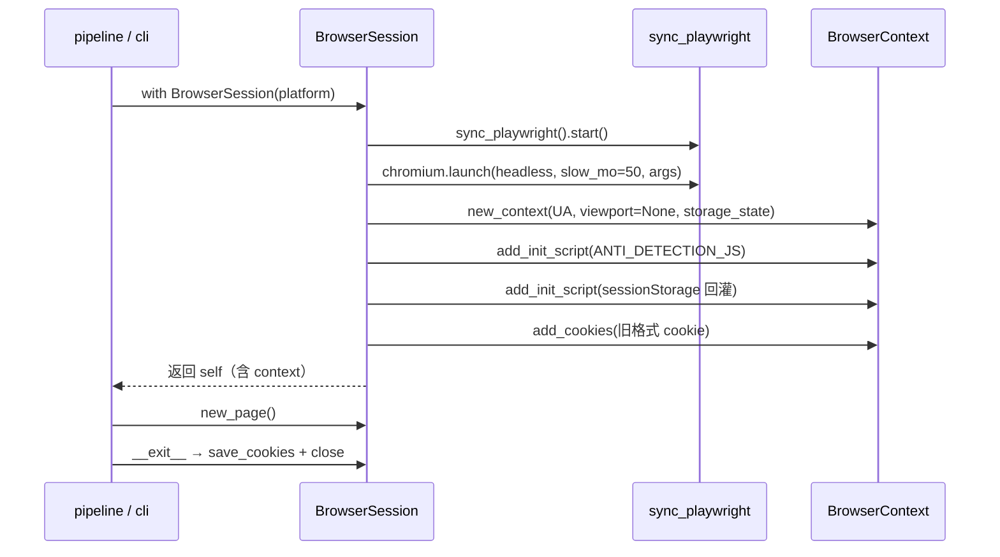
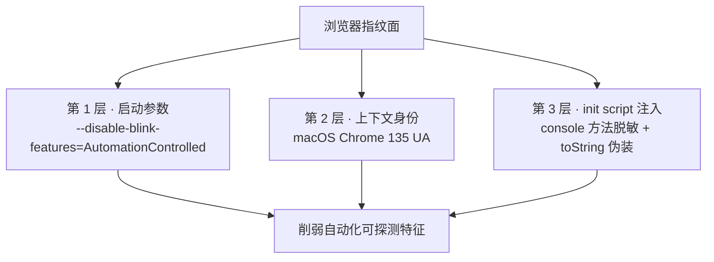
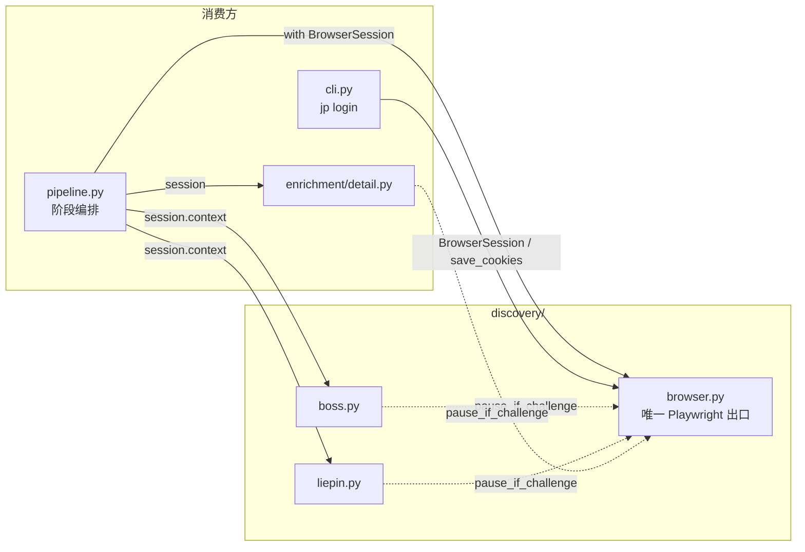

本页聚焦 JobPilot-CN 中浏览器自动化底座的两个核心设计决策：**唯一出口（单点封装）** 与 **反检测注入**。它解释 `discovery/browser.py` 为何被刻意设计成整个项目中唯一引入 `playwright` 的模块、`BrowserSession` 的启动配置如何拼装出一个尽量"像真人"的 Chromium 上下文，以及当平台指纹检测升级时替换底座的迁移路径。登录态持久化的完整语义见 [登录态持久化与 sessionStorage 回灌](17-deng-lu-tai-chi-jiu-hua-yu-sessionstorage-hui-guan)，挑战页人工暂停的完整语义见 [滑块/验证页人工暂停机制](18-hua-kuai-yan-zheng-ye-ren-gong-zan-ting-ji-zhi)，本页仅在接口契约层面提及二者。

## 单点封装原则：唯一的 Playwright 出口

`browser.py` 的模块文档字符串直接写明了设计意图——"**单点封装原则：将来 Playwright 被指纹检测时，整体替换 nodriver/patchright 只改这一个文件**"。这不是事后总结，而是驱动整个模块拆分的首要约束：把"与浏览器引擎打交道"的全部脏活收敛到单一文件，使上层业务代码（平台 discoverer、JD 富化）对底层是 Playwright 还是 nodriver 完全不感知。

Sources: [browser.py](src/jobpilot/discovery/browser.py#L1-L5)

这一约束在代码层得到了可验证的落地。全仓库范围检索 `from playwright` / `sync_playwright`，命中点全部落在 `browser.py`（`from playwright.sync_api import BrowserContext, Page, sync_playwright`），其余模块均只从 `browser` 间接依赖。README 与 CHANGELOG 也把该原则固化为分层契约，并明确"选择器集中在各平台模块的 `LOCATORS`"作为配套边界。

Sources: [browser.py](src/jobpilot/discovery/browser.py#L16), [README.md](README.md#L18), [CHANGELOG.md](CHANGELOG.md#L56)

下表梳理了各关注点的归属边界，体现"关注点分离 + 单点出口"的切分逻辑：

| 关注点 | 归属模块 | 是否触及 Playwright |
| --- | --- | --- |
| 启动/关闭浏览器、上下文装配 | `discovery/browser.py` | ✅ 唯一 |
| 反检测注入、UA、启动参数 | `discovery/browser.py` | ✅ |
| 登录态读写（Cookie / storage_state） | `discovery/browser.py` | ✅ |
| 挑战页检测与人工暂停函数 | `discovery/browser.py` | ✅ |
| 页面选择器、滚动、XHR 解析 | `discovery/boss.py` / `liepin.py` | ❌（只持有 `context`/`page`） |
| JD 正文抓取流程 | `enrichment/detail.py` | ❌（只调用 `session.new_page()`） |
| 阶段编排与并发共享 | `pipeline.py` | ❌（只 `with BrowserSession(...)`） |

## BrowserSession：会话生命周期与启动配置

`BrowserSession` 是封装的载体，实现为 **上下文管理器**（`__enter__` / `__exit__`），保证浏览器进程、Playwright 驱动、`BrowserContext` 三者成对创建与释放，即使上层抛异常也不泄漏资源。对外只暴露 `context` 属性与 `new_page()` 方法，把"如何启动"完全私有化。

Sources: [browser.py](src/jobpilot/discovery/browser.py#L148-L156), [browser.py](src/jobpilot/discovery/browser.py#L201-L203)

进入会话时，启动配置按三层顺序装配（Chromium 启动参数 → 上下文参数 → init script 注入），随后回灌登录态。`__exit__` 则先尝试保存 Cookie（异常被吞掉以保证关闭必达），再依次 `context.close()` → `browser.close()` → `playwright.stop()`。这一"自底向上清理"顺序确保了没有子资源早于父资源被释放。

Sources: [browser.py](src/jobpilot/discovery/browser.py#L158-L199)

启动与装配的完整时序如下：

关键装配参数的语义分类：

| 参数 | 取值 | 作用 |
| --- | --- | --- |
| `headless` | `not headed`（默认有头） | 有头模式便于人工扫码与观察风控 |
| `slow_mo` | `50`（毫秒） | 每个操作放慢，降低机器节流特征 |
| `args` | `--start-maximized`、`--disable-blink-features=AutomationControlled` | 去除自动化标志位 + 窗口最大化 |
| `user_agent` | 硬编码 macOS Chrome 135 UA | 覆盖默认 `HeadlessChrome` 特征 |
| `viewport` | `None` | 最大化窗口下不固定 viewport，避免与真实分辨率冲突 |
| `storage_state` | `load_storage_state(platform)` | 一次性回灌 cookies + localStorage |

Sources: [browser.py](src/jobpilot/discovery/browser.py#L160-L169)

## 反检测三层策略

反检测不是单一开关，而是分布在 **指纹面的三个层次** 上：进程启动参数抹去自动化标志、上下文伪装成真实浏览器身份、页面脚本层掩盖可被探测的 JS 特征。三层互补，覆盖从 `navigator.webdriver` 到 `console` 计时探测的不同检测面。

| 层 | 实现位置 | 针对的检测手段 | 备注 |
| --- | --- | --- | --- |
| 启动参数 | `chromium.launch(args=[...])` | `navigator.webdriver`、自动化标志 | 保留窗口最大化以贴合真人尺寸 |
| UA 身份 | `new_context(user_agent=UA)` | UA 字符串与真实编辑器不一致 | 口径来自 get_jobs 验证过的 macOS Chrome 135 |
| init script | `add_init_script(ANTI_DETECTION_JS)` | 对象参数耗时的 `console.table` 计时探测、函数 toString 暴露包装 | 凭理解重写，非复制第三方脚本 |

Sources: [browser.py](src/jobpilot/discovery/browser.py#L20-L24), [browser.py](src/jobpilot/discovery/browser.py#L26-L29), [browser.py](src/jobpilot/discovery/browser.py#L160-L170)

UA 常量被刻意硬编码而非随机生成，因为随机 UA 若与其他指纹维度（如 `navigator.platform`、字体、时区）不自洽，反而更容易被识别为伪装；固定为经过实测"可用"的单一口径是一种"以不变应万变"的取舍。

Sources: [browser.py](src/jobpilot/discovery/browser.py#L20-L24)

## 反检测 init script 的实现细节

`ANTI_DETECTION_JS` 是一段在每个页面创建时优先执行的 IIFE，其设计遵循两个防御性细节。第一，**幂等保护**：入口处检查 `window.__jpAntiDetect`，已注入则直接返回，避免重复包装导致方法层层嵌套、行为异常。第二，**谨慎包装**：对 `table / log / info / warn / error / debug` 六个 `console` 方法逐个包装，若原生方法不是函数则跳过。

Sources: [browser.py](src/jobpilot/discovery/browser.py#L29-L49)

包装体本身承担两件事：其一是 **参数脱敏**——把所有对象类型参数替换为 `{}` 后再交给原生方法（`args.map(a => (a && typeof a === 'object') ? {} : a)`），以此缓解通过 `console.table` 处理耗时来反推自动化环境的计时探测；其二是 **函数身份伪装**——把包装函数的 `toString`（以及 `toString.toString`）重写为返回 `function name() { [native code] }`，使 `Function.prototype.toString` 无法暴露"函数被改写"的痕迹。整个包装流程用 `try/catch` 包裹，任何一步失败都不会让页面脚本中断。

Sources: [browser.py](src/jobpilot/discovery/browser.py#L33-L47)

注入时机上，脚本通过 `self.context.add_init_script(...)` 在**上下文级别**追加，这意味着它对会话内新建的每一个 `Page` 都自动生效（无需逐页注入），与上层 discoverer 反复 `context.new_page()` 的模式天然匹配。

Sources: [browser.py](src/jobpilot/discovery/browser.py#L170)

## 消费方接口契约

`browser.py` 的公共接口被三类消费方以不同方式依赖，形成稳定的契约面。

- **`pipeline.py`（编排层）**：以 `with BrowserSession(platform) as session:` 打开会话，并把 `session.context` 传给平台 discoverer 的 `run()`，把 `session` 本体传给 `enrich_jobs()`——discover 与 enrich **共用同一浏览器会话**，登录态只验一次。
- **`cli.py`（登录流程）**：`jp login` 直接 `with BrowserSession(platform)`，用 `session.new_page()` 打开首页扫码，并在循环中调用 `save_cookies(session.context, platform)` 持续落盘。
- **平台与富化模块（`boss.py` / `liepin.py` / `detail.py`）**：只从会话拿到 `context` 或 `new_page()`，并各自从 `browser` 引入 `pause_if_challenge` 做挑战页拦截——它们不直接触发任何 Playwright 启动逻辑。

Sources: [pipeline.py](src/jobpilot/pipeline.py#L56-L76), [cli.py](src/jobpilot/cli.py#L60-L64), [boss.py](src/jobpilot/discovery/boss.py#L120-L130), [liepin.py](src/jobpilot/discovery/liepin.py#L90-L110), [detail.py](src/jobpilot/enrichment/detail.py#L87-L104)

对外契约可归纳为"**一个类 + 一组函数**"：

| 接口 | 类型 | 用途 | 详见 |
| --- | --- | --- | --- |
| `BrowserSession(platform, headed=True)` | 上下文管理器 | 启动/装配/关闭浏览器上下文 | 本页 |
| `session.context` | `BrowserContext` | 供平台创建页面 | 本页 |
| `session.new_page()` | 方法 | 新建页面 | 本页 |
| `load_cookies(platform)` | 函数 | 读旧格式纯 cookie 列表 | [登录态持久化与 sessionStorage 回灌](17-deng-lu-tai-chi-jiu-hua-yu-sessionstorage-hui-guan) |
| `load_storage_state(platform)` | 函数 | 读新版 storage_state 文件 | 同上 |
| `save_cookies(context, platform)` | 函数 | 落盘 cookies + sessionStorage | 同上 |
| `has_valid_cookie(platform)` | 函数 | 判定是否存在可用 cookie | 同上 |
| `pause_if_challenge(page, wait_seconds)` | 函数 | 挑战页检测与人工暂停 | [滑块/验证页人工暂停机制](18-hua-kuai-yan-zheng-ye-ren-gong-zan-ting-ji-zhi) |

Sources: [browser.py](src/jobpilot/discovery/browser.py#L58-L116), [browser.py](src/jobpilot/discovery/browser.py#L123-L145)

值得注意的是，`__enter__` 中的登录态回灌同时兼容 **新旧两种格式**：`load_cookies` 处理旧格式纯 cookie 列表（数组），`load_storage_state` 处理新格式 `storage_state`（含 `cookies` 键的字典），二者并存使旧登录文件无需迁移即可继续工作。这一容错设计把"格式演进"的影响封闭在封装内部。

Sources: [browser.py](src/jobpilot/discovery/browser.py#L58-L82), [browser.py](src/jobpilot/discovery/browser.py#L185-L186)

## 可替换性设计：迁移到 nodriver / patchright

单点封装的收益在"需要换底座"时集中兑现。当 Playwright 被目标平台指纹检测攻破时，迁移工作被限定在 `browser.py` 一个文件内，因为上层只依赖三个稳定抽象：**上下文对象**（供平台 `new_page`）、**会话生命周期**（`with` 语义）、**挑战页函数**（`pause_if_challenge`）。只要替换实现仍提供这三者，`pipeline.py` 及各平台 discoverer 无需改动。

Sources: [browser.py](src/jobpilot/discovery/browser.py#L1-L5), [pipeline.py](src/jobpilot/pipeline.py#L48-L76)

迁移时需要保持不变的契约边界如下：

| 契约 | 当前实现 | 替换时的约束 |
| --- | --- | --- |
| 会话入口 | `with BrowserSession(platform) as session` | 必须保持上下文管理器语义 |
| 页面创建 | `session.context` / `session.new_page()` | 需暴露等价的对象/方法 |
| 反检测注入点 | `context.add_init_script(JS)` | 需在页面创建前完成等价注入 |
| 挑战页函数 | `pause_if_challenge(page, wait_seconds)` | 签名与"检测→暂停→恢复/超时抛错"行为需一致 |
| 登录态格式 | storage_state JSON 文件 | 读写接口 `load_cookies`/`save_cookies` 需保留 |

Sources: [browser.py](src/jobpilot/discovery/browser.py#L148-L203), [browser.py](src/jobpilot/discovery/browser.py#L123-L145)

一个易被忽略的兼容性细节是：`browser.py` 中的控制台输出使用 ASCII 标记（`[!]`、`OK`）而非 `✓`/`⚠️`，这是为了规避中文 Windows（GBK）控制台的 `UnicodeEncodeError` 崩溃。替换底座或新增日志时若不慎引入非 ASCII 符号，可能在 Windows 上重现该崩溃。

Sources: [browser.py](src/jobpilot/discovery/browser.py#L131-L143), [CHANGELOG.md](CHANGELOG.md#L45-L48)

## 阅读延伸

本页描述的是"外壳"——浏览器如何被唯一地启动、伪装与消费。与之紧密衔接的下一步阅读：

- [登录态持久化与 sessionStorage 回灌](17-deng-lu-tai-chi-jiu-hua-yu-sessionstorage-hui-guan)：`load_cookies` / `load_storage_state` / `save_cookies` 背后的"猎聘登录态存在 sessionStorage"这一平台特异性，以及 `__enter__` 中的按 origin 回灌脚本。
- [滑块/验证页人工暂停机制](18-hua-kuai-yan-zheng-ye-ren-gong-zan-ting-ji-zhi)：`pause_if_challenge` 的 TTY / 非 TTY 双分支、`_CHALLENGE_URL_PATTERNS` 的风控 URL 特征，以及超时抛错策略。
- [Boss 直聘列表采集与薪资字体反爬](9-boss-zhi-pin-lie-biao-cai-ji-yu-xin-zi-zi-ti-fan-pa) 与 [猎聘 XHR 拦截与城市纠偏](10-xi-pin-xhr-lan-jie-yu-cheng-shi-jiu-pian)：平台 discoverer 如何消费 `session.context`。
- [模块边界与阶段编排契约](7-mo-kuai-bian-jie-yu-jie-duan-bian-pai-qi-yue)：`pipeline.py` 如何在 discover 与 enrich 之间共享同一 `BrowserSession`。