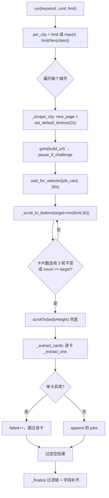
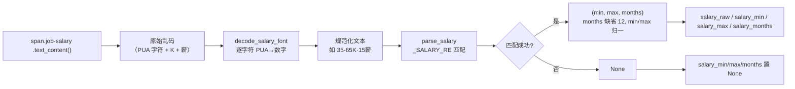

本页聚焦 JobPilot-CN 中 `discovery/boss.py` 承担的两件事：**搜索页列表的结构化采集**（滚动加载 + 单卡字段抽取）与 **薪资的字体反爬解码**（PUA 私有区字符 → 数字）。它解释 Boss 列表页在 2026-09 改版后选择器如何集中管理、多城关键词配额如何平摊，以及被字体混淆的薪资串如何先解码、再用正则还原为结构化的 `(min, max, months)` 三元组。列表页之外的 JD 全文抓取属于另一个阶段，参见 [JD 全文抓取与接口优先/DOM 降级](11-jd-quan-wen-zhua-qu-yu-jie-kou-you-xian-dom-jiang-ji)；服务端筛选参数的取值口径参见 [服务端筛选参数（年限/学历/薪资）](15-fu-wu-duan-shai-xuan-can-shu-nian-xian-xue-li-xin-zi)。

Sources: [boss.py](src/jobpilot/discovery/boss.py#L1-L4)

## 集中式选择器：改版只改一处

Boss 的列表页 DOM 会随平台改版漂移，因此模块把全部选择器收敛到一个 `LOCATORS` 字典，注释明确指出"**选择器集中在 LOCATORS，平台改版只改这里**"。这种设计把"平台改版风险"隔离成单点，其余采集逻辑不再散落硬编码的 CSS 选择器。`LOCATORS` 覆盖六类字段：卡片容器、岗位名链接、薪资、公司名、公司地理位置、标签列表。

Sources: [boss.py](src/jobpilot/discovery/boss.py#L50-L61)

下表对照 2026-09 实测的列表页结构变更，说明为何部分历史选择器已被替换：

| 字段 | 当前选择器 | 变更说明 |
| --- | --- | --- |
| 卡片容器 | `ul.rec-job-list li.job-card-box` | 滚动计数与遍历的基本单位 |
| 岗位名链接 | `a.job-name` | 同时承载 `href`（详情页 URL 来源） |
| 薪资 | `span.job-salary` | 旧文档写的 `span.salary` 已不存在 |
| 公司名 | `span.boss-name` | `span.company-name` 已下线 |
| 公司位置 | `span.company-location` | 以 `·` 拼接城市与区县 |
| 标签列表 | `ul.tag-list li` | 年限/学历/实习标签的载体 |

Sources: [boss.py](src/jobpilot/discovery/boss.py#L50-L61)

## 列表采集流程：多城配额、增量滚动与单卡隔离

采集入口是 `run` 方法，它先解决 **多城配额平摊** 问题。当配置了多个城市时，若沿用"攒够 `limit*2` 就停"的策略，排在列表前面的城市会吃光配额、后面的城市被整体跳过；因此代码改为按城市数平分：`per_city = limit if len(cities) <= 1 else max(4, limit // len(cities))`，保证"五城场景必须每城都有产出"。注意 `len(cities) <= 1` 时直接用完整 `limit`，因为单城不需要平摊，`limit // 1` 也能得到正确结果但语义上保留单城特例更清晰。

Sources: [boss.py](src/jobpilot/discovery/boss.py#L107-L116)

每个城市的采集由 `_scrape_city` 负责，其关键工程决策是 **把单卡定位超时压到 2 秒**：`page.set_default_timeout(2_000)`。原因是若某张卡片缺字段，Playwright 的默认 30 秒自动等待会拖垮整批。流程为：`new_page` → `goto` → `pause_if_challenge` 检测验证页 → `wait_for_selector` 等卡片出现 → `_scroll_to_bottom` 增量滚动 → 计数日志 → `_extract_cards`。整段包在 `try/finally` 中，确保 `page.close()` 必达。

Sources: [boss.py](src/jobpilot/discovery/boss.py#L118-L138)

验证页暂停复用 `discovery/browser.py` 的 `pause_if_challenge` 统一入口，属于 `browser.py` 的单点封装职责，其交互与非 TTY 轮询细节参见 [滑块/验证页人工暂停机制](18-hua-kuai-yan-zheng-ye-ren-gong-zan-ting-ji-zhi)。

Sources: [boss.py](src/jobpilot/discovery/boss.py#L120-L130), [browser.py](src/jobpilot/discovery/browser.py#L123-L145)

滚动加载采用 **增量滚动 + 触底判定** 策略：循环 `max_rounds` 次，每轮 `scrollBy(0, innerHeight * 1.5)` 并随机休眠 `0.8~1.6s`，若卡片数连续 3 轮不变（`stable >= 3`）或已达到目标数（`count >= target`）则提前跳出。目标数被 `min(limit, 30)` 封顶，避免无意义的长滚动。循环结束后再 `scrollTo` 到 `document.body.scrollHeight` 兜底触发懒加载。

Sources: [boss.py](src/jobpilot/discovery/boss.py#L140-L156)

列表采集的完整流程如下：

Sources: [boss.py](src/jobpilot/discovery/boss.py#L107-L169)

`_extract_cards` 实现 **单卡失败隔离**：遍历所有卡片，逐卡 `try/except`，失败仅 `failed += 1` 而不中断整批，最后打印失败比例并过滤掉空结果。这一"单卡失败不拖垮整批"的容错与前面的 2 秒超时互为配套——既压低单卡最坏耗时，又保证个别异常卡被跳过。

Sources: [boss.py](src/jobpilot/discovery/boss.py#L158-L169)

## 薪资字体反爬原理：PUA 私有区字符映射

Boss 对抗采集的核心手段之一是 **字体反爬**：页面把薪资中的数字渲染为 Unicode **私有使用区（PUA, Private Use Area）** 的字符，并在自定义字体里把"某个 PUA 码位"绘制成"某个数字"的字形。这样即使抓到 DOM 文本，拿到的也是一串不可读的乱码字符，而非可直接解析的数字。破解思路就是建立 **PUA 码位 → 阿拉伯数字** 的映射表，在解析前先做一次字符替换。

Sources: [boss.py](src/jobpilot/discovery/boss.py#L45-L48)

映射表 `SALARY_FONT` 用一行推导式同时容纳两个实测段：历史 `get_jobs` 时代的 `U+E8F0`–`U+E8F9`，以及 2026-09 实测的 kanzhun 字体段 `U+E031`–`U+E03A`。两段都是"起始码位 + 偏移 i"对应数字 `i`：

| 字体段 | PUA 码位区间 | 对应数字 | 来源时期 |
| --- | --- | --- | --- |
| 历史段 | `U+E8F0` – `U+E8F9` | `0` – `9` | `get_jobs` 时代 |
| 2026 段 | `U+E031` – `U+E03A` | `0` – `9` | 2026-09 kanzhun 字体 |

Sources: [boss.py](src/jobpilot/discovery/boss.py#L45-L48)

解码函数 `decode_salary_font` 只有一行：逐字符在 `SALARY_FONT` 中查找，命中则替换为数字，未命中（如普通的 `-`、`K`、`薪` 等）原样保留。这种"逐字符替换"设计的健壮性在于：它不假设整串都是 PUA 字符，混合了正常字符的收入单位也能安全通过。

Sources: [boss.py](src/jobpilot/discovery/boss.py#L66-L68)

## 解码 → 解析流水线：从乱码到结构化三元组

解码得到的仍是形如 `25-45K·16薪` 的字符串，需要进一步结构化。正则 `_SALARY_RE = re.compile(r"^(\d+)-(\d+)[Kk](?:·(\d+)薪)?$")` 锚定整串格式：捕获 `下限`、`上限`、可选的 `薪数`（如 `·16薪`），并同时兼容大写 `K` 与小写 `k`。

Sources: [boss.py](src/jobpilot/discovery/boss.py#L63-L63)

`parse_salary` 在正则基础上做了三件事的兜底：其一，**月份默认值**——若无 `·N薪` 后缀，`months` 缺省为 `12`；其二，**倒序兜底**——解码后可能出现 `45-25K` 这类倒序（字体映射错位所致），用 `min/max` 归一；其三，**失败返回 None**——`面议`、`500-800元/天`（日结岗）等非标准格式一律返回 `None`，交由后续字段置空。

Sources: [boss.py](src/jobpilot/discovery/boss.py#L71-L80)

流水线在 `_extract_one` 中串接：`salary_raw = decode_salary_font(_text(LOCATORS["salary"]))`，随后 `parsed = parse_salary(salary_raw)`，最终把结果拆成四个字段写回——`salary_raw`（解码后的原始文本，供展示与二次审计）、`salary_min`、`salary_max`、`salary_months`（解析失败则为 `None`）。

Sources: [boss.py](src/jobpilot/discovery/boss.py#L184-L203)

Sources: [boss.py](src/jobpilot/discovery/boss.py#L184-L203), [boss.py](src/jobpilot/discovery/boss.py#L66-L80)

这四个薪资字段是列表采集阶段直接落库的产出，其后的正则进一步解析由**纯代码过滤链**消费（如薪资中位数低于阈值则拒绝），过滤语义参见 [纯代码过滤链设计](12-chun-dai-ma-guo-lu-lian-she-ji)。这里需强调一个边界：本页只负责把薪资"解码成数字"，**是否由服务端在搜索请求里预先筛选薪资**是另一个层面的配置（`salary` URL 参数），参见 [服务端筛选参数（年限/学历/薪资）](15-fu-wu-duan-shai-xuan-can-shu-nian-xian-xue-li-xin-zi)。

Sources: [base.py](src/jobpilot/discovery/base.py#L113-L119)

## 单卡字段抽取与 `href` 规范化

`_extract_one` 是单张卡片的字段装配器，开头先做 **广告/推荐卡过滤**：若卡片不存在 `a.job-name`（`count() == 0`）或 `href` 里不含 `job_detail`，即判定为非岗位卡并返回 `None`。随后对 URL 做 **规范化主键** 处理——非绝对地址补全 `BOSS_HOME` 前缀，再 `url.split("?")[0]` 去掉安全参数，使之成为稳定、可去重的详情页主键。

Sources: [boss.py](src/jobpilot/discovery/boss.py#L171-L178)

字段装配通过一个内部闭包 `_text(sel)` 统一取值，其对不存在选择器返回空串。标签类字段（年限、学历）从 `tag_list` 中"遍历挑出能被解析的那一条"：`experience_raw` 取第一条能通过 `parse_experience` 的标签，`education_raw` 取第一条能通过 `parse_education` 的标签。注释特别提示实习卡只有 `4天/周` 类标签、无年限标签，此时 `experience_raw` 会为空。

Sources: [boss.py](src/jobpilot/discovery/boss.py#L180-L191)

公司位置按 `·` 拆分为城市与区县两级（`city` / `district`）。值得记录的是三个 HR 字段（`hr_name`、`hr_title`、`hr_active`）被显式写为空串——因为 2026-09 后**列表卡片不再展示 HR 名/头衔/活跃度**，置空而非删除是为了维持下游字段契约的稳定。

Sources: [boss.py](src/jobpilot/discovery/boss.py#L193-L210)

## 反爬字体解码的自动化测试

字体解码与薪资解析有专门的单元测试 `tests/test_salary_parser.py`，覆盖两个关键维度。其一是 **两个 PUA 段各自的解码正确性**：历史段用 `E8F3/E8F5/E8F8/E8F2` 解出 `35-82K·16薪`；2026 段则直接用真实抓包值，`E034/E036/E037/E032` 解出 `35-65K·15薪`，并额外验证日结岗 `500-800元/天` 中混入 PUA 字符仍能解码。

Sources: [test_salary_parser.py](tests/test_salary_parser.py#L6-L19)

其二是 **解析函数的边界行为**：正常格式 `25-45K·16薪 → (25,45,16)`、无薪数后缀 `20-40K → (20,40,12)` 月份缺省、小写 `15-25k` 兼容、倒序 `45-25K → (25,45,12)` 归一，以及非法输入 `面议` / 空串 / `500-800元/天` 一律返回 `None`。这些用例把上文提到的每一项兜底行为都固定成可回归的契约。

Sources: [test_salary_parser.py](tests/test_salary_parser.py#L22-L36)

## 与整体架构的衔接

Boss discoverer 通过 `browser.py` 暴露的 `BrowserSession.context` 拿到浏览器上下文，自身只持有 `context`/`page`，不直接依赖 Playwright——这正是 [Playwright 浏览器单点封装与反检测](8-playwright-liu-lan-qi-dan-dian-feng-zhuang-yu-fan-jian-ce) 所述的"唯一出口"约束。其产出经 `db.upsert_job` 落库，随后由列级状态机驱动进入下一阶段（enrich）。平台调度与阶段编排的契约参见 [模块边界与阶段编排契约](7-mo-kuai-bian-jie-yu-jie-duan-bian-pai-qi-yue)，落库的表结构与字段语义参见 [SQLite 单表数据总线与表结构](6-sqlite-dan-biao-shu-ju-zong-xian-yu-biao-jie-gou)。

Sources: [pipeline.py](src/jobpilot/pipeline.py#L46-L70), [browser.py](src/jobpilot/discovery/browser.py#L1-L5)

采集 URL 的构造由 `build_url` 负责，把 `query`、`city` 以及可选的 `salary`、`experience`、`degree` 参数拼接到 `/web/geek/jobs`。其中城市代码通过 `CITY_CODES` 或配置中的 `city_codes` 覆盖，`experience`/`degree` 也各自映射为服务端代号，取值越界会 `raise ValueError`。这些服务端参数的完整取值口径不在本页展开，参见 [服务端筛选参数（年限/学历/薪资）](15-fu-wu-duan-shai-xuan-can-shu-nian-xian-xue-li-xin-zi) 与 [城市代码映射与多城配额分配](16-cheng-shi-dai-ma-ying-she-yu-duo-cheng-pei-e-fen-pei)。

Sources: [boss.py](src/jobpilot/discovery/boss.py#L86-L105), [boss.py](src/jobpilot/discovery/boss.py#L19-L43)

建议的延伸阅读顺序：先看 [Playwright 浏览器单点封装与反检测](8-playwright-liu-lan-qi-dan-dian-feng-zhuang-yu-fan-jian-ce) 理解 `context` 从何而来，再看 [猎聘 XHR 拦截与城市纠偏](10-xi-pin-xhr-lan-jie-yu-cheng-shi-jiu-pian) 对比另一平台的采集范式，最后进入 [JD 全文抓取与接口优先/DOM 降级](11-jd-quan-wen-zhua-qu-yu-jie-kou-you-xian-dom-jiang-ji) 了解列表采集之后的下一阶段。