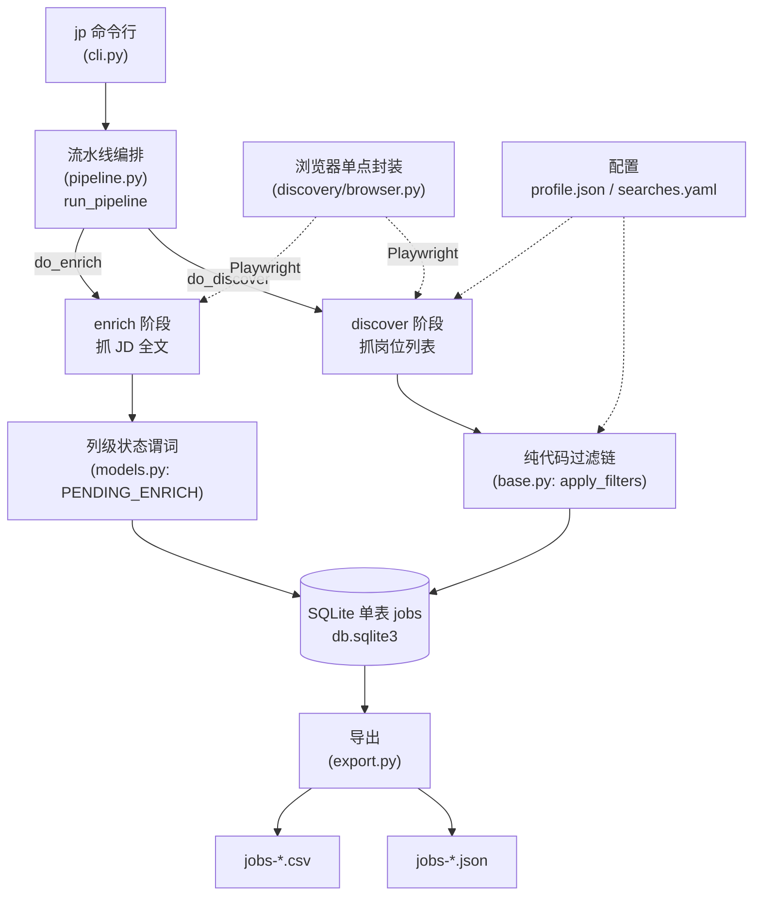

本页帮助初次接触 **JobScrape-CN** 的开发者快速建立全局认知：它是什么、不做什么、解决什么问题，以及内部由哪些核心模块构成。本页只做定位与价值判断，不展开各阶段实现细节——具体机制会在后续章节逐一深入。

Sources: [README.md](../../../../README.md#L1-L4), [pyproject.toml](../../../../pyproject.toml#L1-L6)

## 一句话定位

**JobScrape-CN 是一个面向国内招聘平台（Boss 直聘 / 猎聘）的「岗位列表 + JD 全文」抓取器**：把平台上的岗位卡片采集下来，再把每条岗位的职位描述（Job Description，下文简称 JD）正文抓全，最后导出为 JSON / CSV 供人工查看或下游分析。项目以 `job-scrape-cn` 为包名，对外暴露一个命令行工具 `jp`。

Sources: [README.md](../../../../README.md#L1-L3), [pyproject.toml](../../../../pyproject.toml#L1-L6), [src/jobscrape/cli.py](../../../../src/jobscrape/cli.py#L14)

关键的是它的**边界**：该项目**只做数据采集**，不含任何 AI 分析、打分、打招呼语、简历定制逻辑，**也不需要任何 LLM API Key**。这既是设计取舍，也是使用前提——它替代的是「手动翻几十页招聘网站、逐条复制 JD」的重复劳动，而把「分析岗位、决定投递」留给人或下游工具。项目在开源项目 [job-pilot-cn](https://github.com/GriffithLin/job-pilot-cn) 基础上复用代码改造而成，并保留了署名声明。

Sources: [README.md](../../../../README.md#L1-L4), [CHANGELOG.md](../../../../CHANGELOG.md#L8-L11), [ATTRIBUTION.md](../../../../ATTRIBUTION.md#L1-L7)

## 核心价值：四个设计支柱

对初学者而言，理解这个项目最有效的方式是抓住它的四个核心设计支柱。它们共同回答了一个问题：**为什么采集招聘数据这件事，值得用一套专门的架构来做？**

| 设计支柱 | 解决的问题 | 关键实现 |
| --- | --- | --- |
| **两阶段流水线** | 列表页字段少、详情页字段全，需要分两步采集 | `discover`（抓列表）→ `enrich`（抓 JD 全文），由 `run_pipeline` 统一编排 |
| **SQLite 单表数据总线** | 阶段之间如何传递数据、如何避免重复 | 一张 `jobs` 表，主键为岗位 URL，跨阶段只通过该表交互 |
| **列级状态机（幂等续传）** | 抓取中途崩溃/中断后，如何不重头再来 | 「某阶段完成 = 该阶段负责的列非 NULL」，重跑自动续传，无需断点文件 |
| **纯代码过滤链** | 如何在采集阶段就剔除不相关岗位，且规则可审计 | 标题黑名单 / 日结岗 / HR 不活跃 / 公司黑名单 / 薪资 / 年限 / 学历，全部基于本地配置的确定性规则 |

Sources: [src/jobscrape/pipeline.py](../../../../src/jobscrape/pipeline.py#L1-L4), [src/jobscrape/db.py](../../../../src/jobscrape/db.py#L1-L5), [src/jobscrape/models.py](../../../../src/jobscrape/models.py#L1-L4), [src/jobscrape/discovery/base.py](../../../../src/jobscrape/discovery/base.py#L89-L93)

### 支柱一：两阶段流水线

采集被拆成两个语义清晰的阶段。**`discover`** 阶段打开搜索页，按「关键词 × 城市」的组合滚动或翻页，解析出岗位卡片上的基础字段（标题、公司、城市、薪资、年限、学历、HR 信息等）。**`enrich`** 阶段则逐条打开已入库岗位的详情页，把 JD 正文（`full_description`）抓取下来。两个阶段共享同一个浏览器会话，登录态只校验一次，但通过 `RunOptions` 的 `do_discover` / `do_enrich` 开关可以独立执行任意一个。

Sources: [src/jobscrape/pipeline.py](../../../../src/jobscrape/pipeline.py#L13-L18), [src/jobscrape/pipeline.py](../../../../src/jobscrape/pipeline.py#L46-L78)

### 支柱二：SQLite 单表数据总线

所有阶段的数据流动都汇聚到一张 SQLite 表 `jobs` 上。表结构被显式划分为三块注释区：`discover`（列表页字段）、`enrich`（JD 全文相关）、过滤（`reject_reason` / `rejected_at`）。这样做的结果是**阶段之间零直接调用**——`discover` 只负责写入 discover 列，`enrich` 只负责补齐 enrich 列，二者通过数据库解耦。入库采用 `INSERT` + 主键冲突跳过策略，由于主键是岗位 URL，因此**天然去重、不会覆盖已有行**。

Sources: [src/jobscrape/db.py](../../../../src/jobscrape/db.py#L14-L51), [src/jobscrape/db.py](../../../../src/jobscrape/db.py#L86-L99), [CHANGELOG.md](../../../../CHANGELOG.md#L52-L53)

### 支柱三：列级状态机与幂等续传

这是整个项目最有辨识度的设计。**「某阶段是否完成」不由外部标志位记录，而由该阶段负责的列是否为 NULL 决定**。例如「待抓 JD」的谓词是「已发现（`discovered_at` 非空）且未抓（`detail_scraped_at` 为空）且未被过滤（`reject_reason` 为空）」。由此，任何阶段崩溃后重跑 `jp run`，程序只会处理那些「尚未完成」的行，天然实现**幂等续传**，无需维护任何断点文件。这些谓词集中在 `models.py` 中统一维护，被各阶段与 `status` 计数板复用。

Sources: [src/jobscrape/models.py](../../../../src/jobscrape/models.py#L15-L23), [src/jobscrape/enrichment/detail.py](../../../../src/jobscrape/enrichment/detail.py#L38-L43), [CHANGELOG.md](../../../../CHANGELOG.md#L51)

### 支柱四：纯代码过滤链

采集到的岗位不会无条件入库，而是会先经过一条**确定性、可审计**的过滤链。过滤顺序为：标题黑名单 → 日结岗 → HR 不活跃 → 公司黑名单 → 薪资下限 → 年限区间 → 学历白名单。规则全部写在运行时的 `profile.json` 里，不依赖任何模型，因此**每一次判定都能在配置中找到依据**。被判淘汰的岗位仍会入库，并在 `reject_reason` 列记录原因（默认不导出，可用 `--include-rejected` 查看），保留了「翻案」的空间。

Sources: [src/jobscrape/discovery/base.py](../../../../src/jobscrape/discovery/base.py#L89-L155), [src/jobscrape/config.py](../../../../src/jobscrape/config.py#L14-L31)

## 架构总览

下图展示从命令行到数据的完整流转路径。可以看到，所有数据最终沉淀在 SQLite `jobs` 表中，命令行只是驱动不同阶段的入口。



Sources: [src/jobscrape/cli.py](../../../../src/jobscrape/cli.py#L106-L168), [src/jobscrape/pipeline.py](../../../../src/jobscrape/pipeline.py#L27-L78), [src/jobscrape/export.py](../../../../src/jobscrape/export.py#L48-L69)

## 项目结构速览

代码组织严格遵循「一个模块一类职责」，这也是初学者理解代码时应遵循的阅读顺序：

```
src/jobscrape/
├── cli.py            # Typer 命令行入口（init/status/login/discover/enrich/run/export）
├── config.py         # 运行时目录、profile / searches 配置加载与初始化
├── db.py             # SQLite 单表 + upsert/查询辅助（数据总线）
├── models.py         # 列级状态谓词（阶段衔接契约）
├── pipeline.py       # discover → enrich 编排
├── export.py         # JSON / CSV 导出
├── discovery/        # browser.py（Playwright 唯一出口）+ base.py + boss.py + liepin.py
├── enrichment/       # detail.py：JD 全文抓取
└── searches.example.yaml  # 搜索配置模板（jp init 复制到运行时目录）
tests/                # pytest：薪资解析 / 过滤规则 / 导出 / 城市 / 学历 / 年限
```

Sources: [README.md](../../../../README.md#L203-L217)

其中需要特别记住的一条**架构铁律**：Playwright 只在 `discovery/browser.py` 一个出口封装，各平台的选择器则集中在各自模块顶部的 `LOCATORS` 常量区。这意味着当招聘平台改版时，通常只需修改选择器常量，其余代码无需改动。

Sources: [README.md](../../../../README.md#L220-L222), [CHANGELOG.md](../../../../CHANGELOG.md#L56)

## 技术栈与运行环境

项目是一个使用 `hatchling` 构建、通过 `uv`（或 `pip`）安装的 Python 包，要求 **Python 3.11+**。依赖极简，只有四个运行时库：

| 依赖 | 作用 |
| --- | --- |
| `typer` | 构建 `jp` 命令行子命令体系 |
| `rich` | 终端表格与彩色输出（如 `jp status` 计数板） |
| `pyyaml` | 解析 `searches.yaml` 搜索配置 |
| `playwright` | 驱动 Chromium 浏览器完成页面采集 |

需要强调的是：**浏览器底座（Chromium）必须单独安装**，否则 `jp discover / enrich / run` 会报 `Executable doesn't exist`。

Sources: [pyproject.toml](../../../../pyproject.toml#L1-L16), [README.md](../../../../README.md#L1-L3), [README.md](../../../../README.md#L40-L46)

## 命令行能力一览

项目对外的全部能力都收束在七个 `jp` 子命令中，它们本质上是同一套流水线的不同入口：

| 命令 | 作用 |
| --- | --- |
| `jp init [--force]` | 建库并生成 `profile.json` / `searches.yaml` 模板 |
| `jp login boss\|liepin` | 打开浏览器扫码登录，关闭窗口即保存登录态 |
| `jp discover` | 只抓岗位列表入库 |
| `jp enrich` | 只给已入库岗位补抓 JD 全文 |
| `jp run` | discover + enrich，一条命令跑完（幂等，可重复跑） |
| `jp export [--fmt json\|csv\|all]` | 导出数据 |
| `jp status` | 计数板：总岗位 / 已有 JD / 待抓 JD / 抓 JD 失败 / 已过滤 |

Sources: [README.md](../../../../README.md#L67-L81), [src/jobscrape/cli.py](../../../../src/jobscrape/cli.py#L26-L52)

## 使用边界与合规提示

项目的定位决定了它的使用范围。它**仅供学习研究与个人求职使用**，不用于任何商业用途，且应保持低频使用（建议每日不超过一次、每平台 20-40 岗），避免对目标平台造成负担。使用者需自行遵守目标平台的用户协议，并承担相应风险与责任。

Sources: [README.md](../../../../README.md#L230-L235)

## 建议的阅读路径

如果你是从零开始的初学者，建议按以下顺序建立认知，每一步都建立在前一步之上：

1. **先跑起来**：[快速开始：从安装到首次导出](2-kuai-su-kai-shi-cong-an-zhuang-dao-shou-ci-dao-chu) 与 [安装与环境准备](3-an-zhuang-yu-huan-jing-zhun-bei) 会带你完成从安装到第一份导出的完整流程。
2. **掌握操作面**：了解 [命令行命令体系](4-ming-ling-xing-ming-ling-ti-xi) 与两份核心配置——[搜索任务配置：关键词与城市](5-sou-suo-ren-wu-pei-zhi-guan-jian-ci-yu-cheng-shi)、[过滤偏好配置](6-guo-lu-pian-hao-pei-zhi)。
3. **理解骨架**：进入「深入探索」的 [两阶段流水线的编排与幂等续传](7-liang-jie-duan-liu-shui-xian-de-bian-pai-yu-mi-deng-xu-chuan) 与 [列级状态机：阶段契约与续传语义](8-lie-ji-zhuang-tai-ji-jie-duan-qi-yue-yu-xu-chuan-yu-yi)，这是理解本项目设计思想的关键。
4. **按需下钻**：之后可按照目录中各专题（采集器、反爬、过滤规则、JD 抓取、导出、测试）选择你关心的模块深入。