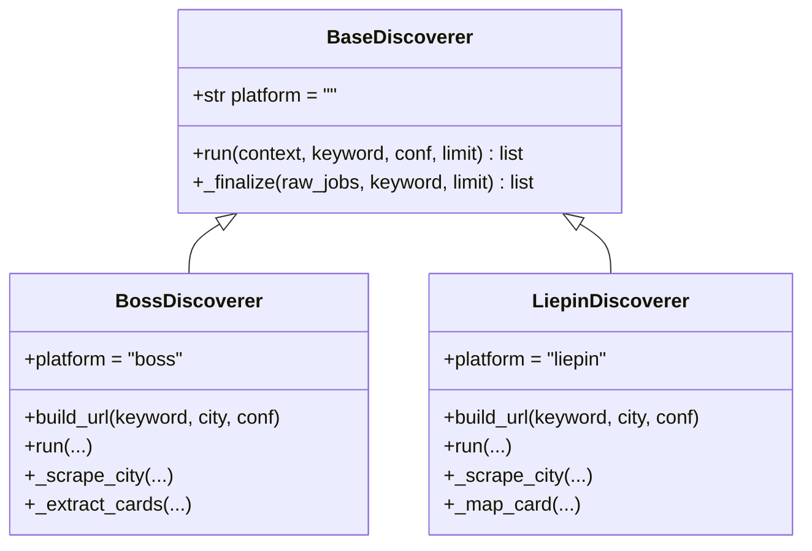
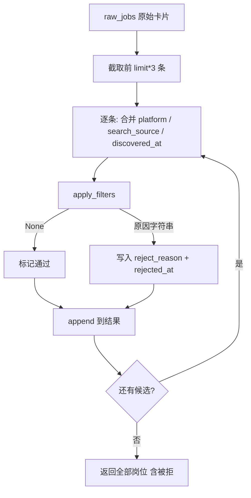
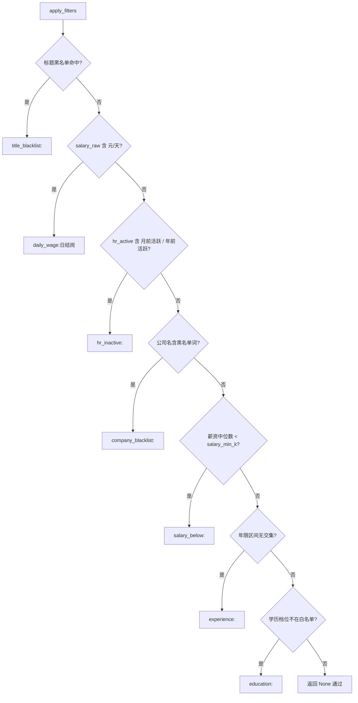

`BaseDiscoverer` 与 `apply_filters` 是岗位列表采集阶段的骨架：子类（Boss / 猎聘）只需负责“把列表页的原始卡片抽成字典”，而字段补齐、去噪淘汰、淘汰原因标注这三件事全部收敛到一处共享的**纯代码过滤链**。本页聚焦这条链的**编排结构**与**基类契约**——它不调用任何模型、规则完全可审计，且被淘汰的岗位会被**保留而非丢弃**（供报告尾翻案）。关于年限、学历两步各自的解析算法，另见 [年限过滤：解析与左开右闭区间匹配](15-nian-xian-guo-lu-jie-xi-yu-zuo-kai-you-bi-qu-jian-pi-pei) 与 [学历过滤：档位归一与白名单](16-xue-li-guo-lu-dang-wei-gui-yu-bai-ming-dan)。

Sources: [base.py](../../../../src/jobscrape/discovery/base.py#L1-L9)

## 设计原则：可审计的纯代码过滤

模块开篇即声明其设计约束——**“不调用任何模型，规则可审计”**。过滤决策完全由 `profile.json` 中的 `preferences` 驱动，而模板顶部也用注释强调“只有 preferences 生效，规则见 `discovery/base.py` 的 `apply_filters`”。这意味着：给定同一份岗位字典与同一份 profile，淘汰与否是可复现、可单元测试、可人工追溯的。

```
DEFAULT_PROFILE = {
    "preferences": {
        "title_blacklist": ["外包", "驻场", "实习"],  # 标题命中任一正则即过滤
        "company_blacklist": [],                       # 公司名包含任一词即过滤
        "salary_min_k": None,                          # 薪资下限（K/月），null = 不过滤
        "experience": None,                            # 年限区间，null = 不过滤
        "education": None,                             # 学历白名单，null = 不过滤
    },
}
```

每条规则一旦命中，都会生成一个**人类可读的淘汰原因字符串**（如 `salary_below:22K < 25K`），并连同时间戳写入 `reject_reason` / `rejected_at` 两列。这一“保留被拒岗”的选择有明确目的：被过滤不等于被删除，它们仍会入库，只是不进入后续的 JD 全文抓取阶段，从而在报告尾部保留翻案余地。关于淘汰列如何参与阶段状态机与计数板，见 [列级状态机：阶段契约与续传语义](8-lie-ji-zhuang-tai-ji-jie-duan-qi-yue-yu-xu-chuan-yu-yi)。

Sources: [base.py](../../../../src/jobscrape/discovery/base.py#L1-L1), [config.py](../../../../src/jobscrape/config.py#L14-L31), [db.py](../../../../src/jobscrape/db.py#L44-L47)

## BaseDiscoverer：两个方法的契约

基类本身极薄，只定义一个类属性和两个方法。`platform` 是子类必须覆盖的标识（用于写回 `jobs.platform` 列）；`run` 是子类实现的抽象入口；`_finalize` 是**共享**的收尾器——子类抽完卡片后统一交给它，避免每个平台各写一份过滤逻辑。



| 成员 | 归属 | 职责 |
|---|---|---|
| `platform` | 基类属性，子类覆盖 | 标识平台，写入每行的 `platform` 列 |
| `run(context, keyword, conf, limit)` | 子类实现 | 打开页面、抓取原始卡片，最后调用 `_finalize` |
| `_finalize(raw_jobs, keyword, limit)` | 基类共享 | 过滤链 + 公共字段补齐 + 淘汰标注 |

`run` 在基类中直接 `raise NotImplementedError`，强制子类提供平台特定的抓取实现；这也是子类之间唯一真正分化之处。子类按“先收集候选、再交给基类收尾”的模式工作，从而保证两平台的过滤语义完全一致。

Sources: [base.py](../../../../src/jobscrape/discovery/base.py#L158-L163), [boss.py](../../../../src/jobscrape/discovery/boss.py#L83-L116), [liepin.py](../../../../src/jobscrape/discovery/liepin.py#L38-L84)

## _finalize：过滤链入口与公共字段补齐

`_finalize` 是整条链的编排中心。它先加载 profile，再对原始岗位列表**超量取材**（`raw_jobs[:limit * 3]`，因为过滤会淘汰一部分，多取以备补足配额），逐条执行三步：

1. **补齐公共字段**：用 `{**j, "platform": self.platform, "search_source": keyword}` 合并出最终行，`discovered_at` 用 `setdefault` 兜底（子类若已填则尊重其值）。
2. **执行过滤链**：调用 `apply_filters(job, profile)`；返回非空原因时，写入 `reject_reason` 与 `rejected_at`。
3. **收集结果**：无论通过与否都 append 进结果列表并返回。

值得留意的是第 3 步的实现细节——代码中有一段 `if len([x for x in jobs if not x.get("reject_reason")]) >= limit:` 判断，但其分支体只是一句 `pass`（空操作），并未 `break`。注释表达的意图是“通过过滤的够数即停，被拒岗继续收集”，但实际行为是**不提前终止**：`limit * 3` 窗口内的所有岗位（通过的和被拒的）都会被收集并返回。因此返回列表的长度可能超过调用方传入的 `limit`——被拒岗被刻意保留，供报告尾翻案。



Sources: [base.py](../../../../src/jobscrape/discovery/base.py#L165-L181)

## 七级过滤链：apply_filters 的顺序与淘汰语义

`apply_filters` 返回 `reject_reason`（`None` 表示通过），并严格按固定顺序执行七级检查。顺序本身是一种成本优化——廉价且高命中的规则（正则、子串、字符串包含）排在前面，一旦命中即**短路返回**，不再跑后续更重的区间运算。每级检查都以 `前缀:明细` 的格式返回原因，便于报告与排查。



| 顺序 | 步骤 | 触发条件 | 原因前缀 |
|---|---|---|---|
| 1 | 标题黑名单 | 标题命中任一正则（`re.search`） | `title_blacklist:` |
| 2 | 日结岗 | `salary_raw` 含 `元/天` | `daily_wage:` |
| 3 | HR 不活跃 | `hr_active` 含 `月前活跃` / `年前活跃` | `hr_inactive:` |
| 4 | 公司黑名单 | 公司名（小写）包含黑名单词（小写） | `company_blacklist:` |
| 5 | 薪资下限 | 折算中位数 < `salary_min_k` | `salary_below:` |
| 6 | 年限 | 岗位要求区间与可接受区间无交集 | `experience:` |
| 7 | 学历 | 岗位要求档位不在白名单内 | `education:` |

其中薪资下限的判定口径为 **`median = (salary_min + salary_max) / 2 * months / 12`**，`months` 缺省按 12 处理——即把年终奖（如 `16薪`）折算进月均，再与 `salary_min_k` 比较。标题黑名单用正则、公司黑名单用子串包含（均做了大小写归一），两者语义不同：前者灵活可写复杂模式，后者只做简单命中。

Sources: [base.py](../../../../src/jobscrape/discovery/base.py#L89-L155), [config.py](../../../../src/jobscrape/config.py#L16-L31)

## 年限与学历两步：区间求交与白名单

链中的第 6、7 步在结构上有共同点：**“配置缺失即整体不启用”**，且**“解析不出就放过（不误杀）”**——实习卡只有 `4天/周`、`6个月` 这类标签时，年限与学历解析均返回 `None`，过滤器选择跳过而非淘汰。

这两步的差异在于淘汰语义：**年限是“区间求交”**（岗位要求区间与 `[min_years, max_years]` 有交集才留），**学历是“白名单”**（岗位要求档位必须在 `allowed` 列表内才留）。此外，二者都支持 `allow_unlimited` 开关：当为 `false` 时，“经验不限” / “学历不限”这类岗位也会被淘汰；反之默认保留。

`apply_filters` 通过 `is_unlimited_experience(raw)` 单独识别“不限”岗位，因为解析出的 `(0, 99)` 会与任何可接受区间都有交集，无法用求交逻辑区分“真不限”与“恰好重叠”。关于年限正则的完整覆盖（`3-5年` / `5年以上` / `1年以内` / `在校/应届`）与**左开右闭区间匹配**的数学推导，见 [年限过滤：解析与左开右闭区间匹配](15-nian-xian-guo-lu-jie-xi-yu-zuo-kai-you-bi-qu-jian-pi-pei)；关于学历档位归一（`统招本科`→`本科`、`本科及以上`→`本科`）与白名单比对，见 [学历过滤：档位归一与白名单](16-xue-li-guo-lu-dang-wei-gui-yu-bai-ming-dan)。

Sources: [base.py](../../../../src/jobscrape/discovery/base.py#L48-L49), [base.py](../../../../src/jobscrape/discovery/base.py#L121-L153)

## 子类的接入方式：共享 _finalize，各自准备候选集

两个子类的 `run` 结构高度对称：都是“多城市循环 → 每城抓取 → 汇总原始列表 → `_finalize` 收尾”。真正的差异在进入过滤链**之前**如何准备候选集。

| 维度 | `BossDiscoverer` | `LiepinDiscoverer` |
|---|---|---|
| 抓取手段 | 滚动加载 + DOM 提取 | XHR 拦截 JSON + AntD 分页 |
| 多城配额 | `per_city = limit` 或 `max(4, limit // len(cities))` | 同左（平摊，避免前排城市吃光配额） |
| 收尾前处理 | 无，直接 `_finalize(raw, ...)` | 先按 `url` / 标题去重，再 `_finalize` |
| 平台特有过滤 | 无额外 | 城市兜底：`dq` 混入外地推荐卡时按配置城市再挡一层 |

两者都复用基类唯一的 `_finalize`，因此无论列表页结构如何不同，最终写库的字段集与过滤语义完全一致。这种“平台差异下沉到候选集准备、过滤语义上提到基类”的分工，正是“采集器基类”存在的价值。抓取层的实现细节分别见 [Boss 直聘采集：滚动加载与薪资字体反爬](11-boss-zhi-pin-cai-ji-gun-dong-jia-zai-yu-xin-zi-zi-ti-fan-pa) 与 [猎聘采集：XHR 拦截与分页翻页](12-xi-pin-cai-ji-xhr-lan-jie-yu-fen-ye-fan-ye)。

Sources: [boss.py](../../../../src/jobscrape/discovery/boss.py#L107-L116), [liepin.py](../../../../src/jobscrape/discovery/liepin.py#L59-L84), [liepin.py](../../../../src/jobscrape/discovery/liepin.py#L157-L159)

## 过滤结果的去向：保留、跳过与翻案

过滤链的产出（`reject_reason` 非空的行）并不会消失，而是作为**一等公民**持久化到 `jobs` 表，并在下游各处被显式区分：

- **跳过富化**：待抓 JD 的谓词 `PENDING_ENRICH` 携带 `AND reject_reason IS NULL`，被拒岗不会进入 JD 全文抓取，避免浪费配额。
- **计数可见**：`jp status` 的“已过滤”一项即 `COUNT(*) WHERE reject_reason IS NOT NULL`。
- **默认隐藏、可选导出**：`jp export` 默认 `WHERE reject_reason IS NULL`，但 `--include-rejected` 可一并导出，用于人工复核与翻案。

由此，纯代码过滤链形成了一条闭环：**规则可审计 → 原因可追溯 → 决策可撤销**。若想理解这套状态机如何保证“任何阶段崩溃后重跑即续传”，请继续阅读 [两阶段流水线的编排与幂等续传](7-liang-jie-duan-liu-shui-xian-de-bian-pai-yu-mi-deng-xu-chuan)；若想了解列表阶段之后的 JD 全文抓取链路，可前往 [JD 全文抓取：接口拦截与 DOM 降级](17-jd-quan-wen-zhua-qu-jie-kou-lan-jie-yu-dom-jiang-ji)。