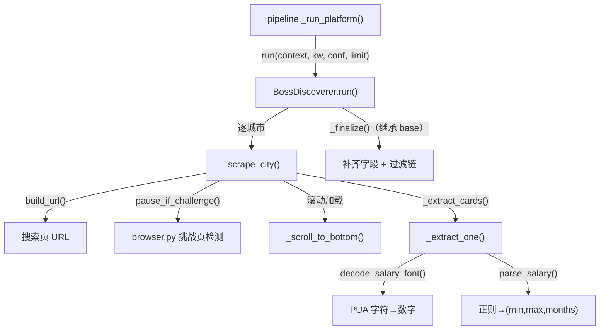
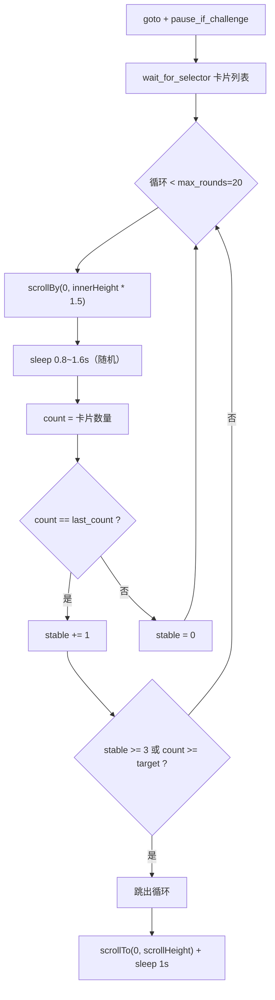

本页剖析 `BossDiscoverer`（`src/jobscrape/discovery/boss.py`）——Boss 直聘岗位列表的采集器实现。它承担两项在流水线中相对独特的职责：一是面对**无限滚动**的搜索结果页，通过增量滚动触发懒加载并判定触底；二是面对**薪资字体反爬**，将出现在 DOM 中的私有区（PUA）字体字符还原为真实数字。除此之外，采集器还统一处理搜索 URL 构造、多城配额分配与卡片字段提取。本页只覆盖列表采集层；浏览器会话、登录态与人工暂停的底层机制见 [浏览器会话封装与登录态持久化](13-liu-lan-qi-hui-hua-feng-zhuang-yu-deng-lu-tai-chi-jiu-hua) 与 [反检测注入与验证页人工暂停](14-fan-jian-ce-zhu-ru-yu-yan-zheng-ye-ren-gong-zan-ting)，过滤链语义见 [采集器基类与纯代码过滤链](10-cai-ji-qi-ji-lei-yu-chun-dai-ma-guo-lu-lian)，详情页 JD 抓取见 [JD 全文抓取：接口拦截与 DOM 降级](17-jd-quan-wen-zhua-qu-jie-kou-lan-jie-yu-dom-jiang-ji)。

## 模块定位与调用契约

`BossDiscoverer` 继承自 `BaseDiscoverer`，只声明 `platform = "boss"` 并重写 `build_url()` 与 `run()` 两个方法；`_finalize()` 复用基类，负责在采集结束后补齐 `platform` / `search_source` 字段并运行纯代码过滤链。流水线侧并不直接构造采集器，而是在 `_run_platform()` 中通过 `BossDiscoverer() if platform == "boss" else ...` 惰性选择实现，并把同一个 `BrowserSession.context` 复用于后续的 enrich 阶段。这一「单平台单实例 + 共享 context」的编排意味着采集器本身不负责浏览器生命周期，只需消费传入的 `context`。

Sources: [boss.py](../../../../src/jobscrape/discovery/boss.py#L83-L84), [boss.py](../../../../src/jobscrape/discovery/boss.py#L107-L116), [base.py](../../../../src/jobscrape/discovery/base.py#L158-L163), [pipeline.py](../../../../src/jobscrape/pipeline.py#L57-L66)

下图给出 `BossDiscoverer` 的内部调用关系：`run()` 按城市拆分为多次 `_scrape_city()`，每次内部完成 URL 构造、挑战页暂停、滚动加载与卡片提取，最终回到基类 `_finalize()` 收口。

## 搜索 URL 构造与服务端筛选

`build_url()` 是采集入口的第一跳，把中文关键词、城市与可选的薪资/年限/学历参数拼成 Boss 的搜索页地址 `https://www.zhipin.com/web/geek/jobs?...`。城市先查配置覆盖 `conf["city_codes"]`，再回落模块级 `CITY_CODES`，最终缺省为北京 `101010100`；关键词经 `quote()` 编码后作为 `query`。所有可选参数均采用「存在才拼接」的写法，因此不配即为不限。

| 参数 | 来源 | 取值 → 编码 | 非法值行为 |
| --- | --- | --- | --- |
| `query` | `keyword` | URL 编码后的关键词 | — |
| `city` | `conf.city_codes` / `CITY_CODES` | 如 北京 `101010100` | 回落 `101010100` |
| `salary` | `conf.boss_salary` | 直接透传（如 `402` 表示 20-30K） | 不校验 |
| `experience` | `conf.experience` | `EXPERIENCE_CODES`：`1年以下/1年以内`→103、`1-3年`→104、`3-5年`→105、`5-10年`→106、`10年以上`→107 | 抛 `ValueError` |
| `degree` | `conf.education` | `DEGREE_CODES`：`高中`→206、`大专`→202、`本科`→203、`硕士`→204、`博士`→205 | 抛 `ValueError` |

`experience` 与 `education` 的代码表在 2026-09 逐档实测（每档 15 张卡全中），并对非法值直接抛错而非静默忽略——这是刻意的「早失败」设计，避免用户以为筛选生效而实际没有。这些平台参数的完整映射与跨平台差异见 [平台城市代码与筛选参数映射](22-ping-tai-cheng-shi-dai-ma-yu-shai-xuan-can-shu-ying-she)。

Sources: [boss.py](../../../../src/jobscrape/discovery/boss.py#L16-L24), [boss.py](../../../../src/jobscrape/discovery/boss.py#L26-L43), [boss.py](../../../../src/jobscrape/discovery/boss.py#L86-L105)

## 多城配额分配

`run()` 的关键策略是**多城平分配额**。若直接沿用「攒够 `limit*2` 就停」的旧逻辑，排在前面的城市会吃光全部配额，导致后续城市被整体跳过。为此 `run()` 计算 `per_city = limit if len(cities) <= 1 else max(4, limit // len(cities))`：单城时直接用 `limit`，多城时按城市数均分，并以 `max(4, ...)` 保证每个城市至少有 4 个名额。随后逐城调用 `_scrape_city()` 并把结果汇入 `raw`，最终交给基类 `_finalize(raw, keyword, limit)` 统一裁剪与过滤。

Sources: [boss.py](../../../../src/jobscrape/discovery/boss.py#L107-L116)

## 页面生命周期与滚动加载

`_scrape_city()` 为每个城市新建一个页面（`context.new_page()`），并将默认超时压到 `2_000` 毫秒——若沿用 Playwright 默认的 30 秒，任一字段缺失的选择器都会把整批拖垮。导航使用 `wait_until="domcontentloaded"` 且超时放宽到 60 秒，随后立即调用 `pause_if_challenge()` 处理可能出现的滑块/登录页，再 `wait_for_selector()` 等待卡片列表出现，最后进入滚动加载。整个过程包裹在 `try/finally` 中，保证无论成败都关闭页面。

Sources: [boss.py](../../../../src/jobscrape/discovery/boss.py#L118-L138), [browser.py](../../../../src/jobscrape/discovery/browser.py#L123-L145)

`_scroll_to_bottom()` 实现**增量滚动 + 稳定判定**的触底逻辑，这是应对无限滚动的核心。它最多循环 `max_rounds = 20` 轮，每轮 `scrollBy(0, innerHeight * 1.5)` 向下滚动一屏半，随机 `sleep(0.8~1.6s)` 模拟人类节奏，然后统计当前卡片数。当卡片数连续 3 轮不变（`stable >= 3`）或已达到目标数量（`count >= target`）时判定触底并跳出；一旦卡片数发生变化则重置 `stable`。跳转后附加一次 `scrollTo(0, scrollHeight)` 并暂停 1 秒，触发最后一屏内容的渲染。`_scrape_city()` 传入的目标为 `min(limit, 30)`，即单城滚动上限 30 张卡。

Sources: [boss.py](../../../../src/jobscrape/discovery/boss.py#L133), [boss.py](../../../../src/jobscrape/discovery/boss.py#L140-L156)

## 薪资字体反爬：PUA 字符解码

Boss 直聘对薪资数字启用**字体反爬**：页面文本里出现的并非普通数字，而是被映射到 Unicode 私有使用区（PUA）的字符，浏览器渲染时通过自定义字体把它们显示成数字，但直接读取 DOM 文本只能拿到 PUA 码点。`boss.py` 用一张映射表 `SALARY_FONT` 完成逆映射：为旧版 `get_jobs` 时代的 `U+E8F0–U+E8F9` 段建立 `chr(0xE8F0 + i) → str(i)` 的字典，再合并 2026-09 实测到的 `kanzhun` 字体段 `U+E031–U+E03A`。两段都覆盖 0–9 十个数字，一次 `.update()` 叠加，兼顾历史与现行口径。

| PUA 段 | 来源 | 映射 | 保留原因 |
| --- | --- | --- | --- |
| `U+E8F0`–`U+E8F9` | `get_jobs` 时代 | `chr(0xE8F0+i) → i` | 新旧站点并存，历史数据可解析 |
| `U+E031`–`U+E03A` | 2026-09 实测（kanzhun 字体） | `chr(0xE031+i) → i` | 当前生效口径 |

`decode_salary_font()` 逐字符查表，命中即替换为数字，未命中的字符（如 `K`、`-`、`·`、`薪`、`元/天`）原样保留，因此解码是「只动数字、不动结构」的保守变换。

Sources: [boss.py](../../../../src/jobscrape/discovery/boss.py#L45-L48), [boss.py](../../../../src/jobscrape/discovery/boss.py#L66-L68), [test_salary_parser.py](../../../../tests/test_salary_parser.py#L6-L19)

单测用真实抓包的码点构造样本验证了该映射：`E8F3 E8F5 - E8F8 E8F2 K·16薪` 解码为 `35-82K·16薪`；2026 段的 `E034 E036 - E037 E036 K·E032 E036薪` 解码为 `35-65K·15薪`，日结岗的 `E036 E031 E031 - E039 E031 E031元/天` 解码为 `500-800元/天`——说明解码本身对日结薪资同样有效，只是后续解析会另行处理。

Sources: [test_salary_parser.py](../../../../tests/test_salary_parser.py#L6-L19)

## 薪资文本解析

解码后的字符串由 `parse_salary()` 用正则 `^(\d+)-(\d+)[Kk](?:·(\d+)薪)?$` 解析为 `(月薪下限, 月薪上限, 年薪月数)`三元组：`[Kk]` 兼容大小写，`·N薪` 为可选组，缺失时月数默认 `12`。为防反爬字体解码顺序错乱导致低价在前，返回值统一用 `min(lo, hi), max(lo, hi)` 兜底排序。

| 输入 | 输出 | 说明 |
| --- | --- | --- |
| `25-45K·16薪` | `(25, 45, 16)` | 标准带薪月数 |
| `20-40K` | `(20, 40, 12)` | 缺省 12 薪 |
| `15-25k` | `(15, 25, 12)` | 小写 k |
| `45-25K` | `(25, 45, 12)` | 倒序由 min/max 纠正 |
| `面议` / `空串` | `None` | 无法解析 |
| `500-800元/天` | `None` | 日结岗不匹配 `K` 格式 |

值得注意的是，日结岗薪资虽然能被正确解码，却不满足 `K` 格式正则该返回 `None`；这类岗位的原始文本 `salary_raw` 会在后续过滤链中由 `apply_filters()` 依据 `元/天` 特征识别并标记为 `daily_wage`。

Sources: [boss.py](../../../../src/jobscrape/discovery/boss.py#L63), [boss.py](../../../../src/jobscrape/discovery/boss.py#L71-L80), [test_salary_parser.py](../../../../tests/test_salary_parser.py#L22-L36), [base.py](../../../../src/jobscrape/discovery/base.py#L101-L102)

## 卡片字段提取与选择器集中

所有 DOM 选择器集中定义在模块级 `LOCATORS` 字典，平台改版只需改这一处——这是 base 层约定的「选择器集中」原则在 Boss 侧的落地。`_extract_cards()` 遍历全部卡片，逐张调用 `_extract_one()`，并用 `try/except` 吞掉单卡异常：失败计数与卡片总数会打印为 `[boss] N/M 张卡片提取失败已跳过`，单卡失败绝不拖垮整批。

Sources: [boss.py](../../../../src/jobscrape/discovery/boss.py#L54-L61), [boss.py](../../../../src/jobscrape/discovery/boss.py#L158-L169)

`_extract_one()` 先做**有效性筛选**：无 `a.job-name`（广告/推荐卡）或 `href` 不含 `job_detail` 的卡片直接返回 `None`；有效链接补全为绝对地址并 `split("?")[0]` 去掉安全参数，作为稳定主键 URL。字段提取遵循「选择器命中则取首个文本、否则空串」的 `_text()` 辅助函数。

| 字段 | 选择器 / 来源 | 处理 |
| --- | --- | --- |
| `url` | `a.job-name[href]` | 补全域名、去 query 作主键 |
| `job_title` | `a.job-name` | 直接取文本 |
| `salary_raw` | `span.job-salary` | 先 `decode_salary_font()` 解码 |
| `salary_min/max/months` | 由 `parse_salary()` | 解析失败为 `None` |
| `company` | `span.boss-name` | 旧 `span.company-name` 已下线 |
| `city` / `district` | `span.company-location` | 按 `·` 切分取前两段 |
| `experience_raw` | `ul.tag-list li` | 取首个能被 `parse_experience()` 识别的标签 |
| `education_raw` | `ul.tag-list li` | 取首个能被 `parse_education()` 识别的标签 |
| `job_tags` | `ul.tag-list li` | 拼接为 JSON 数组字符串 |

年限与学历**都藏在标签列表里**：`experience_raw` 取标签中第一个 `parse_experience()` 返回非空的文本（如 `3-5年`、`在校/应届`），`education_raw` 取第一个 `parse_education()` 命中的文本（如 `本科`、`学历不限`）。实习卡只有 `4天/周` 之类标签，两者都解析不出，字段留空——基类过滤链对解析不出的岗位不误杀。公司名装在 `span.boss-name`（旧文档的 `span.company-name` 已下线），HR 名/头衔/活跃度自 2026-09 起不再展示于列表卡片，故 `hr_name` / `hr_title` / `hr_active` 一律置空串。

Sources: [boss.py](../../../../src/jobscrape/discovery/boss.py#L50-L61), [boss.py](../../../../src/jobscrape/discovery/boss.py#L171-L210), [base.py](../../../../src/jobscrape/discovery/base.py#L125-L127), [base.py](../../../../src/jobscrape/discovery/base.py#L142-L145)

## 设计约束与容错要点

`BossDiscoverer` 的设计贯穿三条可复用的容错原则。其一，**超时分级**：页面默认超时压到 2 秒，而导航超时放宽到 60 秒，让「字段偶发缺失」与「页面加载慢」得到不同的容忍度。其二，**失败隔离粒度下沉到单卡**：`_extract_cards()` 的 `try/except` 保证个别卡片结构异常时整批仍能产出。其三，**反爬解码与业务解析解耦**：`decode_salary_font()` 只负责字符层还原、`parse_salary()` 只负责结构层解析，两者独立可测，使得字体段换代（如从 `E8F0` 段迁移到 `E031` 段）只需扩展映射表而无需触碰解析逻辑。

Sources: [boss.py](../../../../src/jobscrape/discovery/boss.py#L122-L124), [boss.py](../../../../src/jobscrape/discovery/boss.py#L158-L169), [boss.py](../../../../src/jobscrape/discovery/boss.py#L45-L80)

采集产出的原始岗位会经基类 `_finalize()` 进入过滤链并 `upsert` 入库，其幂等与去重语义见 [两阶段流水线的编排与幂等续传](7-liang-jie-duan-liu-shui-xian-de-bian-pai-yu-mi-deng-xu-chuan) 与 [SQLite 单表数据总线与去重入库](9-sqlite-dan-biao-shu-ju-zong-xian-yu-qu-zhong-ru-ku)；年限与学历的区间匹配与档位归一细节见 [年限过滤：解析与左开右闭区间匹配](15-nian-xian-guo-lu-jie-xi-yu-zuo-kai-you-bi-qu-jian-pi-pei) 与 [学历过滤：档位归一与白名单](16-xue-li-guo-lu-dang-wei-gui-yu-bai-ming-dan)。作为横向对照，猎聘采集采用 XHR 拦截与分页翻页的完全不同路径，见 [猎聘采集：XHR 拦截与分页翻页](12-xi-pin-cai-ji-xhr-lan-jie-yu-fen-ye-fan-ye)。