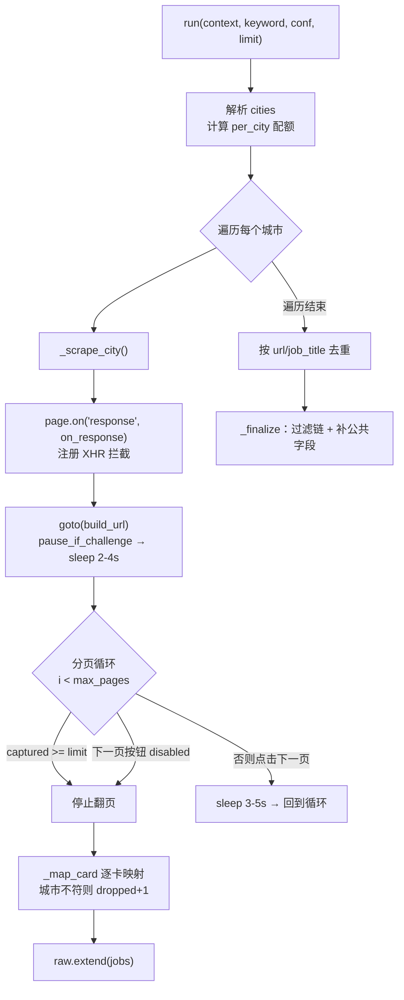

猎聘（liepin.com）的岗位列表采集走的是与 Boss 直聘完全不同的技术路线：它不解析 DOM 卡片，而是在 Playwright 中**拦截搜索页发出的 XHR 响应**，直接从 JSON 载荷里取岗位数据。这一设计动机写在模块头部注释里——猎聘的 XHR JSON **没有字体反爬问题**，因此比 DOM 解析更稳定。本页聚焦于猎聘采集器 `LiepinDiscoverer` 的拦截机制、AntD 分页翻页循环、URL 过滤参数构造以及多城市配额编排，帮助具备经验的开发者理解其与平台特性强耦合的工程取舍。

Sources: [liepin.py](../../../../src/jobscrape/discovery/liepin.py#L1-L4)

## 为什么用 XHR 拦截而不是 DOM 解析

采集器基类 `BaseDiscoverer` 只约定 `run(context, keyword, conf, limit)` 这一入口契约与 `_finalize` 公共收尾逻辑，具体抓取手段留给各平台子类自由实现。猎聘子类选择拦截 XHR，本质上是因为**结构化 JSON 直接给出了薪资、年限、学历等已归一化字段**，绕开了 Boss 那样需要解码私有区反爬字符的环节。下表对比两种列表采集范式的差异。

Sources: [base.py](../../../../src/jobscrape/discovery/base.py#L158-L163), [liepin.py](../../../../src/jobscrape/discovery/liepin.py#L1-L4)

| 维度 | Boss 直聘（DOM 解析） | 猎聘（XHR 拦截） |
| --- | --- | --- |
| 数据来源 | 渲染后的 DOM 卡片节点 | 搜索页 XHR JSON 响应体 |
| 反爬对抗 | 需解码 PUA 私有区薪资字体 | JSON 无字体反爬，直接可读 |
| 触发方式 | `window.scrollBy` 增量滚动加载 | 点击 AntD「下一页」按钮翻页 |
| 字段口径 | 从文本、标签中正则抽取 | 直接读 `job`/`comp`/`recruiter` 嵌套字段 |
| 稳定性风险 | 前端选择器改版 | XHR 接口路径与 JSON 层级改版 |

## 采集总览流程

`run` 方法是采集入口：先按城市拆分，逐城调用 `_scrape_city`，再对累计结果去重，最后交给基类 `_finalize` 过一遍纯代码过滤链。下图为单次 `run` 调用的控制流。

Sources: [liepin.py](../../../../src/jobscrape/discovery/liepin.py#L59-L84)



## XHR 响应拦截机制

拦截的起点是在页面跳转**之前**注册 `page.on("response", on_response)` 监听器。`on_response` 只处理 URL 命中 `XHR_MARKER` 的响应，并显式排除 `-cond-init` 初始化请求，避免把首屏配置请求误当岗位数据。命中后调用 `resp.json()` 解析，解析失败则静默跳过——这一容错保证了单个非 JSON 响应不会中断整批采集。

Sources: [liepin.py](../../../../src/jobscrape/discovery/liepin.py#L26), [liepin.py](../../../../src/jobscrape/discovery/liepin.py#L95-L104)

关键细节在于 JSON 的**嵌套层级**。代码注释标注 2026-09 实测的结构为 `flag → data → data → jobCardList`，比旧文档多了一层 `data`。因此取值链写为 `((data.get("data") or {}).get("data") or {}).get("jobCardList")`，每一步都用 `or {}` 兜底，防止某一层缺失时抛 `AttributeError`。命中的卡片被 `extend` 进 `captured` 累加列表，跨页累积。

Sources: [liepin.py](../../../../src/jobscrape/discovery/liepin.py#L102-L104)

```python
XHR_MARKER = "com.liepin.searchfront4c.pc-search-job"  # L26

def on_response(resp):                                 # L95
    if XHR_MARKER not in resp.url or "-cond-init" in resp.url:
        return                                         # 跳过非目标接口
    try:
        data = resp.json()
    except Exception:
        return                                         # 非 JSON 静默跳过
    cards = ((data.get("data") or {}).get("data") or {}).get("jobCardList") or []
    captured.extend(cards)
```

## URL 构造与服务端过滤参数

`build_url` 负责把配置拼成猎聘搜索 URL。这里有一处容易踩坑的平台行为：**只有 `city` 不会真正过滤**，代码注释明确标注 2026-09 实测「猎聘真正生效的过滤参数是 `dq`（地区），city 只影响展示」，只给 `city` 时 XHR 请求体里的 `dq` 会落到默认值，导致结果混入全国岗位。因此 URL 同时携带 `city` 与 `dq` 两个参数。城市代码优先取配置覆盖，其次查内置 `CITY_CODES`，最终兜底北京 `010`。

Sources: [liepin.py](../../../../src/jobscrape/discovery/liepin.py#L41-L49), [liepin.py](../../../../src/jobscrape/discovery/liepin.py#L18-L23)

学历过滤通过 `eduLevel` 参数映射，内置 `EDU_CODES` 为 `本科→040`、`硕士→030`、`大专→050`；注释说明 `020` 与 `030` 结果相同、博士档无法确认，故未内置。传入不支持的取值会直接抛 `ValueError`，避免静默降级为不限。**年限参数则完全不可用**：注释标注 URL 上的 `workYearCode` 不改变结果，代码在检测到 `conf.experience` 时只打印一行提示，引导使用者改用 `profile.json` 的本地年限过滤。

Sources: [liepin.py](../../../../src/jobscrape/discovery/liepin.py#L28-L30), [liepin.py](../../../../src/jobscrape/discovery/liepin.py#L50-L57), [liepin.py](../../../../src/jobscrape/discovery/liepin.py#L42-L45)

| 参数 | 引用 | 取值来源 | 备注 |
| --- | --- | --- | --- |
| `key` | `build_url` | 搜索关键词 | `quote()` 编码 |
| `city` | `build_url` | `city_codes` 覆盖或 `CITY_CODES` | 仅影响展示 |
| `dq` | `build_url` | 同 `city` | **真正生效的地区过滤** |
| `eduLevel` | `build_url` | `EDU_CODES` | 本科/硕士/大专；非法值抛错 |
| `workYearCode` | — | 未使用 | 实测不生效，改用本地过滤 |

## AntD 分页翻页循环

猎聘搜索页使用 Ant Design 分页组件。翻页逻辑在 `_scrape_city` 中：进入页面并等待 `pause_if_challenge` 与 `random.uniform(2, 4)` 秒随机延时后，进入一个最多 `max_pages`（默认 3）轮的循环。每轮先判断 `captured` 是否已达 `limit`，再取 `li.ant-pagination-next` 元素，读取其 `class` 属性判断是否含 `ant-pagination-disabled`——**这才是翻页终点的判据**，而非点击后 DOM 变化。

Sources: [liepin.py](../../../../src/jobscrape/discovery/liepin.py#L106-L126), [liepin.py](../../../../src/jobscrape/discovery/liepin.py#L32-L35)

按钮未禁用时点击，随后 `time.sleep(random.uniform(3, 5))` 等待新一页 XHR 回流被 `on_response` 捕获。整个循环被 `try/except` 包裹，任何定位或点击异常都直接 `break`，防止单轮失败拖垮整批任务。三种终止条件——抓够数量、按钮禁用、发生异常——共同保证了循环一定收敛。

Sources: [liepin.py](../../../../src/jobscrape/discovery/liepin.py#L115-L126)

| 终止条件 | 判据 | 代码位置 |
| --- | --- | --- |
| 抓取达标 | `len(captured) >= limit` | [L116-L117](../../../../src/jobscrape/discovery/liepin.py#L116-L117) |
| 翻页到底 | `class` 含 `ant-pagination-disabled` | [L120-L122](../../../../src/jobscrape/discovery/liepin.py#L120-L122) |
| 达到上限 | 循环计数 `max_pages` | [L114-L115](../../../../src/jobscrape/discovery/liepin.py#L114-L115) |
| 交互异常 | `click`/`get_attribute` 抛错 | [L125-L126](../../../../src/jobscrape/discovery/liepin.py#L125-L126) |

## 多城市配额与去重

`run` 采用与 Boss 相同的**多城平分配额**策略：`per_city = limit if len(cities) <= 1 else max(4, limit // len(cities))`，保证排在前面的城市不会吃光配额而饿死后续城市。逐城抓取完成后，`raw` 会按 `url`（回退到 `job_title`）去重——因为多城市多页之间可能返回重复卡片。去重后的结果才进入 `_finalize`。

Sources: [liepin.py](../../../../src/jobscrape/discovery/liepin.py#L61-L84)

`_finalize` 由基类提供，对每个岗位补 `platform`、`search_source` 字段，执行 `apply_filters` 纯代码过滤链，并写入 `reject_reason` / `discovered_at`。为抵消过滤淘汰，它会取 `raw_jobs[:limit * 3]` 多取一些样本，通过过滤的岗位够数即停、被拒岗位继续收集以供报告尾翻案。

Sources: [base.py](../../../../src/jobscrape/discovery/base.py#L165-L181), [base.py](../../../../src/jobscrape/discovery/base.py#L89-L155)


## 单卡字段映射与城市兜底

`_map_card` 把 `jobCardList` 的一条 JSON 映射为 `jobs` 表行，字段名以 2026-09 实测为准，分别读自 `card["job"]`、`card["comp"]`、`card["recruiter"]` 三个子对象。薪资先经 `_parse_liepin_salary` 解析为 `(min, max, 12)`，支持 `K` 与 `万`/`W` 两种单位（万自动 ×10 转 K），无法解析（如「面议」）则薪资字段留空。

Sources: [liepin.py](../../../../src/jobscrape/discovery/liepin.py#L140-L189), [liepin.py](../../../../src/jobscrape/discovery/liepin.py#L198-L208)

| 目标字段 | JSON 来源 | 处理 |
| --- | --- | --- |
| `url` / `apply_url` | `job.link` | 非 http 前缀补 `LIEPIN_HOME` |
| `job_title` | `job.title` | 直取 |
| `company` | `comp.compName` | 直取 |
| `city` / `district` | `job.dq` | 按 `-` 切分（如「上海-浦东新区」） |
| `salary_*` | `job.salary` | `_parse_liepin_salary` 解析 |
| `experience_raw` | `job.requireWorkYears` | 如「3-5年」「经验不限」 |
| `education_raw` | `job.requireEduLevel` | 如「本科」「统招本科」 |
| `hr_name` / `hr_title` / `hr_active` | `recruiter.*` | 卡片仍展示 HR 信息 |

城市兜底是本方法的核心防线。代码注释指出 **`dq` 过滤后仍会混入约 5% 的外地推荐卡**，因此 `_map_card` 接收 `allowed` 城市集合，用 `_norm_city` 归一化 `dq` 后比对，不在白名单内则返回 `None`（计为 `dropped`）。当归一化结果为空（`dq` 缺失）时**保留不误杀**，避免丢失无法判定的岗位。`_norm_city` 负责把「上海-浦东新区」切成「上海」、把「北京市」去掉市字后缀。

Sources: [liepin.py](../../../../src/jobscrape/discovery/liepin.py#L155-L159), [liepin.py](../../../../src/jobscrape/discovery/liepin.py#L192-L195)

## 与 Boss 采集的编排差异

虽然两个采集器共享 `run` → 逐城 → `_finalize` 的骨架，但翻页机制与数据处理存在本质区别。下表汇总差异，便于对照阅读。

Sources: [liepin.py](../../../../src/jobscrape/discovery/liepin.py#L86-L138), [boss.py](../../../../src/jobscrape/discovery/boss.py#L118-L169)

| 环节 | Boss 直聘 | 猎聘 |
| --- | --- | --- |
| 加载触发 | `_scroll_to_bottom` 增量滚动 | `next_btn.click()` 点击翻页 |
| 终止判据 | 卡片数 3 轮不变 | 按钮 `class` 含 disabled |
| 数据载体 | `page.locator(...).all()` DOM | `on_response` 捕获的 JSON |
| 单卡提取 | `_extract_one` 逐 selectors 抽取 | `_map_card` 读嵌套字段 |
| 薪资处理 | `decode_salary_font` 反爬解码 | XHR 明文，直接解析 |

值得注意的是，猎聘采集器默认超时沿用 Playwright 默认值，而 Boss 在 `_scrape_city` 中主动将默认超时压到 2 秒——这是因为 Boss 单卡字段缺失会触发 30 秒的 locator 等待，而猎聘走 JSON 拦截、不依赖逐节点定位，因此无此开销。

Sources: [boss.py](../../../../src/jobscrape/discovery/boss.py#L122-L124), [liepin.py](../../../../src/jobscrape/discovery/liepin.py#L93-L138)

## 反检测与验证页衔接

猎聘采集同样复用浏览器底座：`_scrape_city` 在 `goto` 之后立即调用 `pause_if_challenge(page)`，检测是否落入登录页或风控拦截（如 `safe.liepin.com/verifysms`）。该函数在交互终端等待回车、在非 TTY 环境轮询 URL 直到挑战消失，超时抛错而非死等。猎聘的登录态存于 localStorage 与 sessionStorage，由 `BrowserSession` 的 storage_state 回灌机制恢复。

Sources: [liepin.py](../../../../src/jobscrape/discovery/liepin.py#L90-L110), [browser.py](../../../../src/jobscrape/discovery/browser.py#L123-L145), [browser.py](../../../../src/jobscrape/discovery/browser.py#L70-L82)

## 小结与延伸阅读

猎聘采集器的设计围绕一个核心判断展开：**结构化 XHR 数据比 DOM 文本更可靠**。由此派生出拦截 marker 与嵌套路径的脆弱点（接口路径或 JSON 层级改版即失效）、AntD 分页的禁用类判据、以及 `dq` + 客户端城市兜底的双层过滤。理解这些取舍，有助于在平台改版时快速定位需要调整的常量（`XHR_MARKER`、嵌套路径、`LOCATORS`）。

建议继续阅读以下相邻主题：

- [采集器基类与纯代码过滤链](10-cai-ji-qi-ji-lei-yu-chun-dai-ma-guo-lu-lian)：理解 `_finalize` 与 `apply_filters` 的过滤契约
- [Boss 直聘采集：滚动加载与薪资字体反爬](11-boss-zhi-pin-cai-ji-gun-dong-jia-zai-yu-xin-zi-zi-ti-fan-pa)：对照的 DOM 解析范式
- [浏览器会话封装与登录态持久化](13-liu-lan-qi-hui-hua-feng-zhuang-yu-deng-lu-tai-chi-jiu-hua)：`BrowserSession` 与 storage_state 回灌
- [反检测注入与验证页人工暂停](14-fan-jian-ce-zhu-ru-yu-yan-zheng-ye-ren-gong-zan-ting)：`pause_if_challenge` 的完整实现
- [JD 全文抓取：接口拦截与 DOM 降级](17-jd-quan-wen-zhua-qu-jie-kou-lan-jie-yu-dom-jiang-ji)：猎聘详情页的 DOM 采集