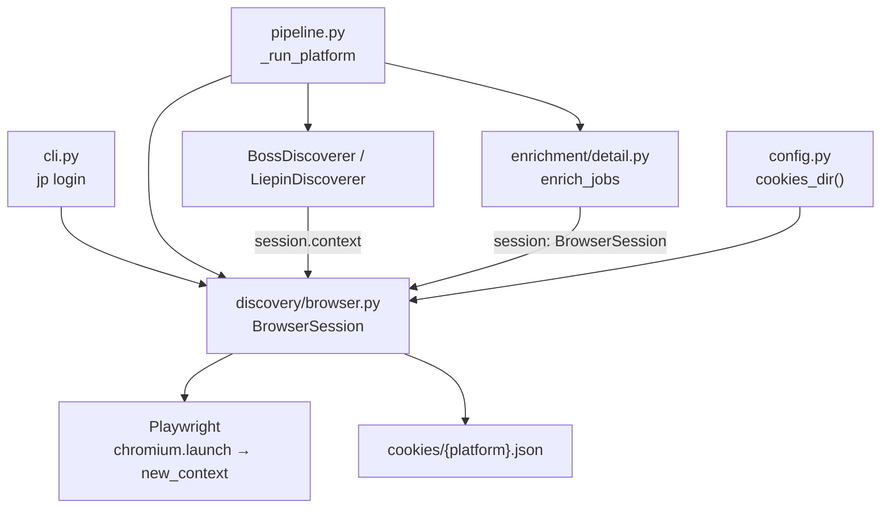
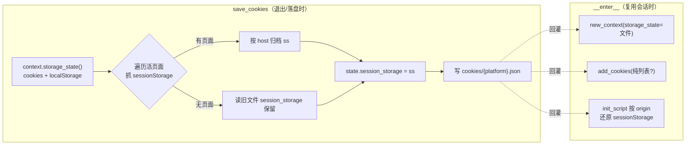
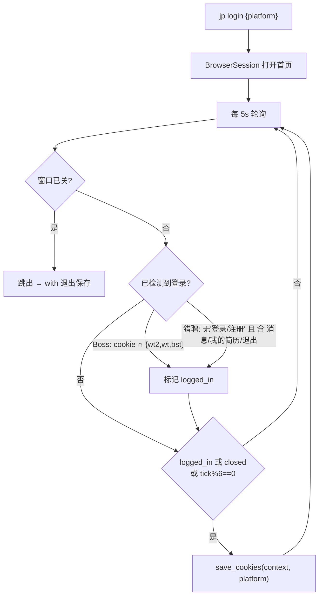

`discovery/browser.py` 是整个项目与 Playwright 的唯一接触面。本页聚焦其**会话封装**与**登录态持久化**两条主线：`BrowserSession` 如何以上下文管理器管理 Chromium 生命周期、登录态如何以 cookies / storage_state / sessionStorage 三种载体落盘与回灌，以及 `jp login` 命令如何驱动扫码登录并保活登录态。反检测脚本注入与验证页人工暂停的细节属于相邻页面，本页仅描述它们与会话装配的接口。

## 单点封装原则与模块定位

`browser.py` 的模块文档字符串明确声明了设计意图：**单点封装**。将来若 Playwright 被指纹检测而需要整体替换为 `nodriver` / `patchright`，只需改动这一个文件，调用方无需感知。这一约束在项目关键设计清单中被重申为「Playwright 只在 `discovery/browser.py` 单点封装」。

Sources: [browser.py](../../../../src/jobscrape/discovery/browser.py#L1-L5), [CHANGELOG.md](../../../../CHANGELOG.md#L49-L57)

模块对外暴露两类接口：一个 `BrowserSession` 上下文管理类，以及一组围绕登录态的模块级函数（`load_cookies` / `load_storage_state` / `save_cookies` / `has_valid_cookie`）。三类调用方都以它为底座：`cli.py` 的 `login` 命令直接实例化它；`pipeline.py` 的 `_run_platform` 用它包裹 discover 与 enrich 两个阶段；`enrichment/detail.py` 的类型注解直接引用 `BrowserSession` 并接收其实例。

Sources: [cli.py](../../../../src/jobscrape/cli.py#L60-L63), [pipeline.py](../../../../src/jobscrape/pipeline.py#L48-L57), [detail.py](../../../../src/jobscrape/enrichment/detail.py#L14-L36)

## BrowserSession 的生命周期：上下文管理器

`BrowserSession` 是一个标准的 `with` 上下文管理器，把「启动 → 装配上下文 → 使用 → 保存并回收」压缩为一次 `with` 语句，从而保证即使中途抛异常也一定会落盘登录态并释放浏览器进程。

`__enter__` 的执行顺序是理解会话装配的关键：先 `sync_playwright().start()`，再以**有头**模式启动 `chromium`（`headless=not self.headed`，默认 `headed=True`），并附带 `--start-maximized` 与 `--disable-blink-features=AutomationControlled` 参数与 `slow_mo=50` 的节流。随后 `new_context` 注入硬编码 UA、`viewport=None`（最大化窗口下不固定视口），并把 `storage_state=load_storage_state(...)` 交给 Playwright 完成 cookies 与 localStorage 的一次性回灌。

Sources: [browser.py](../../../../src/jobscrape/discovery/browser.py#L158-L169)

上下文装配完成后还有两步补强：`add_init_script(ANTI_DETECTION_JS)` 注册反检测脚本（其内容归属反检测专页），以及针对 sessionStorage 的**二次回灌**——读取 state 文件里的 `session_storage` 映射，再注册一个按 `location.host` / `location.origin` 匹配的 init script，因为每个新页面创建时才需要把对应 origin 的 sessionStorage 键值写回。最后 `add_cookies(load_cookies(...))` 兜底回灌旧格式的纯 cookies 文件。

Sources: [browser.py](../../../../src/jobscrape/discovery/browser.py#L170-L187)

`__exit__` 与 `__enter__` 对称：先 `save_cookies` 持久化当前上下文，再依次 `context.close()` → `browser.close()` → `pw.stop()`。`save_cookies` 与关闭被包在 `try/except` 中，确保即便保存失败也不会阻断浏览器回收。

Sources: [browser.py](../../../../src/jobscrape/discovery/browser.py#L189-L199)

| 成员 | 职责 | 关键行为 |
| --- | --- | --- |
| `__init__` | 记录平台与有头标志，占位内部句柄 | `platform` / `headed` / `context=None` |
| `__enter__` | 启动浏览器并装配上下文 | launch → new_context → init_script → sessionStorage 回灌 → cookies 回灌 |
| `__exit__` | 保存登录态并回收资源 | save_cookies → close context → close browser → stop playwright |
| `new_page` | 在已装配上下文上开新页 | 断言 `context` 非空后返回 `context.new_page()` |

Sources: [browser.py](../../../../src/jobscrape/discovery/browser.py#L148-L204)

## 登录态的三层载体

登录态的持久化并非单一文件格式，而是**兼容三种载体**并分层回灌，原因在于两个平台存储登录凭证的位置不同：Boss 的凭证在 cookie 中，而猎聘的登录态在 localStorage，且额外把 token 放在 sessionStorage——只存 cookies 会丢登录。三个模块级读取函数分别对应不同格式，并以 `isinstance` 判别文件结构而互不冲突。

Sources: [browser.py](../../../../src/jobscrape/discovery/browser.py#L58-L82)

| 函数 | 识别格式 | 返回 | 用途 |
| --- | --- | --- | --- |
| `load_cookies` | JSON 列表（旧格式） | `list[dict]` 或 `None` | 兼容历史纯 cookies 文件，经 `add_cookies` 回灌 |
| `load_storage_state` | JSON 字典且含 `cookies` 键（新格式） | 文件路径字符串或 `None` | 交给 `new_context(storage_state=...)` 一次性回灌 cookies + localStorage |
| `save_cookies` | 写入时构造 | 无（写文件） | 把 `context.storage_state()` 落盘，并补抓 sessionStorage |
| `has_valid_cookie` | 复用 `load_cookies` | `bool` | 判断是否存在 cookie 文件（存在性，非有效性校验） |

Sources: [browser.py](../../../../src/jobscrape/discovery/browser.py#L58-L116)

`save_cookies` 是本页最有含量的逻辑。它以 `context.storage_state()` 为基底，再遍历 `context.pages`，对每个仍打开的页面执行 `page.evaluate` 抽取其 `sessionStorage` 全量键值，并按主机名归档为 `ss[host] = kv`。若**没有任何活页面可供抓取**（`if not ss`），则读取旧文件的 `session_storage` 保留原值，避免登录态被空映射覆盖。最终写入 `state["session_storage"] = ss`。这里的「防空覆盖」与 `__enter__` 中按 origin 的回灌 init script 形成闭环：留存下来的 sessionStorage 会在下次会话中按域名精确还原。

Sources: [browser.py](../../../../src/jobscrape/discovery/browser.py#L85-L112), [browser.py](../../../../src/jobscrape/discovery/browser.py#L171-L184)

## 登录态文件与运行时目录

所有登录态文件落在 `config.cookies_dir()` 指向的目录，具体路径为 `{platform}.json`（如 `boss.json` / `liepin.json`）。该目录由 `runtime_dir()` 派生：根目录取环境变量 `JOBSCRAPE_HOME`，缺省为 `~/.job-scrape-cn`，并在创建时顺带建立 `cookies/` 与 `exports/` 子目录。这意味着登录态可随环境变量迁移，且换平台互不干扰。

Sources: [config.py](../../../../src/jobscrape/config.py#L34-L47), [browser.py](../../../../src/jobscrape/discovery/browser.py#L60-L82)

`jp login` 结束后会打印最终保存路径 `config.cookies_dir() / f"{platform}.json"`，README 亦说明登录态「约一周有效」，失效后重新执行 `jp login <平台>` 即可。

Sources: [cli.py](../../../../src/jobscrape/cli.py#L103), [README.md](../../../../README.md#L45-L47), [README.md](../../../../README.md#L225)

## jp login：扫码登录与登录态保活

`login` 命令是登录态持久化的驱动入口。它先按平台选择首页（Boss 为 `https://www.zhipin.com`，猎聘为 `https://www.liepin.com`），然后在 `BrowserSession` 中打开新页并导航，等待用户完成扫码。

Sources: [cli.py](../../../../src/jobscrape/cli.py#L56-L66)

其检测循环是本命令的核心：每 5 秒轮询一次，并区分平台采用**不同证据**判断是否登录成功。Boss 侧检查 cookie 名集合是否与 `{"wt2", "wt", "bst"}` 有交集；猎聘侧则采用**双证据防假阳性**——页面正文中「登录/注册」消失，且出现 `消息` / `我的简历` / `退出` 之一。为兼容后台运行，循环同时探测 `session.context.pages` 是否为空以判断窗口是否被关闭。

Sources: [cli.py](../../../../src/jobscrape/cli.py#L70-L92)

落盘策略体现「检测失误也不丢态」的冗余设计：登录成功后每次循环都调用 `save_cookies`；此外在窗口关闭时、以及未登录状态下每 30 秒（`tick % 6 == 0`）也兜底保存一次。窗口关闭时跳出循环，`with` 退出再触发一次 `save_cookies`。

Sources: [cli.py](../../../../src/jobscrape/cli.py#L93-L103)

## 会话复用：discover 与 enrich 共享同一浏览器

登录态「只验一次」的关键在于会话复用。`pipeline._run_platform` 用**单个** `with BrowserSession(platform)` 语句同时包裹 discover 与 enrich 两个阶段，并把同一个 `session.context` 依次传给发现器与 JD 抓取。这既避免了两阶段各启一次浏览器，也让登录态在一次会话内被统一持有——discover 的采集与 enrich 的详情抓取共享同一套 cookies / storage_state。

Sources: [pipeline.py](../../../../src/jobscrape/pipeline.py#L56-L78)

`enrich_jobs` 的签名以 `session: BrowserSession` 显式声明依赖，其内部按平台分派到 `_enrich_boss` / `_enrich_liepin`，两者都通过 `session.new_page()` 开页并在导航后调用 `pause_if_challenge(page)`——验证页人工暂停的具体机制见 [反检测注入与验证页人工暂停](14-fan-jian-ce-zhu-ru-yu-yan-zheng-ye-ren-gong-zan-ting)，本页只说明它是会话装配之外、由调用方在导航后触发的统一接口。

Sources: [detail.py](../../../../src/jobscrape/enrichment/detail.py#L35-L48), [detail.py](../../../../src/jobscrape/enrichment/detail.py#L84-L104)

| 阶段 | 会话角色 | 与登录态的关系 |
| --- | --- | --- |
| `jp login` | 直接实例化 `BrowserSession`，长驻轮询 | 冷启动扫码，落盘登录态 |
| discover | 复用 `session.context` | 回灌登录态后采集列表 |
| enrich | 复用同一 `session` | 同一登录态下抓 JD 全文 |

Sources: [cli.py](../../../../src/jobscrape/cli.py#L63), [pipeline.py](../../../../src/jobscrape/pipeline.py#L57-L76)

## 设计约束与演进脉络

会话封装绑定了几条需在改动时守住的约束。其一，`UA` 硬编码为 macOS Chrome 135 的 UA 字符串，注释说明这是「`get_jobs` 验证过的口径」，随意改动会破坏既有验证结论。其二，`BrowserSession` 与 `cookies_dir()` 的耦合是「运行时目录 = `$JOBSCRAPE_HOME` 或 `~/.job-scrape-cn`」这条设计约束的直接落点——Windows 上落在用户目录是设计而非缺陷。

Sources: [browser.py](../../../../src/jobscrape/discovery/browser.py#L20-L24), [CHANGELOG.md](../../../../CHANGELOG.md#L49-L57)

历史演进也留下了痕迹。CHANGELOG 记录了一处与登录态落盘相邻的修复：`browser.py` 中原先打印的 `✓` / `⚠️` 等符号在中文 Windows（GBK 控制台）会触发 `UnicodeEncodeError`，因此替换为 ASCII 标记（`OK`、`[!]`）——这正是本页中出现 `print(f"\n[!] 检测到验证/登录页…")` 等 ASCII 打印的由来。此外，`jp login` 的一个已知待办是「检测到登录态后自动退出」尚未实现，目前仍需手动关闭窗口或 `Ctrl+C`。

Sources: [CHANGELOG.md](../../../../CHANGELOG.md#L38-L40), [browser.py](../../../../src/jobscrape/discovery/browser.py#L131), [CHANGELOG.md](../../../../CHANGELOG.md#L118-L122)

阅读建议：本页描述的会话装配中挂载了反检测脚本与验证页暂停接口，其内部实现见 [反检测注入与验证页人工暂停](14-fan-jian-ce-zhu-ru-yu-yan-zheng-ye-ren-gong-zan-ting)；会话被采集器与 JD 抓取消费的具体用法分别见 [采集器基类与纯代码过滤链](10-cai-ji-qi-ji-lei-yu-chun-dai-ma-guo-lu-lian) 与 [JD 全文抓取：接口拦截与 DOM 降级](17-jd-quan-wen-zhua-qu-jie-kou-lan-jie-yu-dom-jiang-ji)。