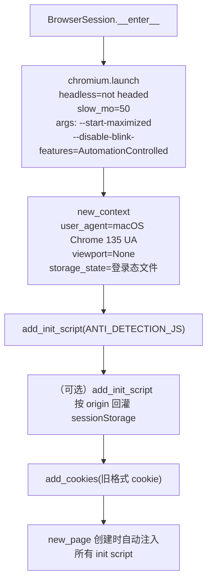
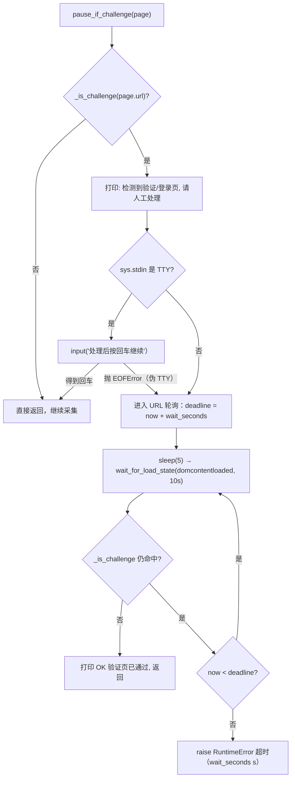

本页聚焦 `discovery/browser.py` 这一"浏览器底座"中与**反爬对抗**直接相关的两块能力：**反检测注入**（让自动化浏览器在指纹层面更像真人）与**验证页人工暂停**（检测到滑块/登录页时把控制权交还给人，而非尝试自动过验证）。二者共用同一份封装文件，是 `BrowserSession` 生命周期里最靠近"平台边缘"的逻辑。理解本页有助于回答"采集为什么会突然停下等人"以及"为什么反检测代码集中在单文件"。

Sources: [browser.py](../../../../src/jobscrape/discovery/browser.py#L1-L5)

## 单点封装原则：反检测为何只住在一个文件

`discovery/browser.py` 被明确设计为 **Playwright 的唯一出口**。文件头注释给出的理由非常直接：将来 Playwright 若被指纹检测识别，整体替换为 `nodriver`/`patchright` 时**只改这一个文件**。这一约束在项目文档中被反复强调，列为"改动时别破坏"的关键设计约束之一——Playwright 只在 `discovery/browser.py` 单点封装。因此，所有反检测相关代码（UA、启动参数、init script、验证页暂停）都不散落在各采集器中，而是收敛于此。各平台的 `boss.py` / `liepin.py` / `enrichment/detail.py` 只通过导入函数获得能力，不自行拼接反检测逻辑。

Sources: [browser.py](../../../../src/jobscrape/discovery/browser.py#L1-L5), [README.md](../../../../README.md#L17), [CHANGELOG.md](../../../../CHANGELOG.md#L56)

`BrowserSession` 以**上下文管理器**形式对外暴露：`__enter__` 负责启动浏览器、建上下文、注入反检测并回灌登录态；`__exit__` 负责保存登录态并逐层关闭 context / browser / playwright。`pipeline.py` 的 `_run_platform` 用 `with BrowserSession(platform) as session:` 包裹整个 discover + enrich 流程，使 **discover 与 enrich 共用同一浏览器会话，登录态只验一次**。

Sources: [browser.py](../../../../src/jobscrape/discovery/browser.py#L158-L199), [pipeline.py](../../../../src/jobscrape/pipeline.py#L46-L57)

## 反检测注入的三层防线

反检测并非单点动作，而是从**进程启动参数**到**页面级 init script** 的三层递进配置。下图展示 `BrowserSession.__enter__` 的建立顺序，以及每层承担的对抗目标：

**第一层：启动参数。** 启动 Chromium 时传入 `--disable-blink-features=AutomationControlled`，用于消除 `navigator.webdriver` 等由自动化控制标志位触发的检测点；`slow_mo=50` 让每个操作带 50ms 延迟，使动作节奏更接近真人；`--start-maximized` 配合 `viewport=None` 让窗口最大化且不锁定固定视口尺寸，避免"固定分辨率"这一常见指纹特征。是否 headed 由构造参数 `headed: bool = True` 决定，`headless=not self.headed`。

Sources: [browser.py](../../../../src/jobscrape/discovery/browser.py#L151-L169)

**第二层：上下文 UA 伪装。** 上下文 `user_agent` 硬编码为一段 **macOS Chrome 135** 的 UA 字符串。注释说明该口径来自 `get_jobs` 时代的实测验证（"get_jobs 验证过的口径"），即经过真实环境检验、能通过平台检测的描述符，而非随意拼接。

Sources: [browser.py](../../../../src/jobscrape/discovery/browser.py#L20-L24), [browser.py](../../../../src/jobscrape/discovery/browser.py#L165-L169)

**第三层：页面级 init script。** `context.add_init_script(ANTI_DETECTION_JS)` 保证**每个新页面创建时**都自动执行这段反检测脚本。脚本内容与设计动机如下表：

| 对抗手段 | 实现要点 | 针对的检测 |
|---|---|---|
| 幂等守卫 | `if (window.__jpAntiDetect) return; window.__jpAntiDetect = true;` | 防止重复注入叠加包装 |
| console 方法包装 | 遍历 `['table','log','info','warn','error','debug']`，对象参数脱敏为 `{}` | 缓解 `console.table` 计时探测 |
| toString 伪装 | `wrapped.toString = () => "function name() { [native code] }"` | 让被包装函数看起来是原生代码 |
| toString 的 toString | `wrapped.toString.toString = ...` | 防止递归检测 `toString.toString` |

脚本以 IIFE 包裹，`nativeStr(name)` 辅助函数生成形如 `function table() { [native code] }` 的字符串。核心动机是：自动化框架包装过的函数在 `Function.prototype.toString` 下会暴露 `[native code]` 缺失的破绽，脚本通过重定义 `toString` 把包装痕迹抹平；同时对 console 传入的对象参数做脱敏，避免某些基于 `console.table` 执行耗时的侧信道探测。

Sources: [browser.py](../../../../src/jobscrape/discovery/browser.py#L26-L49)

在同一次 `__enter__` 中，还会顺带完成 **sessionStorage 回灌**：由于 `storage_state` 不含 sessionStorage（猎聘把登录 token 放在 sessionStorage），代码把上次保存的 `session_storage` 按 `location.host`/`location.origin` 映射，再以另一段 init script 在每个新页面注入 `sessionStorage.setItem`。这与反检测同属"页面初始态注入"这一机制层，共用 `add_init_script` 通道。

Sources: [browser.py](../../../../src/jobscrape/discovery/browser.py#L171-L187), [browser.py](../../../../src/jobscrape/discovery/browser.py#L85-L112)

## 验证页识别：URL 特征匹配

在"人工暂停"之前，系统先要判断当前页面**是不是**验证/登录页。这一判断集中在 `_CHALLENGE_URL_PATTERNS` 常量与 `_is_challenge(url)` 函数中，采用**子串包含**匹配（对 URL 小写化后做 `any(pat in url)`）。匹配的特征清单如下：

| 特征串 | 指向的场景 |
|---|---|
| `safe/verify` | Boss 滑块/安全验证路径 |
| `verify-slider` | 滑块验证页面 |
| `signin` | 登录页（英文路由） |
| `login` | 登录页（通用路由） |
| `safe.liepin.com` | 猎聘风控域名 |
| `verifysms` | 猎聘短信风控拦截页 |

注释明确该清单覆盖"Boss 滑块 / 登录页，猎聘登录页 + 风控拦截（safe.liepin.com/verifysms）"两类平台的典型拦截形态。这种基于 **URL 特征**而非 DOM 内容的判断策略，优势是与页面结构解耦、不依赖易变的选择器；代价是特征清单需随平台改版维护。

Sources: [browser.py](../../../../src/jobscrape/discovery/browser.py#L51-L55), [browser.py](../../../../src/jobscrape/discovery/browser.py#L119-L120)

## 人工暂停：TTY 与后台任务的双模式

`pause_if_challenge(page, wait_seconds=600)` 是整个机制的**交互入口**。其设计原则是注释中的一句话：**不自动过滑块**。函数首先用 `_is_challenge` 判断，若非挑战页则立即返回，零开销。命中挑战页后，打印提示并进入**双模式等待**——这是一个针对"人在终端"和"定时/后台任务"两种运行场景的关键分叉：

**模式一（交互终端）**：当 `sys.stdin.isatty()` 为真，直接 `input("处理后按回车继续…")` 阻塞等待人工处理完并敲回车。若遇到伪 TTY 导致 `EOFError`（回车拿不到），则**落入下方 URL 轮询**，保证不会因拿不到输入而死锁。

**模式二（非 TTY / 后台任务）**：以 `deadline = time.monotonic() + wait_seconds`（默认 600 秒）为上限，循环 `sleep(5)` 后调用 `page.wait_for_load_state("domcontentloaded", timeout=10_000)`，再检查 URL 是否脱离挑战页；一旦脱离即打印 `OK 验证页已通过` 并返回。超时则抛出 `RuntimeError`，携带 `wait_seconds` 与当前 URL。

这一双模式的核心约束写在文档字符串里：**"绝不能死等 `input()` 把进程挂死"**。交互终端等回车、非交互环境轮询 URL 直到挑战消失、超时抛错——三者共同构成一个在无人值守场景下也不会永久阻塞的等待原语。README 的排错章节也向用户复述了这一语义："程序会暂停并提示人工处理，不会自动过验证（交互终端等回车，非交互环境最多等 10 分钟）"。

Sources: [browser.py](../../../../src/jobscrape/discovery/browser.py#L123-L145), [README.md](../../../../README.md#L226-L227)

## 调用点：三处采集/抓取入口的统一挂载

`pause_if_challenge` 被**延迟导入**（函数内部 `from .browser import pause_if_challenge`）以避免循环依赖，并统一挂在三处——每一次 `goto` 目标页之后、等待业务内容之前。下表汇总三处调用点：

| 调用文件 | 位置 | 调用时机 |
|---|---|---|
| `discovery/boss.py` | `_scrape_city` | `page.goto(url)` 后、`wait_for_selector(job_card)` 前 |
| `discovery/liepin.py` | `_scrape_city` | `page.goto(build_url(...))` 后、AntD 翻页循环前 |
| `enrichment/detail.py` | `_enrich_boss` | 详情 API 拦截/降级后 |
| `enrichment/detail.py` | `_enrich_liepin` | `page.goto(url)` 后、轮询 JD 选择器前 |

在 Boss 列表中，调用顺序为：`page.goto` → 打印当前 URL → `pause_if_challenge(page)` → `wait_for_selector` 等卡片出现，确保验证页未通过前不会在错误页面上做无意义等待。猎聘列表同理，在 `goto` 后先暂停再进入分页。JD 抓取阶段亦复刻同一模式：Boss 详情页在 `expect_response` 拦截或降级后调用暂停，猎聘详情页在 `goto` 后立即暂停，再进入最多 15 秒的 React SPA 水合轮询。

Sources: [boss.py](../../../../src/jobscrape/discovery/boss.py#L118-L136), [liepin.py](../../../../src/jobscrape/discovery/liepin.py#L86-L111), [detail.py](../../../../src/jobscrape/enrichment/detail.py#L84-L107), [detail.py](../../../../src/jobscrape/enrichment/detail.py#L112-L129)

## 设计约束与边界

综合上述实现，本机制有三条不可动摇的边界，改动时需特别留意：

- **绝不自动过验证**：`pause_if_challenge` 的职责是"通知 + 等待"，不含任何滑块轨迹模拟或验证码识别逻辑，把决策权完整交还人类。这既是工程上的可靠性选择，也呼应项目"仅学习研究/个人求职、保持低频"的使用须知。
- **不允许无限阻塞**：任何路径最终都有出口——回车、URL 脱离挑战页、或 `RuntimeError` 超时；伪 TTY 的 `EOFError` 也被显式接住并降级为轮询。
- **反检测集中在单文件**：UA、启动参数、`ANTI_DETECTION_JS`、挑战特征表、暂停函数全部位于 `discovery/browser.py`，替换底层驱动时改动面被限定为一个文件。

延续阅读可参考与之紧密相邻的两页：底层会话与登录态的载体见 [浏览器会话封装与登录态持久化](13-liu-lan-qi-hui-hua-feng-zhuang-yu-deng-lu-tai-chi-jiu-hua)；调用本机制的采集器实现见 [Boss 直聘采集：滚动加载与薪资字体反爬](11-boss-zhi-pin-cai-ji-gun-dong-jia-zai-yu-xin-zi-zi-ti-fan-pa) 与 [猎聘采集：XHR 拦截与分页翻页](12-xi-pin-cai-ji-xhr-lan-jie-yu-fen-ye-fan-ye)。