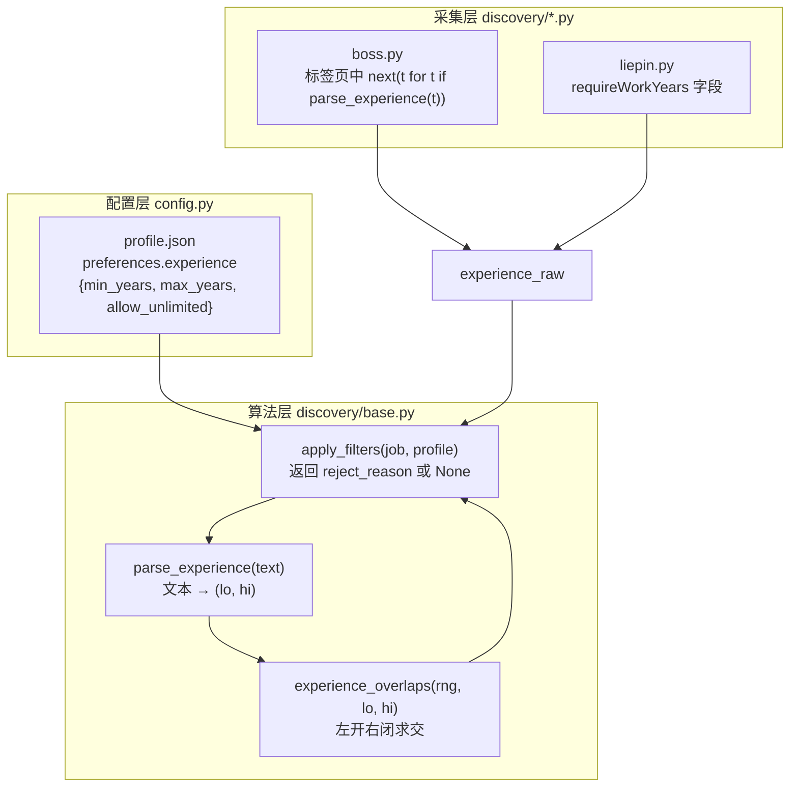
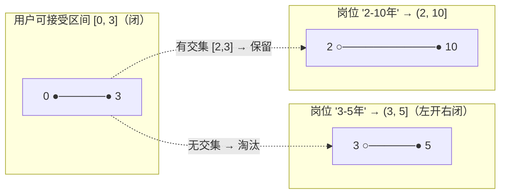
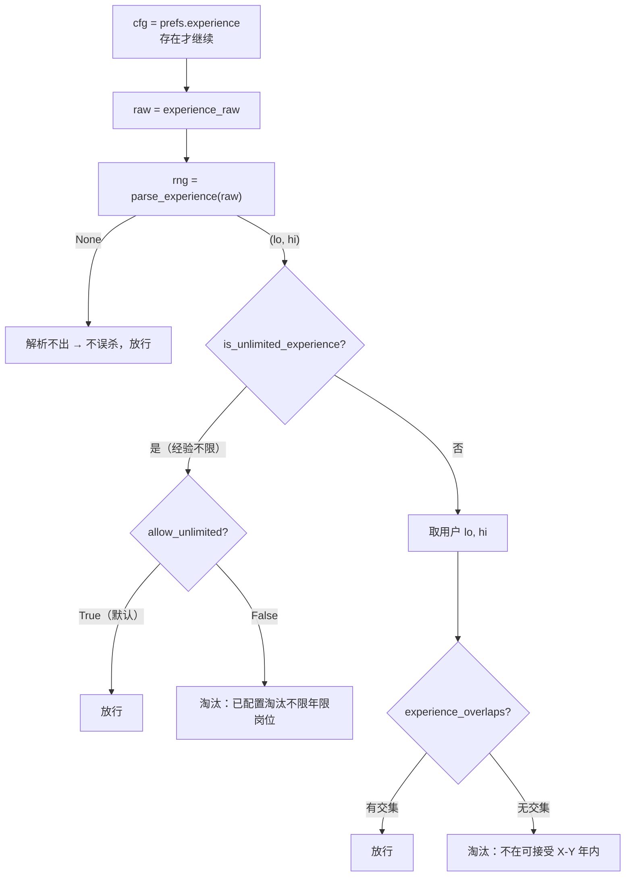
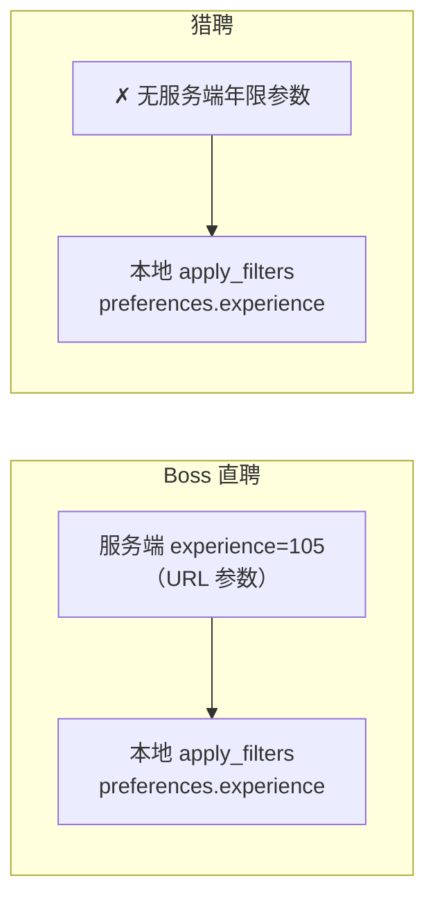

年限过滤是纯代码过滤链中最容易被低估的一环。招聘平台上"3-5年""1年以内""在校/应届""经验不限"这些年限标签表述各异，且"3-5年"这类区间的边界语义存在一个容易被忽略的陷阱：**岗位要求本质上是一个左开右闭区间**——"3-5年"意味着"要 3 年以上的人"，刚满 3 年恰好卡在边界上。本页深入 `jobscrape.discovery.base` 中 `parse_experience`、`experience_overlaps`、`apply_filters` 三者的协作，讲清"文本 → 归一区间 → 区间求交 → 淘汰判定"这条链路，以及服务端参数与本地过滤两种年限筛选路径的分工。

Sources: [base.py](src/jobscrape/discovery/base.py#L16-L22), [base.py](src/jobscrape/discovery/base.py#L25-L45), [base.py](src/jobscrape/discovery/base.py#L76-L86)

## 模块关系与整体数据流

年限过滤不是一个孤立函数，而是横跨三个文件的分工：`config.py` 定义 profile 中 `preferences.experience` 的配置契约；`discovery/base.py` 承担解析与匹配的全部算法；`discovery/boss.py` 与 `discovery/liepin.py` 各自负责把平台字段抽取为 `experience_raw`，前者还能把它翻译成服务端 URL 参数。

三者的调用是单向的：采集器只负责产出 `experience_raw` 字符串，解析、求交、裁决全部集中在 `apply_filters` 内部完成，采集器对此无感知。这种集中式设计让过滤规则"可审计"——基类文档字符串明确声明这是"纯代码过滤链（不调用任何模型，规则可审计）"。

Sources: [base.py](src/jobscrape/discovery/base.py#L1), [base.py](src/jobscrape/discovery/base.py#L89-L137), [boss.py](src/jobscrape/discovery/boss.py#L188-L204), [liepin.py](src/jobscrape/discovery/liepin.py#L162-L182)

## 解析层：parse_experience 的规则体系

`parse_experience` 的目标是把平台上的年限文本归一为一个二元组 `(下限, 上限)`，无法识别时返回 `None`。它采用**先特判、后正则**的分层策略：两个高频特殊标签在正则之前就被拦截，避免误判。

第一条特判是"不限"——只要文本包含"不限"（如"经验不限"），直接返回 `(0, 99)`，其中上界 `UNLIMITED_YEARS = 99` 是一个约定的极大值。第二条是"在校"或"应届"，返回退化区间 `(0, 0)`。这两条都排除了后续正则的干扰。

正则层面有三条模式，覆盖三种区间语法：

| 模式 | 正则 | 命中示例 | 返回 |
|------|------|----------|------|
| 闭合区间 | `(\d+)\s*-\s*(\d+)\s*年` | "3-5年""2-10年" | `(3,5)` `(2,10)` |
| 开区间上界 | `(\d+)\s*年以上` | "5年以上" | `(5, 99)` |
| 上界封顶 | `(\d+)\s*年(?:以下\|以内)` | "1年以下""1年以内" | `(0, 1)` |

Sources: [base.py](src/jobscrape/discovery/base.py#L16-L45)

值得注意的是正则顺序与鲁棒性设计。`_EXP_RANGE_RE` 先于 `_EXP_ABOVE_RE` 匹配，因为"3-5年"同时也符合后者的部分形态；此外闭合区间分支用 `(min(lo, hi), max(lo, hi))` 做了一次归一化，即使平台写反成"5-3年"也能兜底。`_EXP_BELOW_RE` 的正则注释点明了平台差异——"Boss 写「1年以内」，猎聘用「以下」"，所以两个词被并进同一个分组 `(?:以下|以内)`。匹配使用 `re.search` 而非 `match`，因为标签文本可能带前后缀。

Sources: [base.py](src/jobscrape/discovery/base.py#L17-L19), [base.py](src/jobscrape/discovery/base.py#L38-L44)

**返回 `None` 是刻意的防误杀设计**。实习/兼职岗位的标签只有"4天/周""6个月"这类，其中"6个月"含数字但不含"年"，正则全部落空，返回 `None`。单元测试明确覆盖了这一点，断言 `parse_experience("4天/周") is None`、`parse_experience("6个月") is None`、`parse_experience("本科") is None`，即便"本科"是学历而非年限，也不该被解析成区间。与之配套的 `is_unlimited_experience` 只做一件事——判断文本是否含"不限"，供后续单独分支使用。

Sources: [base.py](src/jobscrape/discovery/base.py#L29), [base.py](src/jobscrape/discovery/base.py#L48-L49), [test_experience.py](tests/test_experience.py#L37-L44)

## 匹配层：左开右闭区间的语义

这是整页最核心的洞察，直接编码在 `experience_overlaps` 函数里。函数的可接受输入是"岗位要求区间 `job_range`"与"用户可接受区间 `[lo, hi]`"，返回二者是否有交集。关键在于岗位要求区间被理解为**左开右闭区间 `(jmin, jmax]`**。

为什么是左开右闭？因为"3-5年"在招聘语境里的真实含义是"需要 3 年以上工作经验"——一名刚满 3 年的求职者**不算满足**，他需要超过 3 年。因此区间左端点应当被排除。用户可接受区间是常规的闭区间 `[lo, hi]`，即用户愿意接受的年限含两端。函数实现如下逻辑：非退化情形下，交集条件为 `jmax > lo and jmin < hi`。

用图形解释这一判定：用户区间 `[0, 3]` 与岗位 `(3, 5]` 在点 3 处"相切"——但 3 对岗位是开端点，对用户是闭端点，两者不存在公共点，故判为无交集。这正是测试 `test_filter_left_open_right_closed` 所锚定的行为：可接受 0-3 年时 `_filter("3-5年")` 被淘汰、`_filter("3年以上")` 被淘汰，而 `_filter("2-10年")` 与 `_filter("1年以内")` 保留。

Sources: [base.py](src/jobscrape/discovery/base.py#L76-L86), [test_experience.py](tests/test_experience.py#L61-L66)

**退化区间是左开右闭规则的例外**。当 `jmin == jmax` 时（如"在校/应届"返回的 `(0, 0)`），左开右闭会把区间判为空集，从而**误杀所有应届生岗位**——无论用户可接受区间是什么都无交集。因此函数对退化区间单独处理，改用闭点判定 `lo <= jmin <= hi`，让 `(0, 0)` 表现为"要求 0 年"，与可接受区间含 0 时相交。测试同时验证了反向情形：一个接受 `[3, 5]` 的用户，面对应届岗 `(0, 0)` 时因 `0 ∉ [3, 5]` 而被淘汰，保证应届岗不会错留给有 3 年经验的人。

Sources: [base.py](src/jobscrape/discovery/base.py#L80-L86), [test_experience.py](tests/test_experience.py#L69-L79)

## 过滤层：apply_filters 中的年限分支

`apply_filters` 是整个过滤链的裁决入口，返回 `reject_reason` 字符串表示淘汰，返回 `None` 表示通过。年限检查位于过滤链的第 6 环，顺序为：标题黑名单 → 日结岗 → HR 不活跃 → 公司黑名单 → 薪资 → **年限** → 学历。年限分支的整个逻辑被 `if cfg := prefs.get("experience")` 守卫，**不配置 `preferences.experience` 就完全跳过**，默认 profile 中该字段为 `null`。

Sources: [base.py](src/jobscrape/discovery/base.py#L89-L137), [config.py](src/jobscrape/config.py#L24-L26), [test_experience.py](tests/test_experience.py#L94-L97)

年限分支内部是一条"三重防御"的判定链：

**第一重防御**：`parse_experience` 返回 `None` 时直接放行。这保证"4天/周"这类无法解析的岗位不会被年限规则误杀——无法判定就不淘汰。

Sources: [base.py](src/jobscrape/discovery/base.py#L125-L128), [test_experience.py](tests/test_experience.py#L82-L84)

**第二重防御**针对"经验不限"。由于 `(0, 99)` 这个区间与任何用户区间都有交集，若直接走求交逻辑它会永远通过，因此必须**单独判断**。这正是代码注释"`(0, 99)` 与任何区间都有交集，只能单独判断"的含义。`allow_unlimited` 默认为 `True`，用户可以显式设为 `False` 来淘汰所有"经验不限"的岗位。

Sources: [base.py](src/jobscrape/discovery/base.py#L128-L131), [test_experience.py](tests/test_experience.py#L87-L91)

**第三重防御**是常规路径：读取用户配置的 `min_years`（默认 0）与 `max_years`（默认 `UNLIMITED_YEARS`），调用 `experience_overlaps` 求交。淘汰理由字符串被刻意设计为自解释的格式，例如 `experience:5-10年（按左开右闭 (5,10] 年）不在可接受 0-3 年内`，让导出报告中的淘汰记录直接可读。测试用 `.startswith("experience:")` 作为断言锚点，而不绑定具体文案。

Sources: [base.py](src/jobscrape/discovery/base.py#L132-L137)

## 数据来源：experience_raw 的抽取差异

年限过滤的输入质量取决于 `experience_raw` 如何被抽取，两个平台路径不同。Boss 直聘的年限藏在列表卡片的标签列表里，采集器对每个标签遍历并调用 `parse_experience` 做"试探"，第一个能解析成功的标签即为年限字段——这是一种**用解析器反向识别字段**的技巧，无需硬编码标签顺序。猎聘则更直接，年限来自结构化字段 `requireWorkYears`（注释示例"3-5年""经验不限""5年以上"）。

Sources: [boss.py](src/jobscrape/discovery/boss.py#L188-L189), [boss.py](src/jobscrape/discovery/boss.py#L204), [liepin.py](src/jobscrape/discovery/liepin.py#L162-L165), [liepin.py](src/jobscrape/discovery/liepin.py#L182)

采集器产出字段时使用 `experience_raw or None` 的写法，把空字符串归一为 `None`，与 `apply_filters` 中 `job.get("experience_raw") or ""` 的兜底形成对称。由于过滤是采集器基类 `BaseDiscoverer._finalize` 在收尾阶段统一调用的，两个平台共享完全相同的年限过滤语义，差异仅停留在"如何拿到原始文本"这一层。

Sources: [base.py](src/jobscrape/discovery/base.py#L165-L181), [boss.py](src/jobscrape/discovery/boss.py#L204), [liepin.py](src/jobscrape/discovery/liepin.py#L182)

## 服务端参数 vs 本地过滤：两条筛选路径

年限筛选存在两条正交的路径，二者语义不同、可叠加使用。

**服务端参数路径**只对 Boss 生效，通过 URL 的 `experience` 参数在请求阶段就缩小结果集。`EXPERIENCE_CODES` 把六个合法档位映射为平台编码，`build_url` 在遇到未收录值时**显式抛出 `ValueError`**，注释说明"服务端参数实测只支持这几档，写错要显式报错而不是静默失效"。

| 用户填写 | Boss 编码 | 备注 |
|----------|-----------|------|
| "1年以下" / "1年以内" | `103` | 两种写法映射同一档 |
| "1-3年" | `104` | |
| "3-5年" | `105` | |
| "5-10年" | `106` | |
| "10年以上" | `107` | |

Sources: [boss.py](src/jobscrape/discovery/boss.py#L26-L34), [boss.py](src/jobscrape/discovery/boss.py#L91-L97), [test_experience.py](tests/test_experience.py#L100-L110)

**本地过滤路径**就是本页主角 `apply_filters` 中的年限分支，通过 `profile.json` 的 `preferences.experience` 配置。猎聘没有可用的服务端年限参数——`build_url` 里对 `conf.get("experience")` 的存在只打印一条提示并引导改用本地过滤，代码注释记录了实测结论"猎聘 URL 上的 `workYearCode` 不改变结果，别让人白配"。

两条路径的配置位置也不同：服务端参数写在 `searches.yaml` 的 `boss.experience`（示例配置为 `"3-5年"`），本地过滤写在 `profile.json` 的 `preferences.experience`。前者是"拉取阶段少拉"，后者是"入库前淘汰并记录 reject_reason"，因此本地过滤的淘汰结果会以报告尾部形式保留，供人工翻案。配置模板的注释明确建议：需要精细年限控制时应使用本地过滤。

Sources: [searches.example.yaml](src/jobscrape/searches.example.yaml#L10-L13), [searches.example.yaml](src/jobscrape/searches.example.yaml#L22), [liepin.py](src/jobscrape/discovery/liepin.py#L42-L45), [config.py](src/jobscrape/config.py#L24-L26)

## 设计要点回顾

年限过滤的设计贯穿一条主线：**在"不误杀"与"精确匹配"之间取平衡**。解析层用 `None` 表示"无法识别"而非强行默认值；匹配层对退化区间开后门保护应届生；过滤层对外层未知值放行、对内层"经验不限"单独判定。这些决策共同保证了过滤链对真实数据的鲁棒性——毕竟招聘字段的脏乱程度远超任何单一正则的预期。

其余过滤维度（学历档位归一与白名单）遵循类似但不同的语义，见 [学历过滤：档位归一与白名单](16-xue-li-guo-lu-dang-wei-gui-yu-bai-ming-dan)。若想了解年限过滤在整个采集流水线中的位置与调用时机，可回到 [采集器基类与纯代码过滤链](10-cai-ji-qi-ji-lei-yu-chun-dai-ma-guo-lu-lian)；配置项的完整语义见 [过滤偏好配置](6-guo-lu-pian-hao-pei-zhi)。