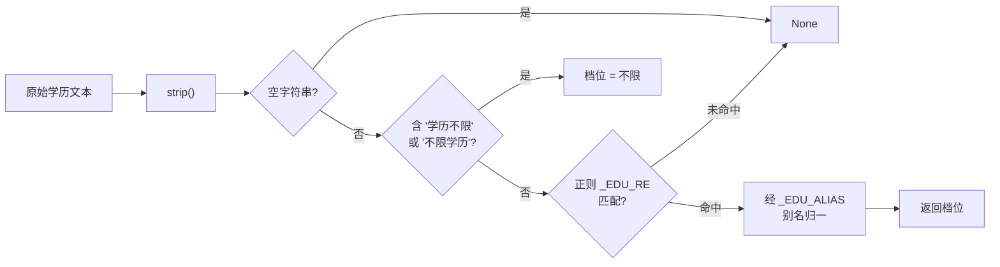
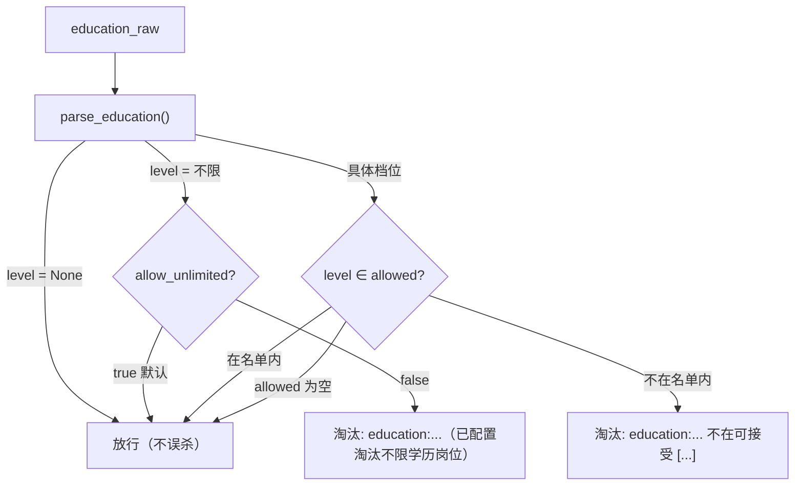
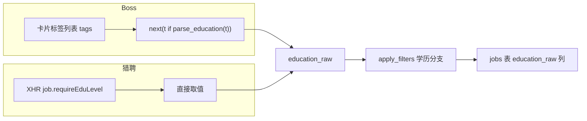

本文聚焦 `jobscrape` 中「学历」维度的过滤实现，回答两个问题：不同平台、不同写法的学历文案如何被归一成统一档位，以及这些档位如何通过一台「白名单」裁判机决定岗位的去留。内容涵盖解析函数 `parse_education`、过滤链中的学历分支、两平台的服务端学历参数编码，以及相关数据字段的落库路径；年限过滤的区间语义请参见 [年限过滤：解析与左开右闭区间匹配](15-nian-xian-guo-lu-jie-xi-yu-zuo-kai-you-bi-qu-jian-pi-pei)。

## 双层过滤：服务端参数与本地白名单

学历过滤在架构上分为**两层**，二者职责正交、可独立启用。第一层是**服务端筛选**：在 `searches.yaml` 里写 `education: "本科"`，采集器会把它翻译成平台搜索 URL 上的参数，从源头上只返回匹配学历的岗位。这一层各平台的取值不同，且写错会直接抛 `ValueError`，不做静默降级。第二层是**本地白名单过滤**：在 `profile.json` 的 `preferences.education.allowed` 里声明可接受的档位列表，`apply_filters` 会在岗位入库前逐条比对，命中则淘汰并记录 `reject_reason`。

Sources: [searches.example.yaml](src/jobscrape/searches.example.yaml#L14-L17), [boss.py](src/jobscrape/discovery/boss.py#L98-L104), [liepin.py](src/jobscrape/discovery/liepin.py#L50-L56), [base.py](src/jobscrape/discovery/base.py#L139-L153)

两层过滤的差异可归纳如下，理解这张表是理解「为什么本地层不可省」的关键：

| 维度 | 服务端筛选（searches.yaml） | 本地白名单（profile.json） |
| --- | --- | --- |
| 生效时机 | 抓取前，由搜索 URL 参数决定 | 抓取后，入库前逐条判定 |
| 平台支持 | Boss 五档齐全；猎聘缺博士档 | 两平台通用，基于归一档位 |
| 取值来源 | 平台的整数代码（见下文映射表） | 中文学历档位白名单 |
| 出错行为 | 非法值抛 `ValueError` | 无法识别的档位**放行不误杀** |
| 匹配语义 | 平台自行定义（各档互斥） | 白名单，岗位档位须在名单内 |

Sources: [README.md](README.md#L112-L124), [base.py](src/jobscrape/discovery/base.py#L144-L153), [searches.example.yaml](src/jobscrape/searches.example.yaml#L14-L17)

服务端层与本地层都依赖同一个**档位归一函数** `parse_education`。它是学历过滤的语义基石：无论文案来自 Boss 的卡片标签、猎聘的 XHR 字段，还是用户在 `allowed` 列表里手写的字符串，都要先经过它归一为统一档位，比较才有意义。

## 档位归一：parse_education 的设计

`parse_education` 的契约是「学历文本 → 归一档位；无法识别返回 `None`」。它的归一逻辑由三样东西构成：一个枚举型正则 `_EDU_RE`（按档位从低到高排列）、一个别名表 `_EDU_ALIAS`，以及一个常量 `EDU_UNLIMITED`。档位的完整取值是固定闭集：`初中及以下 / 初中 / 高中 / 中专 / 中技 / 大专 / 本科 / 硕士 / 博士 / 不限`。

Sources: [base.py](src/jobscrape/discovery/base.py#L52-L73)

归一路径中最重要的两个设计点，是**别名折叠**与**后缀剥离**。别名折叠处理猎聘的 `统招本科` 写法，通过 `_EDU_ALIAS = {"统招本科": "本科"}` 把它等同为基准档 `本科`；后缀剥离则由正则末尾可选的 `(?:及以上|以上)?` 完成，使 Boss 的 `本科及以上` 也取基准档 `本科`——这里刻意不把「及以上」升格成更高档，因为「本科及以上」的实际门槛就是本科。这两条规则让 `本科 / 统招本科 / 本科及以上` 三种写法塌缩为同一个档位，是白名单比对能够跨平台成立的前提。

Sources: [base.py](src/jobscrape/discovery/base.py#L52-L73), [test_education.py](tests/test_education.py#L21-L26)

`parse_education` 只认「学历语义」的词，且正则是**白名单式**的——只有出现在枚举里的词才算命中，其余一律返回 `None`。这一点保证了它被复用于标签识别时不会误判：Boss 卡片标签里混着 `3-5年`、`4天/周` 这类年限/兼职标签，正则不会把它们当成学历。当文本为空或无法识别（如实习卡的 `4天/周`）时返回 `None`，为下游的「不误杀」策略留出了判据。

Sources: [base.py](src/jobscrape/discovery/base.py#L61-L73), [test_education.py](tests/test_education.py#L28-L33)

## 白名单匹配语义

本地过滤的决策入口是 `apply_filters` 中的学历分支，它在过滤链里的位置排在最后（顺序为：标题黑名单 → 日结岗 → HR 不活跃 → 公司黑名单 → 薪资 → 年限 → 学历）。该分支只有在 `preferences.education` 非空时才生效，默认为 `null`（不启用），因此未配置学历偏好时不会淘汰任何岗位。

Sources: [base.py](src/jobscrape/discovery/base.py#L89-L93), [base.py](src/jobscrape/discovery/base.py#L139-L153), [config.py](src/jobscrape/config.py#L27-L29)

分支内部按四种情况分流，这是「白名单」语义的完整定义：

Sources: [base.py](src/jobscrape/discovery/base.py#L139-L153)

四种情况的具体语义值得逐条说明。第一，**无法识别放行**：`parse_education` 返回 `None` 时直接 `pass`，宁可保留可疑岗位也不误杀，这与「实习卡只有 `4天/周`」的数据现实相呼应。第二，**「不限」单列**：`学历不限` 归一为 `EDU_UNLIMITED`，其去留由布尔开关 `allow_unlimited` 控制，默认 `true`（保留）。第三，**具体档位走白名单**：岗位档位不在 `allowed` 内即淘汰。第四，**空名单等于不启用**：`if allowed and ...` 中的短路求值意味着 `allowed: []` 不会淘汰任何岗位。

Sources: [base.py](src/jobscrape/discovery/base.py#L139-L153), [test_education.py](tests/test_education.py#L53-L68)

白名单集合的构造同样做了归一处理。代码对 `allowed` 列表逐项调用 `parse_education`，把用户写的 `统招本科`、`本科及以上` 等变体统一为基准档，`parse_education` 返回 `None` 时则回退为字符串本身（`str(x).strip()`）。这使得配置侧与数据侧的归一逻辑共用同一套规则，避免了两端不一致。淘汰时生成的 `reject_reason` 形如 `education:本科及以上 不在可接受 ['本科', '硕士']`，其中可接受名单经 `sorted()` 排序以保证输出稳定。

Sources: [base.py](src/jobscrape/discovery/base.py#L150-L153), [test_education.py](tests/test_education.py#L48-L50)

## 平台服务端参数映射

当选择在搜索阶段落实学历筛选时，`education` 的取值不是档位中文，而是要翻译成各平台私有的整数代码。翻译表分别内置于两个采集器：Boss 用 `DEGREE_CODES`，猎聘用 `EDU_CODES`。`build_url` 会查表并把结果拼到 URL 上，若查不到则抛 `ValueError` 并列出所有可用档位，让配置错误尽早暴露。

Sources: [boss.py](src/jobscrape/discovery/boss.py#L36-L43), [boss.py](src/jobscrape/discovery/boss.py#L98-L104), [liepin.py](src/jobscrape/discovery/liepin.py#L28-L30), [liepin.py](src/jobscrape/discovery/liepin.py#L50-L56)

| 档位 | Boss `degree` | 猎聘 `eduLevel` |
| --- | --- | --- |
| `高中` | 206 | — |
| `大专` | 202 | 050 |
| `本科` | 203 | 040 |
| `硕士` | 204 | 030 |
| `博士` | 205 | 未内置（020/030 结果相同，无法确认） |

Sources: [boss.py](src/jobscrape/discovery/boss.py#L36-L43), [liepin.py](src/jobscrape/discovery/liepin.py#L28-L30), [README.md](README.md#L115-L121)

这张表揭示了两层过滤并存的现实原因：**服务端档位能力不对称**。Boss 的五档代码均经实测确认，而猎聘的博士档无法确认（020 与 030 返回结果相同），因此未内置——配 `education: "博士"` 于猎聘会显式报错，而非静默失效。此外猎聘的服务端年限参数实测无效，只有学历参数可用，这也是学历本地白名单在猎聘侧尤其重要的背景。平台代码与筛选参数的完整映射可参见 [平台城市代码与筛选参数映射](22-ping-tai-cheng-shi-dai-ma-yu-shai-xuan-can-shu-ying-she)。

Sources: [liepin.py](src/jobscrape/discovery/liepin.py#L28-L30), [liepin.py](src/jobscrape/discovery/liepin.py#L42-L56), [test_education.py](tests/test_education.py#L71-L80)

## 数据来源：education_raw 与落库

学历过滤的输入字段是 `education_raw`，它承载岗位公布的学历要求原文。两个平台的抽取路径完全不同：Boss 从卡片标签列表里用 `parse_education` 反选——`education_raw = next((t for t in tags if parse_education(t)), "")`，即「第一个能被识别为学历的标签」；猎聘则直接取 XHR JSON 中的结构化字段 `requireEduLevel`（如 `本科`、`统招本科`、`学历不限`）。

Sources: [boss.py](src/jobscrape/discovery/boss.py#L184-L191), [liepin.py](src/jobscrape/discovery/liepin.py#L166-L169)

Sources: [boss.py](src/jobscrape/discovery/boss.py#L186-L205), [liepin.py](src/jobscrape/discovery/liepin.py#L161-L183)

`education_raw` 会随岗位行一同写入 SQLite `jobs` 表。它被列入 `ALLOWED_COLUMNS`，并在 `_MIGRATIONS` 中登记了补列脚本，意味着旧版本数据库升级时会自动补上此列——但**升级前抓取的旧行该列为空**，此时学历过滤因输入为 `None` 而对其不生效，需重抓或手动补录。字段在导出侧的方言与查询方式详见 [数据字典与数据库直连查询](20-shu-ju-zi-dian-yu-shu-ju-ku-zhi-lian-cha-xun)。

Sources: [db.py](src/jobscrape/db.py#L53-L58), [db.py](src/jobscrape/db.py#L73-L82), [README.md](README.md#L170-L172)

被学历过滤淘汰的岗位不会被丢弃，而是带 `reject_reason` 入库，且默认不导出——`export` 的 `WHERE` 子句只有加了 `--include-rejected` 才会包含它们，这为人工「翻案」保留了原始证据。过滤链整体被设计为「不调用任何模型、规则可审计」，学历分支正是这一约束下的纯代码实现，其分层位置见 [采集器基类与纯代码过滤链](10-cai-ji-qi-ji-lei-yu-chun-dai-ma-guo-lu-lian)。

Sources: [base.py](src/jobscrape/discovery/base.py#L1-L1), [base.py](src/jobscrape/discovery/base.py#L172-L181), [export.py](src/jobscrape/export.py#L28-L28), [README.md](README.md#L158-L158)

## 测试覆盖与行为契约

学历模块有独立的测试文件 `test_education.py`，用例按「解析」与「过滤」两条主线组织，恰好对齐上文的两大职责。解析侧验证档位识别、别名归一与不误判；过滤侧验证白名单放行、淘汰、`allow_unlimited` 开关、空名单不启用，以及服务端参数映射与显式报错。

Sources: [test_education.py](tests/test_education.py#L13-L33), [test_education.py](tests/test_education.py#L41-L68)

| 测试用例 | 验证的行为契约 |
| --- | --- |
| `test_parse_level` | 各档位原样识别 |
| `test_parse_normalization` | `统招本科`/`本科及以上` → `本科`；`学历不限` → `不限` |
| `test_parse_unrecognized` | 年限/兼职标签不被误判为学历 |
| `test_filter_keeps_allowed` | 名单内档位（含变体）放行 |
| `test_filter_rejects_others` | 名单外档位淘汰，`reject_reason` 以 `education:` 开头 |
| `test_filter_unlimited` | 默认保留「不限」；`allow_unlimited: false` 时淘汰 |
| `test_filter_keeps_unknown` | `""` 与 `4天/周` 等无法解析者放行 |
| `test_filter_disabled_by_default` | 无配置 / 空名单视为不启用 |
| `test_liepin_search_education_param` | 猎聘 `eduLevel` 映射，非法档位抛错 |
| `test_experience_and_education_independent` | 年限与学历两维互不干扰，各报各的 `reject_reason` |

Sources: [test_education.py](tests/test_education.py#L13-L93)

其中 `test_filter_disabled_by_default` 与 `test_experience_and_education_independent` 两个用例最能体现设计意图：前者确立了「学历过滤缺省关闭、空名单不启用」的宽松默认，后者则通过 `experience` 与 `education` 同时配置的场景证明两个过滤维度彼此独立、淘汰理由不串味。配套测试的更广覆盖范围可参见 [单元测试覆盖范围](23-dan-yuan-ce-shi-fu-gai-fan-wei)；面向使用者的配置字段说明见 [过滤偏好配置](6-guo-lu-pian-hao-pei-zhi)。