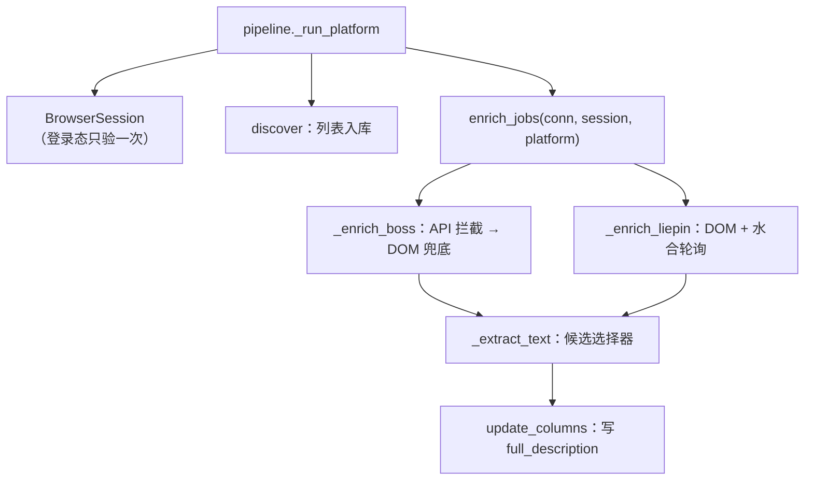
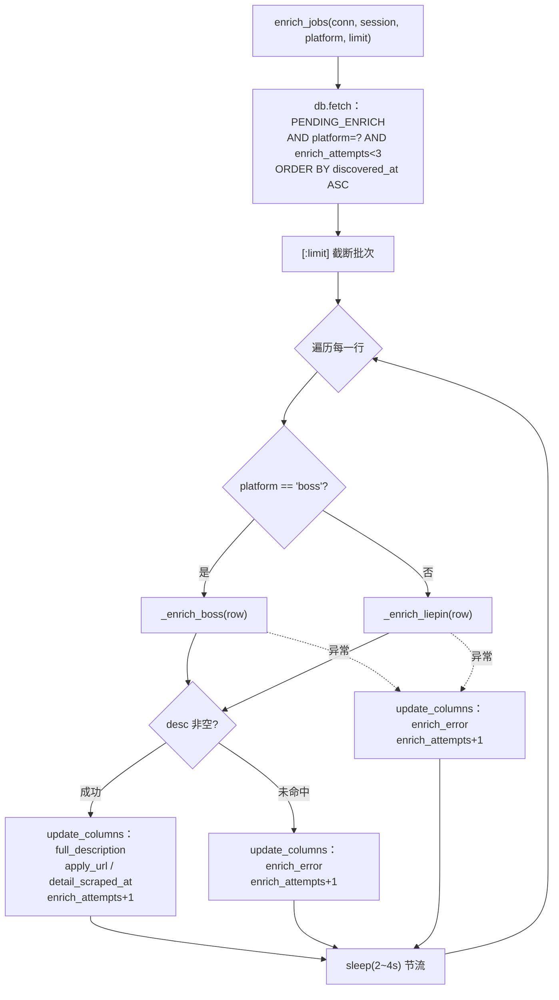
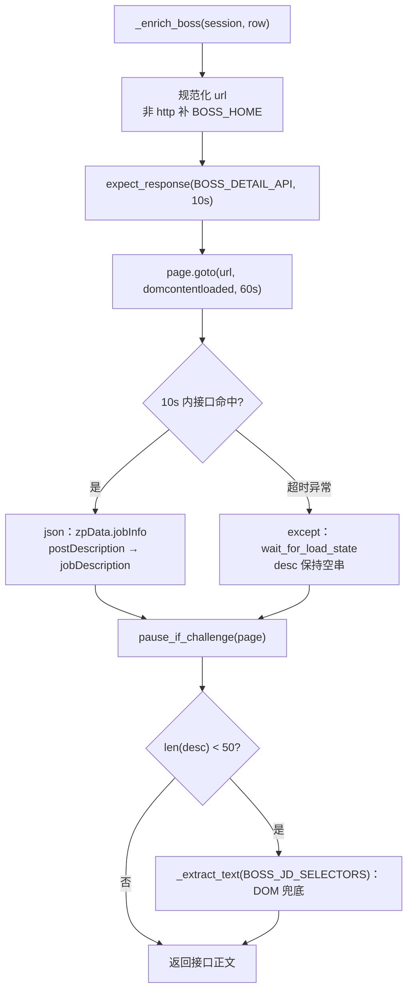
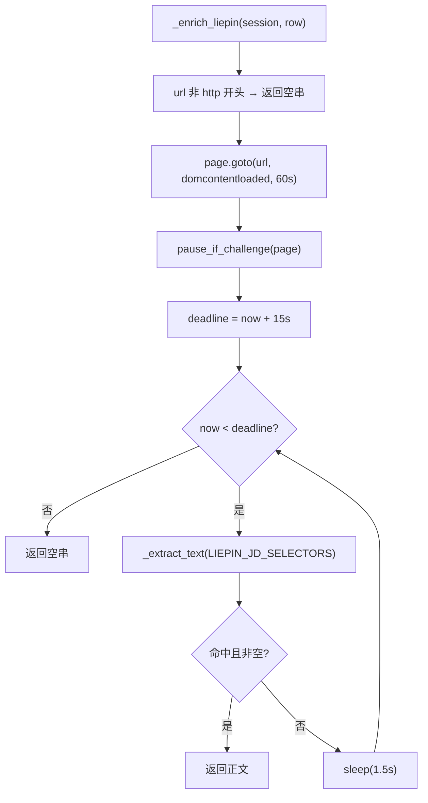
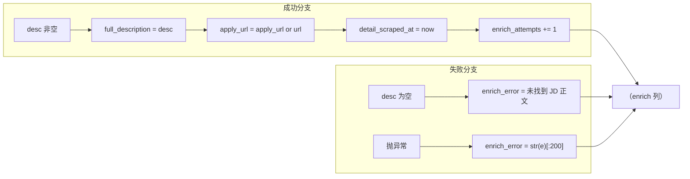

栏目前几页讲的是「**岗位列表**」如何拿到手——Boss 靠滚动加载解析 DOM 卡片，猎聘靠拦截搜索页 XHR。本页进入流水线的第二阶段 **enrich**：给已经入库的岗位补抓 **JD 正文（职位描述全文）**。与列表采集相比，JD 正文的取数有两个鲜明特征：一是**单条成本高**（每条都要新开页、导航、等待渲染），二是**取数路径按平台分裂**——Boss 优先拦详情接口的 JSON，猎聘则直接解析详情页 DOM。整个 `enrichment` 包只有一个文件 `detail.py`，本页围绕它拆解接口拦截、DOM 降级、以及猎聘 SPA 水合轮询三条主线。

Sources: [detail.py](../../../../src/jobscrape/enrichment/detail.py#L1-L5)

## 抓取策略总览：一条取数链，两套平台路径

`detail.py` 的模块文档字符串把策略一句话交代清楚：**Boss 优先走详情 API（`/wapi/zpgeek/job/detail.json` 服务端 JSON，无字体反爬），DOM 兜底；猎聘则是详情页 DOM 直接抓**。这条判断是整页的架构基石——它并非随意选择，而是两个平台的数据交付形态决定的：Boss 的详情正文既有渲染进 DOM 的文本，也有一条结构化的接口响应，而接口返回的服务端 JSON 不含列表页那种 PUA 私有区字体反爬，读取更稳；猎聘的详情正文则深藏在 React SPA 渲染后的 DOM 里，没有等价的、可直接拦截的正文接口。

Sources: [detail.py](../../../../src/jobscrape/enrichment/detail.py#L1-L5)

| 维度 | Boss 直聘 | 猎聘 |
| --- | --- | --- |
| 首选取数路径 | 拦截 `/wapi/zpgeek/job/detail.json` 响应 | 详情页 DOM 解析 |
| 首选路径的载体 | 服务端 JSON（`zpData.jobInfo`） | React SPA 渲染后的 DOM 节点 |
| 反爬负担 | 接口 JSON 无字体反爬 | 依赖 DOM 文本，需等水合完成 |
| 降级/兜底 | 接口超时或短文本 → DOM 选择器 | 无二次降级，靠轮询等选择器命中 |
| 判定正文的阈值 | `len(desc) < 50` 视为失败 | 选择器命中且文本非空即返回 |

Sources: [detail.py](../../../../src/jobscrape/enrichment/detail.py#L84-L131)

enrich 阶段挂载在流水线第二棒。`pipeline._run_platform` 在同一个 `with BrowserSession(platform)` 里，先跑 discover、再调用 `enrich_jobs(conn, session, platform, limit=...)`，两阶段共享同一浏览器会话与登录态。

Sources: [pipeline.py](../../../../src/jobscrape/pipeline.py#L72-L78)



Sources: [detail.py](../../../../src/jobscrape/enrichment/detail.py#L35-L48), [pipeline.py](../../../../src/jobscrape/pipeline.py#L56-L78)

## enrich_jobs：批次编排与双平台分派

`enrich_jobs` 是 enrich 阶段的编排入口。它首先从库里拣出**待抓**的行：谓词 `models.PENDING_ENRICH`（已发现、未抓、未被过滤）**再叠加 `platform = ?` 与 `enrich_attempts < 3`**，按 `discovered_at ASC` 排序，并用 `[:limit]` 截断到本轮上限。

Sources: [detail.py](../../../../src/jobscrape/enrichment/detail.py#L38-L43), [models.py](../../../../src/jobscrape/models.py#L16-L18)

拿到批次后，`for` 循环逐条处理，并按平台分派：`platform == "boss"` 走 `_enrich_boss`，否则走 `_enrich_liepin`。这个分派是**单点**且互斥的——同一行只会走一条路径，这与「列级状态机、阶段间零直接调用」的工程约束一致。

Sources: [detail.py](../../../../src/jobscrape/enrichment/detail.py#L45-L48)



Sources: [detail.py](../../../../src/jobscrape/enrichment/detail.py#L35-L71)

每条处理结束后都会 `time.sleep(random.uniform(2, 4))`，在条目之间插入 2–4 秒随机延时，降低被判为批量爬取的风险。分派、写库与重试次数的语义归属「抓取失败重试与断点续抓」，本页聚焦**取数策略本身**，其失败与续传细节见 [抓取失败重试与断点续抓](18-zhua-qu-shi-bai-zhong-shi-yu-duan-dian-xu-zhua)。

Sources: [detail.py](../../../../src/jobscrape/enrichment/detail.py#L45-L71)

## Boss 首选路径：拦截 detail.json 接口响应

Boss 的接口拦截用**响应等待模式**而非列表采集那种 `page.on("response")` 监听。核心常量是 `BOSS_DETAIL_API = "**/wapi/zpgeek/job/detail.json*"`——注意它是带通配符的 URL 匹配模式，允许接口带任意 query 参数。

Sources: [detail.py](../../../../src/jobscrape/enrichment/detail.py#L16-L19)

`_enrich_boss` 先规范化 URL（非 `http` 开头则补 `BOSS_HOME`），随后用 `page.expect_response(BOSS_DETAIL_API, timeout=10_000)` 开启一个**响应上下文**，在上下文内执行 `page.goto(url, wait_until="domcontentloaded", timeout=60_000)`。当详情接口在 10 秒内被触发，`resp_info.value.json()` 即可拿到响应体，字段从 `data["zpData"]["jobInfo"]` 里取，优先读 `postDescription`，回退到 `jobDescription`。

Sources: [detail.py](../../../../src/jobscrape/enrichment/detail.py#L84-L101)

这里有一个**关键的时序陷阱**，代码注释写得直白：**「列表页点击触发的 detail.json 不一定在直接打开详情页时出现，超时即降级 DOM 抓取」**。也就是说，`expect_response` 可能因为接口未被触发而抛超时异常，此时被 `except` 捕获，仅 `wait_for_load_state("domcontentloaded")` 兜住页面，`desc` 保持空串，流程继续向下走。

Sources: [detail.py](../../../../src/jobscrape/enrichment/detail.py#L85-L103)



Sources: [detail.py](../../../../src/jobscrape/enrichment/detail.py#L84-L107)

## DOM 降级：50 字门槛与候选选择器列表

**降级不是「接口失败才触发」，而是以文本长度为统一判据。** 无论接口是否命中，`_enrich_boss` 都会在导航后先调用 `pause_if_challenge(page)`，再判断 `if len(desc) < 50`——只要接口拿到的正文短于 50 字符（包括超时兜底留下的空串），就走 DOM 兜底。这个 50 字的阈值把「接口空手而归」和「接口只返回了残缺片段」两种情况统一纳入降级。

Sources: [detail.py](../../../../src/jobscrape/enrichment/detail.py#L104-L106)

DOM 兜底由 `_extract_text` 承担。它遍历传入的候选选择器列表，对每个选择器先 `page.locator(sel)` 判断 `count()`，命中则将节点文本逐条 `strip` 后以换行拼接，**只有当拼接结果长度 `>= min_len`（默认 50）才返回**；否则继续试下一个选择器，全部落空则返回空串。这形成了「**逐个尝试、取第一个命中且足够长**」的语义。

Sources: [detail.py](../../../../src/jobscrape/enrichment/detail.py#L74-L81)

```python
def _extract_text(page, selectors, min_len=50):
    for sel in selectors:                       # 候选选择器逐个尝试
        loc = page.locator(sel)
        if loc.count():                         # 命中节点
            text = "\n".join(t.strip() for t in loc.all_text_contents() if t.strip())
            if len(text) >= min_len:            # 长度达标才采纳
                return text
    return ""                                   # 全部落空 → 空串
```

Sources: [detail.py](../../../../src/jobscrape/enrichment/detail.py#L74-L81)

Boss 的候选选择器列表 `BOSS_JD_SELECTORS` 有三项：`div.job-sec-text`、`div.job-detail-section`、`div[class*='job-sec']`。注释点明设计意图——**平台改版时逐个尝试，取第一个命中的**。前两项是具体类名，最后一项用 `class*=...` 做模糊匹配，作为改版后的缓冲。

Sources: [detail.py](../../../../src/jobscrape/enrichment/detail.py#L21-L26)

| 顺序 | Boss 选择器 | 匹配风格 | 定位 |
| --- | --- | --- | --- |
| 1 | `div.job-sec-text` | 精确类名 | 当前主结构 |
| 2 | `div.job-detail-section` | 精确类名 | 备选结构 |
| 3 | `div[class*='job-sec']` | 属性模糊匹配 | 改版缓冲 |

Sources: [detail.py](../../../../src/jobscrape/enrichment/detail.py#L22-L26)

## 猎聘路径：DOM 直采 + SPA 水合轮询

猎聘没有走接口拦截，而是直接解析详情页 DOM，但多了一层**等待水合**的处理。`_enrich_liepin` 先规范化 URL（非 `http` 前缀直接返回空串），`goto` 后调用 `pause_if_challenge`，随后进入一个**截止时间驱动的轮询循环**：以 `time.monotonic() + 15` 秒为 deadline，每轮调 `_extract_text(LIEPIN_JD_SELECTORS)`，命中即返回，未命中则 `sleep(1.5)` 后重试，超时返回空串。

Sources: [detail.py](../../../../src/jobscrape/enrichment/detail.py#L112-L129)

轮询的动因写在注释里——**「2026-09：详情页是 React SPA，正文水合需数秒——轮询等选择器命中」**。相比 Boss 的固定超时等待，这里用「最多等 15 秒、每 1.5 秒试探一次」的活跃轮询，尽早拿到正文就尽早返回，避免无谓等待。

Sources: [detail.py](../../../../src/jobscrape/enrichment/detail.py#L122-L128)

猎聘的候选选择器 `LIEPIN_JD_SELECTORS` 同样三项，且注释记录了实测结构：`section.job-intro-container`、`dd.job-intro-container`、`div[class*='job-description']`。第一项对应注释标注的实测 DOM（`<section class="job-intro-container"><dl class="paragraph">`）。

Sources: [detail.py](../../../../src/jobscrape/enrichment/detail.py#L27-L32)



Sources: [detail.py](../../../../src/jobscrape/enrichment/detail.py#L112-L131)

## 与浏览器底座的衔接

两条取数路径都通过 `session.new_page()` 开新页，并在 `finally` 中 `page.close()`——页面级资源用 `try/finally` 保证回收，即便正文提取抛错也不会泄漏页签。这与 `BrowserSession` 的会话级封装形成两层生命周期分工，`BrowserSession` 的装配细节见 [浏览器会话封装与登录态持久化](13-liu-lan-qi-hui-hua-feng-zhuang-yu-deng-lu-tai-chi-jiu-hua)。

Sources: [detail.py](../../../../src/jobscrape/enrichment/detail.py#L89-L109), [detail.py](../../../../src/jobscrape/enrichment/detail.py#L115-L131)

`pause_if_challenge(page)` 在两条路径的导航之后各调用一次，用于检测滑块/登录/风控页并转入人工暂停。其 TTY 与非 TTY 两种等待分支的完整实现归属反检测专页，见 [反检测注入与验证页人工暂停](14-fan-jian-ce-zhu-ru-yu-yan-zheng-ye-ren-gong-zan-ting)。

Sources: [detail.py](../../../../src/jobscrape/enrichment/detail.py#L104), [detail.py](../../../../src/jobscrape/enrichment/detail.py#L121)

## 结果落库：正文写入与失败分流

当 `enrich_jobs` 拿到非空 `desc`，就通过 `db.update_columns` 一次性写入四个 enrich 列：`full_description=desc`、`apply_url=r["apply_url"] or r["url"]`、`detail_scraped_at=now_iso()`，并把 `enrich_attempts` 自增 1。注意 `apply_url` 的兜底语义——若该行没有独立的 `apply_url`，就回填 `url` 本身。

Sources: [detail.py](../../../../src/jobscrape/enrichment/detail.py#L49-L57), [db.py](../../../../src/jobscrape/db.py#L108-L116)

若正文为空（选择器未命中或水合超时），则走 else 分支，写入 `enrich_error="未找到 JD 正文（选择器可能过期）"` 并自增尝试次数；若提取过程抛异常，则由 `except` 捕获，把 `str(e)[:200]` 截断后写入 `enrich_error`。两条失败路径都只写 enrich 列，不触碰 discover 列，恪守「discovery 只写 discover 列，enrichment 只写 enrich 列」的模块边界。

Sources: [detail.py](../../../../src/jobscrape/enrichment/detail.py#L58-L69), [db.py](../../../../src/jobscrape/db.py#L1-L5)



Sources: [detail.py](../../../../src/jobscrape/enrichment/detail.py#L49-L69)

`enrich_attempts < 3` 的重试上限意味着每条岗位最多被尝试 3 次；写库成功后该列虽自增到 3，但 `PENDING_ENRICH` 谓词要求 `detail_scraped_at IS NULL`，命中过的行不会再被拣出——因此自增对成功行无副作用，只对连续失败的行起到封顶作用。失败行的 `enrich_error` 与 `enrich_attempts` 如何驱动续抓与人工翻案，见 [抓取失败重试与断点续抓](18-zhua-qu-shi-bai-zhong-shi-yu-duan-dian-xu-zhua)。

Sources: [detail.py](../../../../src/jobscrape/enrichment/detail.py#L40), [models.py](../../../../src/jobscrape/models.py#L16-L23), [db.py](../../../../src/jobscrape/db.py#L119-L134)

## 小结与延伸阅读

JD 全文抓取的设计可归纳为一条主线与一个统一判据：**主线**是「能拦接口就拦接口，拦不到就降级 DOM」——Boss 用 `expect_response` 抢 `/wapi/zpgeek/job/detail.json` 的服务端 JSON，猎聘因无等价接口而直采 SPA 渲染后的 DOM；**统一判据**是 50 字长度门槛，把接口空手、接口残缺、DOM 命中不足三种情形收敛到同一处降级决策。两条路径各自的脆弱点也随之明确：Boss 依赖接口路径与 `zpData.jobInfo` 的字段层级，猎聘依赖选择器命中与水合时长，任一改版都需更新 `BOSS_JD_SELECTORS` / `LIEPIN_JD_SELECTORS` 或 `BOSS_DETAIL_API`。

建议继续阅读以下相邻主题：

- [抓取失败重试与断点续抓](18-zhua-qu-shi-bai-zhong-shi-yu-duan-dian-xu-zhua)：`enrich_attempts`、`enrich_error` 与续抓语义
- [浏览器会话封装与登录态持久化](13-liu-lan-qi-hui-hua-feng-zhuang-yu-deng-lu-tai-chi-jiu-hua)：本页复用的 `BrowserSession` 与 `session.new_page()`
- [反检测注入与验证页人工暂停](14-fan-jian-ce-zhu-ru-yu-yan-zheng-ye-ren-gong-zan-ting)：导航后 `pause_if_challenge` 的完整实现
- [列级状态机：阶段契约与续传语义](8-lie-ji-zhuang-tai-ji-jie-duan-qi-yue-yu-xu-chuan-yu-yi)：enrich 列作为阶段完成标志的契约
- [SQLite 单表数据总线与去重入库](9-sqlite-dan-biao-shu-ju-zong-xian-yu-qu-zhong-ru-ku)：`update_columns` 与列白名单约束
- [猎聘采集：XHR 拦截与分页翻页](12-xi-pin-cai-ji-xhr-lan-jie-yu-fen-ye-fan-ye)：猎聘列表阶段的 XHR 拦截范式（与详情阶段 DOM 直采对照）