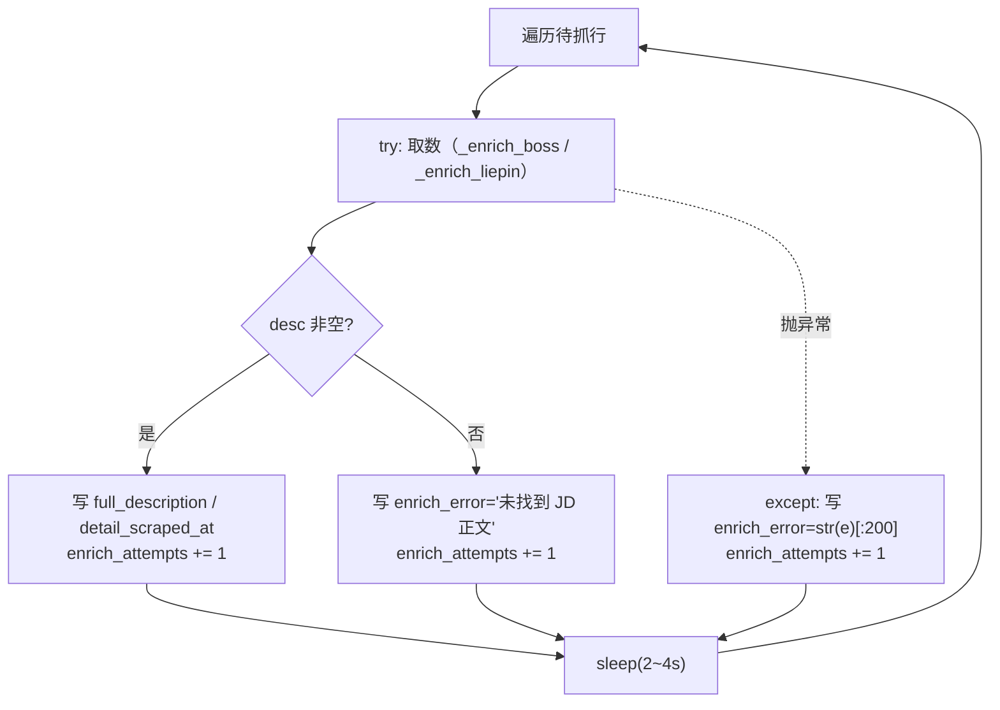
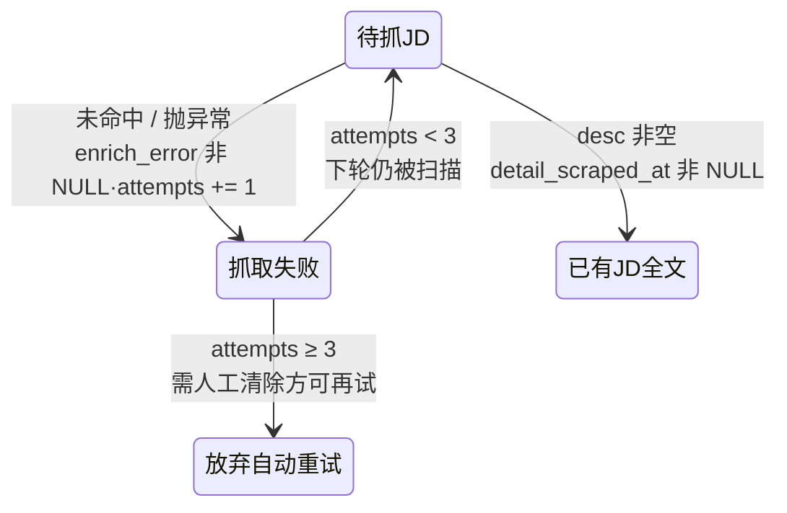
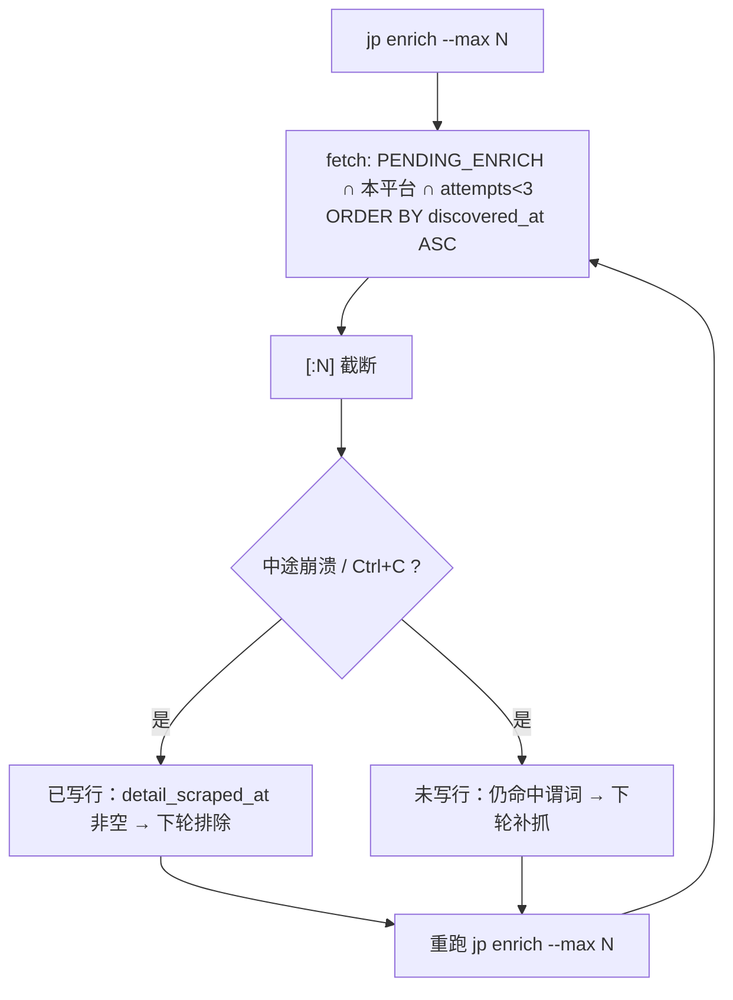
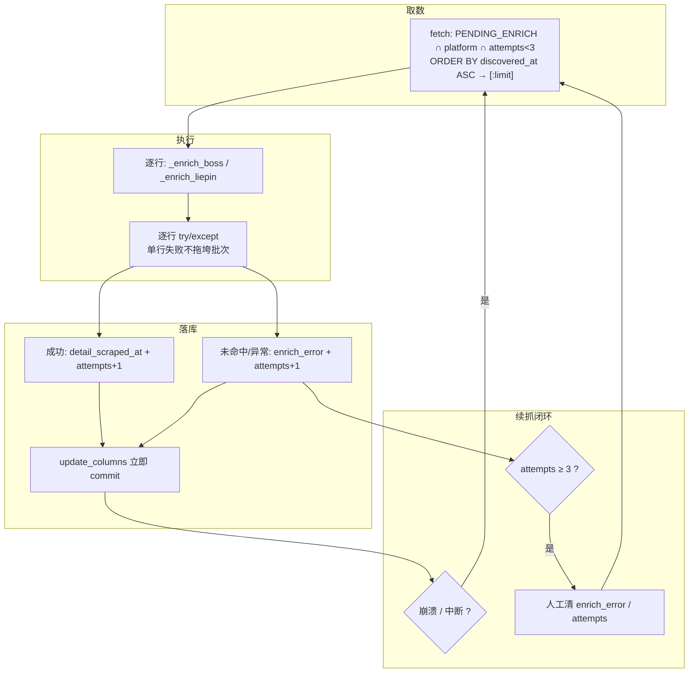

本页聚焦 enrich 阶段（JD 全文抓取）的**故障治理**：当某条岗位的 JD 抓取失败时，程序如何记录失败、如何在有限次数内自动重试、以及为什么中断后**重跑命令就能接着补**而无需任何断点文件。取数策略本身（Boss 的接口拦截 / DOM 降级、猎聘的 SPA 水合轮询）已在 [JD 全文抓取：接口拦截与 DOM 降级](17-jd-quan-wen-zhua-qu-jie-kou-lan-jie-yu-dom-jiang-ji) 展开；本页只关心「失败之后会发生什么」。阅读前建议先建立列级状态机的直觉，见 [列级状态机：阶段契约与续传语义](8-lie-ji-zhuang-tai-ji-jie-duan-qi-yue-yu-xu-chuan-yu-yi)。

Sources: [detail.py](src/jobscrape/enrichment/detail.py#L35-L71)

## 一、失败从何而来：两条失败形态，一种记录方式

`enrich_jobs` 的逐条处理循环把「单条岗位抓取」包在一个 `try` 里，随后按结果分流到**三个写库分支**。第一个分支是成功：当取数函数返回的正文非空（`if desc:`）时，写入 `full_description`、`apply_url`、`detail_scraped_at` 并把 `enrich_attempts` 加一。

Sources: [detail.py](src/jobscrape/enrichment/detail.py#L49-L57)

第二个分支是**「跑通了但没拿到正文」**——取数函数正常返回了空字符串（Boss 的接口超时且 DOM 候选选择器全部落空，或猎聘的 15 秒水合轮询耗尽）。此时写入 `enrich_error="未找到 JD 正文（选择器可能过期）"`，同样把 `enrich_attempts` 加一。

Sources: [detail.py](src/jobscrape/enrichment/detail.py#L58-L63)

第三个分支是**「抛异常」**——取数过程中任意一步出错（网络超时、页面被风控拦截、验证页人工暂停超时等），由 `except Exception as e` 捕获，把异常信息用 `str(e)[:200]` **截断到 200 字符**后写入 `enrich_error`，并照样把 `enrich_attempts` 加一。截断是为避免把超长堆栈塞进单列。

Sources: [detail.py](src/jobscrape/enrichment/detail.py#L64-L69)

下表把两条失败形态与成功形态对照。关键观察是：**三条分支都递增 `enrich_attempts`**——成功也涨、失败也涨，因此这个计数器实际记录的是「被尝试过几次」，而不是「失败过几次」。

| 分支 | 触发条件 | 写入的列 | `enrich_attempts` |
| --- | --- | --- | --- |
| 成功 | `desc` 非空 | `full_description` / `apply_url` / `detail_scraped_at` | +1 |
| 未命中 | 取数返回空串 | `enrich_error="未找到 JD 正文…"` | +1 |
| 异常 | 取数抛 `Exception` | `enrich_error=str(e)[:200]` | +1 |

Sources: [detail.py](src/jobscrape/enrichment/detail.py#L46-L69)



Sources: [detail.py](src/jobscrape/enrichment/detail.py#L44-L71)

## 二、有限重试：`enrich_attempts < 3` 的重试上限

断点续抓并不意味着「无限重试」。`enrich_jobs` 在取数谓词上额外叠加了一条 `AND enrich_attempts < 3`：每个岗位最多被尝试 **3 次**，之后不再进入自动扫描的范围。

Sources: [detail.py](src/jobscrape/enrichment/detail.py#L38-L43)

由于 `enrich_attempts` 在成功、未命中、异常三条分支里都会递增，失败会**消耗重试额度**。结合 `PENDING_ENRICH` 谓词要求 `detail_scraped_at IS NULL`，可以推出两条后果：成功行虽自增到 1，但因 `detail_scraped_at` 已非 NULL 而退出待抓集合，自增对它们无副作用；只有**连续失败的行**会被这条上限封顶。

Sources: [models.py](src/jobscrape/models.py#L16-L18)

这条约束的工程价值，是把失败行导向一个**可恢复的"终态"**：尝试满 3 次后，该行既不在待抓集合（已有 `enrich_error`），也不再被重试扫描——既避免对一条持续失败的坏行无休止重试，也避免高频请求触发平台风控。仓库维护约定把它固化为不可破坏的设计约束，并明确记录了「修好选择器后要重跑，需人工清除失败标志」这个代价。

Sources: [CHANGELOG.md](CHANGELOG.md#L55)



Sources: [detail.py](src/jobscrape/enrichment/detail.py#L38-L43), [detail.py](src/jobscrape/enrichment/detail.py#L49-L69)

## 三、断点续抓：为什么重跑命令就能接着补

续抓能力不靠断点文件，而是靠「取数谓词天然排除已完成行」。`enrich_jobs` 每轮通过 `db.fetch` 拉取待处理批次，查询同时叠加四个约束：命中 `PENDING_ENRICH`（已发现、未抓、未被过滤）、限定 `platform = ?`、限制 `enrich_attempts < 3`，再按 `ORDER BY discovered_at ASC`（先发现先抓）排序，最后用 `[:limit]` 截断到本轮上限。

Sources: [detail.py](src/jobscrape/enrichment/detail.py#L38-L43)

这四个约束共同构成了「断点」的语义：**已完成的行（`detail_scraped_at` 非 NULL）被自动排除，失败未满 3 次的行被自动纳入，顺序与上限保证每轮稳定推进**。因此一次 `jp run` 或 `jp enrich` 中途崩掉、被 Ctrl+C 掐断，都只是让**一批行停在「未写入」状态**——重跑命令时它们仍会被拣出，继续抓。

| 查询条件 | 作用 | 续抓语义 |
| --- | --- | --- |
| `PENDING_ENRICH` | 已发现、未抓、未过滤 | 已完成行自动排除，不重复抓 |
| `platform = ?` | 限定当前平台 | 平台间互不干扰 |
| `enrich_attempts < 3` | 限制重试上限 | 坏行最多试 3 次后停手 |
| `ORDER BY discovered_at ASC` | 先发现先抓 | 推进顺序稳定，可分批补齐 |
| `[:limit]` | 本轮上限 | 抓满即停，下次续抓 |

Sources: [enrichment/detail.py](src/jobscrape/enrichment/detail.py#L35-L43), [README.md](README.md#L73-L81)

`--max` 这一个参数身兼两职：既是「每个关键词 × 每个城市」的列表抓取上限，也是**本轮抓 JD 的条数上限**。所以当岗位总数多于 `--max` 时，会有部分行的 `full_description` 仍为空——这是预期行为，再跑几次即补齐。README 给出的操作节奏是「跑完看 `jp status` 的『待抓 JD』，不为 0 就再跑一次」。

Sources: [README.md](README.md#L71-L81)



Sources: [detail.py](src/jobscrape/enrichment/detail.py#L38-L43), [README.md](README.md#L73-L81)

## 四、逐行隔离：一条坏行不拖垮整批

断点续抓得以成立的另一个前提，是**失败的影响范围被压到单行**。`enrich_jobs` 的 `try/except` 位于 `for` 循环**内部**，因此某一行的异常只会写回该行的 `enrich_error`，循环随即继续处理下一行，批次不会中断。

Sources: [detail.py](src/jobscrape/enrichment/detail.py#L44-L69)

这种「逐行隔离」对验证页场景尤其关键。`pause_if_challenge` 在非交互环境（后台任务 / 定时）下，若验证页在 600 秒内仍未消失，会抛出 `RuntimeError`。该异常沿 `_enrich_boss` / `_enrich_liepin` 冒泡回 `enrich_jobs`，被那一行的 `except` 接住，记入 `enrich_error` 并递增尝试次数——**整批不会因此挂死**。

Sources: [browser.py](src/jobscrape/discovery/browser.py#L138-L145)

这构成了「平台 → 关键词 → 单条岗位」三级递进的错误隔离：编排层 `pipeline.py` 用最外层 `try/except` 隔离平台崩溃（单平台崩溃不影响另一平台），关键词循环隔离单关键词失败，而 enrich 循环内部的 `try/except` 隔离单条岗位。所有错误最终汇入 `RunResult.errors`，由 CLI 打印，并注明「不影响其他阶段，重跑 `jp run` 可续传」。

Sources: [pipeline.py](src/jobscrape/pipeline.py#L37-L40), [pipeline.py](src/jobscrape/pipeline.py#L63-L78), [cli.py](src/jobscrape/cli.py#L170-L181)

## 五、中断安全：写一行、提交一行、歇一歇

崩溃或 Ctrl+C 之所以「无害」，是因为**每写入一行就提交一次事务**。`db.update_columns` 在每次 `UPDATE` 之后立即 `conn.commit()`，`db.upsert_job` 同理，因此进程即使被强杀，已落盘的状态也不会回滚——下一轮扫描就会跳过这些已完成的行。

Sources: [db.py](src/jobscrape/db.py#L108-L116), [db.py](src/jobscrape/db.py#L86-L99)

每处理完一行，循环末尾执行 `time.sleep(random.uniform(2, 4))`，在条目之间插入 **2–4 秒随机延时**降低被判为批量爬取的风险。这也意味着抓取是「慢工」：50 条约需 3 分钟；但从续抓角度看，随机的、非固定节奏的间隔恰好也是对平台友好且对中断无感的处理方式。

Sources: [detail.py](src/jobscrape/enrichment/detail.py#L70), [README.md](README.md#L81)

## 六、验证页暂停：把故障转成人工恢复点

当取数路径导航后落入滑块 / 登录 / 风控页，`pause_if_challenge` 会把它转成一次**人工暂停**，而非直接判死。它依据 URL 特征（`safe/verify`、`verify-slider`、`signin`、`login`、`safe.liepin.com`、`verifysms`）识别挑战页，随后分两种等待分支：**交互终端**打印提示并 `input()` 等回车；**非 TTY 环境**（后台任务、定时）则每 5 秒轮询 URL，直到挑战消失或累计超过 `wait_seconds`（默认 600 秒）后抛 `RuntimeError`。

Sources: [browser.py](src/jobscrape/discovery/browser.py#L119-L145)

这段逻辑在 enrich 的两条取数路径里各被调用一次（Boss 与猎聘都在 `goto` 之后）。对续抓的意义在于：它**宁可暂停也不误过**——人工处理完验证页后，当前这条继续完成；若超时，则异常被逐行隔离逻辑接住，记入 `enrich_error`，等待下一轮重试（仍受 3 次上限约束）。其 TTY / 非 TTY 分支的完整实现属于反检测专页，见 [反检测注入与验证页人工暂停](14-fan-jian-ce-zhu-ru-yu-yan-zheng-ye-ren-gong-zan-ting)。

Sources: [detail.py](src/jobscrape/enrichment/detail.py#L104), [detail.py](src/jobscrape/enrichment/detail.py#L121)

## 七、人工恢复工作流：从失败数到重试 SQL

当有岗位确实修不动（选择器过期、平台改版），就必须人工介入。第一步是用 `jp status` 查看计数板里的「抓 JD 失败」——它由 `detail_scraped_at IS NULL AND enrich_error IS NOT NULL AND reject_reason IS NULL` 三条条件判定，正好等价于 `ENRICH_FAILED` 谓词。

Sources: [cli.py](src/jobscrape/cli.py#L41-L52), [db.py](src/jobscrape/db.py#L129-L132)

第二步是定位原因：`enrich_error` 列里存的就是失败原文（异常信息截断到 200 字符，或「未找到 JD 正文（选择器可能过期）」）。README 的维护小节把常见成因归纳为「选择器过期或未登录」。

Sources: [README.md](README.md#L223-L224)

第三步才是重试。由于失败行会被 `enrich_attempts < 3` 与 `enrich_error IS NOT NULL` 双重挡在自动扫描之外，**必须先人工清除失败标志**，否则重跑 `jp enrich` 不会碰它们。维护约定记录了两种清法：清空 `enrich_error`，或重置 `enrich_attempts`。这是一次有意的权衡——把「重试坏行」从自动行为改成了显式的运维动作。

Sources: [CHANGELOG.md](CHANGELOG.md#L54-L55)

| 症状 | 定位途径 | 恢复动作 |
| --- | --- | --- |
| 「抓 JD 失败」数不为 0 | `jp status` 计数板 | 查看 `enrich_error` 判断成因 |
| 选择器过期 | `enrich_error` 文案提示 | 修 `BOSS_JD_SELECTORS` / `LIEPIN_JD_SELECTORS` 后清标志重跑 |
| 未登录 / 登录态失效 | 失败多集中在某一平台 | 重新 `jp login <平台>` 后清标志重跑 |
| 尝试次数已满 3 | `enrich_attempts` 列 | 重置 `enrich_attempts`（或清 `enrich_error`）后再跑 |

Sources: [README.md](README.md#L223-L227), [CHANGELOG.md](CHANGELOG.md#L54-L55)

清标志可用任意 SQLite 客户端对 `~/.job-scrape-cn/db.sqlite3` 执行，例如把某平台未成功的行重新纳入待抓集合：

```sql
UPDATE jobs
SET enrich_attempts = 0, enrich_error = NULL
WHERE platform = 'boss' AND detail_scraped_at IS NULL;
```

Sources: [README.md](README.md#L176-L188), [CHANGELOG.md](CHANGELOG.md#L55)

## 八、机制全景与小结

把重试与续抓的各个部件串起来，一条岗位从失败到最终补齐的路径可以用下面的关系图概括：取数谓词决定「每轮抓谁」，三条写库分支决定「状态如何推进」，`enrich_attempts` 决定「何时停手」，逐行隔离与逐行提交决定「崩溃后能续」，人工清除决定「停手后如何复活」。



Sources: [detail.py](src/jobscrape/enrichment/detail.py#L35-L71), [db.py](src/jobscrape/db.py#L108-L116), [CHANGELOG.md](CHANGELOG.md#L54-L55)

下表汇总本页涉及的设计要点，便于改动时对照：

| 设计选择 | 解决的问题 | 实现位置 |
| --- | --- | --- |
| 三条分支统一递增 `enrich_attempts` | 计数"尝试次数"而非"失败次数" | `enrich_jobs` 循环 |
| `enrich_attempts < 3` | 给坏行设可恢复终态，避免无限重试 | 取数谓词 |
| `enrich_error=str(e)[:200]` | 记录失败原文且不撑爆单列 | 异常分支 |
| `try/except` 置于 `for` 内部 | 单行失败不拖垮整批 | `enrich_jobs` |
| 逐行 `commit` | 崩溃后已完成进度不回滚 | `update_columns` |
| `[:limit]` + `ORDER BY discovered_at ASC` | 分批稳定推进、可续抓 | `enrich_jobs` |
| `sleep(2~4s)` | 降风控、对中断无感 | `enrich_jobs` |
| 人工清除 `enrich_error` / `enrich_attempts` | 修好后显式复活失败行 | 运维 SQL |

Sources: [detail.py](src/jobscrape/enrichment/detail.py#L38-L71), [db.py](src/jobscrape/db.py#L108-L116), [CHANGELOG.md](CHANGELOG.md#L51-L57)

## 下一步

- 想理解「失败行如何被状态谓词判定与计数」，见 [列级状态机：阶段契约与续传语义](8-lie-ji-zhuang-tai-ji-jie-duan-qi-yue-yu-xu-chuan-yu-yi)。
- 想理解编排层如何编排两阶段与隔离平台崩溃，见 [两阶段流水线的编排与幂等续传](7-liang-jie-duan-liu-shui-xian-de-bian-pai-yu-mi-deng-xu-chuan)。
- 想理解续抓所依赖的 `update_columns` 与列白名单，见 [SQLite 单表数据总线与去重入库](9-sqlite-dan-biao-shu-ju-zong-xian-yu-qu-zhong-ru-ku)。
- 想深入验证页暂停的完整实现，见 [反检测注入与验证页人工暂停](14-fan-jian-ce-zhu-ru-yu-yan-zheng-ye-ren-gong-zan-ting)。