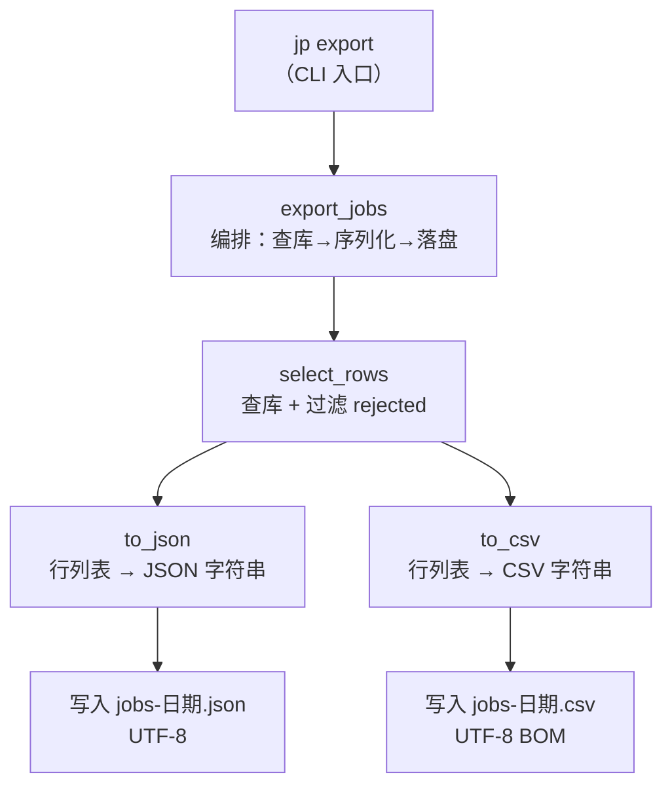
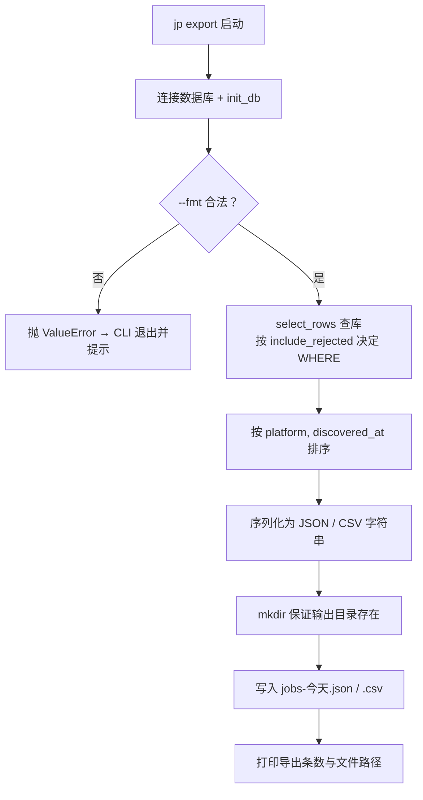

采集流水线把岗位数据持续写入 SQLite 的 `jobs` 单表，但这些数据躺在数据库里并不适合直接阅读或交给下游工具分析。本页聚焦流水线最后一个环节——**用 `jp export` 把库中的岗位快照导出为 JSON / CSV 文件**，讲解命令参数、导出字段、默认过滤行为与两种格式的编码细节。它只覆盖「读库 → 写文件」这一段，不涉及数据如何入库（参见 [SQLite 单表数据总线与去重入库](9-sqlite-dan-biao-shu-ju-zong-xian-yu-qu-zhong-ru-ku)）或如何直连数据库查询（参见 [数据字典与数据库直连查询](20-shu-ju-zi-dian-yu-shu-ju-ku-zhi-lian-cha-xun)）。

## 导出模块的职责定位

导出功能被收敛在独立模块 `src/jobscrape/export.py` 中，模块顶部文档字符串明确了它的定位：**为人工查看或下游分析输出抓取结果，默认写到 `~/.job-scrape-cn/exports/`，文件名带日期**。这种「采集与导出分离」的设计意味着导出是无副作用的——它只是库中数据的一次快照，反复执行不会改变任何岗位状态，也不会触发新的网络请求。

Sources: [export.py](../../../../src/jobscrape/export.py#L1-L4)

从调用链看，`export.py` 对外只暴露三层能力，彼此单向依赖、职责清晰：最底层是 `select_rows`（负责查库并决定哪些行导出），中间是纯函数 `to_json` / `to_csv`（把行列表序列化成字符串，不碰文件系统），最上层是 `export_jobs`（串起查库 + 序列化 + 落盘，返回写出的文件路径列表）。这种分层让序列化逻辑可以脱离数据库单独测试，也让 CLI 只需调用 `export_jobs` 一个入口。

Sources: [export.py](../../../../src/jobscrape/export.py#L27-L69)

## 命令用法与参数

导出的命令行入口是 `jp export`，由 Typer 定义在 `cli.py` 中，绑定的函数为 `export_cmd`（通过 `@app.command(name="export")` 注册，因此命令名是 `export` 而非函数名）。命令支持三个选项，默认行为是 **JSON 与 CSV 各导出一份**。

Sources: [cli.py](../../../../src/jobscrape/cli.py#L148-L156)

| 参数 | 默认值 | 作用 |
| --- | --- | --- |
| `--fmt` | `all` | 选择导出格式：`json`、`csv` 或 `all`（两者都导），传入其它值会报错 |
| `--include-rejected` | `False` | 是否把被纯代码过滤淘汰的岗位（`reject_reason` 非空）一起导出 |
| `--out-dir` | `~/.job-scrape-cn/exports/` | 自定义输出目录，不传则用运行时默认导出目录 |

Sources: [cli.py](../../../../src/jobscrape/cli.py#L149-L153), [README.md](../../../../README.md#L68)

典型用法如下：不带任何参数的 `jp export` 会在默认目录一次产出 JSON + CSV；`jp export --fmt csv --out-dir D:\data` 则只生成 CSV 并写到自定义目录。

Sources: [README.md](../../../../README.md#L52-L55)

命令内部的执行顺序是：先 `db.connect()` 连接并 `db.init_db(conn)` 确保表存在，再调用 `export.select_rows` 得到本次要导出的行（用于打印条数），随后调用 `export.export_jobs` 真正落盘，最后关闭连接并打印「导出 N 条」以及每个输出文件的路径。

Sources: [cli.py](../../../../src/jobscrape/cli.py#L155-L167)

## 输出路径与文件命名

输出目录由 `config.exports_dir()` 决定，它等于运行时根目录下的 `exports` 子目录。而运行时根目录取环境变量 `JOBSCRAPE_HOME`，未设置时默认是用户主目录下的 `~/.job-scrape-cn`。`runtime_dir()` 在返回前会确保 `cookies` 与 `exports` 两个子目录都被创建，因此导出目录通常早已存在。

Sources: [config.py](../../../../src/jobscrape/config.py#L34-L39), [config.py](../../../../src/jobscrape/config.py#L50-L51)

`export_jobs` 在写文件前还会做一次防护：用 `Path(out_dir)` 解析输出目录，并调用 `mkdir(parents=True, exist_ok=True)` 保证目录存在（即便用户通过 `--out-dir` 指定了一个不存在的路径也能自动创建）。文件名统一为 `jobs-<今天日期>.json` 与 `jobs-<今天日期>.csv`，日期用 `date.today().isoformat()` 生成，形如 `jobs-2026-09-01.json`。

Sources: [export.py](../../../../src/jobscrape/export.py#L56-L68)

由于文件名只精确到「天」，同一天内多次导出会**覆盖**同名文件而非追加。若需要保留多次快照，应通过 `--out-dir` 指定不同目录，而不是依赖文件名的区分。

Sources: [export.py](../../../../src/jobscrape/export.py#L58-L68)

## 导出哪些行：默认跳过被过滤岗位

导出范围完全由 `select_rows` 决定。它接收一个 `include_rejected` 开关，并据此动态拼接 SQL 的 `WHERE` 子句：当 `include_rejected=False`（默认）时条件为 `reject_reason IS NULL`，即只导出未被过滤的正常岗位；当 `True` 时条件退化为恒真式 `1=1`，把被淘汰的岗位也一并导出。

Sources: [export.py](../../../../src/jobscrape/export.py#L27-L33)

查询结果统一按 `ORDER BY platform, discovered_at` 排序，因此输出顺序是**先按平台分组、组内按发现时间升序**，便于人工按平台对照阅读。

Sources: [export.py](../../../../src/jobscrape/export.py#L30-L31)

被过滤的岗位仍然完整保留在数据库中（额外记录了 `reject_reason` 与 `rejected_at`），默认不导出只是因为它们对下游分析通常无价值；需要排查「为什么某岗位没出现」时，加 `--include-rejected` 即可把它们导出查看。

Sources: [db.py](../../../../src/jobscrape/db.py#L44-L46), [README.md](../../../../README.md#L158)

## 导出字段清单

导出字段并非「整表所有列」，而是由 `export.py` 顶部的常量 `FIELDS` 显式列举。这份清单共 22 个字段，大致可分为三组：**岗位基础信息**（platform、job_title、company、city、district）、**薪资与要求**（salary_raw / min / max / months、experience_raw、education_raw、job_tags）、以及 **HR 与来源、全文、时间戳**（hr_name、hr_title、hr_active、search_source、url、apply_url、full_description、discovered_at、detail_scraped_at、reject_reason）。

Sources: [export.py](../../../../src/jobscrape/export.py#L17-L24)

值得注意的是，数据库中存在但**不在导出清单**内的列包括 `enrich_error`、`enrich_attempts`、`rejected_at` —— 它们是流水线的内部状态列（用于重试与续传判断），不面向数据消费者，因此被有意排除在导出之外。

Sources: [db.py](../../../../src/jobscrape/db.py#L41-L46)

| 字段 | 含义 | 来源阶段 |
| --- | --- | --- |
| `platform` | 平台标识（`boss` / `liepin`） | discover |
| `job_title` / `company` / `city` / `district` | 岗位标题、公司、城市、区县 | discover |
| `salary_raw` | 薪资原文（如 `30-50K`） | discover |
| `salary_min` / `salary_max` / `salary_months` | 解析后的薪资上下限与月数 | discover |
| `experience_raw` | 岗位要求年限原文（如 `3-5年`） | discover |
| `education_raw` | 学历要求原文（如 `本科`） | discover |
| `job_tags` | 岗位标签 | discover |
| `hr_name` / `hr_title` / `hr_active` | HR 姓名、职务、活跃状态 | discover |
| `search_source` | 命中的搜索来源 | discover |
| `url` | 岗位详情页 URL（也是主键） | discover |
| `apply_url` | 投递链接 | enrich |
| `full_description` | JD 全文 | enrich |
| `discovered_at` / `detail_scraped_at` | 列表发现时间 / JD 抓取时间 | discover / enrich |
| `reject_reason` | 过滤淘汰原因（默认导出时为空） | 过滤 |

Sources: [export.py](../../../../src/jobscrape/export.py#L17-L24), [db.py](../../../../src/jobscrape/db.py#L14-L47)

## 两种序列化格式的实现细节

`to_json` 的实现极其精简：直接对行列表调用 `json.dumps`，并设置 `ensure_ascii=False` 与 `indent=2`。前者保证中文不被转义成 `\uXXXX` 因而可读，后者让每个字段独立成行、便于人眼查看与 diff。

Sources: [export.py](../../../../src/jobscrape/export.py#L36-L37)

`to_csv` 则借助标准库 `csv.DictWriter`，在内存中的 `io.StringIO` 缓冲区上写入。关键点是 `fieldnames=FIELDS` 固定了列顺序，且 `extrasaction="ignore"` 保证即使某行字典里带有 `FIELDS` 之外的键也不会抛错——这为字段清单与数据库列变更之间提供了一层松耦合的容错。

Sources: [export.py](../../../../src/jobscrape/export.py#L40-L45)

两种格式在落盘时的**编码策略刻意不同**，这是导出功能里最容易被忽略但最实用的设计：

| 格式 | 写入编码 | 原因 |
| --- | --- | --- |
| JSON | `utf-8` | JSON 本身是 UTF-8 标准，配合 `ensure_ascii=False` 直接可读 |
| CSV | `utf-8-sig` | 带 BOM 字节序标记，Windows 下 Excel 双击打开不会乱码 |

Sources: [export.py](../../../../src/jobscrape/export.py#L62-L68), [README.md](../../../../README.md#L174)

正因为 CSV 用了 `utf-8-sig`，下游代码读取该文件时也应使用 `encoding="utf-8-sig"` 才能正确剥离 BOM——这一点在导出模块的单元测试中就有示范。

Sources: [tests/test_export.py](../../../../tests/test_export.py#L56)

## 格式校验与错误处理

`export_jobs` 的第一件事是校验格式参数：把 `fmt` 统一转小写后，若不在 `("json", "csv", "all")` 三者之内，直接抛出 `ValueError("fmt 只能是 json / csv / all")`。这种「快速失败」避免了拼错格式却静默无输出的困惑。

Sources: [export.py](../../../../src/jobscrape/export.py#L52-L54)

CLI 层对这个异常做了兜底转换：它在 `try` 块里调用 `export_jobs`，捕获 `ValueError` 后先关闭数据库连接，再以 `typer.Exit(str(e))` 把错误信息作为退出消息抛出，让用户看到清晰提示而非 Python 堆栈。

Sources: [cli.py](../../../../src/jobscrape/cli.py#L158-L164)

完整的一次导出包含五个步骤，可用下面的流程图概括：

Sources: [cli.py](../../../../src/jobscrape/cli.py#L155-L167), [export.py](../../../../src/jobscrape/export.py#L48-L69)

## 测试覆盖

导出行为由 `tests/test_export.py` 专门覆盖，测试用 `monkeypatch.setenv("JOBSCRAPE_HOME", str(tmp_path))` 把运行时目录隔离到临时路径，再插入两条岗位——一条正常、一条带 `reject_reason`——来验证过滤与格式。

Sources: [tests/test_export.py](../../../../tests/test_export.py#L33-L44)

测试断言了三个核心契约：`fmt="all"` 时返回路径的后缀依次是 `.json` 与 `.csv`（对应输出顺序）、默认导出只含 1 条未过滤岗位而 `include_rejected=True` 时含 2 条、以及传入非法格式 `xlsx` 时抛出 `ValueError`。

Sources: [tests/test_export.py](../../../../tests/test_export.py#L47-L75)

## 小结与延伸阅读

`jp export` 是一条**只读、无副作用、按天覆盖**的轻量导出通道：它从 `jobs` 单表挑选 22 个面向消费者的字段，默认跳过被过滤岗位，按平台与时间排序，并针对两种格式采用不同的编码策略（JSON 用 UTF-8，CSV 用带 BOM 的 `utf-8-sig`）。理解这条链路后，建议继续阅读以下页面：

- 想了解每个字段在数据库中的完整定义与直连查询方式，参见 [数据字典与数据库直连查询](20-shu-ju-zi-dian-yu-shu-ju-ku-zhi-lian-cha-xun)
- 想理解数据是如何被写入 `jobs` 表的，参见 [SQLite 单表数据总线与去重入库](9-sqlite-dan-biao-shu-ju-zong-xian-yu-qu-zhong-ru-ku)
- 想了解 `reject_reason` 从何而来、哪些规则会淘汰岗位，参见 [过滤偏好配置](6-guo-lu-pian-hao-pei-zhi)
- 想了解导出目录所属的运行时目录与环境变量约定，参见 [运行时目录与环境变量](21-yun-xing-shi-mu-lu-yu-huan-jing-bian-liang)