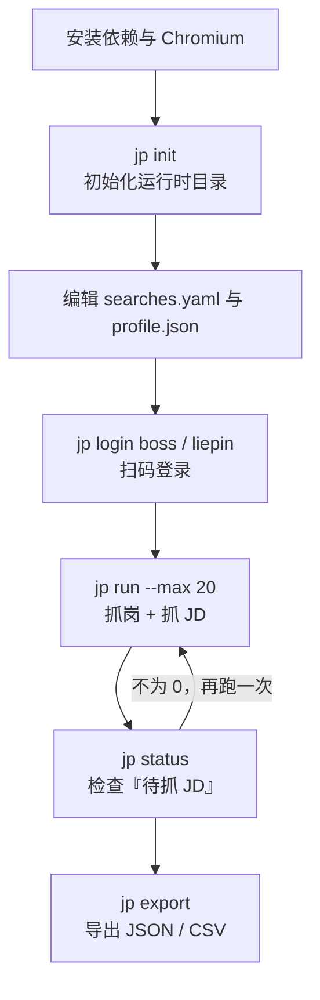

本页面向**初次接触本项目的开发者**，目标是用最短路径跑通「安装 → 初始化 → 登录 → 抓岗 → 抓 JD → 首次导出」这条完整链路。它是一份**串联式**的实操指南：每一步只给出「做什么、跑哪条命令、看到什么结果」，而各环节的深入原理（配置项语义、采集器实现、过滤规则细节）分别由后续专题页承载，本页会在相应位置给出跳转。

整个流程可以概括为**六步**，其中第 4 步（`jp run`）是可重复执行的幂等操作，第 3 步的登录态约一周有效，因此日常只需重复「跑一次 + 导出」。



Sources: [README.md](../../../../README.md#L36-L57), [src/jobscrape/cli.py](../../../../src/jobscrape/cli.py#L26-L186)

## 前置条件：Python 与浏览器底座

运行本工具需要 **Python 3.11+**，以及 Playwright 的 **Chromium 浏览器底座**。二者缺一不可——缺少 Chromium 时，`jp discover` / `jp enrich` / `jp run` 会直接抛 `Executable doesn't exist` 错误。项目通过 `pyproject.toml` 声明依赖并将命令行入口注册为 `jp`。

| 依赖 | 作用 | 声明位置 |
| --- | --- | --- |
| `typer>=0.12` | 命令行框架（`jp` 子命令） | `pyproject.toml` |
| `rich>=13.7` | 终端表格与彩色输出 | `pyproject.toml` |
| `pyyaml>=6.0` | 解析 `searches.yaml` | `pyproject.toml` |
| `playwright>=1.45` | 浏览器自动化底座 | `pyproject.toml` |

`jp` 命令由 `[project.scripts]` 中的 `jp = "jobscrape.cli:main"` 注册，安装后即可全局调用。

Sources: [pyproject.toml](../../../../pyproject.toml#L5-L23), [README.md](../../../../README.md#L33-L34)

## 第 1 步：安装项目与 Chromium

推荐使用 **uv**（更少的手工步骤）；若环境里没有 uv，则用 `pip` 方式。两种方式都必须在最后执行 `playwright install chromium` 才能补齐浏览器底座。

| 方式 | 命令序列 |
| --- | --- |
| uv（推荐） | `uv sync` → `uv run playwright install chromium` |
| pip | `python -m venv .venv` → `.venv\Scripts\activate` → `pip install -e .` → `playwright install chromium` |

安装细节（虚拟环境、离线环境、镜像加速等）由 [安装与环境准备](3-an-zhuang-yu-huan-jing-zhun-bei) 专页展开；本页只要求你能在终端成功打印出 `jp --help` 即视为安装完成。

Sources: [README.md](../../../../README.md#L19-L34), [pyproject.toml](../../../../pyproject.toml#L8-L16)

## 第 2 步：初始化运行时目录（`jp init`）

`jp init` 是所有操作的起点。它会在运行时目录下创建数据库文件，并生成两个**配置模板**供你按需编辑。运行时目录默认位于用户主目录下的 `~/.job-scrape-cn/`（在中文 Windows 上即 `C:\Users\<用户名>\.job-scrape-cn`），可通过环境变量 `JOBSCRAPE_HOME` 改到别处；目录会在首次访问时自动创建，并预置 `cookies/` 与 `exports/` 两个子目录。

```powershell
jp init                 # 首次执行：建库 + 生成配置模板
jp init --force         # 覆盖已存在的 profile.json / searches.yaml
```

命令执行后，运行时目录结构如下，理解它有助于后续排查问题：

```
~/.job-scrape-cn/            （或 $JOBSCRAPE_HOME 指定的目录）
├── db.sqlite3              # SQLite 单表 jobs，WAL 模式
├── db.sqlite3-wal          # WAL 日志（勿单独拷走，否则最新数据不可见）
├── db.sqlite3-shm
├── profile.json            # 过滤规则（纯代码，无模型）
├── searches.yaml           # 搜索配置（关键词 × 城市）
├── cookies/
│   ├── boss.json           # 登录态（storage_state：cookies + web/local/sessionStorage）
│   └── liepin.json
└── exports/
    ├── jobs-YYYY-MM-DD.json
    └── jobs-YYYY-MM-DD.csv
```

`jp init` 会在结束语中提示编辑上述两个文件，并给出下一步的登录命令，形成引导闭环。

Sources: [src/jobscrape/cli.py](../../../../src/jobscrape/cli.py#L26-L38), [src/jobscrape/config.py](../../../../src/jobscrape/config.py#L34-L78), [src/jobscrape/db.py](../../../../src/jobscrape/db.py#L14-L51)

## 第 3 步：编辑搜索与过滤配置

初始化后需要确认两处配置：**搜索什么**（`searches.yaml`）和**过滤掉什么**（`profile.json`）。`searches.yaml` 决定每个平台的 `keywords`（关键词）与 `cities`（城市），二者是**笛卡尔积**的关系——每个关键词都会逐城市抓一次；`profile.json` 决定标题黑名单、公司黑名单、薪资下限、年限与学历白名单等纯代码过滤规则。

一个最小的 `searches.yaml` 示例（写其它非法值会直接报错，不会静默失效）：

```yaml
boss:
  keywords: ["算子开发", "GPU 优化", "CUDA"]
  cities: ["北京", "上海", "深圳"]
  experience: "3-5年"     # 可选，仅 Boss 生效的服务端年限筛选
  education: "本科"       # 可选，服务端学历筛选
liepin:
  keywords: ["算子开发", "异构计算"]
  cities: ["北京", "上海"]
  max_pages: 3            # 猎聘翻页上限
  education: "本科"
```

配置项的完整语义（合法枚举值、城市代码覆盖、年限/学历档位映射）分别见 [搜索任务配置：关键词与城市](5-sou-suo-ren-wu-pei-zhi-guan-jian-ci-yu-cheng-shi) 与 [过滤偏好配置](6-guo-lu-pian-hao-pei-zhi)。若首次只是想验证链路是否通畅，可直接使用模板默认值，无需修改。

Sources: [src/jobscrape/searches.example.yaml](../../../../src/jobscrape/searches.example.yaml#L1-L30), [src/jobscrape/config.py](../../../../src/jobscrape/config.py#L16-L31), [README.md](../../../../README.md#L85-L158)

## 第 4 步：扫码登录（`jp login`）

采集依赖登录态，因此需要为每个要使用的平台执行一次扫码登录。命令会打开一个**有头浏览器**窗口，你完成扫码后程序会检测登录态并自动落盘；登录态保存在 `cookies/` 下，约一周有效。使用完毕后**直接关掉浏览器窗口即可退出**——登录态会持续保存，不会因关闭窗口而丢失。

```powershell
jp login boss       # Boss 直聘，检测 cookie 中的 wt2 / wt / bst
jp login liepin     # 猎聘，微信扫码，双证据判定（登录/注册消失 且 出现消息/我的简历/退出）
```

两个平台采用**不同的登录态判定策略**：Boss 直接检查 cookie 名是否命中 `wt2`、`wt`、`bst`；猎聘采用「双证据防假阳性」——同时满足「页面出现『登录/注册』字样消失」且「出现『消息』/『我的简历』/『退出』任一关键词」才算登录成功。猎聘的登录 token 存放在 `sessionStorage` 中，因此落盘时会在 `storage_state` 之外额外补抓 `session_storage`。

Sources: [src/jobscrape/cli.py](../../../../src/jobscrape/cli.py#L55-L103), [src/jobscrape/discovery/browser.py](../../../../src/jobscrape/discovery/browser.py#L58-L112)

## 第 5 步：抓岗与抓 JD（`jp run`）

登录完成后，一条命令即可跑完「抓岗位列表 → 抓 JD 全文」的完整流水线。`jp run` 是 `discover`（列表采集）与 `enrich`（JD 全文补抓）的组合，**幂等可续传**——中断后重跑只会补齐未完成的部分，不会重复抓取已完成的行。

| 命令 | 作用 | 关键参数 |
| --- | --- | --- |
| `jp discover` | 只抓岗位列表入库（含纯代码过滤） | `--platform boss/liepin/all`、`--max` |
| `jp enrich` | 只给已入库岗位补抓 JD 全文 | `--platform`、`--max` |
| `jp run` | discover + enrich 一条命令跑完 | `--platform`、`--max` |

`--max` 有**双重含义**：既是「每个关键词 × 每个城市」的列表抓取上限，也是**本轮抓 JD 的条数上限**。因此当岗位总数大于 `--max` 时，会有部分行的 `full_description` 仍为空，这是正常现象——`jp enrich` 每次都从「还没抓过 JD」的行里取最多 `--max` 条，抓满即停。

```powershell
jp run --max 20                 # 两个平台都抓
jp run --platform boss --max 20 # 只抓 Boss
jp enrich --max 50              # 单独补抓 JD；跑完看 jp status 决定是否再跑
```

抓 JD 时每条之间会**随机间隔 2–4 秒**（防风控），因此 50 条约需 3 分钟；中途 `Ctrl+C` 无害，重跑会接着补。每个岗位的 JD 最多**自动重试 3 次**（靠 `enrich_attempts < 3` 限制），超过后不再自动重试。流水线的幂等性来自「列级状态机」——某阶段完成即该阶段负责的列非 `NULL`，详见 [两阶段流水线的编排与幂等续传](7-liang-jie-duan-liu-shui-xian-de-bian-pai-yu-mi-deng-xu-chuan)。

Sources: [src/jobscrape/cli.py](../../../../src/jobscrape/cli.py#L106-L145), [src/jobscrape/pipeline.py](../../../../src/jobscrape/pipeline.py#L27-L79), [src/jobscrape/enrichment/detail.py](../../../../src/jobscrape/enrichment/detail.py#L35-L71), [README.md](../../../../README.md#L49-L81)

## 第 6 步：查看状态（`jp status`）

在导出前，用 `jp status` 确认采集进度。它会打印一张**计数板**，帮助判断「是否还需要再跑一次 `jp enrich`」以及「是否有抓取失败需要排查」。

| 计数项 | 判定逻辑 |
| --- | --- |
| 总岗位 | 表内全部行数 |
| 已有 JD 全文 | `full_description` 非空 |
| 待抓 JD | 已 discover、未抓 JD、且未被过滤 |
| 抓 JD 失败 | 未抓 JD 且 `enrich_error` 非空、且未被过滤 |
| 已过滤 | `reject_reason` 非空 |

只要「待抓 JD」不为 0，就说明还有岗位没补全 JD，再跑一次 `jp enrich --max 50` 即可（已完成的行不会被重复抓取，靠 `detail_scraped_at` 判断）。

Sources: [src/jobscrape/cli.py](../../../../src/jobscrape/cli.py#L41-L52), [src/jobscrape/db.py](../../../../src/jobscrape/db.py#L119-L134), [README.md](../../../../README.md#L73-L79)

## 第 7 步：首次导出（`jp export`）

最后一步是导出。`jp export` 默认同时生成 **JSON 与 CSV** 两个文件，写入运行时目录下的 `exports/`，文件名带当天日期（如 `jobs-2026-09-10.json`）。CSV 以 **UTF-8 BOM** 编码写出，用 Excel 双击打开不会乱码。被过滤的岗位默认**不导出**，加 `--include-rejected` 可一并导出查看。

```powershell
jp export                                  # JSON + CSV 写到 ~/.job-scrape-cn/exports/
jp export --fmt csv --out-dir D:\data      # 只导出 CSV 到指定目录
jp export --include-rejected               # 连同被过滤的岗位一起导出
```

导出字段固定为 22 列，覆盖平台、岗位标题、公司、城市、薪资、年限/学历原文、HR 信息、搜索来源、URL、JD 全文、时间戳与过滤原因等。

```powershell
# 导出成功后终端会回显条数与文件路径
# OK 导出 N 条：
#   ...\.job-scrape-cn\exports\jobs-2026-09-10.json
#   ...\.job-scrape-cn\exports\jobs-2026-09-10.csv
```

需要强调的是：**导出只是快照，数据始终留在 `db.sqlite3` 里**。不导出也不会丢数据，随时可重跑 `jp export` 生成新快照，或用任意 SQLite 客户端直连数据库查询，详见 [数据字典与数据库直连查询](20-shu-ju-zi-dian-yu-shu-ju-ku-zhi-lian-cha-xun)。

Sources: [src/jobscrape/cli.py](../../../../src/jobscrape/cli.py#L148-L167), [src/jobscrape/export.py](../../../../src/jobscrape/export.py#L17-L69), [README.md](../../../../README.md#L52-L54)

## 首次导出验证清单

完成全部步骤后，可用下表快速自检「链路是否真正跑通」。若任一项异常，多半是登录态、浏览器底座或选择器（平台改版）问题。

| 检查点 | 期望结果 | 异常时的方向 |
| --- | --- | --- |
| `jp --help` | 列出 7 个子命令 | 安装/入口注册失败，重装 |
| `jp status` | 打印计数板表格 | 运行时目录权限问题 |
| 计数板「总岗位」 | 大于 0 | 搜索关键词/城市配置为空 |
| 计数板「已有 JD 全文」 | 大于 0 | 未登录或 JD 选择器过期 |
| `exports/` 目录 | 出现 `jobs-<日期>.json` / `.csv` | 未执行 `jp export` |
| CSV 用 Excel 打开 | 中文正常、不乱码 | 编码问题（应为 UTF-8 BOM） |

Sources: [src/jobscrape/cli.py](../../../../src/jobscrape/cli.py#L14-L17), [src/jobscrape/db.py](../../../../src/jobscrape/db.py#L119-L134), [src/jobscrape/export.py](../../../../src/jobscrape/export.py#L48-L69)

## 常见问题速查

下表汇总首次跑通链路时最常遇到的几类问题及其处置方式；更系统的排查思路见项目根目录 `README.md` 的「维护与排错」一节。

| 现象 | 可能原因 | 处置 |
| --- | --- | --- |
| `Executable doesn't exist` | 未安装 Chromium 底座 | 运行 `playwright install chromium` |
| 抓不到列表 / 字段为空 | 平台改版，选择器过期 | 修改对应平台模块顶部的 `LOCATORS` / `XHR_MARKER` |
| 抓 JD 失败 | 选择器过期或未登录 | `jp status` 看失败数，`enrich_error` 列有原因 |
| 登录态失效 | 登录态过期（约一周） | 重新 `jp login <平台>` |
| 遇到滑块/验证页 | 风控触发 | 程序会**暂停并等待人工处理**，不自动过验证 |
| 部分行 `full_description` 为空 | 岗位数多于当轮 `--max` | 再跑 `jp enrich --max N` 补齐 |

其中「验证页人工暂停」是一个有意设计的行为：交互终端下等待回车，非交互环境最多轮询 10 分钟，达到超时才会抛错，绝不会用 `input()` 把后台进程挂死。

Sources: [README.md](../../../../README.md#L219-L228), [src/jobscrape/discovery/browser.py](../../../../src/jobscrape/discovery/browser.py#L123-L145), [src/jobscrape/dd](../../../../src/jobscrape/enrichment/detail.py#L35-L71), [src/jobscrape/enrichment/detail.py](../../../../src/jobscrape/enrichment/detail.py#L58-L69)

## 下一步阅读

至此你已完成首次导出。推荐按下列顺序继续深入，先补齐「快速上手」组，再进入「深入探索」组：

1. 若安装环节还有疑问，回到 [安装与环境准备](3-an-zhuang-yu-huan-jing-zhun-bei) 查看依赖与浏览器底座的完整说明。
2. 想系统了解所有命令与参数，读 [命令行命令体系](4-ming-ling-xing-ming-ling-ti-xi)。
3. 需要定制抓取范围与过滤偏好，读 [搜索任务配置：关键词与城市](5-sou-suo-ren-wu-pei-zhi-guan-jian-ci-yu-cheng-shi) 与 [过滤偏好配置](6-guo-lu-pian-hao-pei-zhi)。
4. 想理解为什么 `jp run` 能中断续传，进入 [两阶段流水线的编排与幂等续传](7-liang-jie-duan-liu-shui-xian-de-bian-pai-yu-mi-deng-xu-chuan)。
5. 想直接拿数据做分析，读 [数据字典与数据库直连查询](20-shu-ju-zi-dian-yu-shu-ju-ku-zhi-lian-cha-xun)。