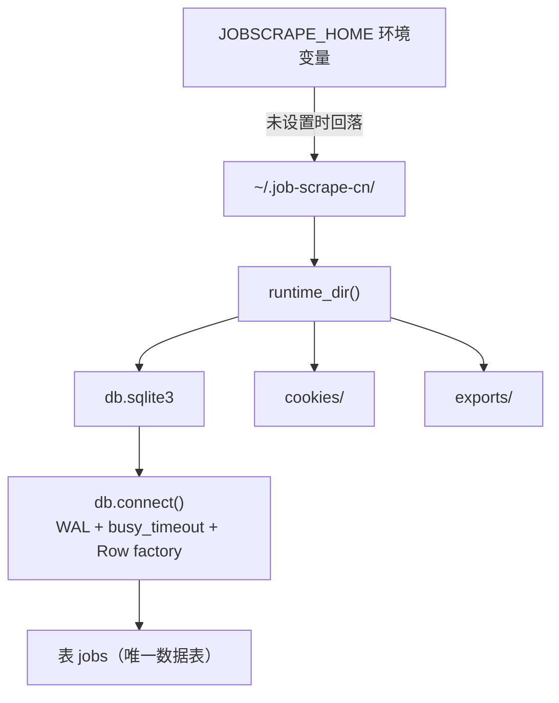
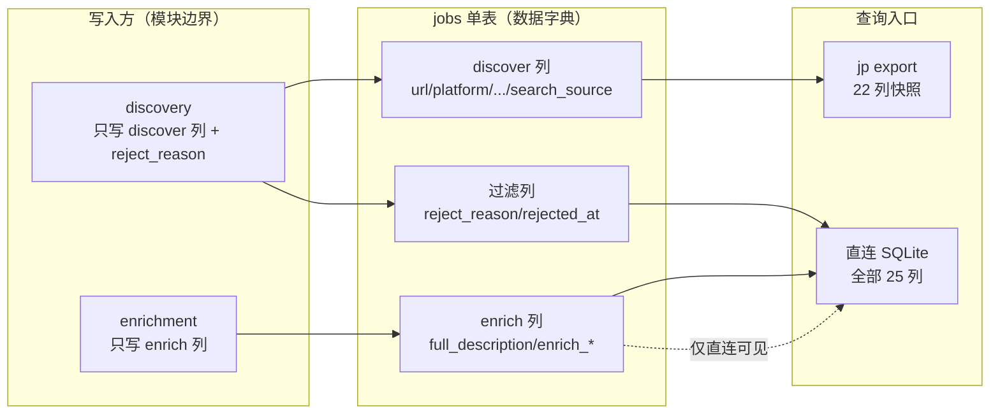

本页回答两个紧密相关的问题：**`jobs` 单表里每一列到底存什么、由谁写入**，以及**不导出、直接打开 SQLite 库时该怎么查**。前者是"数据字典"（schema 即契约），后者是"直连查询"（用任意 SQLite 客户端读同一份库）。理解这两点，才能安全地对采集结果做下游分析。

需要先建立一个核心认知：**数据库才是数据的唯一真相源，`jp export` 只是一次快照**。README 明确说明"不导出数据也一直在库里（`jp export` 只是快照）"，因此真正可查询的是 `~/.job-scrape-cn/db.sqlite3`，而不是导出的文件。
Sources: [README.md](../../../../README.md#L160-L176)

## 数据库定位与连接参数

运行时目录由 `config.runtime_dir()` 决定，取值优先级为环境变量 `JOBSCRAPE_HOME`，否则回落到用户主目录下的 `~/.job-scrape-cn`；数据库文件固定为该目录下的 `db.sqlite3`。也就是说，Windows 上直连的完整路径是 `C:\Users\<用户>\.job-scrape-cn\db.sqlite3`。
Sources: [config.py](../../../../src/jobscrape/config.py#L34-L43)

所有连接都由 `db.connect()` 统一构造，它在建连时施加了三个关键设置：开启 **WAL 日志模式**（`PRAGMA journal_mode=WAL`）、设置 **10 秒忙等待**（`PRAGMA busy_timeout=10000`，同时 `sqlite3.connect` 的 `timeout=10` 也生效），以及把 `row_factory` 设为 `sqlite3.Row`，让查询结果可以按列名访问。这意味着即使 `jp run` 正在写库，直连只读也不会轻易被锁死。
Sources: [db.py](../../../../src/jobscrape/db.py#L65-L70)



## 数据总线：单表 jobs 的结构

整库只有一张业务表 `jobs`，表体被拆成三个语义区块，用注释在 DDL 中显式标注：`discover`（列表页采集）、`enrich`（JD 全文）、过滤（纯代码规则淘汰）。这一"一列即一个阶段状态"的设计，是 `jp run` 幂等续传的基础，其续传语义与谓词定义详见 [列级状态机：阶段契约与续传语义](8-lie-jie-zhuang-tai-ji-jie-duan-qi-yue-yu-xu-chuan-yu-yi)。
Sources: [db.py](../../../../src/jobscrape/db.py#L1-L51)

建表脚本 `SCHEMA` 使用 `CREATE TABLE IF NOT EXISTS`，并在 `platform` 列上加了 `CHECK(platform IN ('boss','liepin'))` 约束，从数据库层拒绝非法平台值。此外还有一个**部分索引** `idx_jobs_pending_enrich`，仅对 `detail_scraped_at IS NULL` 的行建索引，专门加速"待抓 JD"的筛选。
Sources: [db.py](../../../../src/jobscrape/db.py#L14-L51)

值得注意的是旧库升级机制：`CREATE TABLE IF NOT EXISTS` 不会给已存在的表补新列，因此 `init_db` 会用 `PRAGMA table_info(jobs)` 读出已有列，再对 `_MIGRATIONS` 里声明的列执行 `ALTER TABLE ... ADD COLUMN`。目前迁移清单包含 `experience_raw` 与 `education_raw` 两列——**升级前抓的旧行这两列为空**，年限/学历过滤对它们不生效，需要重抓或手动补。
Sources: [db.py](../../../../src/jobscrape/db.py#L73-L83), [README.md](../../../../README.md#L169-L172)

## 字段字典（列级参考）

下表是 `jobs` 表的完整字段字典，按"写入阶段"分组。**"写入方"** 列标明了哪个模块负责写该列——这是模块边界的铁律：`discovery` 只写 discover 列，`enrichment` 只写 enrich 列，跨模块写列会破坏续传语义。
Sources: [db.py](../../../../src/jobscrape/db.py#L19-L46), [CHANGELOG.md](../../../../CHANGELOG.md#L49-L56)

| 列名 | 类型 | 阶段 | 写入方 | 含义与 NULL 语义 |
| --- | --- | --- | --- | --- |
| `url` | TEXT | discover | discovery | **主键**（岗位 URL 规范化）；`upsert_job` 靠它做去重 |
| `platform` | TEXT | discover | discovery | `'boss'` / `'liepin'`，受 `CHECK` 约束 |
| `job_title` | TEXT | discover | discovery | 岗位标题 |
| `company` | TEXT | discover | discovery | 公司名 |
| `city` | TEXT | discover | discovery | 城市（Boss 取公司地址首段，猎聘取 `dq` 首段） |
| `district` | TEXT | discover | discovery | 区/县（如"浦东新区"） |
| `salary_raw` | TEXT | discover | discovery | 薪资原文（Boss 已解码字体反爬） |
| `salary_min` | INTEGER | discover | discovery | 薪资下限（K/月） |
| `salary_max` | INTEGER | discover | discovery | 薪资上限（K/月） |
| `salary_months` | INTEGER | discover | discovery | 薪资月数（Boss 有 `·16薪`，猎聘固定 12） |
| `experience_raw` | TEXT | discover | discovery | 年限要求原文（`3-5年`/`经验不限`…）；旧行可能为空 |
| `education_raw` | TEXT | discover | discovery | 学历要求原文（`本科`/`统招本科`…）；旧行可能为空 |
| `job_tags` | TEXT | discover | discovery | 标签的 **JSON 数组字符串**（如 `['3-5年', '本科']`） |
| `hr_name` | TEXT | discover | discovery | HR 名（2026-09 起 Boss 列表页已不展示，常为空） |
| `hr_title` | TEXT | discover | discovery | HR 头衔（Boss 常为空；猎聘取 `recruiterTitle`） |
| `hr_active` | TEXT | discover | discovery | HR 活跃度（如"2月前活跃"，用于过滤不活跃 HR） |
| `search_source` | TEXT | discover | discovery | 命中的搜索关键词（即 `searches.yaml` 里的 keyword） |
| `discovered_at` | TEXT | discover | discovery | 入库时间（ISO 秒级，`now_iso()` 生成） |
| `full_description` | TEXT | enrich | enrichment | JD 全文；NULL 表示尚未抓取 |
| `apply_url` | TEXT | enrich | enrichment | 申请链接（Boss 兜底取 `url`） |
| `detail_scraped_at` | TEXT | enrich | enrichment | JD 抓取完成时间戳——**续传判断的核心列** |
| `enrich_error` | TEXT | enrich | enrichment | 抓取失败原因（选择器过期/未登录等） |
| `enrich_attempts` | INTEGER | enrich | enrichment | 尝试次数，默认 0；达到 3 次不再自动重试 |
| `reject_reason` | TEXT | 过滤 | discovery | 淘汰原因（如 `title_blacklist:外包`）；NULL 表示通过 |
| `rejected_at` | TEXT | 过滤 | discovery | 淘汰时间戳 |

各列的取值来源可以追溯到平台映射逻辑：Boss 从卡片标签中挑出能解析为年限/学历的那一条存入 `experience_raw` / `education_raw`，猎聘则分别取 XHR JSON 的 `requireWorkYears` 与 `requireEduLevel`。
Sources: [boss.py](../../../../src/jobscrape/discovery/boss.py#L184-L210), [liepin.py](../../../../src/jobscrape/discovery/liepin.py#L162-L189)

## 字典的强制机制：列白名单

数据字典不只是"文档上的约定"，代码里有实打实的白名单守卫。`db.py` 定义 `_DISCOVER_COLUMNS` 集合，与 enrich/过滤列合并成 `ALLOWED_COLUMNS`。`upsert_job` 与 `update_columns` 在写库前都会校验 `set(输入列) - ALLOWED_COLUMNS`，一旦出现未知列就抛出 `ValueError(f"未知列: {bad}")`——这保证任何拼写错误或越界写列都会在写入前失败，而不会污染表结构。
Sources: [db.py](../../../../src/jobscrape/db.py#L53-L62), [db.py](../../../../src/jobscrape/db.py#L86-L116)

另一个细节是 **NULL 过滤**：`upsert_job` 在构造 INSERT 时会丢弃值为 `None` 的键（`... if k in ALLOWED_COLUMNS and v is not None`），因此插入的行只会带上真正有值的列，未提供的列使用表默认值（如 `enrich_attempts` 默认 0，其余为 NULL）。
Sources: [db.py](../../../../src/jobscrape/db.py#L86-L99)

## 导出视图 vs 库内全量列

"数据字典"与"导出字段"并不是一回事：**导出是库内列的一个子集**。`export.py` 的 `FIELDS` 常量固定了导出顺序，共 22 列。对照上面的字段字典，可以发现三列**只存在于库内、不进入导出**：`enrich_error`、`enrich_attempts`、`rejected_at`。前者是排查抓取失败用的内部诊断列，后者是过滤时间戳。理解这一点很重要——**这些列只能通过直连查询看到**，导出文件里不会有。导出行为本身的细节见 [导出为 JSON 与 CSV](19-dao-chu-wei-json-yu-csv)。
Sources: [export.py](../../../../src/jobscrape/export.py#L17-L33), [README.md](../../../../README.md#L162-L167)

| 维度 | 库内 `jobs` 表 | 导出文件（JSON/CSV） |
| --- | --- | --- |
| 列范围 | 全部 25 列 | `FIELDS` 声明的 22 列 |
| 仅库内可见 | `enrich_error` / `enrich_attempts` / `rejected_at` | — |
| 被过滤岗位 | 始终保留 | 默认排除，`--include-rejected` 才含 |
| 用途 | 唯一真相源 / 续传状态 | 分析快照 |

## 直连查询实践

直连查询指用任意 SQLite 客户端直接打开 `db.sqlite3`，跳过导出流程。README 以 DBeaver CE 为例给出了三步：新建连接选 SQLite → Path 指向 `~/.job-scrape-cn/db.sqlite3` → 展开库查看 `jobs` 表。首次连接会提示联网下载 SQLite JDBC 驱动，**离线环境会卡在这一步**。
Sources: [README.md](../../../../README.md#L176-L182)

直连时有两条不可忽视的注意事项。第一是 **WAL 陷阱**：WAL 模式下最近的写入可能还在 `db.sqlite3-wal` 文件里，单独把 `db.sqlite3` 拷到别处打开会看不到最新数据——要拷贝就连同 `-wal` / `-shm` 一起拷，或直接在原路径打开。第二是 **只读建议**：应在 DBeaver 的编辑连接里勾选 Read-only connection，因为改坏状态列会直接让 `jp run` 的续传判断出错，例如清空 `detail_scraped_at` 会导致 JD 被重复抓取。
Sources: [README.md](../../../../README.md#L183-L188), [db.py](../../../../src/jobscrape/db.py#L65-L70)

`counts()` 函数是理解"哪些列构成计数板"的最佳样本——它正是 `jp status` 的数据源，用五条 SQL 分别统计总岗位、已有 JD、待抓 JD、抓 JD 失败、已过滤，可以直接照搬为直连查询模板。
Sources: [db.py](../../../../src/jobscrape/db.py#L119-L135)

### 常用查询模板

README 提供了两个可直接复用的 SQL：一个按平台汇总"岗位数 / 有 JD / 已过滤"，另一个按发现时间倒序取有 JD 全文的岗位列表。
Sources: [README.md](../../../../README.md#L190-L201)

```sql
-- 按平台统计采集与过滤概况
SELECT platform, COUNT(*) 岗位数,
       SUM(full_description IS NOT NULL) 有JD,
       SUM(reject_reason IS NOT NULL) 已过滤
FROM jobs GROUP BY platform;

-- 取最近发现、且已抓到 JD 全文的岗位
SELECT job_title, company, salary_raw, city, url
FROM jobs WHERE full_description IS NOT NULL
ORDER BY discovered_at DESC LIMIT 50;
```

如需排查抓取失败，可直连查询导出不可见的那几列；如需查看被过滤岗位及其原因，可查询 `reject_reason`——建议顺手把连接设为只读，避免误改续传状态列。
Sources: [export.py](../../../../src/jobscrape/export.py#L17-L24), [db.py](../../../../src/jobscrape/db.py#L119-L135)

```sql
-- 排查抓取失败（这三列不进入导出，只能直连看）
SELECT url, platform, enrich_attempts, enrich_error
FROM jobs WHERE enrich_error IS NOT NULL
ORDER BY enrich_attempts DESC;

-- 查看被过滤岗位的淘汰原因分布
SELECT reject_reason, COUNT(*) FROM jobs
WHERE reject_reason IS NOT NULL GROUP BY reject_reason;
```

## 概念关系总览

下图把"数据字典—写入方—查询入口"三者串起来，帮助定位每一列的责任边界与可见范围。
Sources: [db.py](../../../../src/jobscrape/db.py#L1-L135), [export.py](../../../../src/jobscrape/export.py#L17-L33)



## 下一步阅读

若想理解"为什么列等于阶段状态、续传如何靠这些列实现"，请继续阅读 [列级状态机：阶段契约与续传语义](8-lie-jie-zhuang-tai-ji-jie-duan-qi-yue-yu-xu-chuan-yu-yi)；若想理解 `url` 主键去重与 `upsert` 的入库语义，参见 [SQLite 单表数据总线与去重入库](9-sqlite-dan-biao-shu-ju-zong-xian-yu-qu-zhong-ru-ku)。导出字段与命令行参数则见 [导出为 JSON 与 CSV](19-dao-chu-wei-json-yu-csv)。