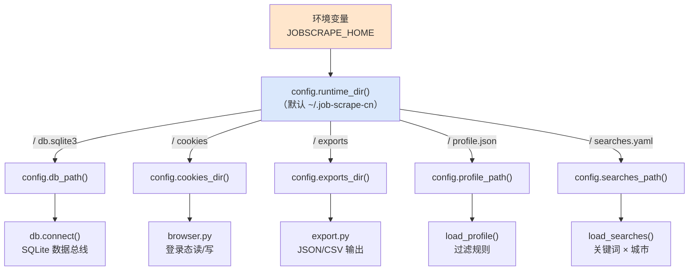
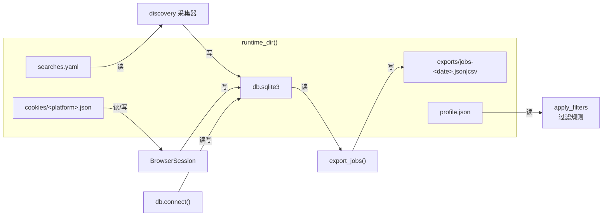

本页解释 JobScrape-CN 的**运行时目录**（程序在工作时读写的数据都放在哪儿）以及唯一的环境变量 `JOBSCRAPE_HOME`。源码里所有"文件路径"都不硬编码散落各处，而是统一收口在 `src/jobscrape/config.py` 中——理解这一个文件，就掌握了整个项目的落盘位置。本页只讲"文件放哪里、由谁读写、如何改位置"，具体配置项含义请分别参考 [搜索任务配置：关键词与城市](5-sou-suo-ren-wu-pei-zhi-guan-jian-ci-yu-cheng-shi) 与 [过滤偏好配置](6-guo-lu-pian-hao-pei-zhi)。

## 核心设计：一个可整体搬走的运行时目录

程序不在项目目录里写任何数据，而是把**所有运行产物**（数据库、登录态、配置、导出结果）都放在用户主目录下的 `~/.job-scrape-cn/` 中。承担这一职责的函数是 `runtime_dir()`：它先读取环境变量 `JOBSCRAPE_HOME`，读不到就退回 `Path.home() / ".job-scrape-cn"`，随后用 `mkdir(parents=True, exist_ok=True)` 保证目录存在，并顺手创建 `cookies/` 与 `exports/` 两个子目录（`exist_ok=True` 让重复调用不报错）。

Sources: [config.py](../../../../src/jobscrape/config.py#L34-L39)

之所以采用"集中式运行时目录"而不是"随代码就地落盘"，有三个直接收益：**其一**，源码目录保持干净，`.gitignore` 里只需排除 `*.sqlite3` 等文件即可，无需为每个功能单独配置忽略规则；**其二**，整个运行时目录可以整体打包、备份或搬到别处，数据自包含无绝对路径依赖；**其三**，测试可以把它指向临时目录实现完全隔离。

Sources: [.gitignore](../../../../.gitignore#L1-L12)

运行时目录的完整结构如下。注意 `profile.json` 与 `searches.yaml` 是"用户手动填写的输入"，`cookies/`、`db.sqlite3`、`exports/` 则是"程序产出的输出"：

```
~/.job-scrape-cn/                 # 运行时目录（JOBSCRAPE_HOME 可改）
├── db.sqlite3                    # SQLite 单表数据总线（+ -wal / -shm）
├── profile.json                  # 过滤偏好配置（jp init 生成默认值，用户编辑）
├── searches.yaml                 # 搜索任务配置（jp init 从包内模板复制）
├── cookies/                      # 登录态持久化
│   ├── boss.json                 # Playwright storage_state（cookies + localStorage + sessionStorage）
│   └── liepin.json
└── exports/                      # 导出结果（文件名带日期）
    ├── jobs-2026-09-01.json
    └── jobs-2026-09-01.csv
```

Sources: [config.py](../../../../src/jobscrape/config.py#L34-L59)

## 环境变量 JOBSCRAPE_HOME

项目**只使用一个环境变量**：`JOBSCRAPE_HOME`。它的作用就是把上面整个运行时目录"搬到别处"。当它被设置时，`db.sqlite3`、`cookies/`、`exports/`、`profile.json`、`searches.yaml` 会**全部**搬迁到该路径下——不存在"数据库在 A 处、登录态在 B 处"的部分迁移情况，因为所有路径函数都从同一个 `runtime_dir()` 派生。

| 场景 | 设置方式 | 效果 |
| --- | --- | --- |
| 默认（不设） | 无需操作 | 使用 `~/.job-scrape-cn/` |
| 换盘符/目录 | 设 `JOBSCRAPE_HOME=D:\jobdata` | 全部数据落到 `D:\jobdata\` |
| 测试隔离 | `monkeypatch.setenv("JOBSCRAPE_HOME", str(tmp_path))` | 数据写入临时目录，测试结束自动清理 |

Sources: [config.py](../../../../src/jobscrape/config.py#L35) · [test_export.py](../../../../tests/test_export.py#L33-L35)

环境变量的读取发生在**每次调用 `runtime_dir()` 时**，而非模块加载时。这意味着同一个进程内只要环境变量发生变化，后续所有路径解析都会立即跟随——这正是测试能够用 `monkeypatch` 动态切换目录的底层前提。

Sources: [config.py](../../../../src/jobscrape/config.py#L34-L36)

## 路径 API 一览：从 runtime_dir 派生的五个入口

`config.py` 对外暴露了五个路径函数，它们都是 `runtime_dir()` 的薄封装，只是拼接了不同的文件名或子目录。其余全部模块都通过这五个函数获取路径，**没有任何模块自己拼路径字符串**：

| 函数 | 返回路径 | 用途 | 主要消费者 |
| --- | --- | --- | --- |
| `db_path()` | `<home>/db.sqlite3` | SQLite 数据库文件 | [db.py](../../../../src/jobscrape/db.py#L66) 的 `connect()` |
| `cookies_dir()` | `<home>/cookies` | 登录态目录 | [browser.py](../../../../src/jobscrape/discovery/browser.py#L60) 读、[browser.py](../../../../src/jobscrape/discovery/browser.py#L110) 写 |
| `exports_dir()` | `<home>/exports` | 导出默认输出目录 | [export.py](../../../../src/jobscrape/export.py#L56) 的 `export_jobs()` |
| `profile_path()` | `<home>/profile.json` | 过滤偏好配置 | `load_profile()` |
| `searches_path()` | `<home>/searches.yaml` | 搜索任务配置 | `load_searches()` |

Sources: [config.py](../../../../src/jobscrape/config.py#L42-L59)

这个"单点收口"是关键工程约束：数据库连接、Cookie 落盘、导出输出、配置加载这四条完全不同的功能线，全部依赖同一组路径函数。若将来要改变目录布局，只需修改 `config.py` 一处。下图刻画了这种"一个源头、多路消费"的关系：



Sources: [config.py](../../../../src/jobscrape/config.py#L34-L59) · [db.py](../../../../src/jobscrape/db.py#L65-L70) · [export.py](../../../../src/jobscrape/export.py#L48-L57)

## 初始化：jp init 生成了什么

运行时目录里的文件并非全靠手写——`jp init` 命令会一次性建好数据库骨架并生成两份配置模板。它依次调用 `config.runtime_dir()`（建目录）、`db.connect()` + `db.init_db()`（建表）、`config.init_profile()`、`config.init_searches()`，最后打印各文件路径引导用户编辑。

Sources: [cli.py](../../../../src/jobscrape/cli.py#L26-L38)

`init_profile()` 的默认逻辑是：**若 `profile.json` 已存在则跳过**（返回已有路径），只有传 `force=True` 时才覆盖。新写入的内容是 `DEFAULT_PROFILE`——一个含标题黑名单默认值（`["外包", "驻场", "实习"]`）的 JSON，其余过滤项均为 `null` 表示"不过滤"。

Sources: [config.py](../../../../src/jobscrape/config.py#L16-L31) · [config.py](../../../../src/jobscrape/config.py#L62-L69)

`init_searches()` 采用同样的"存在即跳过"策略，但它不是硬编码内容，而是用 `shutil.copy` 把**包内模板** `searches.example.yaml` 复制到运行时目录。这里用到了 `PKG_DIR`——它由 `Path(__file__).resolve().parent` 得到，指向 `jobscrape` 包自身所在目录，从而能定位到随包发布的模板文件。

Sources: [config.py](../../../../src/jobscrape/config.py#L12) · [config.py](../../../../src/jobscrape/config.py#L72-L78)

| 文件 | 生成方式 | 内容来源 | 已存在时 |
| --- | --- | --- | --- |
| `db.sqlite3` | `db.init_db()` 执行建表脚本 | `db.py` 的 `SCHEMA` | `CREATE TABLE IF NOT EXISTS` 幂等，不报错 |
| `profile.json` | `init_profile()` 写入 JSON | `DEFAULT_PROFILE` 常量 | 跳过（除非 `--force`） |
| `searches.yaml` | `init_searches()` 复制模板 | 包内 `searches.example.yaml` | 跳过（除非 `--force`） |

Sources: [cli.py](../../../../src/jobscrape/cli.py#L31-L37) · [db.py](../../../../src/jobscrape/db.py#L77-L83)

这么设计是为了**保护用户已填写的配置**：反复运行 `jp init` 不会把辛苦编辑好的 `searches.yaml` 或 `profile.json` 冲掉，只有显式加 `--force` 才会覆盖。

Sources: [cli.py](../../../../src/jobscrape/cli.py#L28) · [config.py](../../../../src/jobscrape/config.py#L65-L66)

## 容错细节：配置缺失时的两种不同行为

两个 `load_*` 函数在"文件不存在"时行为**故意不同**，这是初学者容易踩坑的地方。`load_profile()` 发现 `profile.json` 不存在时直接抛出 `FileNotFoundError` 并提示"先运行: jp init"——因为过滤规则必须由用户明确决定，不能凭空猜测。

Sources: [config.py](../../../../src/jobscrape/config.py#L81-L85)

而 `load_searches()` 在文件缺失时会**自动补生成**：它先调用 `init_searches()` 从包内模板复制一份，再读取。同时它还会做一次白名单过滤，只保留 `boss` 与 `liepin` 两个键——即使模板里误加了其他顶级键，也不会被下游当作平台处理。

Sources: [config.py](../../../../src/jobscrape/config.py#L88-L94)

两种行为差异可归纳为：

| 函数 | 文件缺失时 | 设计意图 |
| --- | --- | --- |
| `load_profile()` | 抛 `FileNotFoundError` | 过滤规则需用户显式配置，不能默认放行 |
| `load_searches()` | 自动从模板生成后再读 | 搜索任务有合理默认模板，可开箱即用 |

Sources: [config.py](../../../../src/jobscrape/config.py#L83-L93)

## 各产物的生命周期与读写者

运行时目录中的文件各有明确的"谁写、谁读、何时写"闭环，这对排查"数据去哪了"至关重要。数据库由 `db.connect()` 打开（启用 WAL 日志模式与 10 秒忙等待超时），`db_path()` 是所有 SQL 读写的唯一入口。

Sources: [db.py](../../../../src/jobscrape/db.py#L65-L70)

登录态文件 `cookies/<platform>.json` 是**读写双向**的：`BrowserSession.__enter__` 通过 `load_storage_state()` / `load_cookies()` 回灌旧登录态，`__exit__` 通过 `save_cookies()` 落盘。`save_cookies()` 特意关闭一个隐患——当没有活页面可抓 sessionStorage 时，它会读取旧文件保留原有值，避免"登录态被空值覆盖"。

Sources: [browser.py](../../../../src/jobscrape/discovery/browser.py#L158-L200) · [browser.py](../../../../src/jobscrape/discovery/browser.py#L102-L112)

导出文件则由 `export_jobs()` 写入 `exports/`，文件名带 `date.today().isoformat()` 日期戳（如 `jobs-2026-09-01.json`）；CLI 也允许用 `--out-dir` 把输出改到任意目录，此时 `config.exports_dir()` 的默认值就被绕过——这是少数允许不走默认路径的地方。

Sources: [export.py](../../../../src/jobscrape/export.py#L56-L68) · [cli.py](../../../../src/jobscrape/cli.py#L148-L153)



Sources: [config.py](../../../../src/jobscrape/config.py#L34-L59) · [browser.py](../../../../src/jobscrape/discovery/browser.py#L85-L112) · [export.py](../../../../src/jobscrape/export.py#L48-L68)

## 测试中的目录隔离模式

由于所有路径都从 `runtime_dir()` 派生，测试只需一个 `monkeypatch.setenv("JOBSCRAPE_HOME", str(tmp_path))` 就能把整个运行时目录重定向到 pytest 提供的临时目录，从而做到**测试之间零污染、测后自动清理**。`tests/test_export.py` 的 `conn` fixture 是这一模式的典型：先设环境变量，再 `db.connect()`，这样数据库就落在 `tmp_path` 而非真实用户主目录。

Sources: [test_export.py](../../../../tests/test_export.py#L33-L44)

这一设计把"环境变量"从一个可选的便利功能，升级成了**可测试性的基础设施**——如果路径是硬编码的，测试就无法在不碰真实数据的前提下插入样例记录。

Sources: [test_export.py](../../../../tests/test_export.py#L35-L36)

## 小结与延伸阅读

`config.py` 中不到 100 行的代码，承担了"把外界环境映射为内部文件路径"的全部职责：通过 `runtime_dir()` 单一入口读取 `JOBSCRAPE_HOME`，派生出五个路径函数，再由 `db.py`、`browser.py`、`export.py` 分别消费。理解这一层，是排查 "`jp` 跑完数据在哪""为什么换了电脑登录态没了""测试怎么不污染我的数据库" 这类问题的钥匙。

- 想了解运行时目录中 `searches.yaml` 的字段含义，继续阅读 [搜索任务配置：关键词与城市](5-sou-suo-ren-wu-pei-zhi-guan-jian-ci-yu-cheng-shi)。
- 想了解 `profile.json` 的过滤规则配置，继续阅读 [过滤偏好配置](6-guo-lu-pian-hao-pei-zhi)。
- 想了解数据库本身的结构与直连查询，阅读 [数据字典与数据库直连查询](20-shu-ju-zi-dian-yu-shu-ju-ku-zhi-lian-cha-xun)。
- 想了解登录态文件是如何被抓取流程读取的，阅读 [浏览器会话封装与登录态持久化](13-liu-lan-qi-hui-hua-feng-zhuang-yu-deng-lu-tai-chi-jiu-hua)。