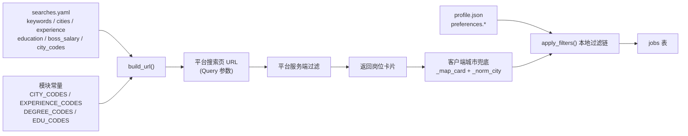
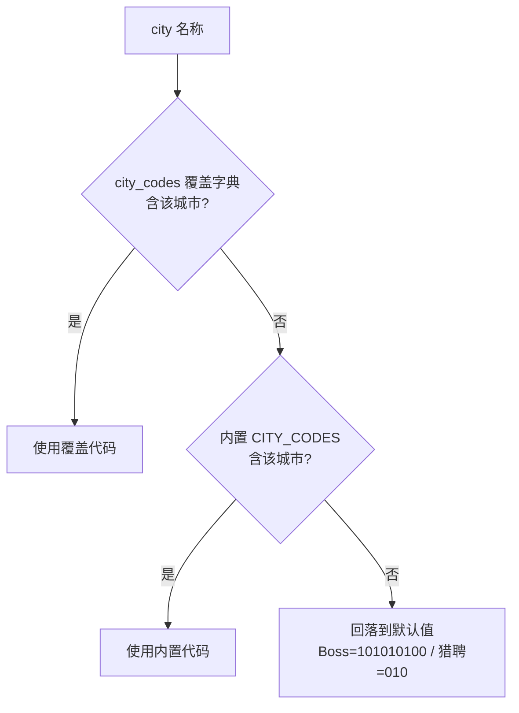

JobScrape-CN 需要同时对接 Boss 直聘与猎聘两个招聘平台，而两个平台对"同一座城市""同一档学历""同一段年限"使用了**完全不同的编码体系**：北京在 Boss 是 `101010100`，在猎聘却是 `010`；本科在 Boss 是 `degree=203`，在猎聘却是 `eduLevel=040`。本页说明这套映射体系如何被组织、如何被搜索配置覆盖，以及哪些筛选参数是**服务端生效**、哪些只能**本地兜底**。理解这套映射，是正确编写 `searches.yaml` 与排查"配了城市却抓到外地岗位""配了学历却毫无效果"类问题的前提。

Sources: [boss.py](../../../../src/jobscrape/discovery/boss.py#L18-L43), [liepin.py](../../../../src/jobscrape/discovery/liepin.py#L17-L30)

## 映射体系的整体设计

两个平台的发现器各自持有一组**模块级常量字典**（`CITY_CODES`、`EXPERIENCE_CODES`、`DEGREE_CODES`、`EDU_CODES`），它们是"人类可读的配置写法"到"平台私有的代码"之间的翻译表。这些常量只承载**已知被实测验证过**的取值：注释里反复出现 `2026-09 实测` 字样，说明每条映射都经过逐档抓取核对，未确认的档位（如猎聘博士档）被刻意排除在外。

运行时，`build_url` 方法把 `searches.yaml` 中用户填写的关键词与选项，翻译成平台搜索页的 URL 查询参数。整条链路是：**配置文件（searches.yaml）→ 发现器 build_url → 平台 URL Query 参数 → 服务端过滤**。与此并行的还有一条**本地过滤**链路（profile.json → apply_filters），两条链路的职责边界见下文。

Sources: [boss.py](../../../../src/jobscrape/discovery/boss.py#L86-L105), [liepin.py](../../../../src/jobscrape/discovery/liepin.py#L41-L57), [base.py](../../../../src/jobscrape/discovery/base.py#L89-L155), [searches.example.yaml](../../../../src/jobscrape/searches.example.yaml#L1-L17)

## 城市代码：内置表与三级覆盖

两个平台的城市代码长度与结构截然不同——Boss 使用九位数字串（`101010100`），猎聘使用短数字串（`010`、`050090`）。内置表收录了同样的十一座城市，覆盖主要一线与新一线城市：

| 城市 | Boss 代码（`city` 参数） | 猎聘代码（`city` / `dq` 参数） |
|------|--------------------------|-------------------------------|
| 北京 | `101010100` | `010` |
| 上海 | `101020100` | `020` |
| 深圳 | `101280600` | `050090` |
| 广州 | `101280100` | `050020` |
| 杭州 | `101210100` | `070020` |
| 成都 | `101270100` | `280020` |
| 南京 | `101190100` | `060020` |
| 苏州 | `101190400` | `060080` |
| 武汉 | `101200100` | `170020` |
| 西安 | `101110100` | `270020` |
| 合肥 | `101220100` | `150020` |

城市代码的解析采用**三级优先级**：优先读取配置里的 `city_codes` 覆盖字典，其次查内置 `CITY_CODES`，最后回落到硬编码的默认值（两平台都默认北京）。这意味着当内置表中没有某座城市时，可用 `city_codes: {城市名: 代码}` 直接覆盖，而不会因查表失败而中断。两个发现器使用完全一致的表达式结构，只有默认值不同：

Sources: [boss.py](../../../../src/jobscrape/discovery/boss.py#L18-L24), [boss.py](../../../../src/jobscrape/discovery/boss.py#L87), [liepin.py](../../../../src/jobscrape/discovery/liepin.py#L17-L23), [liepin.py](../../../../src/jobscrape/discovery/liepin.py#L48), [searches.example.yaml](../../../../src/jobscrape/searches.example.yaml#L5-L7), [test_liepin_city.py](../../../../tests/test_liepin_city.py#L36-L39)

## 猎聘的城市陷阱：`city` 与 `dq` 双参数

猎聘的城市过滤存在一个**反直觉的实测结论**：URL 上只带 `city` 参数**并不会真正过滤**——真正生效的过滤参数是 `dq`（地区）。当只给 `city` 时，XHR 请求体里的 `dq` 会落回默认值，结果混杂全国岗位。因此猎聘的 `build_url` 一律**同时写入 `city` 与 `dq` 两个参数，并赋予相同的城市代码**，缺一不可。测试对此有显式断言：URL 必须同时包含 `city=020` 与 `dq=020`，且注释直言"只给 city 不会过滤，必须带 dq"。

Sources: [liepin.py](../../../../src/jobscrape/discovery/liepin.py#L45-L49), [test_liepin_city.py](../../../../tests/test_liepin_city.py#L29-L33)

## 客户端城市兜底与名称归一

即便正确设置了 `dq`，实测显示猎聘仍会**混入约 5% 的外地推荐卡**。因此在服务端过滤之后，发现器还会在客户端做**第二层城市兜底**：`_map_card` 接收配置城市构成的允许集合 `allowed`，卡片若属于其他城市则返回 `None` 被丢弃并计数。

兜底的关键在于**城市名归一化** `_norm_city`：它把 `dq` 字段里形态各异的城市名统一为标准名——`"上海-浦东新区"` 取 `-` 前的主城得到 `上海`，`"北京市"` 去掉末尾的"市"得到 `北京`。当 `dq` 为空、无法判定城市时，函数**保留该卡片而非误杀**，这是"宁可多留不可错杀"的保守设计。测试覆盖了这三种路径：允许城市保留、其他城市丢弃、未知城市保留。

| 输入 `dq` | `_norm_city` 输出 | 配置允许 `{上海}` 时的结果 |
|-----------|-------------------|----------------------------|
| `上海-浦东新区` | `上海` | 保留 |
| `深圳-南山区` | `深圳` | 丢弃 |
| `深圳` | `深圳` | 丢弃 |
| `""`（空） | `""` | 保留（不误杀） |

Sources: [liepin.py](../../../../src/jobscrape/discovery/liepin.py#L62-L63), [liepin.py](../../../../src/jobscrape/discovery/liepin.py#L140-L159), [liepin.py](../../../../src/jobscrape/discovery/liepin.py#L192-L195), [test_liepin_city.py](../../../../tests/test_liepin_city.py#L22-L59)

## 筛选参数映射：服务端生效 vs 本地兜底

并非所有筛选都能交给平台服务端。两个平台对"年限""学历""薪资"三种筛选的支持程度差异悬殊，配置项因此被分派到两条不同的处理链路上：

| 筛选维度 | 配置项（`searches.yaml`） | Boss 服务端 | 猎聘服务端 | 本地兜底（profile.json） |
|----------|--------------------------|-------------|-----------|--------------------------|
| 城市 | `cities` / `city_codes` | ✔ `city` | ✔ `city` + `dq` | ✔ 客户端归一兜底 |
| 年限 | `experience` | ✔ `experience=…` | ✘ 不生效 | ✔ `preferences.experience` |
| 学历 | `education` | ✔ `degree=…` | ✔ `eduLevel=…` | ✔ `preferences.education` |
| 薪资 | `boss_salary` | ✔ `salary=…` 透传 | — | ✔ `preferences.salary_min_k` |

Boss 的年限与学历都能通过服务端参数生效；猎聘**只有学历参数可用**，年限参数（`workYearCode`）实测不改变结果，因此配了 `experience` 只会打印一条提示，引导用户改用 `profile.json` 的本地过滤。薪资方面，Boss 的 `boss_salary` 值被**原样透传**为 URL 的 `salary` 参数（例如 `"402"` 表示 20-30K），映射表中不含任何翻译逻辑。

Sources: [searches.example.yaml](../../../../src/jobscrape/searches.example.yaml#L4-L17), [boss.py](../../../../src/jobscrape/discovery/boss.py#L86-L105), [liepin.py](../../../../src/jobscrape/discovery/liepin.py#L41-L57)

## Boss 服务端参数映射表

Boss 发现器维护两张映射表，分别对应 `experience` 与 `degree` 两个查询参数。年限表中一个值得注意的细节是**"1年以下"与"1年以内"映射到同一个代码 `103`**——两平台对同一语义的措辞不同（Boss 写"以内"，猎聘写"以下"），但 Boss 服务端将其视作同一档。

| 配置值（Boss `experience`） | 服务端代码 | 配置值（Boss `education`） | 服务端代码（`degree`） |
|-----------------------------|-----------|----------------------------|------------------------|
| `1年以下` | `103` | `高中` | `206` |
| `1年以内` | `103` | `大专` | `202` |
| `1-3年` | `104` | `本科` | `203` |
| `3-5年` | `105` | `硕士` | `204` |
| `5-10年` | `106` | `博士` | `205` |
| `10年以上` | `107` | — | — |

注释明确标注这些代码在 `2026-09` 经过逐档实测（每档 15 张卡片全部命中），并特意排除了混合档 `201`。测试对映射做了回归校验：`3-5年` → `experience=105`、`1年以内` → `experience=103`、`本科` → `degree=203`、`博士` → `degree=205`，且未配置的维度不应出现在 URL 中。

Sources: [boss.py](../../../../src/jobscrape/discovery/boss.py#L26-L43), [test_experience.py](../../../../tests/test_experience.py#L100-L122)

## 猎聘学历映射与年限的显式降级

猎聘的学历参数 `eduLevel` 仅内置三档，且**博士档因无法确认而未收录**——注释解释 `020` 与 `030` 结果相同，博士档代码无法验证，故不臆造。年限参数则不进入映射表，而是走一条**提示而非静默失败**的降级路径：当配置里出现 `experience` 时，`build_url` 会打印提示，告知用户改用本地过滤。

| 配置值（猎聘 `education`） | 服务端代码（`eduLevel`） |
|----------------------------|--------------------------|
| `本科` | `040` |
| `硕士` | `030` |
| `大专` | `050` |

可以看到，**同一档学历在两平台的代码不同**：本科在 Boss 是 `203`、在猎聘是 `040`；硕士在 Boss 是 `204`、在猎聘是 `030`。这正是映射体系必须按平台隔离的根本原因。

Sources: [liepin.py](../../../../src/jobscrape/discovery/liepin.py#L28-L30), [liepin.py](../../../../src/jobscrape/discovery/liepin.py#L42-L56), [test_education.py](../../../../tests/test_education.py#L71-L80)

## 非法参数：显式报错而非静默失效

映射表未收录的取值会触发 `ValueError`，并在错误信息里用 `sorted(...)` 列出全部可接受取值，帮助用户即时定位。这一策略的动机在测试注释中写得很直白：**"服务端参数实测只支持这几档，写错要显式报错而不是静默失效"**。因为若静默忽略非法参数，用户会得到一个"筛选看似配了却毫无效果"的结果，这类问题极难排查。

需要注意的是两个平台对"不支持的参数"处理方式不同：**非法取值**（如 Boss 写 `3年`、猎聘写 `博士后`）一律抛 `ValueError`；而**平台整体不支持的参数**（猎聘的 `experience`）只打印提示、不中断流程，因为配置本身在语法上合法，只是该平台无此能力。两条路径的差异体现了"配置错误"与"能力缺失"的语义区分。

Sources: [boss.py](../../../../src/jobscrape/discovery/boss.py#L91-L104), [liepin.py](../../../../src/jobscrape/discovery/liepin.py#L42-L56), [test_experience.py](../../../../tests/test_experience.py#L106-L121), [test_education.py](../../../../tests/test_education.py#L77-L79)

## 配置注入与加载路径

这些参数最终由 pipeline 从 `searches.yaml` 加载后，按平台切片注入发现器。`config.load_searches` 只保留 `boss` 与 `liepin` 两个顶层键，其余内容被过滤；`run_pipeline` 再按 `opts.platforms` 逐平台取出对应配置字典 `conf`，传给 `discoverer.run`，最终到达 `build_url`。这种设计意味着**每个平台拥有独立的映射空间**，一个平台的城市代码或学历代码不会污染另一个平台。

Sources: [config.py](../../../../src/jobscrape/config.py#L88-L95), [pipeline.py](../../../../src/jobscrape/pipeline.py#L27-L70)

## 小结与延伸阅读

本页揭示的核心模式是：**"配置写法 → 平台私有代码"的翻译被收敛为模块级常量字典，并叠加一层 `city_codes` 覆盖入口**；同时因两平台能力不均，映射被拆成**服务端参数（searches.yaml）与本地过滤（profile.json）两条链路**，并通过显式报错与降级提示避免"配置了却无效"的隐形故障。

- 若要了解关键词与城市的搜索配置写法，请阅读 [搜索任务配置：关键词与城市](5-sou-suo-ren-wu-pei-zhi-guan-jian-ci-yu-cheng-shi)；
- 若要了解 `profile.json` 中本地过滤偏好（年限、学历白名单）的完整语义，请阅读 [过滤偏好配置](6-guo-lv-pian-hao-pei-zhi)；
- 若要了解映射参数如何进入两个平台的采集流程，请阅读 [Boss 直聘采集：滚动加载与薪资字体反爬](11-boss-zhi-pin-cai-ji-gun-dong-jia-zai-yu-xin-zi-zi-ti-fan-pa) 与 [猎聘采集：XHR 拦截与分页翻页](12-xi-pin-cai-ji-xhr-lan-jie-yu-fen-ye-fan-ye)；
- 本地过滤链中年限与学历的区间/归一算法，分别详见 [年限过滤：解析与左开右闭区间匹配](15-nian-xian-guo-lu-jie-xi-yu-zuo-kai-you-bi-qu-jian-pi-pei) 与 [学历过滤：档位归一与白名单](16-xue-li-guo-lu-dang-wei-gui-yu-bai-ming-dan)。