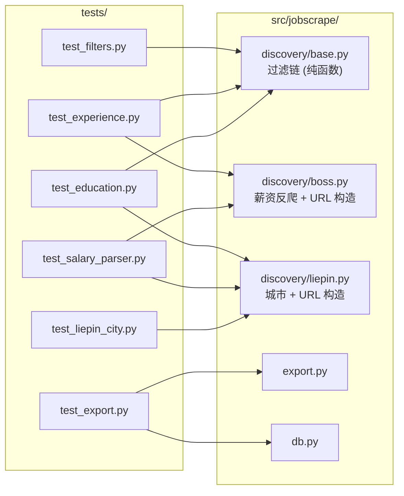

本文面向需要修改或扩展 `job-scrape-cn` 的中级开发者，说明项目单元测试**测了什么、为什么这么测、以及刻意没测什么**。测试集中在 `tests/` 目录，共 **6 个文件、44 个测试函数**，全部聚焦于那些**不依赖浏览器、不依赖网络、不依赖大模型**的纯函数与纯数据变换逻辑。理解这条边界的设计意图，比记住具体断言更重要——它直接决定了你在改动代码时应当如何补充或调整测试。

Sources: [tests](tests), [CHANGELOG.md](../../../../CHANGELOG.md#L42-L47)

## 测试基础设施：pytest 与最小依赖

测试框架是 **pytest**，通过 `pyproject.toml` 的依赖分组声明，不进入运行时依赖。运行时依赖只有 `typer`、`rich`、`pyyaml`、`playwright` 四项；pytest 被单独放在 `[dependency-groups]` 的 `dev` 组中，意味着安装生产包的用户不会被动带入测试框架。同时 `[tool.pytest.ini_options]` 把 `testpaths` 固定为 `["tests"]`，因此无论从哪个目录调用 `pytest`，都只会收集 `tests/` 下的用例，避免误扫 `src/` 或运行时目录。

```toml
[dependency-groups]
dev = ["pytest>=8.0"]

[tool.pytest.ini_options]
testpaths = ["tests"]
```

Sources: [pyproject.toml](../../../../pyproject.toml#L8-L29)

值得注意的是，`tests/` 目录下**没有 `conftest.py`**。唯一的 fixture 定义在 `tests/test_export.py` 内部（`conn`），通过 `monkeypatch.setenv("JOBSCRAPE_HOME", str(tmp_path))` 把运行时目录重定向到 pytest 的临时目录。这一做法把「运行时目录可被环境变量覆盖」这一设计约束（见 `config.runtime_dir()`）反向利用为测试隔离手段——每个用例都在独立的临时目录里建库、写数据、导出，互不污染，也不需要手工清理。

Sources: [tests/test_export.py](../../../../tests/test_export.py#L33-L44), [src/jobscrape/config.py](../../../../src/jobscrape/config.py#L34-L39)

## 覆盖地图：测试文件 → 被测模块

每个测试文件都精准对应一类**可被确定性验证的业务规则**。下表给出完整的映射关系与测试数量，合计 44 项：

| 测试文件 | 被测模块 | 测试数 | 核心被测对象 |
| --- | --- | --- | --- |
| `test_filters.py` | `discovery/base.py` | 5 | `apply_filters` 的标题/公司黑名单、薪资下限、日结岗 |
| `test_experience.py` | `discovery/base.py` + `discovery/boss.py` | 13 | `parse_experience`、`experience_overlaps`、`BossDiscoverer.build_url` |
| `test_education.py` | `discovery/base.py` + `discovery/liepin.py` | 10 | `parse_education`、`apply_filters`、`LiepinDiscoverer.build_url` |
| `test_salary_parser.py` | `discovery/boss.py` + `discovery/liepin.py` | 6 | `decode_salary_font`、`parse_salary`、`_parse_liepin_salary` |
| `test_liepin_city.py` | `discovery/liepin.py` | 7 | `_norm_city`、`build_url`、`_map_card`、`_parse_liepin_salary` |
| `test_export.py` | `export.py` + `db.py` | 3 | `export_jobs`、`select_rows`、`to_json`、`to_csv` |

Sources: [tests/test_filters.py](../../../../tests/test_filters.py#L1-L40), [tests/test_experience.py](../../../../tests/test_experience.py#L1-L122), [tests/test_education.py](../../../../tests/test_education.py#L1-L94), [tests/test_salary_parser.py](../../../../tests/test_salary_parser.py#L1-L43), [tests/test_liepin_city.py](../../../../tests/test_liepin_city.py#L1-L66), [tests/test_export.py](../../../../tests/test_export.py#L1-L76)

从依赖方向看，测试对象高度集中在 `discovery/base.py` 的**纯代码过滤链**上——它是整个采集流水线中最容易出错、也最值得回归保护的部分。下图展示测试与源码模块的依赖关系：



Sources: [src/jobscrape/discovery/base.py](../../../../src/jobscrape/discovery/base.py#L1-L182), [src/jobscrape/export.py](../../../../src/jobscrape/export.py#L1-L70), [src/jobscrape/db.py](../../../../src/jobscrape/db.py#L1-L135)

## 纯函数优先：为什么过滤链是测试重心

测试策略的核心假设是：**能被纯函数表达的业务规则，就应该被穷举测试**。`discovery/base.py` 的 `apply_filters()` 正是这样一个函数——它接收一个岗位 dict 和一份 profile，返回 `reject_reason` 或 `None`，不产生任何副作用。它的判断顺序（标题黑名单 → 日结岗 → HR 不活跃 → 公司黑名单 → 薪资 → 年限 → 学历）在 docstring 中被显式声明，测试也逐条覆盖。

Sources: [src/jobscrape/discovery/base.py](../../../../src/jobscrape/discovery/base.py#L89-L155), [tests/test_filters.py](../../../../tests/test_filters.py#L14-L39)

测试对**每种拒绝原因的前缀**做精确断言，而非只判断「是否被拒」。例如标题黑名单期望返回 `"title_blacklist:外包"`、日结岗期望 `"daily_wage:日结岗"`、薪资不足期望 `reason.startswith("salary_below:")`。这种断言方式保证 `reject_reason` 的格式契约（它会被写入数据库、进而在 `jp export` 中作为可读字段展示）不会在重构中被悄悄破坏。

Sources: [tests/test_filters.py](../../../../tests/test_filters.py#L21-L39), [src/jobscrape/export.py](../../../../src/jobscrape/export.py#L17-L24)

年限过滤的测试进一步验证了两个容易出错的语义细节。其一是**左开右闭区间**：可接受 0-3 年时，要求 `3-5年` 的岗位因边界 3 重合而被判为**无交集**，因此测试断言 `_filter("3-5年")` 必须被拒绝、`_filter("2-10年")` 必须被保留。其二是**退化区间**（`在校/应届` 解析为 `(0,0)`）按闭点处理，避免误杀应届生——`test_filter_degenerate_range` 显式覆盖了这一边界。这两个用例直接对应 `experience_overlaps()` 中 `jmax > lo and jmin < hi` 与 `lo <= jmin <= hi` 两条分支。

Sources: [tests/test_experience.py](../../../../tests/test_experience.py#L61-L79), [src/jobscrape/discovery/base.py](../../../../src/jobscrape/discovery/base.py#L76-L86)

## 反脆弱契约：「解析不出就不误杀」

测试中反复出现一条贯穿全项目的设计契约：**当字段无法解析时，过滤链选择保留而非淘汰**。学历测试中 `_filter("")` 与 `_filter("4天/周")` 都断言返回 `None`（保留），年限测试中 `_filter("")` 同样保留。`apply_filters` 源码里对应 `if level is None: pass` 与 `if rng is not None:` 两处「短路放行」逻辑。

Sources: [tests/test_education.py](../../../../tests/test_education.py#L60-L68), [tests/test_experience.py](../../../../tests/test_experience.py#L82-L97), [src/jobscrape/discovery/base.py](../../../../src/jobscrape/discovery/base.py#L124-L145)

与之配套的是「过滤默认关闭」的测试：当 profile 中 `preferences` 为空、或 `allowed` 为空列表时，任何岗位都不应被过滤。这使得「不配置就不过滤」成为可回归的行为契约，防止未来默认值改动导致用户未配置时突然大量丢岗。

Sources: [tests/test_education.py](../../../../tests/test_education.py#L65-L68), [tests/test_experience.py](../../../../tests/test_experience.py#L94-L97)

另一类契约针对**服务端筛选参数的显式报错**。Boss 与猎聘的 URL 构造只支持实测确认过的枚举值，传入非法值必须抛 `ValueError` 而非静默失效。因此测试既断言合法值被正确编码（如 `experience=105`、`degree=203`、`eduLevel=040`），也用 `pytest.raises(ValueError)` 断言非法值（如 `"3年"`、`"博士后"`、`"博士"` 之于猎聘）直接报错。这是把「宁可报错，不可静默」的设计意图固化为测试。

Sources: [tests/test_experience.py](../../../../tests/test_experience.py#L100-L122), [tests/test_education.py](../../../../tests/test_education.py#L71-L80), [src/jobscrape/discovery/boss.py](../../../../src/jobscrape/discovery/boss.py#L86-L105)

## 反爬与城市映射的回归测试

薪资解析涉及**字体反爬解码**，是另一类必须回归的风险点。`test_salary_parser.py` 覆盖了两代私有区字符映射：旧的 `U+E8F0` 段与 2026-09 实测的 `U+E031`–`U+E03A`（kanzhun 字体）。测试用 `chr(0xE8F3)` 这类构造方式直接拼出私有区字符，断言 `decode_salary_font` 能还原为正常数字，并进一步验证解码后可能出现**倒序**（`45-25K` → `(25,45,12)`）时的 min/max 兜底。

Sources: [tests/test_salary_parser.py](../../../../tests/test_salary_parser.py#L6-L36), [src/jobscrape/discovery/boss.py](../../../../src/jobscrape/discovery/boss.py#L45-L80)

猎聘城市过滤的测试则把该平台的**两个真实坑**固化为回归用例：其一，搜索 URL 必须同时携带 `city` 与 `dq` 两个参数（只给 `city` 不会真正生效）；其二，`dq` 过滤后仍会混入约 5% 的外地推荐卡，客户端兜底 `_map_card` 必须挡掉城市不符的卡片，但同时**对 `dq` 为空、无法判定的卡片放行**（不误杀）。`_norm_city` 的测试覆盖了「上海-浦东新区」→「上海」、「北京市」→「北京」两种归一场景。

Sources: [tests/test_liepin_city.py](../../../../tests/test_liepin_city.py#L22-L59), [src/jobscrape/discovery/liepin.py](../../../../src/jobscrape/discovery/liepin.py#L140-L195)

## 导出测试：唯一触及数据库的用例

`test_export.py` 是整个测试集中唯一**依赖 SQLite 与文件系统**的部分，因此它用 fixture 显式搭建了一个受控环境。`conn` fixture 重定向运行时目录后，通过 `db.connect()` + `db.init_db()` 建表，再用 `db.upsert_job()` 写入两行：一行正常岗位、一行带 `reject_reason` 的已过滤岗位。这一设计顺带覆盖了 `db.py` 的建表、迁移与 upsert 主键去重路径。

Sources: [tests/test_export.py](../../../../tests/test_export.py#L33-L44), [src/jobscrape/db.py](../../../../src/jobscrape/db.py#L65-L99)

在此之上，用例验证了三条导出契约：默认**跳过被过滤岗位**（只导出 1 行）、`include_rejected=True` 时导出全部（2 行）、以及 JSON/CSV 双格式落盘且 CSV 带 UTF-8 BOM（`test_export_json_and_csv` 读取 CSV 时用 `utf-8-sig` 解码即验证了 BOM 存在）。最后 `test_export_bad_format` 断言非法格式 `xlsx` 抛 `ValueError`，与前面「非法参数显式报错」的契约一脉相承。

Sources: [tests/test_export.py](../../../../tests/test_export.py#L47-L75), [src/jobscrape/export.py](../../../../src/jobscrape/export.py#L48-L69)

## 测试边界：刻意未覆盖的部分

理解测试**没测什么**同样关键。以下模块完全依赖真实浏览器、网络或第三方站点结构，因此**不在单元测试范围内**，属于集成/冒烟测试的职责：

| 未覆盖模块 | 原因 |
| --- | --- |
| `discovery/browser.py`（`BrowserSession`、`pause_if_challenge`、反检测注入） | 需启动 Playwright 与 Chromium |
| `discovery/boss.py` 采集方法（`_scrape_city`、`_scroll_to_bottom`、`_extract_cards`、`_extract_one`） | 依赖真实 DOM 与滚动加载 |
| `discovery/liepin.py` 采集方法（`_scrape_city`、XHR 拦截 `on_response`） | 依赖真实 XHR 响应结构 |
| `enrichment/detail.py`（`enrich_jobs`、JD 全文抓取） | 需访问岗位详情页 |
| `pipeline.py`（`run_pipeline` 编排） | 需要完整浏览器会话 |
| `cli.py`（Typer 命令） | 端到端命令入口 |
| `config.py`（`load_profile`、`load_searches` 文件 IO） | 除被 export 间接使用外未单测 |

Sources: [src/jobscrape/pipeline.py](../../../../src/jobscrape/pipeline.py#L27-L79), [src/jobscrape/discovery/browser.py](../../../../src/jobscrape/discovery/browser.py), [src/jobscrape/enrichment/detail.py](../../../../src/jobscrape/enrichment/detail.py), [src/jobscrape/cli.py](../../../../src/jobscrape/cli.py)

这条边界并非疏漏，而是一条清晰的分工线：**可确定性验证的规则（解析、过滤、映射、序列化）走单元测试；依赖外部世界状态的采集流程走人工实跑与冒烟测试**。CHANGELOG 中的历史验证记录也印证了这一点——每次功能验证都同时报告「N 项单测通过」与「实跑实测结果」（如「实跑 Boss `degree=203` 得 15/15 本科」），二者互补。

Sources: [CHANGELOG.md](../../../../CHANGELOG.md#L42-L47), [CHANGELOG.md](../../../../CHANGELOG.md#L104-L116)

因此，当你修改采集方法的选择器或 XHR 解析逻辑时，不要期待单元测试会拦截回归——你需要依赖 `LOCATORS` 集中定义带来的可维护性，以及实跑验证。反过来，当你修改 `parse_experience`、`parse_education`、`apply_filters`、`_norm_city` 或任何薪资解析函数时，`tests/` 下的 44 个用例会立刻告诉你是否破坏了既有契约。

Sources: [src/jobscrape/discovery/boss.py](../../../../src/jobscrape/discovery/boss.py#L54-L61), [src/jobscrape/discovery/liepin.py](../../../../src/jobscrape/discovery/liepin.py#L32-L35)

## 延伸阅读

单元测试覆盖的过滤规则，其算法细节在相邻页面中有完整展开。若想深入理解被测函数的语义，建议依次阅读 [年限过滤：解析与左开右闭区间匹配](15-nian-xian-guo-lu-jie-xi-yu-zuo-kai-you-bi-qu-jian-pi-pei) 与 [学历过滤：档位归一与白名单](16-xue-li-guo-lu-dang-wei-gui-yu-bai-ming-dan)；测试中出现的城市代码断言则对应 [平台城市代码与筛选参数映射](22-ping-tai-cheng-shi-dai-ma-yu-shai-xuan-can-shu-ying-she)。

Sources: [src/jobscrape/discovery/base.py](../../../../src/jobscrape/discovery/base.py#L25-L73), [src/jobscrape/discovery/liepin.py](../../../../src/jobscrape/discovery/liepin.py#L18-L30)

最后，测试所保护的「列级状态机 = 阶段契约」「被过滤岗位不自动翻案」等不可破坏的约束，与 [设计约束与项目演进脉络](24-she-ji-yue-shu-yu-xiang-mu-yan-jin-mai-luo) 的内容直接呼应——那份约束清单正是这些测试存在的根本理由。