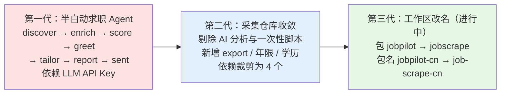
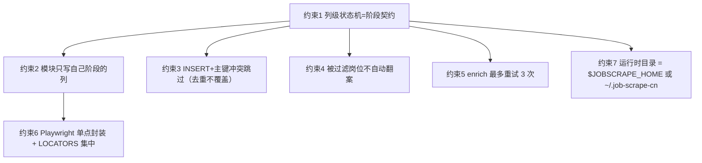

本页面向中级开发者，回答两个问题：**这套代码为什么这样组织（设计约束）**，以及**它从哪来、往哪走（演进脉络）**。前者是「改动时别踩的红线」，后者是理解当前形态的来龙去脉。所有结论均来自仓库内可验证的文件与提交历史，不含推测。

Sources: [CHANGELOG.md](../../../../CHANGELOG.md#L49-L57)

## 仓库定位：一个「只做采集」的项目

job-scrape-cn 的自我定位非常克制：抓 Boss 直聘 / 猎聘的岗位列表 → 抓 JD 全文 → 导出 JSON/CSV，**不含任何 AI 分析、打分、打招呼语、简历定制逻辑，也不依赖任何 LLM API Key**。这个定位不是一开始就有的，而是在一次大幅收敛中确立的，因此它同时也是「演进脉络」的起点。项目复用自原作者的 [job-pilot-cn](https://github.com/GriffithLin/job-pilot-cn)，并保留了归属声明。理解这一定位，后面所有约束才有落脚点——很多约束正是为了在「没有 LLM、纯代码、可幂等重跑」的前提下保证可靠采集。

Sources: [README.md](../../../../README.md#L1-L6), [CHANGELOG.md](../../../../CHANGELOG.md#L8-L11), [ATTRIBUTION.md](../../../../ATTRIBUTION.md#L1-L8)

## 演进脉络：从半自动 Agent 到纯采集器

项目的演进可以清晰地划分为三代形态，每一代都对应一次对「职责边界」的重新收敛。下图给出三代的总体迁移路径：

### 第一代：半自动求职 Agent（初始提交）

初始提交的定位是「半自动国内求职 agent：**抓岗 → AI 打分 → 打招呼语/简历定制要点 → 人工发送**」，设计理念是 AI 干 80% 的活、最后一步发送由人在手机/网页完成，以规避平台封号风险。技术栈包含 **OpenAI 兼容 LLM 端点**与 **Pydantic**，流水线为 `Discover → Enrich → Score → Greet → Tailor → Report → jp sent` 七阶段，并引入「防虚构三层」（LLM 只产结构化数据 → 代码组装文本 → 确定性 validator 守门）。运行时目录当时是 `~/.jobpilot-cn/`，包名为 `src/jobpilot/`。

Sources: [CHANGELOG.md](../../../../CHANGELOG.md#L15-L21)

### 第二代：采集仓库收敛（提交 2d8069d）

这次改造（提交信息为「采集仓库收敛 + 年限/学历筛选能力」，共 36 文件、+772 / -1957）做了三件互相耦合的事。**其一，剔除 AI 与一次性脚本**：删除 `llm.py`、`scoring/`（score / greet / tailor / validator）、`prompts/`、`report.py`、`scripts/`、`examples/`，并移除 `openai`、`anthropic`、`pydantic` 依赖。**其二，改造核心链路**：`db.py` 表结构精简为 discover / enrich / 过滤三块列，`models.py` 只保留状态谓词，`pipeline.py` 只编排 discover → enrich，CLI 命令收敛为 `init / status / login / discover / enrich / run / export`。**其三，补齐采集能力**：新增 `export.py` 与 `jp export`，并引入年限、学历两套过滤。

Sources: [CHANGELOG.md](../../../../CHANGELOG.md#L23-L36), [CHANGELOG.md](../../../../CHANGELOG.md#L15-L21)

收敛后依赖被裁到极简的四个：`typer`、`rich`、`pyyaml`、`playwright`，构建系统为 hatchling，入口脚本为 `jp = "jobscrape.cli:main"`。依赖的精简本身就是「只做采集」定位的工程表达——没有 LLM SDK，就不可能在代码里偷偷调用模型。

Sources: [pyproject.toml](../../../../pyproject.toml#L8-L16)

同一次改造还修复了一个 Windows 兼容缺陷：原代码在中文 Windows 控制台上打印 `✓` / `⚠️` 会直接 `UnicodeEncodeError`，现已全部换成 ASCII 标记（`OK`、`[!]`）。此外，`searches.yaml` 模板从仓库根目录移入包内 `src/jobscrape/searches.example.yaml`，用 `PKG_DIR` 定位，保证 `pip` 安装后仍能被 `jp init` 复制出来。这些细节共同指向一个演进原则：**让包在任何环境都能独立、可移植地跑起来**。

Sources: [CHANGELOG.md](../../../../CHANGELOG.md#L27), [CHANGELOG.md](../../../../CHANGELOG.md#L40), [config.py](../../../../src/jobscrape/config.py#L12), [config.py](../../../../src/jobscrape/config.py#L72-L78)

### 第三代：本地改名与去标识（工作区进行中）

在当前工作区中，包标识正从最初的 `jobpilot` 迁移到 `jobscrape`：`pyproject.toml` 已声明 `name = "job-scrape-cn"`、`packages = ["src/jobscrape"]` 与入口 `jp = "jobscrape.cli:main"`。通过 `git status` 可以看到这是一组由 `src/jobpilot/*` 到 `src/jobscrape/*` 的暂存重命名（R / RM 状态），即 **HEAD 提交仍是 `jobpilot`，而工作区已推进为 `jobscrape`**。这一步属于「去标识化」，与第二代「剔除 AI 表述」一脉相承。

Sources: [pyproject.toml](../../../../pyproject.toml#L2-L23)

## 七条关键设计约束

CHANGELOG 明确列出「改动时别破坏」的七条约束。它们是这套代码最稳定的骨架，以下逐条给出代码落点；先看它们之间的依赖关系：

Sources: [CHANGELOG.md](../../../../CHANGELOG.md#L49-L57)

### 约束 1 与 2：列级状态机与模块写列边界

「阶段完成 = 该阶段负责的列非 NULL」，这就是阶段之间的衔接契约。`models.py` 用 SQL 谓词把它集中定义：`PENDING_ENRICH` 表示「已发现、未抓、未被过滤」，`ENRICH_FAILED` 表示「抓过但失败、且未被过滤」，所有阶段与 status 计数板都复用这两个谓词，阶段间零直接调用。

Sources: [models.py](../../../../src/jobscrape/models.py#L1-L23), [pipeline.py](../../../../src/jobscrape/pipeline.py#L1-L4)

围绕这一契约，`db.py` 用列白名单把「谁写哪些列」固化下来：`_DISCOVER_COLUMNS` 覆盖列表页产出的全部字段（`url`、`platform`、`job_title`、`salary_*`、`experience_raw`、`education_raw`、`discovered_at` 等），`ALLOWED_COLUMNS` 在其上叠加 `full_description`、`apply_url`、`detail_scraped_at`、`enrich_error`、`enrich_attempts` 等 enrich 列与过滤列。`upsert_job` 与 `update_columns` 都会校验列名，传入未知列直接抛 `ValueError`——**discovery 只写 discover 列、enrichment 只写 enrich 列，这条铁律有代码守卫，不是口头约定**。表结构的注释也把三块列分组标注为 discover / enrich / 过滤。

Sources: [db.py](../../../../src/jobscrape/db.py#L14-L62), [db.py](../../../../src/jobscrape/db.py#L86-L99), [db.py](../../../../src/jobscrape/db.py#L108-L116)

### 约束 3：入库是 INSERT + 主键冲突跳过

`url` 是表主键，入库走 `INSERT`，遇到 `IntegrityError` 直接返回 `False`（表示「已存在、未新增」）。这带来两个天然性质：**去重**（同一岗位抓多次不会重复）与**不覆盖**（已入库的行不会被新抓的数据冲掉已有状态列）。`pipeline.py` 正是用 `sum(1 for j in jobs if db.upsert_job(...))` 统计「本轮新增」。

Sources: [db.py](../../../../src/jobscrape/db.py#L15-L16), [db.py](../../../../src/jobscrape/db.py#L86-L99), [pipeline.py](../../../../src/jobscrape/pipeline.py#L67-L68)

### 约束 4：被过滤岗位不会自动翻案

`PENDING_ENRICH` 谓词里带有 `reject_reason IS NULL`，这意味着**只要一行被打了 `reject_reason`，它就不会再被 enrich 选中**。因此放宽过滤规则后，旧数据不会自动重抓 JD——必须手动 `UPDATE jobs SET reject_reason=NULL` 才可能重新进入待抓队列。`db.counts()` 的「待抓 JD」「抓 JD 失败」两项同样都带 `reject_reason IS NULL` 条件，保持与状态机一致。

Sources: [models.py](../../../../src/jobscrape/models.py#L15-L23), [db.py](../../../../src/jobscrape/db.py#L119-L134)

### 约束 5：enrich 最多重试 3 次

`enrich_jobs` 取待抓行的 SQL 里硬编码 `enrich_attempts < 3`，每次尝试无论成功或失败都会 `enrich_attempts + 1`。因此修好选择器后要重跑，**必须先把失败行的 `enrich_attempts` 清零（或删除这些行）**，否则已用满 3 次的行不会再次被选中。成功时写入 `full_description` 与 `detail_scraped_at`，失败时写入 `enrich_error`，两者都记录尝试次数。

Sources: [detail.py](../../../../src/jobscrape/enrichment/detail.py#L38-L69)

### 约束 6：Playwright 单点封装 + 选择器集中

Playwright 只在 `discovery/browser.py` 一个文件里出现，其目标写在文件首行——「将来 Playwright 被指纹检测时，整体替换 nodriver/patchright 只改这一个文件」。各平台模块则把选择器集中在模块顶部的 `LOCATORS` 字典（Boss 的 `job_card` / `salary` / `company_name` 等，猎聘的 `next_page` / `page_disabled`），平台改版只需改这一处；猎聘的 XHR 特征抽成 `XHR_MARKER`。

Sources: [browser.py](../../../../src/jobscrape/discovery/browser.py#L1-L5), [boss.py](../../../../src/jobscrape/discovery/boss.py#L50-L61), [liepin.py](../../../../src/jobscrape/discovery/liepin.py#L25-L35), [README.md](../../../../README.md#L219-L228)

### 约束 7：运行时目录 = `$JOBSCRAPE_HOME` 或 `~/.job-scrape-cn`

所有运行时产物（数据库、Cookie、导出、配置）都归入一个目录，路径由 `runtime_dir()` 决定：优先环境变量 `JOBSCRAPE_HOME`，否则 `~/.job-scrape-cn`（Windows 上即 `C:\Users\<用户>\.job-scrape-cn`）。该函数会顺带 `mkdir` 出 `cookies/` 与 `exports/` 子目录。CHANGELOG 特别标注「这是设计而非 bug」——因为曾有使用者疑惑「为什么 init 到 C 盘」。

Sources: [config.py](../../../../src/jobscrape/config.py#L34-L59), [CHANGELOG.md](../../../../CHANGELOG.md#L57)

## 约束在代码中的落点一览

| 约束 | 语义 | 代码落点 |
| --- | --- | --- |
| 1 列级状态机 | 阶段完成 = 列非 NULL | [models.py](../../../../src/jobscrape/models.py#L15-L23) |
| 2 写列边界 | discovery/enrich 各写各列 | [db.py](../../../../src/jobscrape/db.py#L53-L62) |
| 3 去重不覆盖 | INSERT + 主键冲突跳过 | [db.py](../../../../src/jobscrape/db.py#L86-L99) |
| 4 不自动翻案 | `reject_reason IS NULL` 前缀 | [db.py](../../../../src/jobscrape/db.py#L125-L133) |
| 5 重试上限 | `enrich_attempts < 3` | [detail.py](../../../../src/jobscrape/enrichment/detail.py#L40) |
| 6 单点封装 | Playwright 唯一出口 | [browser.py](../../../../src/jobscrape/discovery/browser.py#L1-L5) |
| 7 运行时目录 | 环境变量或 `~/.job-scrape-cn` | [config.py](../../../../src/jobscrape/config.py#L34-L39) |

Sources: [CHANGELOG.md](../../../../CHANGELOG.md#L49-L57)

## 演进中的关键行为变更

演进不只体现在文件增删，也体现在若干「行为语义」的悄悄变化——这些变化最容易在升级后造成困惑，值得单列对照。

| 变更 | 变更前 | 变更后 | 落点 |
| --- | --- | --- | --- |
| 年限区间语义 | 闭区间 `[a,b]` 与岗位 `[b,c]` 边界相交即保留 | 岗位要求按**左开右闭** `(jmin, jmax]`，`3-5年` 不再被 0-3 年误留 | [base.py](../../../../src/jobscrape/discovery/base.py#L76-L86) |
| 退化区间处理 | —— | `jmin == jmax`（如在校/应届 0-0）按闭点处理，避免误杀 | [base.py](../../../../src/jobscrape/discovery/base.py#L83-L86) |
| 猎聘城市过滤 | 只传 `city`，结果混杂全国 | 同时传 `city` 与 `dq`，并加客户端兜底 `_norm_city()` | [CHANGELOG.md](../../../../CHANGELOG.md#L61-L72) |
| 猎聘年限参数 | 期望 `workYearCode=` 生效 | 实测**不生效**，配了只打印提示，改用本地过滤 | [liepin.py](../../../../src/jobscrape/discovery/liepin.py#L41-L57) |
| 旧库兼容 | 仅靠 `CREATE TABLE IF NOT EXISTS` | 增加 `_MIGRATIONS` + `ALTER TABLE` 补 `experience_raw` / `education_raw` | [db.py](../../../../src/jobscrape/db.py#L73-L83) |

Sources: [CHANGELOG.md](../../../../CHANGELOG.md#L74-L116)

其中「左开右闭」是最值得记住的一条语义：可接受 0-3 年时，`3-5年`、`3年以上` 由「保留」变为「淘汰」，而 `1-3年`、`2-10年`、`1年以内` 仍保留。其内在理由是——语义上「要求 3 年以上」的岗位不会考虑年限在 3 年的应聘者，因此边界 `b` 相交不应视为命中。`parse_experience()` 负责把 `3-5年` / `5年以上` / `1年以内` / `在校/应届` / `经验不限` 解析为区间，实习标签（`4天/周`、`6个月`）返回 `None` 以避免误杀。

Sources: [base.py](../../../../src/jobscrape/discovery/base.py#L25-L45), [base.py](../../../../src/jobscrape/discovery/base.py#L121-L137), [CHANGELOG.md](../../../../CHANGELOG.md#L107-L116)

## 向后兼容与数据升级约束

第二代的列新增没有走破坏性重建，而是**旧库自动升级**：`init_db()` 先执行 `CREATE TABLE IF NOT EXISTS`，再用 `PRAGMA table_info` 检查缺列并逐列 `ALTER TABLE ... ADD COLUMN`。这带来一个必须意识到的边界——**升级前抓的旧行，`experience_raw` / `education_raw` 两列为空，年限/学历过滤对它们不生效**，需要重抓或手动补。

Sources: [db.py](../../../../src/jobscrape/db.py#L73-L83), [README.md](../../../../README.md#L169-L172)

另一个与数据可靠性直接相关的约束是 SQLite 的 **WAL 模式**：数据库以 `PRAGMA journal_mode=WAL` 打开，因此最近的写入可能还在 `db.sqlite3-wal` 里。单独拷走 `db.sqlite3` 会看不到最新数据，且**直接改坏状态列会让 `jp run` 的续传判断出错**——例如清空 `detail_scraped_at` 会导致 JD 被重复抓取。这也是「列级状态机」约束在生产使用中的直接投影。

Sources: [db.py](../../../../src/jobscrape/db.py#L65-L70), [README.md](../../../../README.md#L184-L188)

## 尚未落地的事项（待办）

CHANGELOG 还记录了一批「用户提出但尚未实施」的方向，它们勾勒了后续演进的可能路径。这些待办的共性是：**都用「手动 SQL / 手动关窗口 / 手动补列」作为当前替代方案**，待办就是把这些人肉操作产品化。因此预计它们会以新增 CLI 命令（如 `jp prune`）、参数（如 `jp login --wait`、`jp init --dir`）或数据补丁的形式进入下一代。

| 状态 | 标记 | 事项 |
| --- | --- | --- |
| 待办 | 新增 | `jp login` 检测到登录态后自动退出（`--wait` 保留阻塞） |
| 待办 | 新增 | `jp prune` 清理命令（`--failed` / `--rejected` / `--platform`） |
| 待办 | 新增 | 关键词归一化：加载 `searches.yaml` 时去首尾空格、折叠连续空格 |
| 待办 | 变更 | `jp init --dir`，或把默认运行时目录改到仓库内（与约束 7 相关） |
| 待办 | 修复 | 猎聘服务端年限筛选参数尚未找到（本地过滤已可用） |
| 待办 | 新增 | 猎聘学历缺「博士」档（020 与 030 返回结果相同，无法确认） |
| 待办 | 新增 | Boss 年限仅验证 103-107，`101`/`102` 未实测 |

Sources: [CHANGELOG.md](../../../../CHANGELOG.md#L118-L128)

值得注意的是「待办」与「约束」之间的张力：例如 `jp init --dir` 直接触及约束 7（运行时目录），`jp prune` 则对应约束 4（被过滤岗位不自动翻案，当前只能手写 DELETE SQL）。这说明**约束不是教条，而是演进时被反复权衡的边界**——当手动替代方案足够痛时，约束就可能被产品化的新能力部分松开。

Sources: [CHANGELOG.md](../../../../CHANGELOG.md#L54), [CHANGELOG.md](../../../../CHANGELOG.md#L123-L125)

## 阅读延伸

理解本章的约束后，建议按以下顺序深入具体的实现细节：先读 [列级状态机：阶段契约与续传语义](8-lie-ji-zhuang-tai-ji-jie-duan-qi-yue-yu-xu-chuan-yu-yi) 与 [两阶段流水线的编排与幂等续传](7-liang-jie-duan-liu-shui-xian-de-bian-pai-yu-mi-deng-xu-chuan)，把约束 1–3 落到实处；再读 [SQLite 单表数据总线与去重入库](9-sqlite-dan-biao-shu-ju-zong-xian-yu-qu-zhong-ru-ku) 看约束 2、3 的存储细节；接着读 [年限过滤：解析与左开右闭区间匹配](15-nian-xian-guo-lu-jie-xi-yu-zuo-kai-you-bi-qu-jian-pi-pei) 与 [学历过滤：档位归一与白名单](16-xue-li-guo-lu-dang-wei-gui-yu-bai-ming-dan) 理解本章提到的行为变更；最后用 [运行时目录与环境变量](21-yun-xing-shi-mu-lu-yu-huan-jing-bian-liang) 收束约束 7。