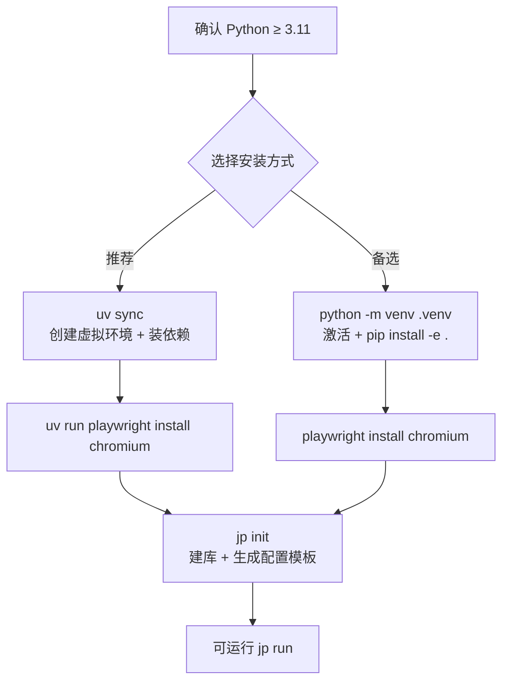
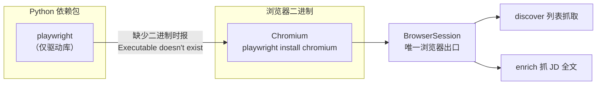
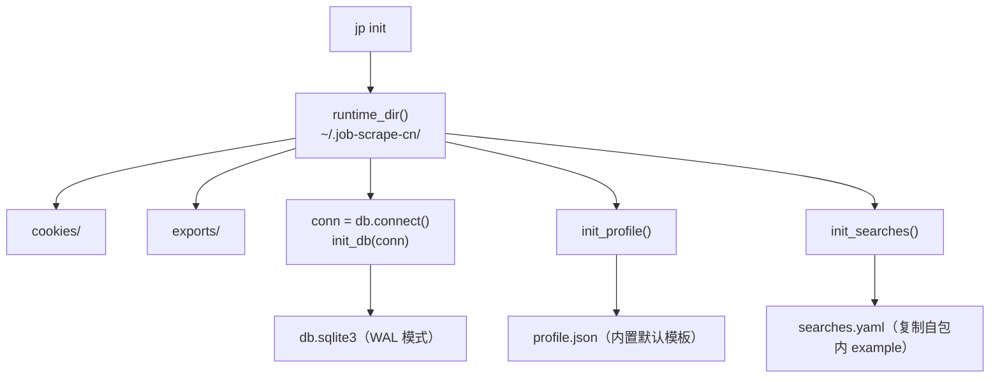

本页面向初次接触 job-scrape-cn 的开发者，目标是让你在一台干净机器上把项目跑起来：装好 Python 运行时、拉齐依赖、下载浏览器底座，并理解安装过程中会生成哪些文件、系统会用到哪个环境变量。**采集逻辑、命令用法、配置项含义分别属于后续页面**，本页只负责「让它能跑」。一句话概括本项目：它是国内招聘平台（Boss 直聘 / 猎聘）的岗位与 JD 全文抓取器，只做数据采集，不需要任何 LLM API Key，也不含分析打分逻辑。

Sources: [README.md](README.md#L1-L6), [CHANGELOG.md](CHANGELOG.md#L8-L11)

## 前置要求

安装前只需确认两件事：**Python 版本**与**操作系统**。项目在 `pyproject.toml` 中硬性声明 `requires-python = ">=3.11"`，低于 3.11 会直接拒绝安装；代码内部大量使用 `X | None` 形式的类型注解（如浏览器模块的函数签名），这也要求 3.11 及以上。操作系统层面没有专属约束，Windows / macOS / Linux 均可运行，官方文档示例统一以 Windows PowerShell 书写，本页沿用同一口径。

| 项目 | 要求 | 说明 |
| --- | --- | --- |
| Python | **≥ 3.11** | `pyproject.toml` 硬性声明，低于此版本拒绝安装 |
| 操作系统 | Windows / macOS / Linux | 无特殊限制，示例以 PowerShell 为准 |
| 网络 | 可访问 PyPI 与 Playwright CDN | 安装依赖与下载 Chromium 需要联网 |
| 磁盘 | 约数百 MB（含 Chromium） | 浏览器底座是体积大头 |

Sources: [pyproject.toml](pyproject.toml#L5), [pyproject.toml](pyproject.toml#L1-L7), [src/jobscrape/discovery/browser.py](src/jobscrape/discovery/browser.py#L58-L70)

## 依赖清单

项目运行时依赖极少，只有四个直接依赖，全部在 `pyproject.toml` 的 `dependencies` 中声明。它们各自承担明确职责：`typer` 负责命令行框架（`jp` 的各个子命令），`rich` 负责终端表格与彩色输出（如 `jp status` 的计数板），`pyyaml` 负责解析搜索配置 `searches.yaml`，`playwright` 负责驱动真实浏览器。另有独立的开发依赖组，仅在跑测试时需要。

| 依赖 | 版本约束 | 作用 |
| --- | --- | --- |
| `typer` | ≥ 0.12 | 命令行入口框架 |
| `rich` | ≥ 13.7 | 终端表格与彩色输出 |
| `pyyaml` | ≥ 6.0 | 解析 `searches.yaml` |
| `playwright` | ≥ 1.45 | 驱动浏览器采集 |
| `pytest`（dev） | ≥ 8.0 | 单元测试（仅开发需要） |

安装完成后，`pyproject.toml` 还会注册一个命令行脚本入口：`jp`，它指向 `jobscrape.cli:main`。也就是说，**你后续所有操作都通过 `jp` 这一个命令进行**——`jp init`、`jp login`、`jp run`、`jp export` 等，其完整命令体系属于 [命令行命令体系](4-ming-ling-xing-ming-ling-ti-xi) 页面。测试配置也在此一并声明：`testpaths = ["tests"]`，因此直接运行 `pytest` 即可发现全部测试。

Sources: [pyproject.toml](pyproject.toml#L8-L13), [pyproject.toml](pyproject.toml#L15-L16), [pyproject.toml](pyproject.toml#L25-L29), [src/jobscrape/cli.py](src/jobscrape/cli.py#L14)

## 安装步骤

项目提供两种等价的安装方式，官方**推荐 uv**（因为它能一并管理虚拟环境与依赖锁定），但 `pip` 同样可用。无论选哪种，流程都是「先装 Python 依赖 → 再装浏览器底座」两步，二者缺一不可。下面的流程图展示了完整路径与两条分支的差异。

**方式一（推荐，uv）**：进入项目根目录后执行 `uv sync`，它会依据 `uv.lock` 自动创建虚拟环境并安装全部依赖；随后用 `uv run playwright install chromium` 安装浏览器底座。uv 方式下所有命令都需要以 `uv run` 前缀调用——这也是阅读后续文档时需要留意的约定，凡示例写 `uv run pytest`，即指在虚拟环境中运行。

Sources: [README.md](README.md#L19-L31), [uv.lock](uv.lock#L1-L1)

**方式二（备选，pip）**：手动创建并激活虚拟环境 `python -m venv .venv`，Windows 下用 `.venv\Scripts\activate` 激活，再执行 `pip install -e .` 以可编辑模式安装本项目，最后单独运行 `playwright install chromium`。激活虚拟环境后，`jp` 与 `pytest` 都会直接从虚拟环境解析，无需再加 `uv run` 前缀。

Sources: [README.md](README.md#L26-L31)

## 安装浏览器底座（关键步骤）

**最容易被跳过、也最容易导致运行失败的一步是安装 Chromium。** Playwright 的 Python 包本身不含浏览器二进制，必须先执行 `playwright install chromium` 下载对应浏览器，否则任何涉及采集的命令（`jp discover` / `jp enrich` / `jp run`）都会报 `Executable doesn't exist` 错误。之所以必须依赖真实浏览器，是因为项目采用「有头 Chromium + Cookie 回灌」的方案驱动两个平台：采集阶段的列表抓取、JD 全文抓取都通过 `BrowserSession` 这一唯一出口创建浏览器实例。

浏览器底座是**单点封装**的：Playwright 的所有使用都收敛在 `discovery/browser.py` 一个文件内，`discovery` 采集器与 `enrichment` 抓取器都只通过它间接使用 Playwright。这意味着将来若因指纹检测需要更换底层（如 nodriver / patchright），只需改这一个文件。对安装者而言，这条约束的实际含义是：**只要 Chromium 装好，两个采集阶段就都能工作**。

Sources: [README.md](README.md#L33-L34), [src/jobscrape/discovery/browser.py](src/jobscrape/discovery/browser.py#L1-L5), [src/jobscrape/enrichment/detail.py](src/jobscrape/enrichment/detail.py#L13-L14), [src/jobscrape/cli.py](src/jobscrape/cli.py#L60-L63)

## 初始化运行时目录

依赖与浏览器就绪后，执行 `jp init` 完成环境初始化。它做三件事：创建运行时目录、初始化 SQLite 数据库、生成两个配置模板文件。运行时目录默认位于用户主目录下的 `~/.job-scrape-cn/`，其中会自动创建 `cookies/`（存放登录态）与 `exports/`（存放导出结果）两个子目录，数据库文件为 `db.sqlite3`。`jp init` 支持 `--force` 参数，用于覆盖已存在的配置文件。

Sources: [README.md](README.md#L39-L43), [src/jobscrape/cli.py](src/jobscrape/cli.py#L26-L38), [src/jobscrape/config.py](src/jobscrape/config.py#L34-L39)

初始化会生成两个模板文件——`profile.json`（过滤规则）与 `searches.yaml`（关键词 × 城市）。二者的**内容含义与编辑方法分别属于 [过滤偏好配置](6-guo-lu-pian-hao-pei-zhi) 与 [搜索任务配置：关键词与城市](5-sou-suo-ren-wu-pei-zhi-guan-jian-ci-yu-cheng-shi) 页面**，此处只强调它们的来源：`profile.json` 由代码内置的默认模板写出，`searches.yaml` 则从随包分发的 `searches.example.yaml` 复制而来，因此即使项目已安装为包，模板依然可用。两个文件在已存在且未指定 `--force` 时都会被跳过，不会覆盖你的修改。

Sources: [src/jobscrape/config.py](src/jobscrape/config.py#L62-L78), [src/jobscrape/db.py](src/jobscrape/db.py#L65-L83), [CHANGELOG.md](CHANGELOG.md#L27)

## 环境变量：JOBSCRAPE_HOME

运行时目录的位置由环境变量 `JOBSCRAPE_HOME` 控制：若未设置，则回退到默认的 `~/.job-scrape-cn`。你可以把它指到别处（例如某个数据分区），让数据库、登录态与导出文件全部落到新位置。`runtime_dir()` 在每次被调用时都会确保目标目录及其子目录存在，因此首次运行会**自动创建**整个目录树，无需手动建目录。这里只需知道该变量的**存在与位置语义**；运行目录的完整结构、各文件生命周期等更细的工程约定，请见 [运行时目录与环境变量](21-yun-xing-shi-mu-lu-yu-huan-jing-bian-liang)。

Sources: [src/jobscrape/config.py](src/jobscrape/config.py#L34-L39), [README.md](README.md#L57)

## 验证安装

安装是否成功，可用两条命令快速验证。第一条是 `jp status`，它会连库、建表并打印计数板；能正常输出表格即说明依赖、`jp` 入口与数据库三者都就绪。第二条是 `jp --help`（或直接运行 `jp`），Typer 会列出全部子命令——**当你能看到 `init / status / login / discover / enrich / run / export` 这些命令时，安装与入口注册就已确认无误**。注意，此时还未登录平台，`jp status` 的计数全部为 0 属正常现象，真正的采集需先完成 [快速开始：从安装到首次导出](2-kuai-su-kai-shi-cong-an-zhuang-dao-shou-ci-dao-chu) 中的扫码登录步骤。

Sources: [src/jobscrape/cli.py](src/jobscrape/cli.py#L41-L52), [src/jobscrape/cli.py](src/jobscrape/cli.py#L184-L186), [README.md](README.md#L59-L69)

## 常见问题排查

下表汇总了安装阶段最可能遇到的四类问题及其根因。它们几乎都指向同一件事：**环境准备的两个环节（Python 依赖 / 浏览器二进制）尚未对齐**。

| 现象 | 根因 | 解决方式 |
| --- | --- | --- |
| `jp discover / enrich / run` 报 `Executable doesn't exist` | 未安装 Chromium 浏览器二进制 | 执行 `playwright install chromium`（uv 用户用 `uv run playwright install chromium`） |
| 安装被拒绝，提示版本不符 | Python 低于 3.11 | 升级到 Python ≥ 3.11 后重建虚拟环境 |
| `jp` 命令找不到 | 未安装项目或未激活虚拟环境 | 执行 `pip install -e .`，并先激活 `.venv` |
| 打印报错或中文乱码（中文 Windows） | 旧版曾在控制台输出非 ASCII 字符 | 当前版本已改用 ASCII 标记（`OK` / `[!]`），升级到最新代码即可 |

Sources: [README.md](README.md#L33-L34), [pyproject.toml](pyproject.toml#L5), [CHANGELOG.md](CHANGELOG.md#L38-L40), [README.md](README.md#L219-L228)

## 下一步

环境就绪后，建议按目录顺序继续阅读：先看本页前置的 [快速开始：从安装到首次导出](2-kuai-su-kai-shi-cong-an-zhuang-dao-shou-ci-dao-chu) 建立全局印象，再进入 [命令行命令体系](4-ming-ling-xing-ming-ling-ti-xi) 弄清 `jp` 各子命令的职责边界，随后配置 [搜索任务配置：关键词与城市](5-sou-suo-ren-wu-pei-zhi-guan-jian-ci-yu-cheng-shi) 与 [过滤偏好配置](6-guo-lu-pian-hao-pei-zhi) 两个文件，即可正式运行采集。若想深入了解安装所创建的运行时目录，可随时查阅 [运行时目录与环境变量](21-yun-xing-shi-mu-lu-yu-huan-jing-bian-liang)。