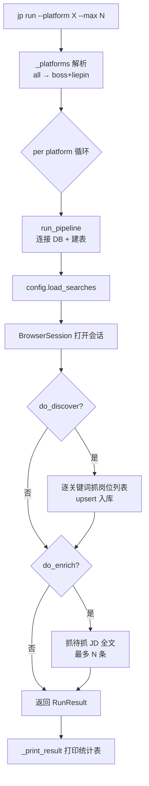
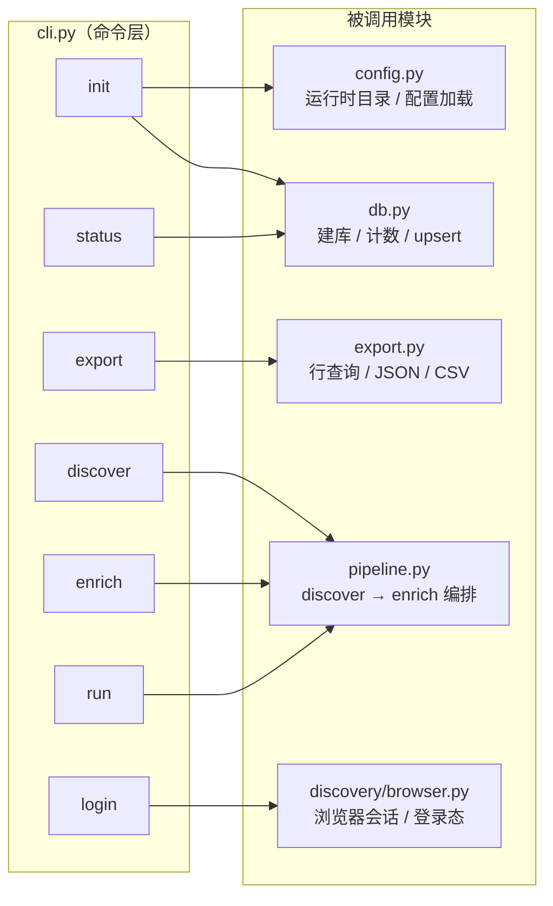

`job-scrape-cn` 对外只暴露**一个命令行入口 `jp`**，全部能力都收敛在这条命令的子命令里：初始化、扫码登录、抓岗位列表、抓 JD 全文、导出、查看统计。理解这套命令体系，等于拿到了整个采集工具的操作面板。本页只讲**命令表面**——每个子命令的名字、参数、行为与相互关系；每条命令内部调用的采集算法与流水线细节，请沿目录跳转到对应页面。

本文面向初次接触本项目的开发者，读完后你应当能够：不查源码就选对命令完成一次完整采集，并理解 `--max`、`--platform` 这类参数为什么在多个命令间"长得一样"却含义微妙。

## 命令入口的注册机制

`jp` 这个可执行名不是硬编码的，而是由打包元数据声明的**控制台脚本入口点**：`pyproject.toml` 的 `[project.scripts]` 把 `jp` 映射到 `jobscrape.cli:main`，安装后由 Python 生成同名可执行文件。

Sources: [pyproject.toml](pyproject.toml#L15-L16)

对应的 Python 侧，`cli.py` 用 Typer 声明了一个应用实例并定义了一个极薄的 `main()` 函数：

```python
app = typer.Typer(help="JobScrape-CN：Boss 直聘 / 猎聘 岗位与 JD 全文抓取器")
...
def main() -> None:
    app()
```

也就是说 `jp` 的一切行为都由 Typer 应用 `app` 承载，`main()` 只是把它触发。此外模块顶部用 `PLATFORMS = ("boss", "liepin")` 定义了**唯一的平台全集常量**，并提供一个校验辅助函数 `_platforms(platform, default_all=True)`：当传入 `"all"` 时展开为两个平台，否则原样返回单个平台，遇到非法值则直接 `typer.Exit` 报错结束。这是后面 `discover / enrich / run` 三个命令共享平台解析逻辑的根源。

Sources: [cli.py](src/jobscrape/cli.py#L14-L23)

## 命令全景

整套 CLI 由 **7 个子命令**构成，可归为四组职责：环境准备、状态观测、数据采集、数据导出。下表给出速查视角（是否依赖浏览器与登录态一列，对排障尤其重要）：

| 命令 | 关键参数 | 作用 | 需要浏览器 / 登录态 |
| --- | --- | --- | --- |
| `jp init` | `[--force]` | 创建运行时目录、初始化数据库、生成配置模板 | 否 |
| `jp status` | — | 打印各阶段计数板 | 否 |
| `jp login` | `<平台>`（位置参数） | 开浏览器扫码登录并持久化登录态 | 是（需人工扫码） |
| `jp discover` | `[--platform]` `[--max]` | 只抓岗位列表入库 | 是 |
| `jp enrich` | `[--platform]` `[--max]` | 只给已入库岗位补抓 JD 全文 | 是 |
| `jp run` | `[--platform]` `[--max]` | discover + enrich 一条命令跑完 | 是 |
| `jp export` | `[--fmt]` `[--include-rejected]` `[--out-dir]` | 导出 JSON / CSV | 否 |

这张表与项目 README 的「命令一览」保持一致，可作为最日常的快速参考。

Sources: [README.md](README.md#L59-L81)

## 初始化与状态观测：`init` / `status`

`jp init` 是**第一次使用前的唯一准备步骤**。它按顺序做三件事：先调用 `config.runtime_dir()` 创建运行时目录，再打开数据库连接并执行建表，最后写出过滤配置与搜索配置两个模板文件。命令输出会明确告诉用户两个文件的实际路径，并提示"下一步扫码登录"。

Sources: [cli.py](src/jobscrape/cli.py#L26-L38)

其中 `runtime_dir()` 的目录位置由环境变量 `JOBSCRAPE_HOME` 决定，缺省为 `~/.job-scrape-cn`，并会自动补建 `cookies/`、`exports/` 子目录。两个模板则由 `init_profile()` 与 `init_searches()` 负责：前者写入默认 `profile.json`，后者把包内的 `searches.example.yaml` 复制为 `searches.yaml`。二者都遵循"**已存在则跳过**"的策略，除非显式加 `--force` 才会覆盖。

Sources: [config.py](src/jobscrape/config.py#L34-L78)

`--force` 选项直接声明在 `init` 函数签名里（`force: bool = typer.Option(False, "--force", ...)`），作用就是覆盖已存在的 `profile.json` / `searches.yaml`。

Sources: [cli.py](src/jobscrape/cli.py#L27-L29)

`jp status` 则是**只读的健康检查**。它建立数据库连接、确保表存在，然后把 `db.counts()` 返回的字典渲染成一张两列表格输出。`db.counts()` 是计数板的唯一数据源，固定输出五个指标。

Sources: [cli.py](src/jobscrape/cli.py#L41-L52)

| 计数板指标 | 口径（对应列谓词） |
| --- | --- |
| 总岗位 | `COUNT(*)` 全表行数 |
| 已有 JD 全文 | `full_description IS NOT NULL` |
| 待抓 JD | 已发现、未抓、未被过滤 |
| 抓 JD 失败 | 未抓但有 `enrich_error` 且未被过滤 |
| 已过滤 | `reject_reason IS NOT NULL` |

这五个计数背后其实是**列级状态谓词**：某阶段"完成"= 该阶段负责的列非 NULL。这些谓词集中定义在 `models.py`（如 `PENDING_ENRICH`），被 `enrich` 命令和 `status` 计数板共同复用，是理解"续传"语义的关键锚点。

Sources: [db.py](src/jobscrape/db.py#L119-L134), [models.py](src/jobscrape/models.py#L16-L23)

## 扫码登录：`login`

`jp login` 是**唯一使用位置参数而非选项的命令**：调用形态是 `jp login boss` 或 `jp login liepin`，平台名作为 `typer.Argument` 传入，且必须显式给出（否则 argparse 层报错）；传入非 `boss / liepin` 的值会被直接拒绝。

Sources: [cli.py](src/jobscrape/cli.py#L55-L59)

登录流程会针对平台打开对应首页（Boss 为 `zhipin.com`，猎聘为 `liepin.com`），随后进入一个**轮询循环**：每 5 秒检测一次登录状态。检测方式因平台而异——Boss 走 cookie 名判断（是否出现 `wt2` / `wt` / `bst`），猎聘则用"双证据"防假阳性（页面文本中"登录/注册"消失且出现任一登录后导航词）。一旦检测到登录态就会即时落盘，未登录时也每 30 秒兜底保存一次，即使检测失误也不丢态。当浏览器窗口被关闭，循环即退出。

Sources: [cli.py](src/jobscrape/cli.py#L60-L103)

初学者最容易困惑的一点是：**`login` 命令不会自己结束**，它会一直阻塞，直到你手动关掉浏览器窗口（或 Ctrl+C）。登录态最终保存在 `~/.job-scrape-cn/cookies/<平台>.json`。README 也特别说明关掉窗口即保存、约一周有效。

Sources: [README.md](README.md#L45-L48)

## 采集三兄弟：`discover` / `enrich` / `run`

这三个命令是项目的主体，它们**共享完全相同的两个选项** `--platform`（默认 `all`）与 `--max`（默认 `20`），但通过组合 `RunOptions` 的两个开关，映射到流水线的不同阶段。三者本质是同一段编排逻辑 `run_pipeline` 的三种裁剪：

- `discover`：只抓岗位列表，构造 `RunOptions(do_enrich=False)`
- `enrich`：只补抓 JD 全文，构造 `RunOptions(do_discover=False)`
- `run`：两阶段全跑，`RunOptions` 的 `do_discover` 与 `do_enrich` 均取默认真值

Sources: [cli.py](src/jobscrape/cli.py#L106-L145)

`RunOptions` 是这四个字段的行为契约：

| 字段 | 默认值 | 含义 |
| --- | --- | --- |
| `platforms` | `["boss", "liepin"]` | 要处理的平台列表，由 `_platforms()` 解析 `--platform` 得到 |
| `max_per_search` | `20` | 每个关键词的列表抓取上限，同时是本轮 JD 抓取条数上限 |
| `do_discover` | `True` | 是否执行列表采集阶段 |
| `do_enrich` | `True` | 是否执行 JD 全文阶段 |

Sources: [pipeline.py](src/jobscrape/pipeline.py#L13-L18)

理解 `--max` 的**双重含义**是使用这套命令的关键：它既是"每个关键词 × 每个城市"的列表抓取上限，也是**本轮抓 JD 的条数上限**。因此当岗位总数多于 `--max` 时，会有部分行暂时没有 JD 全文——这是设计使然，多跑几次 `jp enrich` 即可补齐，已完成的行不会被重复抓取。

Sources: [README.md](README.md#L71-L79)

下面这张流程图刻画了 `jp run` 在单平台内的实际走向，可帮助你区分"命令入口"与"流水线内部"：



`_print_result` 是三个采集命令共用的收尾函数：若 `RunResult.stats` 非空则渲染"执行统计"表，若 `RunResult.errors` 非空则以红色列出每个失败项（且错误内容被截断到 200 字符）。

Sources: [cli.py](src/jobscrape/cli.py#L170-L181)

流水线本身的设计哲学是"**单平台崩溃不影响另一平台**"：`run_pipeline` 逐平台调用 `_run_platform`，并用 `try/except` 把异常收进 `result.errors` 而不中断整体；`_run_platform` 内部同样对每个关键词的采集、对 enrich 阶段分别兜底。这正是为什么命令在无浏览器、无登录态时**不会崩溃**，而是把错误优雅地回显到结果表里。

Sources: [pipeline.py](src/jobscrape/pipeline.py#L27-L78)

这也解释了 `jp run` 的**幂等续传**特性：任何阶段崩溃后直接重跑即可接着补，无需断点文件——续传完全依赖数据库的列级状态机。

Sources: [pipeline.py](src/jobscrape/pipeline.py#L1-L4)

## 数据导出：`export`

`jp export` 是**唯一不接触浏览器的数据出口**。它接受三个选项：`--fmt`（`json` / `csv` / `all`，默认 `all`）、`--include-rejected`（是否一并导出被过滤的岗位）、`--out-dir`（输出目录，默认 `~/.job-scrape-cn/exports/`）。

Sources: [cli.py](src/jobscrape/cli.py#L148-L167)

命令内部先查一次 `export.select_rows()` 拿到行数用于回显，再调用 `export.export_jobs()` 真正写文件。默认过滤逻辑是"排除被过滤岗位"（`reject_reason IS NULL`），除非加 `--include-rejected`；导出字段由 `export.FIELDS` 固定，与数据字典页的字段清单一致。

Sources: [export.py](src/jobscrape/export.py#L17-L33)

输出文件带日期戳（`jobs-YYYY-MM-DD.json` / `.csv`），其中 CSV 特意以 `utf-8-sig`（带 BOM）写出，保证 Excel 双击直开不乱码。若 `--fmt` 传入非法值，`export_jobs` 抛出 `ValueError`，命令层捕获后转为 `typer.Exit`，以非零退出码干净地报错结束。

Sources: [export.py](src/jobscrape/export.py#L48-L69), [cli.py](src/jobscrape/cli.py#L158-L164)

## 命令与代码模块的映射关系

把命令当作"薄壳"、把模块当作"实现"，可以得到如下对照。这张图也说明为什么命令体系一旦定型就很稳定——真正的重逻辑都在被调用的模块里，`cli.py` 只负责参数解析与结果回显：



其中多个命令是**延迟导入**（在函数体内 `import`）而非模块顶部导入。例如 `login` 才导入 `BrowserSession`，采集命令才导入 `pipeline`。这种写法让不涉及浏览器的 `init` / `status` / `export` 不会有启动负担，也是源码里值得注意的工程小约定。

Sources: [cli.py](src/jobscrape/cli.py#L60-L60), [cli.py](src/jobscrape/cli.py#L112-L112), [cli.py](src/jobscrape/cli.py#L126-L126), [cli.py](src/jobscrape/cli.py#L140-L140)

## 常见问题排查

| 现象 | 可能原因 | 处理建议 |
| --- | --- | --- |
| 报错 `Executable doesn't exist` | 未安装浏览器底座 Chromium | 先跑 `playwright install chromium` |
| `jp discover / enrich / run` 抓不到数据 | 未登录或登录态过期（约一周） | 先 `jp login <平台>` 扫码 |
| `platform 只能是 boss / liepin / all` 报错 | `--platform` 传了非法值 | 改用 `boss` / `liepin` / `all` |
| `jp enrich` 跑完仍有岗位没有 JD | `--max` 是每轮上限，属正常 | 反复 `jp enrich` 直到 `jp status` 的"待抓 JD"归零 |
| `--fmt` 报错 | 传了 `json` / `csv` / `all` 以外的值 | 使用合法取值 |
| 找不到 `profile.json`（提示"先运行: jp init"） | 尚未初始化运行时目录 | 先执行 `jp init` |

其中窗口命令 `install chromium` 的提示最初来自 README 的安装说明，而 `load_profile` 在文件缺失时抛出的 `FileNotFoundError` 文案正是"未找到 …。先运行: jp init"。

Sources: [README.md](README.md#L33-L34), [config.py](src/jobscrape/config.py#L81-L85)

## 小结与阅读建议

命令体系的骨架可以一句话概括：**一个 `jp` 入口、7 个子命令、三种角色**——准备环境（`init`）、观测与登录（`status` / `login`）、采集与导出（`discover` / `enrich` / `run` / `export`）。采集三兄弟共享 `--platform` / `--max` 语义并通过 `RunOptions` 裁剪流水线阶段，是本页最值得记住的模式。

如果你想进一步深入：

- 想知道命令背后的两阶段流水线如何编排、为什么能幂等续传，请阅读 [两阶段流水线的编排与幂等续传](7-liang-jie-duan-liu-shui-xian-de-bian-pai-yu-mi-deng-xu-chuan)；
- 想理解"列非 NULL 即完成"的状态机契约，请阅读 [列级状态机：阶段契约与续传语义](8-lie-ji-zhuang-tai-ji-jie-duan-qi-yue-yu-xu-chuan-yu-yi)；
- 想知道 `--max` 抓来的数据如何入库去重，请阅读 [SQLite 单表数据总线与去重入库](9-sqlite-dan-biao-shu-ju-zong-xian-yu-qu-zhong-ru-ku)；
- 想配置关键词、城市与过滤规则，请分别阅读 [搜索任务配置：关键词与城市](5-sou-suo-ren-wu-pei-zhi-guan-jian-ci-yu-cheng-shi) 与 [过滤偏好配置](6-guo-lu-pian-hao-pei-zhi)；
- 想了解 `export` 产出的字段含义与直连查询方式，请阅读 [数据字典与数据库直连查询](20-shu-ju-zi-dian-yu-shu-ju-ku-zhi-lian-cha-xun)。