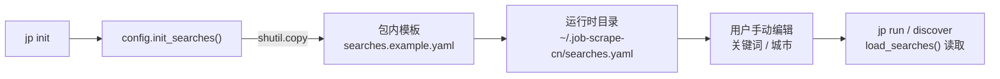
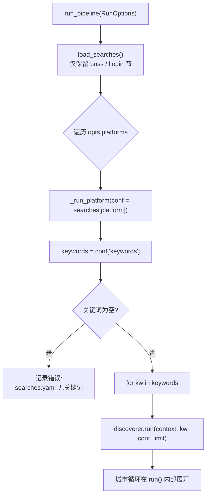
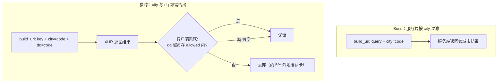

`searches.yaml` 是 JobScrape-CN 的**搜索任务配置**，唯一的职责是回答两个问题：每个平台要搜什么关键词、要到哪些城市去搜。它不涉及过滤偏好（那是 `profile.json` 的领域），也不含任何模型或打分逻辑——它只是一张「关键词 × 城市」的采集任务清单。本页聚焦这个配置文件的结构、加载流程，以及关键词与城市如何被展开成具体的抓取请求。

理解这一点是理解整个采集流水线的起点：`jp run` 的产出行数与执行时长，几乎完全由这份文件决定。

Sources: [config.py](src/jobscrape/config.py#L88-L94), [searches.example.yaml](src/jobscrape/searches.example.yaml#L1-L17)

## 配置文件的位置与生成

搜索配置固定落在运行时目录下，路径由 `searches_path()` 定义为 `~/.job-scrape-cn/searches.yaml`。运行时目录本身可通过环境变量 `JOBSCRAPE_HOME` 重定向，若目录不存在则会自动创建。



`jp init` 命令会调用 `config.init_searches()`，把包内的 `searches.example.yaml` 复制到运行时目录。**这是一个「存在即跳过」的幂等操作**：如果 `searches.yaml` 已经存在且未加 `--force`，复制会被跳过，你手动编辑过的内容不会被覆盖；只有显式传入 `--force` 才会重新用模板覆盖。这意味着「编辑搜索任务」和「初始化运行时」是两件分开的事——先 `jp init`，再改文件。

Sources: [config.py](src/jobscrape/config.py#L34-L39), [config.py](src/jobscrape/config.py#L58-L59), [config.py](src/jobscrape/config.py#L72-L78), [cli.py](src/jobscrape/cli.py#L26-L38)

## 文件结构：按平台分节

配置的顶层是平台名，目前只支持 `boss` 与 `liepin` 两个键。加载时 `load_searches()` 会用一个白名单过滤顶层键，任何既非 `boss` 也非 `liepin` 的顶级节点都会被丢弃——所以你可以在文件里写注释或自定义字段，但只有这两节会被真正读取。

每一节内部的结构由以下字段组成，其中 `keywords` 与 `cities` 是必需的核心项，其余为可选的服务端筛选参数：

| 字段 | 适用平台 | 是否必需 | 说明 |
| --- | --- | --- | --- |
| `keywords` | 两平台 | 是 | 搜索关键词列表，逐条 × 逐城市抓取 |
| `cities` | 两平台 | 是 | 城市**中文名**列表（映射为代码，见下节） |
| `city_codes` | 两平台 | 否 | `{城市名: 代码}`，覆盖或补充内置城市代码 |
| `max_pages` | liepin | 否 | 翻页上限，默认 3；Boss 为滚动采集，忽略该项 |
| `boss_salary` | boss | 否 | Boss 的 `salary` 筛选参数（如 `"402"`） |
| `experience` | boss | 否 | 服务端年限筛选，仅 Boss 生效（猎聘配了只打印提示） |
| `education` | 两平台 | 否 | 服务端学历筛选，两平台可用档位不同 |

Sources: [config.py](src/jobscrape/config.py#L88-L94), [searches.example.yaml](src/jobscrape/searches.example.yaml#L4-L30)

## 关键词如何展开成采集任务

`searches.yaml` 并不是一份被「整体消化」的配置，而是在流水线里被**逐关键词展开**的。`run_pipeline` 先调用 `load_searches()` 拿到全量配置，再对每个平台取其对应的节，进入 `_run_platform`。

在 `_run_platform` 中，代码取出 `conf.get("keywords", [])`，然后**外层遍历关键词**：每个关键词调用一次 `discoverer.run(...)`。也就是说，`keywords` 列表里有 N 项，采集器就会被驱动 N 轮。若关键词列表为空，该平台不会报错中断，而是记录一条 `"searches.yaml 无关键词"` 的错误并跳过——这属于「配置缺项」而非「程序故障」。



一个关键细节：**`conf` 整节会被原样传给 `discoverer.run()`**，关键词是通过独立参数 `kw` 传入的。因此 `cities`、`city_codes`、`education` 等字段对同一个平台下的每个关键词都相同——它们不随关键词变化，只有 `kw` 在变。

Sources: [pipeline.py](src/jobscrape/pipeline.py#L27-L43), [pipeline.py](src/jobscrape/pipeline.py#L46-L70)

## 城市：中文名到平台代码的映射

`cities` 里写的是**城市中文名**（如 `"北京"`），但两个平台的搜索接口接受的都是各自的内部代码。映射逻辑集中在各 discoverer 的 `build_url` 里，规则是：

```python
code = conf.get("city_codes", {}).get(city) or CITY_CODES.get(city, <默认值>)
```

即**优先级为 `city_codes` 覆盖 > 内置 `CITY_CODES` > 平台默认城市**。`city_codes` 的存在意义正是为了支持内置表未收录的城市——你可以在 `searches.yaml` 里为任意城市名指定代码，而无需改动代码。

两个平台各自维护了一份内置城市代码表，值体系完全不同（Boss 是 9 位数字，猎聘是 6 位或纯数字段）：

| 城市 | Boss 代码（9 位） | 猎聘代码 |
| --- | --- | --- |
| 北京 | `101010100` | `010` |
| 上海 | `101020100` | `020` |
| 深圳 | `101280600` | `050090` |
| 广州 | `101280100` | `050020` |
| 杭州 | `101210100` | `070020` |
| 成都 | `101270100` | `280020` |
| 南京 | `101190100` | `060020` |
| 苏州 | `101190400` | `060080` |
| 武汉 | `101200100` | `170020` |
| 西安 | `101110100` | `270020` |
| 合肥 | `101220100` | `150020` |

Sources: [boss.py](src/jobscrape/discovery/boss.py#L18-L24), [liepin.py](src/jobscrape/discovery/liepin.py#L17-L23), [boss.py](src/jobscrape/discovery/boss.py#L86-L88), [liepin.py](src/jobscrape/discovery/liepin.py#L41-L49)

## 城市在两个平台的差异处理

虽然都从 `cities` 读城市，但两个平台对城市的用法有本质区别，这是配置时最需要留意的部分。

**Boss** 把城市代码作为 `city=` 参数拼进 URL，服务端按城市返回结果，客户端不做二次城市校验。**猎聘**则更微妙：实测只有 URL 上的 `city` 参数并不会真正过滤，请求体里的 `dq` 才会落到目标城市——因此 `build_url` 会**同时**拼上 `city={code}&dq={code}`，只给 `city` 会导致结果混杂全国岗位。



即便如此，猎聘 `dq` 过滤后仍会混入约 **5% 的外地推荐卡**，所以 `run()` 里还有一层**客户端城市兜底**：用 `cities` 构建 `allowed` 集合，卡片映射时若其城市不在集合内则丢弃。城市名比对前会经过 `_norm_city` 归一化（`「上海-浦东新区」→「上海」`、`「北京市」→「北京」`）。特别注意：**当 `dq` 为空、无法判定城市时，卡片会被保留而非误杀**。

Sources: [liepin.py](src/jobscrape/discovery/liepin.py#L41-L57), [liepin.py](src/jobscrape/discovery/liepin.py#L59-L84), [liepin.py](src/jobscrape/discovery/liepin.py#L140-L189), [liepin.py](src/jobscrape/discovery/liepin.py#L192-L195), [test_liepin_city.py](tests/test_liepin_city.py#L29-L59)

## 多城市配额：每个城市都有产出

`cities` 列表里的城市不是「追加搜索」，而是**平分配额**的。在两个平台的 `run()` 里，都会先计算每城配额：

```python
per_city = limit if len(cities) <= 1 else max(4, limit // len(cities))
```

也就是说，`--max` 给出的上限会被**城市数平分**（至少保证 4 条），而不是每个城市各抓满 `--max`。这里有一处刻意的设计：**曾经的逻辑是「攒够 `limit*2` 就停」，结果排在前面的城市会吃光配额，后面的城市被整体跳过**；改为平分配额后，五城场景下每城都保证有产出。因此当你把 `cities` 从 3 个扩到 5 个时，单城实际抓取量会下降，若希望总量不变应同步调大 `--max`。

Sources: [boss.py](src/jobscrape/discovery/boss.py#L107-L116), [liepin.py](src/jobscrape/discovery/liepin.py#L59-L70)

## 平台特有参数：翻页与筛选

配置里还有几个不随关键词、也不随城市变化的参数，理解它们的边界可以避免「配了但不生效」的困惑。

**`max_pages`（仅猎聘）**控制 AntD 分页的翻页次数，默认 3。`_scrape_city` 会循环点击「下一页」，一旦按钮进入 `ant-pagination-disabled` 状态便停止。Boss 是滚动加载，没有分页概念，因此 `max_pages` 对 Boss 无意义。

**`experience`（仅 Boss）**会拼成 `&experience=<code>` 让服务端先筛一轮，取值必须是 `1年以下/1年以内/1-3年/3-5年/5-10年/10年以上` 之一，写错会**直接抛 `ValueError`**（不静默失效）。猎聘没有可用的服务端年限参数，`build_url` 检测到该字段只会打印一句提示，年限筛选需改走 `profile.json` 的本地过滤。

**`boss_salary`（仅 Boss）**是薪资筛选参数，直接拼成 `&salary=<值>`。

**`education`（两平台）**是学历服务端筛选，拼成 Boss 的 `&degree=` 或猎聘的 `&eduLevel=`。两平台**档位集合不同**，取值非法同样直接报错。

Sources: [liepin.py](src/jobscrape/discovery/liepin.py#L113-L127), [boss.py](src/jobscrape/discovery/boss.py#L89-L105), [liepin.py](src/jobscrape/discovery/liepin.py#L50-L57), [searches.example.yaml](src/jobscrape/searches.example.yaml#L8-L17)

## 从配置到数据：关键词沉淀为 search_source

关键词在采集完成时会被写进岗位记录，字段名为 `search_source`，取值即触发该岗位采集的 `kw`。这来自 `BaseDiscoverer._finalize`——它在过滤链开始前就把 `platform` 与 `search_source` 补进每条岗位：

```python
job = {**j, "platform": self.platform, "search_source": keyword}
```

因此导出的每一行都能追溯它由哪个关键词搜得，便于后续按关键词维度统计产出与质量。这也解释了为什么 `conf` 整节原样下传而 `kw` 独立传参——关键词需要被记住，而城市等参数只用于构造请求。

Sources: [base.py](src/jobscrape/discovery/base.py#L165-L181), [db.py](src/jobscrape/db.py#L57-L57), [export.py](src/jobscrape/export.py#L21-L21)

## 小结与下一步

`searches.yaml` 是采集任务的「输入清单」：平台分节 → `keywords` 逐条驱动 → 每轮内 `cities` 平分配额展开 → 城市名经 `city_codes` 覆盖或内置表映射为平台代码。服务端筛选参数（`experience`/`education`/`boss_salary`）与翻页参数（`max_pages`）是附着在平台节上的静态配置，对同平台下所有关键词生效。

建议的阅读顺序：

- 想弄清「过滤为什么生效/如何调参」→ [过滤偏好配置](6-guo-lu-pian-hao-pei-zhi)，它解释了 `profile.json` 与本地过滤链，与搜索配置互补。
- 想弄清「关键词与城市如何被编排进两阶段流水」→ [两阶段流水线的编排与幂等续传](7-liang-jie-duan-liu-shui-xian-de-bian-pai-yu-mi-deng-xu-chuan)。
- 想核对城市代码与筛选参数的完整映射 → [平台城市代码与筛选参数映射](22-ping-tai-cheng-shi-dai-ma-yu-shai-xuan-can-shu-ying-she)。
- 想理解命令入口如何触发这些配置 → [命令行命令体系](4-ming-ling-xing-ming-ling-ti-xi)。