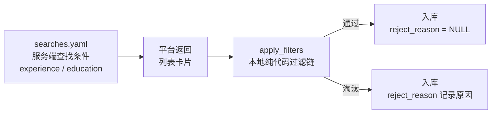
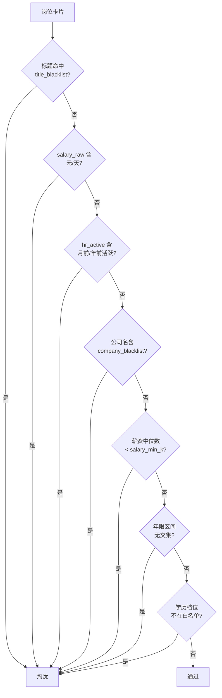
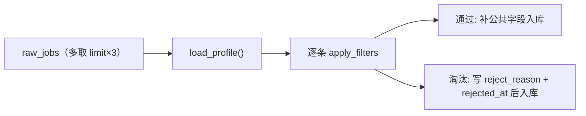
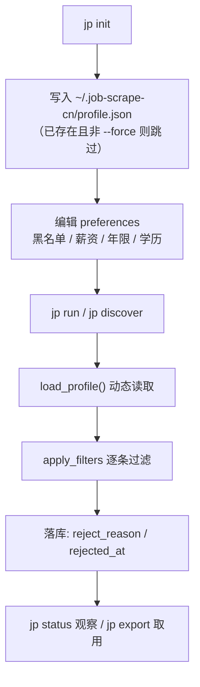

本页聚焦 JobScrape-CN 的**过滤偏好**体系：如何通过 `~/.job-scrape-cn/profile.json` 声明式地定义「哪些岗位该被淘汰」，以及这些规则在何时、以什么顺序、按什么语义被应用到每个采集到的岗位上。这里的核心心智模型是**两层过滤**——第一层是拼进搜索 URL 的**服务端查找条件**（让平台先筛一轮），第二层是采集落地后逐条执行的**本地纯代码过滤链**（规则可审计、不调用任何模型）。本页只讲过滤偏好本身，服务端参数到平台代码的完整映射见 [平台城市代码与筛选参数映射](22-ping-tai-cheng-shi-dai-ma-yu-shai-xuan-can-shu-ying-she)，关键词与城市的组织方式见 [搜索任务配置：关键词与城市](5-sou-suo-ren-wu-pei-zhi-guan-jian-ci-yu-cheng-shi)。

## 两层过滤的分工

JobScrape-CN 把「过滤」拆成了两个独立、互补的层次。第一层写在 `searches.yaml` 里，作为**查找条件**随搜索页一起发给平台（如 Boss 的 `&experience=`、`&degree=`），作用是缩小平台返回的候选集；第二层写在 `profile.json` 里，是采集器拿到卡片后逐条跑的**纯代码规则链**，作用是做服务端参数覆盖不到、或各平台表达能力不一致的兜底筛选。二者是「先粗筛、再精筛」的关系，而不是替代关系。

服务端查找条件必须由各平台自己支持，因此存在平台差异：Boss 支持服务端年限与学历参数，而猎聘只有学历参数真正生效——它的 URL 年限参数实测不改变结果，配了只会打印一行提示，年限筛选必须落到本地。正因为服务端参数不齐整，`profile.json` 的本地过滤才是两平台通用、且语义完全一致的那一层。

Sources: [searches.example.yaml](../../../../src/jobscrape/searches.example.yaml#L10-L17), [boss.py](../../../../src/jobscrape/discovery/boss.py#L86-L105), [liepin.py](../../../../src/jobscrape/discovery/liepin.py#L41-L57)

## profile.json 的结构与默认模板

`jp init` 会把内置的默认模板写入运行时目录，之后由使用者手动编辑。运行时目录默认是 `~/.job-scrape-cn`，可用环境变量 `JOBSCRAPE_HOME` 改写；`profile.json` 的路径由 `profile_path()` 拼出。写入逻辑是：文件已存在且非 `--force` 时跳过，避免覆盖用户已经调好的规则。

配置文件只有一个顶层键 `preferences`，其下可声明五类偏好字段：

| 字段 | 类型 | 语义 | 默认模板值 |
| --- | --- | --- | --- |
| `title_blacklist` | 正则字符串数组 | 标题命中任一正则（`re.search`）即淘汰 | `["外包", "驻场", "实习"]` |
| `company_blacklist` | 字符串数组 | 公司名（小写）包含任一词即淘汰 | `[]` |
| `salary_min_k` | 数字 / `null` | 薪资中位数（K/月，按 12 个月折算）低于则淘汰 | `null` |
| `experience` | 对象 / `null` | 可接受年限区间 `[min_years, max_years]` | `null` |
| `education` | 对象 / `null` | 学历档位白名单 `allowed` | `null` |

`experience` 与 `education` 是嵌套对象，各自还带一个 `allow_unlimited` 开关（默认 `true`），用于决定是否连「经验不限」「学历不限」的岗位也一并淘汰。两类字段值为 `null` 表示**该维度不做任何过滤**。

Sources: [config.py](../../../../src/jobscrape/config.py#L14-L31), [config.py](../../../../src/jobscrape/config.py#L34-L85), [cli.py](../../../../src/jobscrape/cli.py#L26-L38)

## 过滤链的执行顺序

每个采集到的岗位都会经过同一个函数 `apply_filters(job, profile)`。它按固定顺序依次判定，返回一个**淘汰原因字符串**（`reject_reason`）表示被淘汰，返回 `None` 表示通过全部规则。判定顺序为：标题黑名单 → 日结岗 → HR 不活跃 → 公司黑名单 → 薪资 → 年限 → 学历。这个顺序是可预测的，因此首条命中的规则就决定了该岗位的最终 `reject_reason`。

其中前三条中有一部分是**硬编码规则**、不来自 `profile.json`：`salary_raw` 含「元/天」判为日结岗；`hr_active` 含「月前活跃」或「年前活跃」判为 HR 不活跃。（Boss 的列表卡片已不再展示 HR 活跃度，其 `hr_active` 恒为空串，故 HR 不活跃规则实际只对猎聘生效。）每条规则都带前缀化的原因，如 `title_blacklist:外包`、`daily_wage:日结岗`、`salary_below:18K < 25K`，方便回溯。

Sources: [base.py](../../../../src/jobscrape/discovery/base.py#L89-L155), [boss.py](../../../../src/jobscrape/discovery/boss.py#L207-L209), [test_filters.py](../../../../tests/test_filters.py#L21-L39)

## 薪资下限的折算语义

`salary_min_k` 不直接比较原始薪资，而是先把岗位的薪资区间折算成**按 12 个月计的中位数**再比较。具体公式为 `(salary_min + salary_max) / 2 * salary_months / 12`，其中 `salary_months` 缺省为 12。这一折算让「15 薪」这类岗位的年包被拉平成可比的月度口径，避免因为发薪月数不同而误判。仅当岗位的 `salary_min` 与 `salary_max` 都已解析出、且配置了非空的 `salary_min_k` 时才执行该规则（`salary_min_k` 为 `null` 视为不过滤）。

Sources: [base.py](../../../../src/jobscrape/discovery/base.py#L113-L119), [test_filters.py](../../../../tests/test_filters.py#L30-L34)

## 年限过滤：左开右闭区间求交

年限过滤的语义是「岗位要求的年限区间与我的可接受区间是否有交集，无交集则淘汰」。首要步骤是把岗位文本解析成整数区间 `(下限, 上限)`：`3-5年 → (3,5)`、`5年以上 → (5,99)`、`1年以下`/`1年以内 → (0,1)`、`在校/应届 → (0,0)`、`经验不限 → (0,99)`；解析不出（如实习卡的 `4天/周`、`6个月`）则返回 `None`，此时**不淘汰**以避免误杀。可接受区间由 `min_years` / `max_years` 给出（缺省 `0` / `99`）。

关键在于比较函数把**岗位要求区间按「左开右闭」`(jmin, jmax]` 理解**：`3-5年` 被解读为「要 3 年以上的人，刚满 3 年不算」。因此两个区间 `(jmin, jmax]` 与 `[lo, hi]` 有交集的条件是 `jmax > lo and jmin < hi`，而非朴素的双闭比较。退化区间（`jmin == jmax`，如「在校/应届」的 0-0）按闭点 `lo <= jmin <= hi` 处理，避免把空区间误算成永远无交集。以「可接受 0-3 年」为例：

| 岗位要求 | 解析区间 | 结果 | 原因 |
| --- | --- | --- | --- |
| `1-3年` | `(1,3]` | 通过 | 与 `[0,3]` 有交集 |
| `2-10年` | `(2,10]` | 通过 | 与 `[0,3]` 有交集 |
| `3-5年` | `(3,5]` | 淘汰 | 左开，3 不计入，无交集 |
| `3年以上` | `(3,99]` | 淘汰 | 同上 |
| `在校/应届` | `[0,0]` 退化 | 通过 | 退化区间按闭点处理 |

「经验不限」被解析为 `(0, 99)`，它和任何区间都有交集，因此不能靠求交淘汰，只能由 `experience.allow_unlimited` 单独判断：设为 `false` 时才淘汰不限年限的岗位（默认 `true` 保留）。该规则的完整解析与区间匹配细节另见 [年限过滤：解析与左开右闭区间匹配](15-nian-xian-guo-lu-jie-xi-yu-zuo-kai-you-bi-qu-jian-pi-pei)。

Sources: [base.py](../../../../src/jobscrape/discovery/base.py#L16-L22), [base.py](../../../../src/jobscrape/discovery/base.py#L25-L49), [base.py](../../../../src/jobscrape/discovery/base.py#L76-L86), [base.py](../../../../src/jobscrape/discovery/base.py#L121-L137), [test_experience.py](../../../../tests/test_experience.py#L61-L91)

## 学历过滤：档位归一与白名单

学历过滤采用**白名单语义**：先把岗位的学历文本归一到标准档位，再判断该档位是否落在 `education.allowed` 名单内，不在则淘汰。归一规则抹平了平台写法差异——`统招本科` 视同 `本科`（猎聘写法），`本科及以上` 取基准档 `本科`（Boss 写法），`学历不限`/`不限学历` 归一为「不限」。识别不到任何学历档位（如 `4天/周`、空串）时返回 `None`，同样**不淘汰**以避免误杀。

几个边界行为值得注意：`allowed` 为空数组时视为**未启用**该过滤，任何学历都通过；「学历不限」默认保留，只有 `education.allow_unlimited` 设为 `false` 时才淘汰。学历档位归一逻辑的完整说明见 [学历过滤：档位归一与白名单](16-xue-li-guo-lu-dang-wei-gui-yu-bai-ming-dan)。

Sources: [base.py](../../../../src/jobscrape/discovery/base.py#L52-L73), [base.py](../../../../src/jobscrape/discovery/base.py#L139-L153), [test_education.py](../../../../tests/test_education.py#L41-L68)

## 服务端查找条件与本地过滤的对照

对同一个维度，服务端参数与本地过滤各司其职。服务端参数能在平台侧减少返回到浏览器的卡片数量，但受平台表达能力限制、且取值档位固定（写错值会直接 `ValueError` 报错而非静默失效）；本地过滤则在两平台上一视同仁、语义完全统一，且支持区间/白名单这类服务端不提供的灵活表达式。

| 维度 | 服务端位置（searches.yaml） | 本地位置（profile.json） | 说明 |
| --- | --- | --- | --- |
| 年限 | `experience`（仅 Boss 生效） | `preferences.experience` | Boss 服务端仅支持固定档位；猎聘年限只能走本地 |
| 学历 | `education`（两平台均生效） | `preferences.education` | 两平台服务端档位不同，本地白名单更灵活 |
| 薪资 | `boss_salary`（仅 Boss） | `preferences.salary_min_k` | 本地按 12 个月折算中位数比较 |
| 标题 / 公司 | — | `title_blacklist` / `company_blacklist` | 纯本地，平台无此参数 |

一个实践约定是：**年限筛选优先用本地过滤**。因为猎聘没有可用的服务端年限参数，若只依赖服务端参数会导致两平台口径不一致；把它统一放到 `profile.json` 才能保证「同一套偏好、两平台同判」。服务端参数到平台代码（如 `degree=203`、`eduLevel=040`）的逐项映射与实测记录，见 [平台城市代码与筛选参数映射](22-ping-tai-cheng-shi-dai-ma-yu-shai-xuan-can-shu-ying-she)。

Sources: [searches.example.yaml](../../../../src/jobscrape/searches.example.yaml#L4-L17), [boss.py](../../../../src/jobscrape/discovery/boss.py#L26-L43), [liepin.py](../../../../src/jobscrape/discovery/liepin.py#L28-L30), [README.md](../../../../README.md#L101-L124)

## 采集端如何调用过滤链

过滤链的调用发生在采集器基类的 `_finalize()` 中：它先加载 `profile.json`，再对归一后的候选岗逐条调用 `apply_filters`，并给每个结果补上公共字段（`platform`、`search_source`、`discovered_at`）。被淘汰的岗位会写入 `reject_reason` 与 `rejected_at`，但**仍然保留在结果列表中**——通过过滤的岗位用来满足 `limit` 配额，被拒的岗位则一并入库，供后续在报告末尾或导出时「翻案」复查。为抵消过滤带来的淘汰损耗，`_finalize` 会多取一些候选（最多 `limit * 3` 条）再执行过滤。

由于过滤结果直接落库，采集平台在流水线中的角色是「只写 discover 列」——`reject_reason` / `rejected_at` 属于过滤列，与 JD 抓取阶段互不干扰。整条流水线的阶段衔接与续传语义见 [两阶段流水线的编排与幂等续传](7-liang-jie-duan-liu-shui-xian-de-bian-pai-yu-mi-deng-xu-chuan)。

Sources: [base.py](../../../../src/jobscrape/discovery/base.py#L165-L181), [db.py](../../../../src/jobscrape/db.py#L44-L47), [pipeline.py](../../../../src/jobscrape/pipeline.py#L58-L70)

## 被拒岗位的落库、统计与导出

淘汰结果会落在 `jobs` 表的 `reject_reason`（原因文本）与 `rejected_at`（时间戳）两列，默认**不导出**。`jp export` 的取数谓词是 `reject_reason IS NULL`，即只导出通过过滤的岗位；加 `--include-rejected` 则改为 `1=1`，把被拒岗位一并导出以便查看。此外，`reject_reason IS NULL` 也是多个阶段谓词的组成部分：它是「待抓 JD」与「抓 JD 失败」判定的必要条件，意味着被过滤的岗位不会被 `jp enrich` 再去抓取 JD 全文，从而省下浏览器开销。

`jp status` 的计数板中，「已过滤」一项正是 `reject_reason IS NOT NULL` 的行数，可直接观察过滤偏好把多少岗位挡在了门外。

| 出口 | 行为 | 关键谓词 |
| --- | --- | --- |
| `jp export` | 默认只导出通过岗位 | `reject_reason IS NULL` |
| `jp export --include-rejected` | 连被拒岗位一起导出 | `1=1` |
| `jp status` → 已过滤 | 统计被淘汰岗位数 | `reject_reason IS NOT NULL` |
| `jp enrich` | 跳过被拒岗位，不抓其 JD | `reject_reason IS NULL` |

配置偏好修改后无需额外注册：由于 `apply_filters` 在每次采集时动态读取 `profile.json`，新规则会在下一次采集时自动生效（已入库的历史行不会被回溯重判），若想用新偏好复查旧岗位，需要重抓或查阅上面的导出/查询出口。导出的字段与数据字典详见 [导出为 JSON 与 CSV](19-dao-chu-wei-json-yu-csv)。

Sources: [export.py](../../../../src/jobscrape/export.py#L17-L33), [export.py](../../../../src/jobscrape/export.py#L48-L69), [db.py](../../../../src/jobscrape/db.py#L119-L134), [models.py](../../../../src/jobscrape/models.py#L15-L23), [cli.py](../../../../src/jobscrape/cli.py#L148-L167)

## 生成本地过滤配置的流程

理解完整生命周期后可以归纳为一条清晰的链路：`jp init` 写出默认模板 → 使用者编辑 `profile.json` → `jp run / discover` 采集时动态加载并应用 → 结果按 `reject_reason` 分流落库 → 由 `jp status` / `jp export` 观察与取用。

需要强调的是「配置即数据」的设计取舍：过滤偏好不参与阶段状态机、不被写进数据库，它只在采集时被读取一次。这带来轻量与可审计的好处，代价是**偏好变更不回溯历史数据**——这是使用者在调整过滤规则时需要预期的行为边界。

Sources: [config.py](../../../../src/jobscrape/config.py#L62-L85), [base.py](../../../../src/jobscrape/discovery/base.py#L165-L181), [cli.py](../../../../src/jobscrape/cli.py#L26-L38)

## 下一步

本页覆盖了过滤偏好的配置结构、执行顺序与语义边界。若想继续深入采集流水线如何组织这些阶段，建议阅读 [两阶段流水线的编排与幂等续传](7-liang-jie-duan-liu-shui-xian-de-bian-pai-yu-mi-deng-xu-chuan)；若想深入了解年限与学历两条规则的算法细节，可分别前往 [年限过滤：解析与左开右闭区间匹配](15-nian-xian-guo-lu-jie-xi-yu-zuo-kai-you-bi-qu-jian-pi-pei) 与 [学历过滤：档位归一与白名单](16-xue-li-guo-lu-dang-wei-gui-yu-bai-ming-dan)。