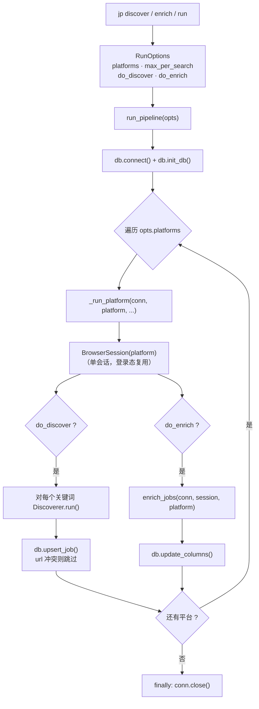
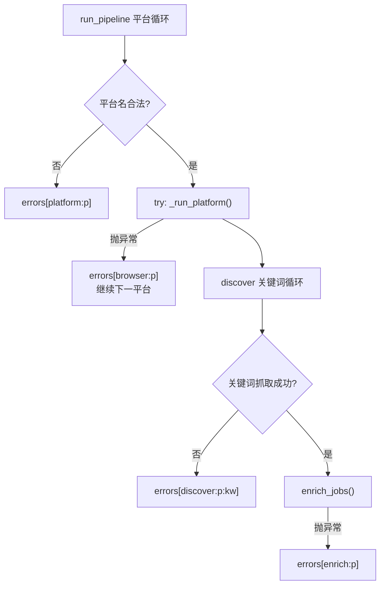
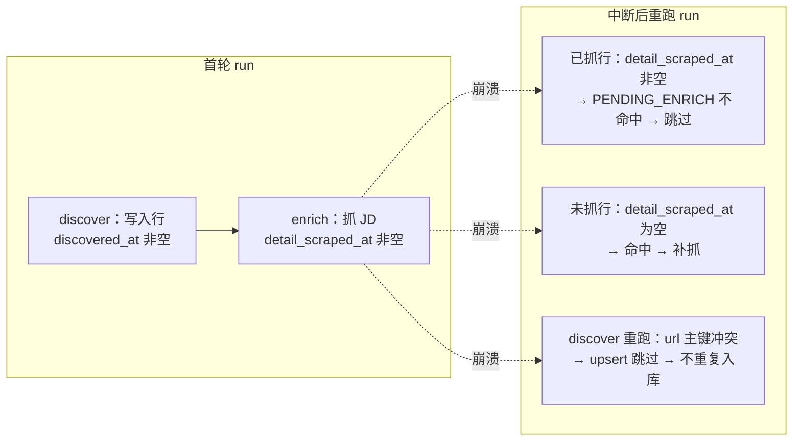
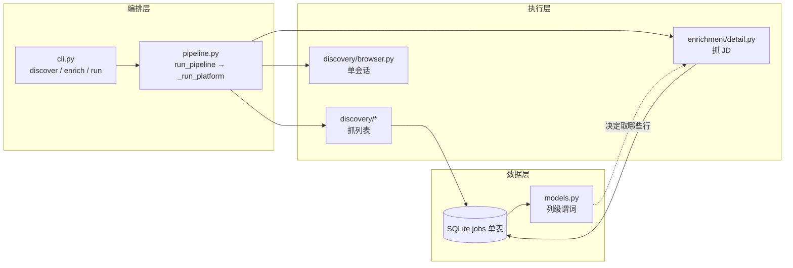

本页聚焦 `jobscrape` 采集链路的**编排层**：一个进程如何把「抓岗位列表」与「抓 JD 全文」这两个阶段串联起来，以及在任意阶段崩溃后，为什么只靠重跑命令就能安全续传、而不需要任何断点文件。阅读本页前，建议先了解命令入口，见 [命令行命令体系](4-ming-ling-xing-ming-ling-ti-xi)。数据表结构与列语义的细节由 [SQLite 单表数据总线与去重入库](9-sqlite-dan-biao-shu-ju-zong-xian-yu-qu-zhong-ru-ku) 与 [列级状态机：阶段契约与续传语义](8-lie-ji-zhuang-tai-ji-jie-duan-qi-yue-yu-xu-chuan-yu-yi) 展开，本页只处理「编排」这一层。

## 设计出发点：把断点写进数据，而不是写进文件

整个流水线的核心设计目标，是把「执行到哪了」这一状态**编码进数据本身**，而不是落在一份独立的进度文件里。`pipeline.py` 开头的模块文档明确写道：幂等性来自列级状态机——任何阶段崩溃，重跑 `jp run` 即续传，无需断点文件。这意味着编排层不需要读取、写入、校验任何 checkpoint，它只需按照「谁负责的列还是空的，谁就还没干完」这一条规则依次推进即可。

这一约束在仓库的维护约定中被列为第一要务：**列级状态机即阶段契约**，阶段完成的定义就是该阶段负责的列非 NULL，且明确「不要引入断点文件」。因此，`pipeline.py` 的编排代码异常精简——它几乎不含业务逻辑，只负责连接数据库、遍历平台、按开关调用两个阶段，并把它们的异常收集到一份结果清单里。

Sources: [pipeline.py](src/jobscrape/pipeline.py#L1-L4), [CHANGELOG.md](CHANGELOG.md#L49-L57)

## 编排骨架：run_pipeline 与 _run_platform

编排的入口是 `run_pipeline(opts)`。它先建立唯一的数据库连接并确保表结构就绪，然后进入「按平台循环」的外层结构，最后在 `finally` 中关闭连接——无论中途是否抛错，连接都会被释放。真正的单平台工作被委托给 `_run_platform`，四个平台名（`boss`、`liepin`）之外的取值会被直接记为错误并跳过。

`_run_platform` 内部呈现出一条清晰的分阶段直线：先处理 discover，再处理 enrich，两段各自独立，用 `opts.do_discover` 与 `opts.do_enrich` 两个布尔开关控制是否执行。discover 段会遍历该平台配置里的每个关键词，用对应的 `Discoverer` 抓取列表并通过 `db.upsert_job` 入库；enrich 段则调用 `enrich_jobs` 为已入库的岗位补抓 JD 全文。值得注意的是，两个阶段**共用同一个 `BrowserSession`**，这为后文的登录态复用埋下伏笔。

Sources: [pipeline.py](src/jobscrape/pipeline.py#L27-L43), [pipeline.py](src/jobscrape/pipeline.py#L46-L79)

## RunOptions 与 RunResult：一个编排函数、三种命令形态

`RunOptions` 是一个纯数据类，承载四个编排参数：`platforms`（默认两个平台）、`max_per_search`（默认 20）、`do_discover`、`do_enrich`（默认均为 `True`）。`RunResult` 则承载输出：`errors`（错误清单）与 `stats`（统计计数）。命令行层的三个采集命令并不是三套独立实现，而是**对同一个 `run_pipeline` 的三种参数化调用**，差别仅在两个布尔开关上。

下表演示了这种「一函数多用」的映射关系。`jp run` 保持两个开关都为默认的 `True`，于是走完整两阶段；`jp discover` 与 `jp enrich` 只是各关掉一个阶段开关。

| 命令 | 构造的 RunOptions | 行为 |
| --- | --- | --- |
| `jp discover` | `do_enrich=False` | 只跑第一阶段（抓列表入库） |
| `jp enrich` | `do_discover=False` | 只跑第二阶段（补抓 JD 全文） |
| `jp run` | 两者默认 `True` | 顺序跑完两阶段，幂等可重跑 |

`max_per_search` 这一个参数身兼两职：它既是「每个关键词 × 每个城市」的列表抓取上限，也是这一轮 JD 抓取的条数上限。这种复用让 `--max` 的语义在两个阶段间保持统一，用户无需为不同阶段记忆两个不同的上限值。

Sources: [pipeline.py](src/jobscrape/pipeline.py#L13-L24), [cli.py](src/jobscrape/cli.py#L106-L145), [README.md](README.md#L71-L73)

## 多粒度错误隔离：崩溃只影响一个单元

编排层用一系列嵌套的 `try/except` 把「失败的影响范围」压缩到尽可能小。最外层是平台级：某个平台发生异常（例如浏览器启动失败）会被记入 `browser:{platform}`，然后继续处理下一个平台——注释明确写出「单平台崩溃不影响另一平台」。在 discover 内部，隔离粒度进一步细化到**关键词级**：每个关键词的抓取各自包裹在 `try` 中，失败只记录为 `discover:{platform}:{keyword}`，同平台其它关键词照常执行。enrich 阶段同样以平台为单位收集异常，记为 `enrich:{platform}`。此外，配置里若某平台没有任何关键词，会记下 `discover:{platform}` 提示，而不会中断。

所有错误最终汇聚到 `RunResult.errors` 这个字典里，键名即「出错单元」的路径式标识。CLI 的 `_print_result` 会把错误打印为一张提示表，并注明「不影响其他阶段，重跑 jp run 可续传」。这种设计让一次不完整的运行仍然能产出部分成果，而不是全盘回滚。

Sources: [pipeline.py](src/jobscrape/pipeline.py#L37-L40), [pipeline.py](src/jobscrape/pipeline.py#L60-L78), [cli.py](src/jobscrape/cli.py#L170-L181)

## 单会话复用：登录态只验一次

`_run_platform` 在 discover 与 enrich 之间**共用一个 `BrowserSession`**，代码注释点明其动机：「discover 与 enrich 共用同一浏览器会话，登录态只验一次」。这不仅是性能考虑——两个阶段都依赖扫码登录态，若各自独立开会话，就要各自经历一次登录态校验，既慢又更容易触发风控。

`BrowserSession` 以上下文管理器实现，进入时启动有头 Chromium 并回灌持久化的 Cookie 与 storage state，退出时再把最新登录态落盘。因为整个 `_run_platform` 把两个阶段都包在 `with BrowserSession(platform) as session:` 之内，所以无论是 discover 还是 enrich 抛出的异常，会话都会在 `__exit__` 中正确保存并关闭。浏览器底座的完整封装细节见 [浏览器会话封装与登录态持久化](13-liu-lan-qi-hui-hua-feng-zhuang-yu-deng-lu-tai-chi-jiu-hua)。

Sources: [pipeline.py](src/jobscrape/pipeline.py#L56-L57), [browser.py](src/jobscrape/discovery/browser.py#L148-L200)

## 幂等续传的两块基石

续传之所以无需断点文件，靠的是两块互相配合的机制：**入库端的主键去重**与**状态端的列级状态机**。二者都不在 `pipeline.py` 内实现，而是由数据层与谓词层提供，编排层只是信任并复用它们。

第一块基石是去重入库：`upsert_job` 以岗位 `url` 为主键执行 `INSERT`，一旦主键冲突（该岗位已存在）就捕获 `IntegrityError` 并返回 `False`，既不报错也不覆盖已有行。因此重复执行 discover 是安全的——已入库的岗位会被安静跳过，只有新岗位返回 `True` 并计入「新增」统计。这一设计属于 [SQLite 单表数据总线与去重入库](9-sqlite-dan-biao-shu-ju-zong-xian-yu-qu-zhong-ru-ku) 的主题。

第二块基石是列级状态机：每个阶段「完成与否」由其负责列是否为 NULL 表达。「待抓 JD」由 `models.PENDING_ENRICH` 谓词定义——要求 `discovered_at IS NOT NULL`（已发现）、`detail_scraped_at IS NULL`（未抓 JD）、`reject_reason IS NULL`（未被过滤）三者同时成立。enrich 阶段只挑命中该谓词的行来抓，抓完即把 `detail_scraped_at` 写为当前时间戳，于是这些行在下一轮就不再命中，天然实现「已完成不重复」。谓词的完整语义与阶段契约约束见 [列级状态机：阶段契约与续传语义](8-lie-ji-zhuang-tai-ji-jie-duan-qi-yue-yu-xu-chuan-yu-yi)。

Sources: [db.py](src/jobscrape/db.py#L86-L99), [models.py](src/jobscrape/models.py#L15-L18), [pipeline.py](src/jobscrape/pipeline.py#L67-L68)

## enrich 的续传取数：每轮只取未完成的行

enrich 阶段把「续传」落到了具体的查询上。`enrich_jobs` 通过 `db.fetch` 拉取待处理行，查询同时叠加三个条件：命中 `PENDING_ENRICH`、`platform = ?` 限定当前平台、`enrich_attempts < 3` 限制重试次数。结果按 `discovered_at ASC` 排序（先发现的先抓），再用切片 `[:limit]` 截断为本轮上限。因此每跑一次 `jp enrich`，只会处理「还没抓过」的行中最早的一批，抓满 `--max` 即停；已完成的行因 `detail_scraped_at` 非空而被谓词排除，不会被重复抓取。

失败路径同样是幂等的：抓不到 JD 时更新 `enrich_error` 并把 `enrich_attempts` 加一，累计到 3 次后该行不再自动重试——这既避免了对同一坏行无休止重试，也让「修好选择器后再重跑」成为可控操作。每行之间插入 2–4 秒随机间隔以降低风控风险，中途 Ctrl+C 也无害，重跑会接着补未完成的行。

| 查询条件 | 作用 | 续传语义 |
| --- | --- | --- |
| `PENDING_ENRICH` | 已发现、未抓、未过滤 | 已完成行自动排除，不重复抓 |
| `platform = ?` | 限定当前平台 | 平台间互不干扰 |
| `enrich_attempts < 3` | 限制重试上限 | 坏行最多试 3 次后停手 |
| `ORDER BY discovered_at ASC` | 先发现先抓 | 保证推进顺序稳定 |
| `[:limit]` | 本轮上限 | 抓满即停，可分批续抓 |

Sources: [detail.py](src/jobscrape/enrichment/detail.py#L35-L71), [README.md](README.md#L73-L81), [CHANGELOG.md](CHANGELOG.md#L55)

## 端到端数据流全景

把上述机制拼合起来，可得到一条从命令到数据的完整视图：CLI 把参数封装为 `RunOptions`，`run_pipeline` 建立唯一的数据库连接并逐平台推进；每个平台内，discover 用 `upsert_job` 去重写入列表字段，enrich 用 `update_columns` 回填 JD 字段；两个阶段共用一次会话与一张表，靠列级谓词表达进度。任何一步崩溃，都只是让「负责列」暂时停留在 NULL 状态，重跑命令即可从未完成处继续。

需要牢记的一条边界铁律是：**discovery 只写 discover 列，enrichment 只写 enrich 列**。跨模块写列会破坏「阶段完成 = 该列非空」的判据，从而破坏续传语义——这正是编排层能保持精简的前提，也是后续改动时不可破坏的约束。

Sources: [pipeline.py](src/jobscrape/pipeline.py#L27-L79), [db.py](src/jobscrape/db.py#L1-L5), [CHANGELOG.md](CHANGELOG.md#L51-L53)

## 下一步

- 想看进度状态具体如何判定与查询，见 [列级状态机：阶段契约与续传语义](8-lie-ji-zhuang-tai-ji-jie-duan-qi-yue-yu-xu-chuan-yu-yi)。
- 想深入单表结构与去重入库的数据库细节，见 [SQLite 单表数据总线与去重入库](9-sqlite-dan-biao-shu-ju-zong-xian-yu-qu-zhong-ru-ku)。