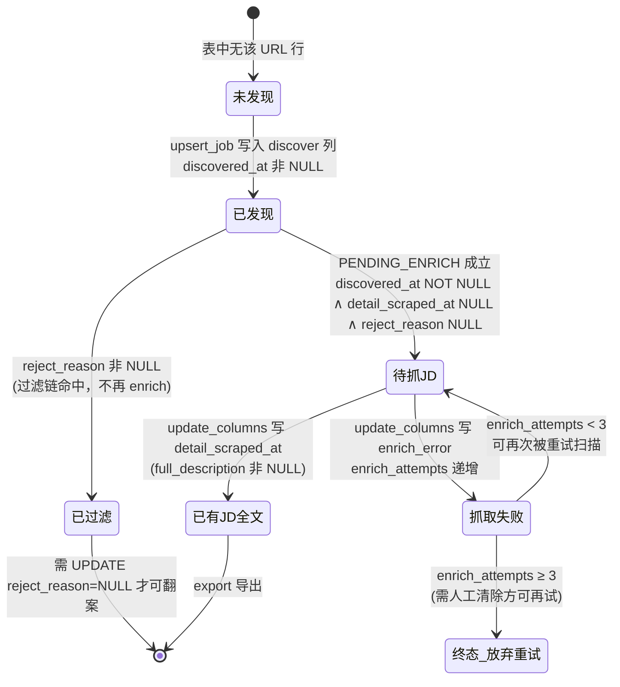

本页深入剖析 JobScrape-CN 的**核心一致性机制**——列级状态机（column-level state machine）。它将"某个处理阶段是否完成"编码为"该阶段负责的数据库列是否为 NULL"，从而让整个流水线在任意阶段崩溃后都能通过重跑 `jp run` 实现续传，**无需任何断点文件**。

本页聚焦状态机的三块基石：**表结构契约**（列区块划分与部分索引）、**写入契约**（模块边界与列白名单强制）、以及**状态谓词与续传语义**。关于流水线编排本身（`discover → enrich` 的调用顺序、浏览器会话复用），请参见 [两阶段流水线的编排与幂等续传](7-liang-jie-duan-liu-shui-xian-de-bian-pai-yu-mi-deng-xu-chuan)；关于入库去重的实现细节，请参见 [SQLite 单表数据总线与去重入库](9-sqlite-dan-biao-shu-ju-zong-xian-yu-qu-zhong-ru-ku)。

## 一、核心思想：以列作为状态载体

传统管道式爬虫常用"断点文件"（记录已处理到哪里）或"内存队列"来支撑续传，二者都引入了额外的状态一致性问题。JobScrape-CN 采用了一种更简洁的约定：**阶段完成 = 该阶段负责的列非 NULL**。这一约定在 `models.py` 的模块文档中被明确表述为"某阶段完成 = 该阶段负责的列非 NULL"，并且被强调为"所有阶段与 status 计数板复用；阶段间零直接调用，靠这些谓词衔接"。

在这个模型下，数据库表 `jobs` 的每一行既是一条数据记录，也是一个状态机的**当前状态快照**。`discover` 阶段写入的数据列一旦落库，就永久标记了"该 URL 已被发现"；`enrich` 阶段写入 `detail_scraped_at` 则标记"该 URL 的 JD 全文已抓取"。任何一次重跑都只需要扫描"目标列仍为 NULL"的行，天然实现了断点续传。

Sources: [models.py](src/jobscrape/models.py#L1-L4)

## 二、表结构契约：三个列区块 + 一个部分索引

状态机的"状态空间"直接体现在 SQLite 表结构上。`SCHEMA` 常量把 `jobs` 表的列显式划分为三个注释区块，形成清晰的状态分层：

| 列区块 | 归属阶段 | 代表列 | NULL 语义 |
| --- | --- | --- | --- |
| **discover（列表页）** | `discover` | `job_title`、`company`、`salary_*`、`experience_raw`、`education_raw`、`discovered_at` | `discovered_at IS NULL` = 该行尚未被列表阶段写入 |
| **enrich（JD 全文）** | `enrich` | `full_description`、`apply_url`、`detail_scraped_at`、`enrich_error`、`enrich_attempts` | `detail_scraped_at IS NULL` = JD 未抓取 |
| **过滤（纯代码规则淘汰）** | `discover` 内联 | `reject_reason`、`rejected_at` | `reject_reason IS NOT NULL` = 已被过滤链淘汰 |

主键设计为 `url TEXT PRIMARY KEY`，`platform` 列带 `CHECK(platform IN ('boss','liepin'))` 约束——这既是完整性约束，也是状态机合法值域的声明。`discovered_at` 作为 discover 区块的结束标记，同时充当续传时的排序键。

Sources: [db.py](src/jobscrape/db.py#L14-L47)

值得注意的是一个**针对状态机的部分索引（partial index）**：`idx_jobs_pending_enrich` 只在 `detail_scraped_at IS NULL` 的行上建立索引，并索引 `discovered_at` 列。这与 enrich 阶段的取数谓词完全对齐——系统扫描"待抓 JD"时只需命中索引中的最小 `discovered_at`，无需全表扫描。

Sources: [db.py](src/jobscrape/db.py#L49-L50)

## 三、写入契约：模块边界铁律与列白名单

状态机能够成立的前提是**每个阶段只能触碰自己负责的列**。`db.py` 顶部将此上升为"模块边界铁律"，明确规定："discovery 只写 discover 列，enrichment 只写 enrich 列"。若跨模块写列，就会破坏"列非 NULL = 阶段完成"的映射，进而破坏续传语义。

Sources: [db.py](src/jobscrape/db.py#L1-L5)

这一铁律并非仅靠约定，而是由**列白名单**在代码层面强制。`db.py` 用集合运算定义了合法列集合 `ALLOWED_COLUMNS`，它是 discover 区块列与实际可用列的并集：

- `_DISCOVER_COLUMNS`：discover 区块的全部列（含 `url`、`platform`）；
- `ALLOWED_COLUMNS`：在此基础上并入 `full_description`、`apply_url`、`detail_scraped_at`、`enrich_error`、`enrich_attempts`、`reject_reason`、`rejected_at`。

任何写入函数都会先做 `set(job) - ALLOWED_COLUMNS` 差集检查，出现未知列立即 `raise ValueError`，从源头阻断越界写入。

Sources: [db.py](src/jobscrape/db.py#L53-L62)

两个写入入口分别承载不同语义：

**`upsert_job`（INSERT + 主键冲突跳过）** 用于 discover 阶段首次落库。它过滤掉 `None` 值列后构造 `INSERT`，捕获 `sqlite3.IntegrityError`（URL 主键冲突）时直接返回 `False`，成功插入返回 `True`。返回值的布尔语义被 `pipeline` 用于统计"新增"计数——**已存在的行不会被覆盖**，这是列级状态机"不破坏既有状态"的关键保障。

Sources: [db.py](src/jobscrape/db.py#L86-L99)

**`update_columns`（受控列更新）** 用于 enrich 阶段及状态推进。同样做白名单校验，且当 `cols` 为空时直接返回（避免生成非法 SQL）。它只更新调用方显式指定的列，因此天然不会误伤 discover 区块的数据。

Sources: [db.py](src/jobscrape/db.py#L108-L116)

此外，`fetch` 提供一个统一检索入口，接受 SQL 谓词字符串与参数，默认按 `discovered_at DESC` 排序——这正是状态谓词（见下节）的消费方式。

Sources: [db.py](src/jobscrape/db.py#L102-L105)

## 四、状态谓词：阶段衔接的唯一接口

若说列白名单约束了"能写什么"，那么**状态谓词**则定义了"如何判定状态"。`models.py` 集中定义了两个核心谓词常量，作为阶段之间衔接的唯一接口：

| 谓词常量 | SQL 语义 | 用途 |
| --- | --- | --- |
| `PENDING_ENRICH` | `discovered_at IS NOT NULL AND detail_scraped_at IS NULL AND reject_reason IS NULL` | 待抓 JD：已发现、未抓、且未被过滤 |
| `ENRICH_FAILED` | `detail_scraped_at IS NULL AND enrich_error IS NOT NULL AND reject_reason IS NULL` | 抓 JD 失败过（排查后可重跑 enrich 再试） |

`PENDING_ENRICH` 中同时要求 `reject_reason IS NULL`——这意味着**被过滤的岗位不参与 enrich**，也不会被自动"翻案"。`ENRICH_FAILED` 则通过 `enrich_error IS NOT NULL` 区分"从未尝试"与"尝试失败"两种 `detail_scraped_at IS NULL` 的子状态。

Sources: [models.py](src/jobscrape/models.py#L15-L23)

`models.py` 还提供 `now_iso()`，以 `timespec="seconds"` 生成秒级 ISO 时间戳，作为各状态列（`discovered_at`、`detail_scraped_at`）的统一时间来源。

Sources: [models.py](src/jobscrape/models.py#L11-L12)

需要指出的是，`db.counts()` 中的计数查询**内联了与谓词等价的 SQL 字符串**（而非导入常量），形成一份"平行副本"。两处语义当前一致，但修改谓词时需同步更新，否则计数板会与实际续传判断产生偏差。

Sources: [db.py](src/jobscrape/db.py#L126-L132)

## 五、续传语义：幂等重跑的完整链路

续传能力由三个机制协同实现，形成闭环：

1. **discover 端幂等**：`upsert_job` 主键冲突即跳过，重跑不会重复插入，也不会覆盖既有状态；

Sources: [db.py](src/jobscrape/db.py#L86-L99)

2. **enrich 端幂等**：`enrich_jobs` 以 `PENDING_ENRICH` 为取数谓词，只捞"未抓"的行，并按 `discovered_at ASC` 排序、切片 `[:limit]`。已完成的行（`detail_scraped_at` 非 NULL）自然被排除。

Sources: [enrichment/detail.py](src/jobscrape/enrichment/detail.py#L38-L43)

3. **状态写入**：enrich 成功时通过 `update_columns` 写入 `full_description`、`apply_url`、`detail_scraped_at`、`enrich_attempts`；失败或异常时写入 `enrich_error` 与递增的 `enrich_attempts`。无论成功失败，取数谓词都会让该行退出"待抓"集合（成功靠 `detail_scraped_at`，失败靠 `enrich_error`）。

Sources: [enrichment/detail.py](src/jobscrape/enrichment/detail.py#L44-L71)

在编排层，`run_pipeline` 每次运行时重新 `connect` + `init_db`，然后对每个平台执行 discover 与 enrich。平台崩溃被 `try/except` 捕获并写入 `result.errors`，"单平台崩溃不影响另一平台"，且错误提示明确告知用户"重跑 `jp run` 可续传"。

Sources: [pipeline.py](src/jobscrape/pipeline.py#L27-L43)

`CHANGELOG.md` 将上述语义固化为两条不可破坏的约束：其一"列级状态机 = 阶段契约……`jp run` 靠这个幂等续传，不要引入断点文件"；其二"被过滤岗位不会自动翻案……放宽规则后需先 `UPDATE jobs SET reject_reason=NULL` 才会重新抓 JD"。

Sources: [CHANGELOG.md](CHANGELOG.md#L49-L55)

## 六、有限重试：`enrich_attempts < 3` 的语义

续传并非"无限重试"。enrich 的取数谓词额外附加了 `AND enrich_attempts < 3`，为每个岗位设置了**最多三次尝试**的上限：

Sources: [enrichment/detail.py](src/jobscrape/enrichment/detail.py#L38-L43)

每次 enrich 尝试（成功、正文未找到、或抛异常）都会将 `enrich_attempts` 递增一次；由于 `enrich_attempts` 的更新发生在**所有三条分支**（成功 / 空正文 / 异常）中，因此失败也会消耗重试额度。

Sources: [enrichment/detail.py](src/jobscrape/enrichment/detail.py#L50-L69)

这条约束制造了一个**可恢复的"终态"**：达到 3 次尝试后，该行既不在 `PENDING_ENRICH`（有 `enrich_error`），也不再被重试扫描。若上游选择器修复后想重跑这些行，必须人工清除失败标志（清空 `enrich_error` 或重置 `enrich_attempts`）——这正是 `CHANGELOG` 中"修好选择器后要重跑需先清失败行或清 `enrich_attempts`"所描述的操作语义。

Sources: [CHANGELOG.md](CHANGELOG.md#L55-L55)

## 七、状态转换视图

将上述列与谓词整合，`jobs` 表每行的生命周期可建模为如下状态机。节点为状态快照，边标注触发写入的列变更：

该图的每个转换都对应一条经过验证的代码路径：`未发现 → 已发现` 由 `upsert_job` 触发；`已发现 → 已过滤` 与 `已发现 → 待抓JD` 的分叉由 `discovered_at` 与 `reject_reason` 的写入顺序决定；`待抓JD ⇄ 抓取失败` 的循环边界即 `enrich_attempts < 3` 谓词。

Sources: [db.py](src/jobscrape/db.py#L86-L116)

Sources: [enrichment/detail.py](src/jobscrape/enrichment/detail.py#L38-L71)

## 八、状态的可观测性：计数板

状态机并非黑箱。`db.counts()` 将状态谓词翻译为"计数板"查询，直观反映每个状态的行数分布：

| 计数项 | 判定谓词 | 对应状态 |
| --- | --- | --- |
| 总岗位 | `COUNT(*)` | 全部行 |
| 已有 JD 全文 | `full_description IS NOT NULL` | 已有JD全文 |
| 待抓 JD | `PENDING_ENRICH` | 待抓JD |
| 抓 JD 失败 | `ENRICH_FAILED` | 抓取失败 |
| 已过滤 | `reject_reason IS NOT NULL` | 已过滤 |

`cli.py` 的 `jp status` 命令遍历该字典逐行渲染为 Rich 表格，把状态机当前快照暴露给用户，指导其决定是否再跑一次 `jp enrich` 以补齐"待抓 JD"。

Sources: [db.py](src/jobscrape/db.py#L119-L134)

Sources: [cli.py](src/jobscrape/cli.py#L41-L52)

## 九、模式演进：`init_db` 的补列迁移

列级状态机对**向后兼容**提出了要求：状态定义在不断扩展（例如新增 `experience_raw`、`education_raw` 两列作为过滤依据），而 `CREATE TABLE IF NOT EXISTS` 对已存在的表不会新增列。为此 `init_db` 在 `executescript(SCHEMA)` 之后，通过 `PRAGMA table_info(jobs)` 读取现有列集合，与 `_MIGRATIONS` 元组比对，对缺失列执行 `ALTER TABLE jobs ADD COLUMN`，从而让旧库平滑升级到新状态定义。

Sources: [db.py](src/jobscrape/db.py#L73-L83)

这一迁移机制的语义后果被 `README.md` 明确记录：升级前抓取的旧行 `experience_raw` / `education_raw` 为空，年限/学历过滤对它们不生效，"需要重抓或手动补"。换言之，**补列只保证 schema 兼容，不回溯填充历史数据的状态**。

Sources: [README.md](README.md#L169-L172)

## 十、设计要点小结

综合以上分析，列级状态机的工程价值可归纳为下表：

| 设计选择 | 解决的问题 | 实现位置 |
| --- | --- | --- |
| 列=状态，无断点文件 | 消除外部状态文件与数据库不一致的风险 | `models.py` 谓词 + `db.py` 列区块 |
| 模块边界铁律 | 防止跨阶段写列破坏续传语义 | `db.py` 白名单 + `ValueError` |
| INSERT + 主键冲突跳过 | 重跑不覆盖、不重复 | `upsert_job` |
| 部分索引对齐谓词 | 待抓扫描无需全表遍历 | `idx_jobs_pending_enrich` |
| `enrich_attempts < 3` | 给失败状态设终态，避免无限重试 | `enrich_jobs` 谓词 |
| `reject_reason IS NULL` 前置条件 | 过滤与 enrich 状态解耦 | `PENDING_ENRICH` |
| `ALTER TABLE` 补列 | schema 演进不丢历史行 | `init_db` |

理解这套契约后，可以顺畅地进入下一层：[SQLite 单表数据总线与去重入库](9-sqlite-dan-biao-shu-ju-zong-xian-yu-qu-zhong-ru-ku) 将展开 URL 主键规范化、WAL 并发与去重的具体实现；而各阶段如何产出这些列数据，则分别由 [采集器基类与纯代码过滤链](10-cai-ji-qi-ji-lei-yu-chun-dai-ma-guo-lu-lian) 与 [JD 全文抓取：接口拦截与 DOM 降级](17-jd-quan-wen-zhua-qu-jie-kou-lan-jie-yu-dom-jiang-ji) 深入阐述。