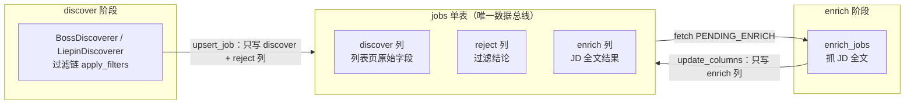
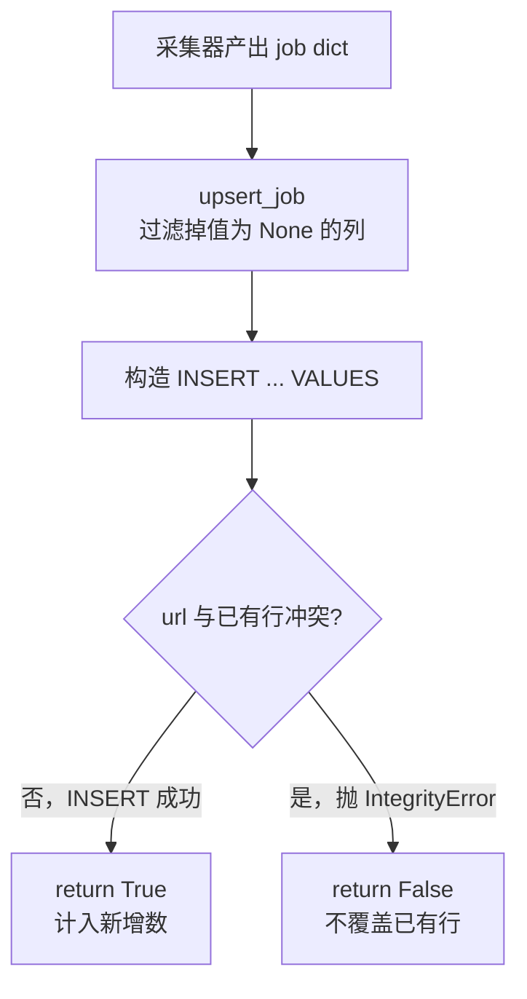
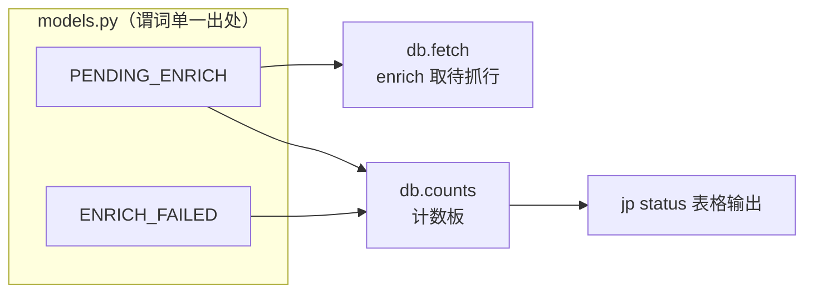

本页聚焦 `jobscrape` 数据层的中枢——**单表 `jobs`**。它不是各阶段私有的持久化终点，而是一条**数据总线（data bus）**：discover 与 enrich 两个阶段彼此不直接调用，全部通过读写这一张表的列来交接工作。围绕这张表，本页将解释三件事：列如何分区承载状态、URL 主键如何驱动去重入库、以及 WAL 连接与列白名单/迁移如何保证并发安全与 schema 演进。关于列级状态机的语义契约，另见 [列级状态机：阶段契约与续传语义](8-lie-ji-zhuang-tai-ji-jie-duan-qi-yue-yu-xu-chuan-yu-yi)；关于流水线编排，见 [两阶段流水线的编排与幂等续传](7-liang-jie-duan-liu-shui-xian-de-bian-pai-yu-mi-deng-xu-chuan)。

Sources: [db.py](../../../../src/jobscrape/db.py#L1-L5)

## 设计哲学：一列即一个阶段的状态

传统的多阶段爬虫往往用中间文件或独立表在阶段间传递数据，代价是同步与清理逻辑分散。本项目采取相反策略：**全局只有一张 `jobs` 表，所有阶段共享同一行**。`db.py` 的开头就把它定义成"数据总线"，并明确两条边界—阶段间只通过本表交互，且 **discovery 只写 discover 列，enrichment 只写 enrich 列**。

这一约束带来的直接好处是：**是否存在中间状态**可以被压缩成"某一列是否为 NULL"。例如 enrich 是否对某行动过手，只取决于 `detail_scraped_at` 是否为 NULL；过滤是否淘汰某行，只取决于 `reject_reason` 是否为 NULL。状态无需额外字段表达，天然内嵌在列本身。

下图展示两个阶段围绕总线表的读写方向：discovery 阶段向表写入"列表页字段 + 过滤结论"，enrichment 阶段从表中取"待抓行"，再把"JD 全文结果"写回同一行。

需要说明一处实现细节：按列归属，"过滤结论"也是由 discovery 侧写入的——`_finalize` 在入库前就对每个 job 调用 `apply_filters`，命中规则时把 `reject_reason` 与 `rejected_at` 写进 job 字典，随后一并入库。因此 discovery 实际写入的是"discover 列 + reject 列"，enrichment 只负责 enrich 列。

Sources: [db.py](../../../../src/jobscrape/db.py#L1-L5), [discovery/base.py](../../../../src/jobscrape/discovery/base.py#L165-L181)

## `jobs` 表结构：三段式列分区

表定义集中在 `db.py` 顶部的 `SCHEMA` 常量中，用 `CREATE TABLE IF NOT EXISTS` 声明。主键是 `url`，`platform` 通过 `CHECK(platform IN ('boss','liepin'))` 约束枚举值。整张表的列按功能被划分为三段，与上文的分区一一对应。

| 分区 | 列 | 语义 |
| --- | --- | --- |
| **discover（列表页）** | `job_title`, `company`, `city`, `district`, `salary_raw`, `salary_min`, `salary_max`, `salary_months`, `experience_raw`, `education_raw`, `job_tags`, `hr_name`, `hr_title`, `hr_active`, `search_source`, `discovered_at` | 搜索卡片上直接可得的字段，含解析后的薪资区间与年限/学历原文 |
| **enrich（JD 全文）** | `full_description`, `apply_url`, `detail_scraped_at`, `enrich_error`, `enrich_attempts` | 详情页抓取结果；`detail_scraped_at` 非 NULL 即"已抓过" |
| **过滤（纯代码规则淘汰）** | `reject_reason`, `rejected_at` | 被过滤岗位的淘汰原因与时间戳，仍入库保留以便翻案 |

主键 `url` 与 `platform` 不归属任何单一阶段，它们是总线上的**全局标识**。`enrich_attempts` 设有 `DEFAULT 0`，从零开始累加重试次数，用于把重试上限逻辑下推到查询层。

除表本身外，`SCHEMA` 还声明了一个**部分索引** `idx_jobs_pending_enrich`：它以 `discovered_at` 为索引键，但只覆盖 `detail_scraped_at IS NULL` 的行。这是一个"待办队列"式索引——因为 enrich 阶段每轮只是反复扫描"尚未抓取 JD"的行，把索引裁剪到这批行上，能让索引体积随已完成行数增长而保持精简。

Sources: [db.py](../../../../src/jobscrape/db.py#L14-L51)

## 去重入库：URL 主键归一与 upsert 语义

去重的根节点是**主键 `url`**。因此"是否重复"完全取决于采集器给出的 URL 是否稳定——同一岗位若每次生成的 URL 不同，数据库就无法识别为同一条。

两个平台各自做了归一化：

| 平台 | URL 归一策略 | 效果 |
| --- | --- | --- |
| Boss | 取卡片链接后，`url.split("?")[0]` 去掉查询串（安全参数） | 同一详情页的稳定 URL |
| 猎聘 | 优先用 `job.link`；缺失时回退 `liepin:{jobId or title}` 合成键 | 链接缺失时仍能生成可判重的主键 |

Boss 侧的这行 `split("?")` 意义关键：详情链接常带随机安全参数，若原样入库，同一岗位在多次采集中会因参数不同而被判为新行，去重即失效。猎聘侧除了数据库主键去重外，还在采集器内部先用 `url` 集合做了一轮**同批次内存去重**（多城市多页翻页容易撞车），避免把重复行送进入库流程。

入库动作由 `upsert_job` 完成，其语义是**"插入，冲突即忽略"**：

值得注意的是，`upsert_job` 是**纯粹的插入式 upsert**：遇到主键冲突时直接 `return False`，**不更新任何已有列**。这一取舍是有意为之——若冲突时覆盖写入，重复采集就会把该行已经抓好的 enrich 列（`full_description`、`detail_scraped_at`）清回 NULL，破坏续传状态。因此更新已存在行只能走另一条受控路径 `update_columns`（enrich 阶段专用），两条写通道职责分明。

Sources: [db.py](../../../../src/jobscrape/db.py#L86-L99), [discovery/boss.py](../../../../src/jobscrape/discovery/boss.py#L171-L178), [discovery/liepin.py](../../../../src/jobscrape/discovery/liepin.py#L75-L84), [discovery/liepin.py](../../../../src/jobscrape/discovery/liepin.py#L171-L172)

## 两条写通道：`upsert_job` 与 `update_columns`

`db.py` 对外只暴露两条写路径，分别服务于两个阶段，构成总线上的双车道。

`upsert_job`（discover 用）在入库前会先做两项清理：**剔除值为 `None` 的列**（让数据库默认值/空值生效，也避免插入无意义字段），并用白名单校验列名——任何不在 `ALLOWED_COLUMNS` 内的键都会直接抛 `ValueError`，让拼写错误在开发期即暴露，而不是静默写空。

`update_columns`（enrich 用）则按主键定向更新：同样先做白名单校验，若无列可更新则直接返回；否则拼出 `UPDATE jobs SET ... WHERE url = ?`。enrich 阶段抓取成功/失败时正是用它把结果写回对应行。

| 维度 | `upsert_job` | `update_columns` |
| --- | --- | --- |
| 使用阶段 | discover | enrich |
| SQL | `INSERT INTO jobs ...` | `UPDATE jobs SET ... WHERE url = ?` |
| 冲突行为 | 主键冲突即忽略并返回 False | 按主键精确更新 |
| 返回值 | `bool`（是否新增） | 无 |
| 典型调用 | 流水线汇总新增数 | 回写 JD 全文 / 错误 / 重试次数 |

在 enrichment 阶段，`enrich_jobs` 每次通过 `update_columns` 一次性写回多个 enrich 列：成功时写 `full_description`、`apply_url`、`detail_scraped_at` 并把 `enrich_attempts` 自增；失败时写 `enrich_error` 并同样累加重试次数。整块更新发生在单条 `UPDATE` 中，保证行的状态切换是原子的。

Sources: [db.py](../../../../src/jobscrape/db.py#L86-L116), [enrichment/detail.py](../../../../src/jobscrape/enrichment/detail.py#L46-L71)

## 连接与并发：WAL 与 busy_timeout

所有连接都经由 `connect()` 统一创建，它在 `config.db_path()` 指向的 `db.sqlite3` 上设置三件事：`sqlite3.Row` 行工厂（让查询结果可按列名访问，`enrich_jobs` 里 `r["url"]` 式的取值即依赖于此）、`PRAGMA journal_mode=WAL` 和 `PRAGMA busy_timeout=10000`。

WAL（Write-Ahead Logging）模式的价值在于**读写并发**：它允许一个写事务与多个读事务同时进行，减少锁争用。但 WAL 也有一个常被忽视的运维后果——最近的写入可能还停留在旁路文件 `db.sqlite3-wal` 中，尚未合并回主库文件。因此若单纯拷贝 `db.sqlite3` 到别处打开，会**看不到最新数据**；正确做法是连同 `-wal` / `-shm` 一起拷贝，或直接在原路径打开（详见 [数据字典与数据库直连查询](20-shu-ju-zi-dian-yu-shu-ju-ku-zhi-lian-cha-xun)）。

`busy_timeout=10000`（10 秒）与之配套：当数据库被其他连接短暂占用时，SQLite 会重试等待而非立即报错，进一步降低并发写入下的失败率。

Sources: [db.py](../../../../src/jobscrape/db.py#L65-L70), [config.py](../../../../src/jobscrape/config.py#L42-L43), [README.md](../../../../README.md#L185-L188)

## 列白名单与增量迁移：schema 演进的安全网

表结构会随功能演进而新增列，`db.py` 用两层机制保证演进安全。

第一层是**列白名单** `ALLOWED_COLUMNS`。它由 `_DISCOVER_COLUMNS` 集合与 enrich、reject 相关列合并而成，是 `upsert_job` 与 `update_columns` 共用的校验依据。任何写入都必须命中白名单，这既是防御拼写错误，也是把"哪些列允许被程序写入"这一契约集中到单一处声明。

第二层是**增量迁移** `_MIGRATIONS`。问题在于 `CREATE TABLE IF NOT EXISTS` 只在表不存在时建表，**不会给已存在的旧表补列**。因此 `init_db` 在建表后，会先用 `PRAGMA table_info(jobs)` 读出当前实际拥有的列名，再对 `_MIGRATIONS` 中列举的每一列（当前是 `experience_raw` 与 `education_raw`）检查是否缺失，缺失才 `ALTER TABLE ... ADD COLUMN`。这既覆盖了"老库升级"场景，又因幂等而可安全地每次启动执行。

`init_db` 被 `pipeline.run_pipeline`、`cli.init`、`cli.status` 与 `cli.export` 反复调用，正是依赖这份幂等性——无论数据库是新是旧，都能被拉到与当前代码一致的结构。

Sources: [db.py](../../../../src/jobscrape/db.py#L53-L62), [db.py](../../../../src/jobscrape/db.py#L73-L83), [pipeline.py](../../../../src/jobscrape/pipeline.py#L27-L29), [cli.py](../../../../src/jobscrape/cli.py#L30-L34)

## 查询与谓词复用：从 `fetch` 到计数板

总线上的读路径同样集中在 `db.py`。`fetch` 是一个薄封装：接收 `where` 谓词与参数，按 `discovered_at DESC` 排序返回 `SELECT * FROM jobs`。enrich 阶段正是用它拉取待抓行——把 `models.PENDING_ENRICH` 拼上平台与重试次数条件后交给 `fetch`。

这里的关键设计是**谓词集中定义**：`models.py` 把"待抓 JD"与"抓 JD 失败"两种状态各写成一条 SQL 片段常量，供所有阶段与统计口复用。于是"什么算待抓"这一语义只有一个出处，discover、enrich 与 `jp status` 计数板对状态的理解天然一致，不会出现彼此口径漂移。

计数板由 `counts` 提供，它一次性返回五组数字，是 `jp status` 命令的全部数据源：

| 计数项 | 对应条件 |
| --- | --- |
| 总岗位 | `COUNT(*)` |
| 已有 JD 全文 | `full_description IS NOT NULL` |
| 待抓 JD | `discovered_at IS NOT NULL AND detail_scraped_at IS NULL AND reject_reason IS NULL` |
| 抓 JD 失败 | `detail_scraped_at IS NULL AND enrich_error IS NOT NULL AND reject_reason IS NULL` |
| 已过滤 | `reject_reason IS NOT NULL` |

每个条件本质都是对某一列**是否为 NULL** 的判断，再次印证了总线设计的内核：**列即状态**，状态即谓词。

Sources: [db.py](../../../../src/jobscrape/db.py#L102-L134), [models.py](../../../../src/jobscrape/models.py#L15-L23), [enrichment/detail.py](../../../../src/jobscrape/enrichment/detail.py#L38-L43), [cli.py](../../../../src/jobscrape/cli.py#L41-L52)

## 小结与延伸阅读

`jobs` 单表把"阶段状态"编码进列，用 URL 主键提供判定重复的唯一锚点，再以 `upsert_job`（插入即忽略）与 `update_columns`（定向更新）两条受控写通道分隔两阶段的职责。WAL 与 `busy_timeout` 负责并发健壮性，列白名单与 `_MIGRATIONS` 负责 schema 演进安全，`models.py` 的谓词常量则统一了全系统对"某阶段是否完成"的判读口径。掌握这张表，就掌握了整个采集流水线的共享内存。

建议继续阅读：

- 想理解列级状态的谓词契约与续传语义 → [列级状态机：阶段契约与续传语义](8-lie-ji-zhuang-tai-ji-jie-duan-qi-yue-yu-xu-chuan-yu-yi)
- 想理解 discover 与 enrich 如何围绕本表编排 → [两阶段流水线的编排与幂等续传](7-liang-jie-duan-liu-shui-xian-de-bian-pai-yu-mi-deng-xu-chuan)
- 想直接查库或了解导出字段 → [数据字典与数据库直连查询](20-shu-ju-zi-dian-yu-shu-ju-ku-zhi-lian-cha-xun)